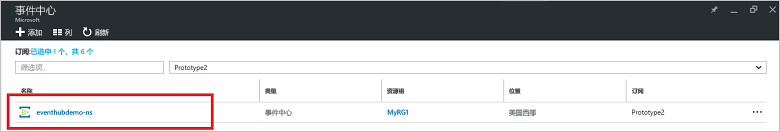
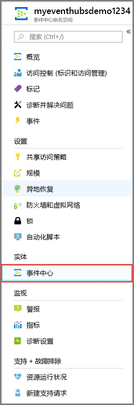
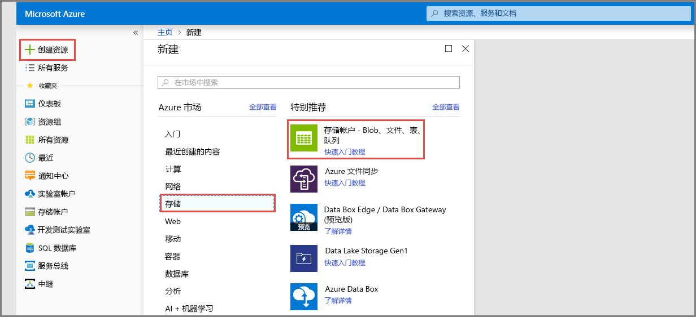
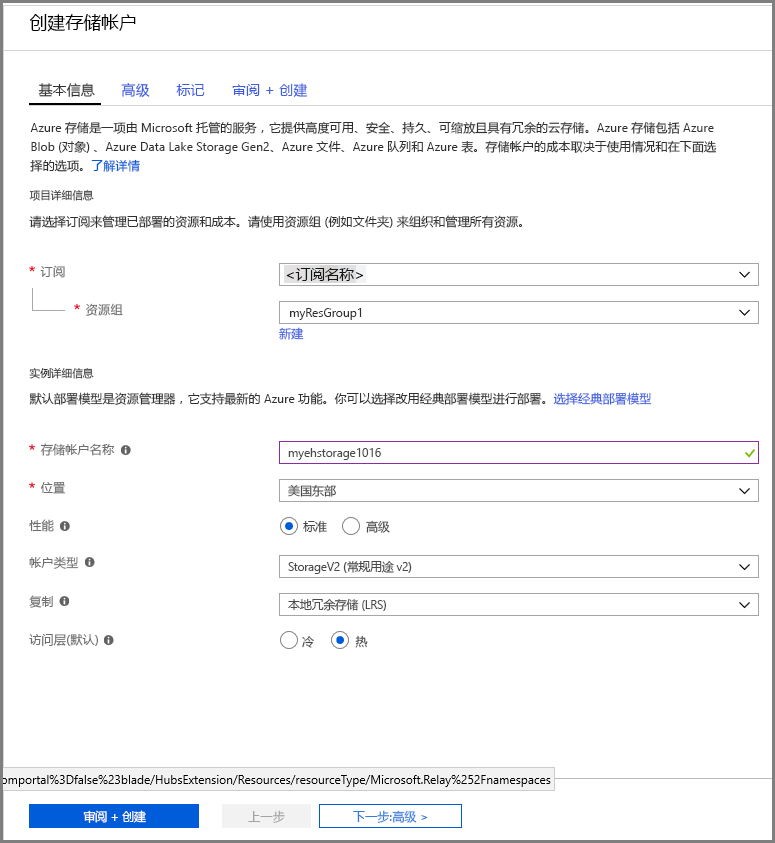
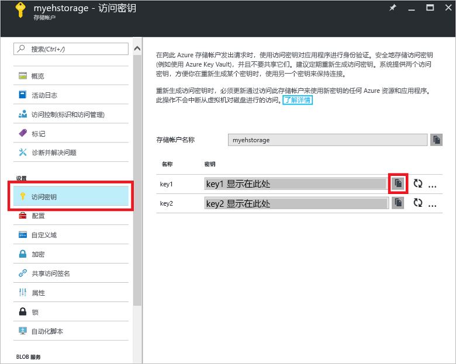

# 快速入门：使用 Azure 门户和 .NET 处理事件流

Azure 事件中心是高度可缩放的数据流平台和引入服务，每秒能够接收和处理数百万个事件。 本快速入门介绍如何使用 [Azure 门户](https://portal.azure.com)创建事件中心，然后使用 .NET Standard SDK 向事件中心发送事件和从中接收事件。

若要完成本快速入门，需要一个 Azure 订阅。 如果没有订阅，请在开始之前[创建一个免费帐户][]。

## 先决条件

若要完成本快速入门，请确保具备以下项：

- [Visual Studio 2017 Update 3（版本 15.3 (26730.01)）](http://www.visualstudio.com/vs)或更高版本。
- [.NET Standard SDK](https://www.microsoft.com/net/download/windows) 2.0 或更高版本。

## 创建资源组

资源组是 Azure 资源的逻辑集合。 所有资源在资源组中进行部署和管理。 执行以下操作创建资源组：

1. 在左侧导航栏中，单击“资源组”。 然后单击“添加”。

   ![][1]

2. 键入资源组的唯一名称。 系统会立即检查该名称是否在当前选定的 Azure 订阅中可用。

3. 在“订阅”中，单击要在其中创建资源组的 Azure 订阅的名称。

4. 选择资源组的地理位置。

5. 单击“创建”。

   ![][2]

## 创建事件中心命名空间

事件中心命名空间提供唯一的范围容器，可以通过其完全限定的域名进行引用，而在该容器中，可以创建一个或多个事件中心。 若要使用门户在资源组中创建命名空间，请执行以下操作：

1. 登录到 [Azure 门户][]，单击屏幕左上角的“创建资源”。

2. 依次单击“物联网”、“事件中心”。

3. 在“创建命名空间”中输入命名空间名称。 系统会立即检查该名称是否可用。

   

4. 在确保命名空间名称可用后，选择定价层（基础版或标准版）。 另外，请选择一个 Azure 订阅、资源组以及要创建该资源的位置。
 
5. 单击“创建”以创建命名空间。 可能需要等待几分钟让系统完全预配资源。

6. 在命名空间的门户列表中，单击新创建的命名空间。

7. 依次“共享访问策略”、“RootManageSharedAccessKey”。
    
8. 单击复制按钮，将 **RootManageSharedAccessKey** 连接字符串复制到剪贴板。 将此连接字符串保存在临时位置（如记事本），供稍后使用。
    
## 创建事件中心

若要在该命名空间中创建事件中心，请执行以下操作：

1. 在“事件中心”命名空间列表中，单击新创建的命名空间。      
   
     

2. 在命名空间窗口中，单击“事件中心”。
   
    

1. 在窗口顶部，单击“+ 添加事件中心”。
   
    
1. 为事件中心键入名称，并单击“创建”。
   
    

祝贺你！ 现已使用门户创建了一个事件中心命名空间，并在该命名空间中创建了一个事件中心。

## 为事件处理程序主机创建存储帐户

事件处理程序主机是一个智能代理，它通过管理持久性检查点和并行接收操作，来简化从事件中心接收事件的过程。 对于检查点，事件处理程序主机需要一个存储帐户。 以下示例演示如何创建存储帐户，以及如何获取其密钥以进行访问：

1. 登录到 [Azure 门户][Azure 门户]，并单击屏幕左上角的“新建”。

2. 依次“存储”、“存储帐户”。
   
    

3. 在“创建存储帐户”中，键入存储帐户的名称。 选择 Azure 订阅、资源组和创建该资源的位置。 然后单击“创建”。
   
    

4. 在存储帐户列表中，单击新建的存储帐户。

5. 在“存储帐户”窗口中单击“访问密钥”。 复制“密钥 1”的值，供稍后使用。
   
    

## 下载并运行示例

下一步是运行示例代码，用于将事件发送到事件中心，以及使用事件处理程序主机接收这些事件。 

首先，从 GitHub 下载 [SampleSender](https://github.com/Azure/azure-event-hubs/tree/master/samples/DotNet/Microsoft.Azure.EventHubs/SampleSender) 和 [SampleEphReceiver](https://github.com/Azure/azure-event-hubs/tree/master/samples/DotNet/Microsoft.Azure.EventHubs/SampleEphReceiver) 示例，或克隆 [azure-event-hubs 存储库](https://github.com/Azure/azure-event-hubs)。

### 发送方

1. 打开 Visual Studio，在“文件”菜单中单击“打开”，然后单击“项目/解决方案”。

2. 找到前面下载的 **SampleSender** 示例文件夹，然后双击 SampleSender.sln 文件，在 Visual Studio 中加载该项目。

3. 在解决方案资源管理器中，双击 Program.cs，在 Visual Studio 编辑器中打开该文件。

4. 将 `EventHubConnectionString` 值替换为创建命名空间时获取的连接字符串。

5. 将 `EventHubName` 替换为在该命名空间中创建的事件中心的名称。

6. 在“生成”菜单中，单击“生成解决方案”以确保没有任何错误。

### 接收方

1. 打开 Visual Studio，在“文件”菜单中单击“打开”，然后单击“项目/解决方案”。

2. 找到在步骤 1 中下载的 **SampleEphReceiver** 示例文件夹，然后双击 SampleEphReceiver.sln 文件，在 Visual Studio 中加载该项目。

3. 在解决方案资源管理器中，双击 Program.cs，在 Visual Studio 编辑器中打开该文件。

4. 替换以下变量值：
    1. `EventHubConnectionString`：替换为创建命名空间时获取的连接字符串。
    2. `EventHubName`：替换为在该命名空间中创建的事件中心的名称。
    3. `StorageContainerName`：存储容器的名称。 为其指定唯一的名称，运行应用时，系统将会创建该容器。
    4. `StorageAccountName`：创建的存储帐户的名称。
    5. `StorageAccountKey`：从 Azure 门户获取的存储帐户密钥。

5. 在“生成”菜单中，单击“生成解决方案”以确保没有任何错误。

### 运行应用

首先运行 **SampleSender** 应用程序，会看到正在发送 100 条消息。 按 **Enter** 结束程序。

![][3]

然后运行 **SampleEphReceiver** 应用，会看到正在将消息接收到事件处理程序主机。

![][4]
 
## 清理资源

可以使用门户来删除存储帐户、命名空间和事件中心。 

1. 在 Azure 门户中，单击左窗格中的“所有资源”。 
2. 单击要删除的存储帐户或命名空间。 删除命名空间也会删除其内部的所有事件中心。
3. 在屏幕顶部的菜单栏中，单击“删除”。 确认删除。 

## 后续步骤

在本文中，我们已创建用于从事件中心发送和接收事件的事件中心命名空间和其他资源。 有关详细信息，请继续阅读以下教程：

> [!div class="nextstepaction"]
> [将事件中心数据流中的数据异常可视化](event-hubs-tutorial-visualize-anomalies.md)

[创建一个免费帐户]: https://azure.microsoft.com/free/?ref=microsoft.com&utm_source=microsoft.com&utm_medium=docs&utm_campaign=visualstudio
[Azure 门户]: https://portal.azure.com/
[1]: ./media/event-hubs-quickstart-portal/resource-groups1.png
[2]: ./media/event-hubs-quickstart-portal/resource-groups2.png
[3]: ./media/event-hubs-quickstart-portal/sender1.png
[4]: ./media/event-hubs-quickstart-portal/receiver1.png
