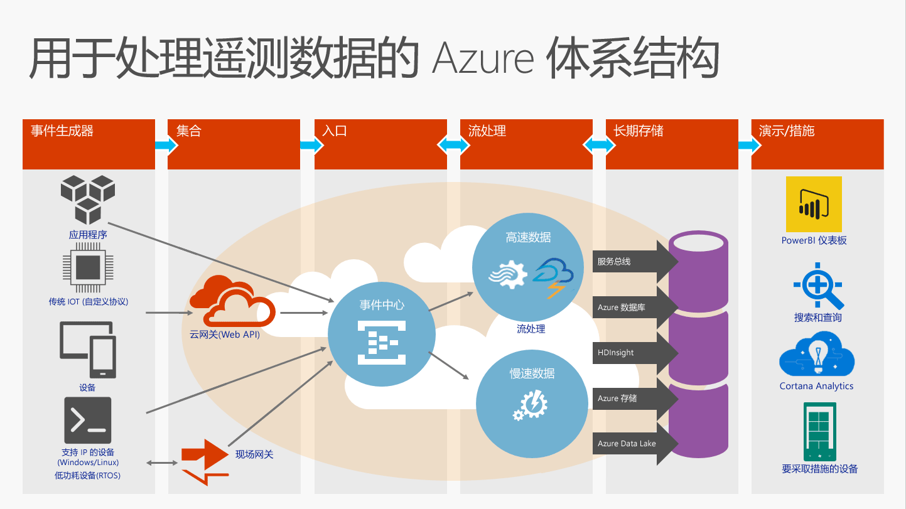

# 什么是事件中心？

Azure 事件中心是高度可缩放的数据流式处理平台和事件引入服务，能够每秒接收和处理数百万事件。 事件中心可以处理和存储分布式软件和设备生成的事件、数据或遥测。 可以使用任何实时分析提供程序或批处理/存储适配器转换和存储发送到数据中心的数据。 由于能够以较低的延迟和极高的规模提供[发布订阅功能](https://msdn.microsoft.com/library/aa560414.aspx)，事件中心可以充当大数据的“入口”。

## 为何使用事件中心？

事件中心的事件和遥测处理功能特别适用于：

* 应用程序检测
* 用户体验或工作流处理
* 物联网 (IoT) 方案

例如，事件中心允许在移动应用中进行行为跟踪、从 Web 场采集流量信息、在电视游戏中捕获游戏内事件，或者从工业机器、互联汽车或其他设备中收集遥测数据。

## Azure 事件中心概述

事件中心在解决方案体系结构中扮演的常见角色是充当事件管道的“前门”，通常称为“事件引入器”。 事件引入器是位于事件发布者与事件使用者之间的组件或服务，可以将事件流的生成与这些事件的使用分离开来。 下图显示了此体系结构：

事件中心提供消息流处理功能，但其特征不同于传统的企业消息传送。 事件中心功能围绕高吞吐量和事件处理方案而构建。 因此，事件中心不同于 [Azure 服务总线](https://azure.microsoft.com/services/service-bus/)消息传送，未实现适用于[服务总线消息传送](/azure/service-bus-messaging/)实体（例如主题）的某些功能。

## 事件中心功能

事件中心包含以下主要元素：

- [**事件生成者/发布者**](event-hubs-features.md#event-publishers)：向事件中心发送数据的实体。 事件通过 AMQP 1.0 或 HTTPS 发布。
- [**分区**](event-hubs-features.md#partitions)：使每个使用者只读取事件流的特定子集或分区。
- [**SAS 令牌**](event-hubs-features.md#sas-tokens)：用来对事件发布者进行标识和身份验证。
- [**事件使用者**](event-hubs-features.md#event-consumers)：从事件中心读取事件数据的实体。 事件使用者通过 AMQP 1.0 进行连接。 
- [**使用者组**](event-hubs-features.md#consumer-groups)：为多个使用资源的应用程序提供单独的事件流视图，方便那些使用者单独操作。
- [**吞吐量单位**](event-hubs-features.md#capacity)：预先购买的容量单位。 一个分区最多只能缩放一个吞吐量单位。

有关事件中心的这些功能和其他功能的技术细节，请参阅[事件中心功能概述](event-hubs-features.md)。 

## 后续步骤

如需事件中心的详细定价信息，请参阅[事件中心定价](https://azure.microsoft.com/pricing/details/event-hubs/)。

有关事件中心的详细信息，请访问以下链接：

* 使用 [事件中心教程](event-hubs-dotnet-standard-getstarted-send.md)
* [事件中心常见问题](event-hubs-faq.md)
* [使用事件中心的示例应用程序](https://github.com/Azure/azure-event-hubs/tree/master/samples)
 
 

