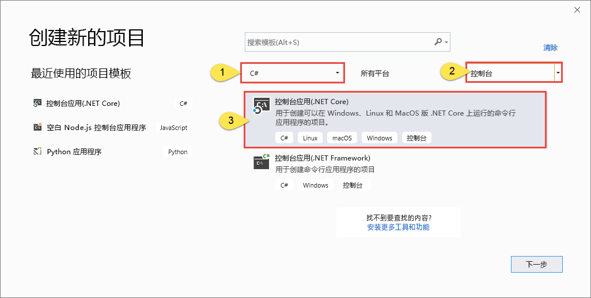
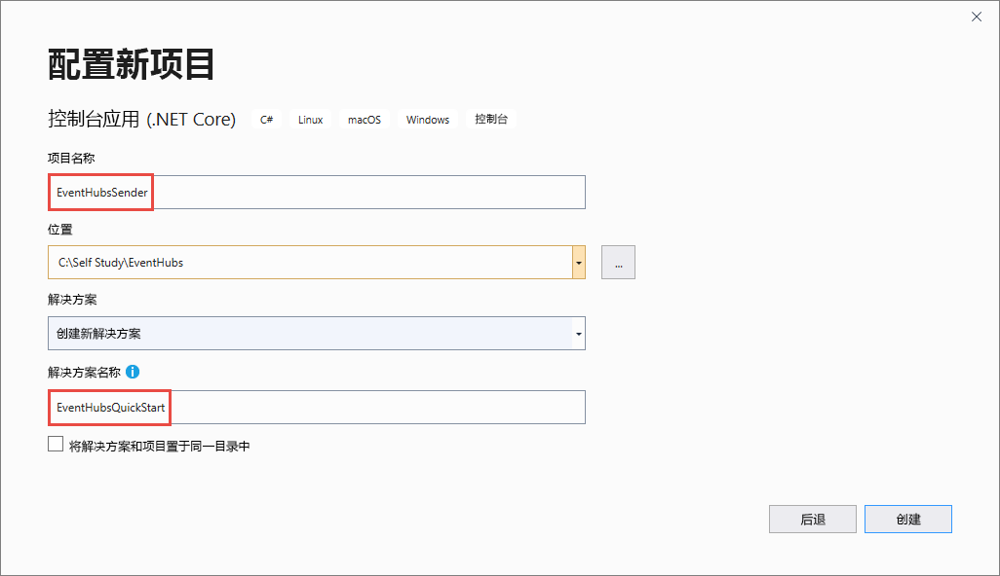

# <a name="send-events-to-and-receive-events-from-azure-event-hubs---net-core-azuremessagingeventhubs"></a>向/从 Azure 事件中心发送/接收事件 - .NET Core (Azure.Messaging.EventHubs) 
本快速入门介绍如何使用 **Azure.Messaging.EventHubs** .NET Core 库向事件中心发送事件以及从事件中心接收事件。 

> [!IMPORTANT]
> 本快速入门使用新的 **Azure.Messaging.EventHubs** 库。 有关使用旧的 **Microsoft.Azure.EventHubs** 库的快速入门，请参阅[使用 Microsoft.Azure.EventHubs 库发送和接收事件](event-hubs-dotnet-standard-getstarted-send.md)。 


## <a name="prerequisites"></a>必备条件
如果不熟悉 Azure 事件中心，请在阅读本快速入门之前参阅[事件中心概述](event-hubs-about.md)。 

若要完成本快速入门，需要具备以下先决条件：

- **Microsoft Azure 订阅**。 若要使用 Azure 服务（包括 Azure 事件中心），需要一个订阅。  如果没有现有的 Azure 帐户，可以注册[免费试用](https://azure.microsoft.com/free/)帐户，或者在[创建帐户](https://azure.microsoft.com)时使用 MSDN 订阅者权益。
- **Microsoft Visual Studio 2019**。 Azure 事件中心客户端库利用 C# 8.0 中引入的新功能。  仍可以在旧版 C# 中使用该库，但该库的某些功能不可用。  若要启用这些功能，必须[将 .NET Core 3.0 用作目标](/dotnet/standard/frameworks#how-to-specify-target-frameworks)，或指定要使用的[语言版本](/dotnet/csharp/language-reference/configure-language-version#override-a-default)（8.0 或更高）。 如果使用 Visual Studio，Visual Studio 2019 以前的版本与用于生成 C# 8.0 项目的工具将不兼容。 可在[此处](https://visualstudio.microsoft.com/vs/)下载 Visual Studio 2019（包括免费的 Community Edition）
- **创建事件中心命名空间和事件中心**。 第一步是使用 [Azure 门户](https://portal.azure.com)创建事件中心类型的命名空间，并获取应用程序与事件中心进行通信所需的管理凭据。 要创建命名空间和事件中心，请按照[此文](event-hubs-create.md)中的步骤操作。 然后，按照以下文章中的说明获取**事件中心命名空间的连接字符串**：[获取连接字符串](event-hubs-get-connection-string.md#get-connection-string-from-the-portal)。 稍后将在本快速入门中使用连接字符串。

## <a name="send-events"></a>发送事件 
本部分介绍如何创建一个向事件中心发送事件的 .NET Core 控制台应用程序。 

### <a name="create-a-console-application"></a>创建控制台应用程序

1. 启动 Visual Studio 2019。 
1. 选择“创建新项目”。  
1. 在“创建新项目”对话框中执行以下步骤：  如果看不到此对话框，请在菜单中选择“文件”，然后依次选择“新建”、“项目”。    
    1. 选择“C#”作为编程语言。 
    1. 选择“控制台”作为应用程序类型。  
    1. 从结果列表中选择“控制台应用(.NET Core)”。  
    1. 然后，选择“下一步”  。 

            
1. 输入 **EventHubsSender** 作为项目名称，输入 **EventHubsQuickStart** 作为解决方案名称，然后选择“确定”以创建项目。  

    

### <a name="add-the-event-hubs-nuget-package"></a>添加事件中心 NuGet 包

1. 在菜单中选择“工具”   > “NuGet 包管理器”   > “包管理器控制台”  。 
1. 运行以下命令安装 **Azure.Messaging.EventHubs** NuGet 包：

    ```cmd
    Install-Package Azure.Messaging.EventHubs
    ```


### <a name="write-code-to-send-messages-to-the-event-hub"></a>编写代码以将消息发送到事件中心

1. 在 **Program.cs** 文件顶部添加以下 `using` 语句：

    ```csharp
    using System.Text;
    using System.Threading.Tasks;
    using Azure.Messaging.EventHubs;
    using Azure.Messaging.EventHubs.Producer;
    ```

2. 将事件中心连接字符串和事件中心名称的常量添加到 `Program` 类。 请将括号中的占位符替换为在创建事件中心时获取的适当值。 请确保 `{Event Hubs namespace connection string}` 是命名空间级别的连接字符串，而不是事件中心字符串。 

    ```csharp
    private const string connectionString = "<EVENT HUBS NAMESPACE - CONNECTION STRING>";
    private const string eventHubName = "<EVENT HUB NAME>";
    ```

3. 将 `Main` 方法替换为以下 `async Main` 方法。 参阅代码注释了解详细信息。 

    ```csharp
        static async Task Main()
        {
            // Create a producer client that you can use to send events to an event hub
            await using (var producerClient = new EventHubProducerClient(connectionString, eventHubName))
            {
                // Create a batch of events 
                using EventDataBatch eventBatch = await producerClient.CreateBatchAsync();

                // Add events to the batch. An event is a represented by a collection of bytes and metadata. 
                eventBatch.TryAdd(new EventData(Encoding.UTF8.GetBytes("First event")));
                eventBatch.TryAdd(new EventData(Encoding.UTF8.GetBytes("Second event")));
                eventBatch.TryAdd(new EventData(Encoding.UTF8.GetBytes("Third event")));

                // Use the producer client to send the batch of events to the event hub
                await producerClient.SendAsync(eventBatch);
                Console.WriteLine("A batch of 3 events has been published.");
            }
        }
    ```
5. 生成项目并确保没有错误。
6. 运行程序并等待出现确认消息。 
7. 在 Azure 门户中，可以验证事件中心是否已收到消息。 在“指标”部分切换到“消息”视图。   刷新页面以更新图表。 可能需要在几秒钟后才会显示已收到消息。 

    [](./media/getstarted-dotnet-standard-send-v2/verify-messages-portal.png#lightbox)

    > [!NOTE]
    > 有关包含更详细注释的完整源代码，请参阅 [GitHub 上的此文件](https://github.com/Azure/azure-sdk-for-net/blob/master/sdk/eventhub/Azure.Messaging.EventHubs/samples/Sample03_PublishAnEventBatch.cs)

## <a name="receive-events"></a>接收事件
本部分介绍如何编写一个使用事件处理器从事件中心接收消息的 .NET Core 控制台应用程序。 该事件处理器通过从事件中心管理持久检查点和并行接收操作，来简化从这些事件中心接收事件的过程。 事件处理器与特定的事件中心和使用者组相关联。 它从事件中心内的多个分区接收事件，并将其传递给处理程序委托，以使用提供的代码进行处理。 


### <a name="create-an-azure-storage-and-a-blob-container"></a>创建 Azure 存储和 Blob 容器
本快速入门使用 Azure 存储作为检查点存储。 按照以下步骤创建 Azure 存储帐户。 

1. [创建 Azure 存储帐户](/azure/storage/common/storage-account-create?tabs=azure-portal)
2. [创建一个 blob 容器](../storage/blobs/storage-quickstart-blobs-portal.md#create-a-container)
3. [获取存储帐户的连接字符串](../storage/common/storage-configure-connection-string.md?#view-and-copy-a-connection-string)

    请记下该连接字符串和容器名称。 稍后要在接收代码中使用这些信息。 


### <a name="create-a-project-for-the-receiver"></a>为接收器创建项目

1. 在“解决方案资源管理器”窗口中，右键单击“EventHubQuickStart”解决方案，指向“添加”，然后选择“新建项目”。    
1. 依次选择“控制台应用(.NET Core)”、“下一步”。   
1. 输入 **EventHubsReceiver** 作为**项目名称**，然后选择“创建”。  

### <a name="add-the-event-hubs-nuget-package"></a>添加事件中心 NuGet 包

1. 在菜单中选择“工具”   > “NuGet 包管理器”   > “包管理器控制台”  。 
1. 运行以下命令安装 **Azure.Messaging.EventHubs** NuGet 包：

    ```cmd
    Install-Package Azure.Messaging.EventHubs
    ```
1. 运行以下命令安装 **Azure.Messaging.EventHubs.Processor** NuGet 包：

    ```cmd
    Install-Package Azure.Messaging.EventHubs.Processor
    ```    

### <a name="update-the-main-method"></a>更新 Main 方法 

1. 在 **Program.cs** 文件顶部添加以下 `using` 语句。

    ```csharp
    using System.Text;
    using System.Threading.Tasks;
    using Azure.Storage.Blobs;
    using Azure.Messaging.EventHubs;
    using Azure.Messaging.EventHubs.Consumer;
    using Azure.Messaging.EventHubs.Processor;
    ```
1. 将事件中心连接字符串和事件中心名称的常量添加到 `Program` 类。 请将括号中的占位符替换为在创建事件中心时获取的适当值。 请将括号中的占位符替换为创建事件中心和存储帐户时获取的适当值（访问密钥 - 主连接字符串）。 请确保 `{Event Hubs namespace connection string}` 是命名空间级别的连接字符串，而不是事件中心字符串。

    ```csharp
        private const string ehubNamespaceConnectionString = "<EVENT HUBS NAMESPACE - CONNECTION STRING>";
        private const string eventHubName = "<EVENT HUB NAME>";
        private const string blobStorageConnectionString = "<AZURE STORAGE CONNECTION STRING>";
        private const string blobContainerName = "<BLOB CONTAINER NAME>";
    ```
3. 将 `Main` 方法替换为以下 `async Main` 方法。 参阅代码注释了解详细信息。 

    ```csharp
        static async Task Main()
        {
            // Read from the default consumer group: $Default
            string consumerGroup = EventHubConsumerClient.DefaultConsumerGroupName;

            // Create a blob container client that the event processor will use 
            BlobContainerClient storageClient = new BlobContainerClient(blobStorageConnectionString, blobContainerName);

            // Create an event processor client to process events in the event hub
            EventProcessorClient processor = new EventProcessorClient(storageClient, consumerGroup, ehubNamespaceConnectionString, eventHubName);

            // Register handlers for processing events and handling errors
            processor.ProcessEventAsync += ProcessEventHandler;
            processor.ProcessErrorAsync += ProcessErrorHandler;

            // Start the processing
            await processor.StartProcessingAsync();

            // Wait for 10 seconds for the events to be processed
            await Task.Delay(TimeSpan.FromSeconds(10));

            // Stop the processing
            await processor.StopProcessingAsync();
        }    
    ```
1. 现在，将以下事件和错误处理程序方法添加到类中。 

    ```csharp
        static Task ProcessEventHandler(ProcessEventArgs eventArgs)
        { 
            // Write the body of the event to the console window
            Console.WriteLine("\tRecevied event: {0}", Encoding.UTF8.GetString(eventArgs.Data.Body.ToArray())); 
            return Task.CompletedTask; 
        }

        static Task ProcessErrorHandler(ProcessErrorEventArgs eventArgs)
        {
            // Write details about the error to the console window
            Console.WriteLine($"\tPartition '{ eventArgs.PartitionId}': an unhandled exception was encountered. This was not expected to happen.");
            Console.WriteLine(eventArgs.Exception.Message);
            return Task.CompletedTask;
        }    
    ```
1. 生成项目并确保没有错误。

    > [!NOTE]
    > 有关包含更详细注释的完整源代码，请参阅 [GitHub 上的此文件](https://github.com/Azure/azure-sdk-for-net/blob/master/sdk/eventhub/Azure.Messaging.EventHubs.Processor/samples/Sample01_HelloWorld.cs)。
6. 运行接收器应用程序。 
1. 应会看到一条消息，指出已接收事件。 

    

    这些事件是前面通过运行发送器程序发送到事件中心的三个事件。 


## <a name="next-steps"></a>后续步骤
查看 GitHub 上的示例。 

- [GitHub 上的事件中心示例](https://github.com/Azure/azure-sdk-for-net/tree/master/sdk/eventhub/Azure.Messaging.EventHubs/samples)
- [GitHub 上的事件处理器示例](https://github.com/Azure/azure-sdk-for-net/tree/master/sdk/eventhub/Azure.Messaging.EventHubs.Processor/samples)
- [基于角色的访问控制 (RBAC) 示例](https://github.com/Azure/azure-event-hubs/tree/master/samples/DotNet/Azure.Messaging.EventHubs/ManagedIdentityWebApp)
