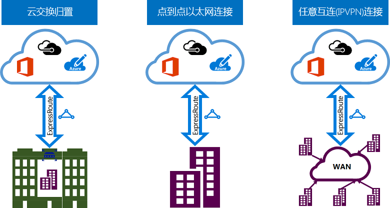

# ExpressRoute 连接模型
在本地网络和 Microsoft 云之间创建连接时，可以采用三种不同的方式：[CloudExchange 归置](#CloudExchange)、[点到点以太网连接](#Ethernet)、[任意位置之间的 (IPVPN) 连接](#IPVPN)。 连接服务提供商可以提供一个或多个连接模型。 你可以咨询连接服务提供商以选择最合适的模型。
  

## 共置于云交换位置
如果你所在的位置提供云交换设施，则你可以订购虚拟交叉连接，以通过共同租用提供商的以太网交换连接到 Microsoft 云。 共同租用提供商可以在共置设施中的基础结构与 Microsoft 云之间提供第 2 层交叉连接或托管的第 3 层交叉连接。

## 点到点以太网连接
你可以通过点到点以太网链路，将本地数据中心/办公室连接到 Microsoft 云。 点到点以太网提供商可以在你的站点与 Microsoft 云之间提供第 2 层连接或托管的第 3 层连接。

## 任意位置之间的 (IPVPN) 网络
你可以将 WAN 集成到 Microsoft 云。 IPVPN 提供商（通常提供 MPLS VPN）可在分支机构与数据中心之间提供任意位置之间的连接。 Microsoft 云可与你的 WAN 互连，就如同它是其他任何一个分支机构。 WAN 提供商通常提供托管的第 3 层连接。 在上述所有连接模型中，ExpressRoute 功能与特性完全相同。 

## 后续步骤
* 了解 ExpressRoute 连接和路由域。 请参阅 [ExpressRoute 线路和路由域](expressroute-circuit-peerings.md)。
* 了解 ExpressRoute 功能。 请参阅 [ExpressRoute 技术概述](expressroute-introduction.md)
* 查找服务提供商。 请参阅 [ExpressRoute 合作伙伴和对等位置](expressroute-locations.md)。
* 确保符合所有先决条件。 请参阅 [ExpressRoute 先决条件](expressroute-prerequisites.md)。
* 请参阅[路由](expressroute-routing.md)、[NAT](expressroute-nat.md) 和 [QoS](expressroute-qos.md) 的要求。
* 配置 ExpressRoute 连接。
  * [创建 ExpressRoute 线路](expressroute-howto-circuit-portal-resource-manager.md)
  * [配置路由](expressroute-howto-routing-portal-resource-manager.md)
  * [将 VNet 链接到 ExpressRoute 线路](expressroute-howto-linkvnet-portal-resource-manager.md)
