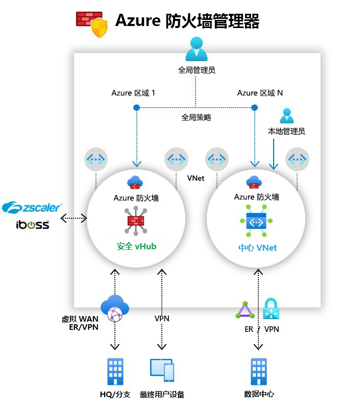

# 什么是 Azure 防火墙管理器预览版？

[!INCLUDE [Preview](../../includes/firewall-manager-preview-notice.md)]

Azure 防火墙管理器预览版是一种安全管理服务，可为基于云的安全外围提供中心安全策略和路由管理。 

防火墙管理器可为两种网络体系结构类型提供安全管理：

- **安全虚拟中心**

   [Azure 虚拟 WAN 中心](../virtual-wan/virtual-wan-about.md#resources)是一种 Microsoft 托管资源，可用于轻松创建中心辐射型体系结构。 当安全和路由策略与此类中心相关联时，它被称为[安全虚拟中心](secured-virtual-hub.md)。 
- **中心虚拟网络**

   这是你自己创建并管理的标准 Azure 虚拟网络。 安全策略在与此类中心关联后，将称为中心虚拟网络。  目前仅支持 Azure 防火墙策略。 可将包含工作负荷服务器和服务的辐射虚拟网络对等互连。 还可以在未对等互连到任何辐射的独立虚拟网络中管理防火墙。

有关安全虚拟中心与中心虚拟网络体系结构的详细比较，请参阅[有哪些 Azure 防火墙管理器体系结构选项？](vhubs-and-vnets.md)。 

## Azure 防火墙管理器预览版功能

Azure 防火墙管理器预览版具有以下功能：

### 中央 Azure 防火墙部署和配置

可以集中部署和配置多个跨不同 Azure 区域和订阅的 Azure 防火墙实例。 

### 分层策略（全局和本地）

可以使用 Azure 防火墙管理器预览版跨多个安全虚拟中心集中管理 Azure 防火墙策略。 中央 IT 团队可以创作全局防火墙策略，跨团队实施组织范围的防火墙策略。 本地创作的防火墙策略允许 DevOps 自助服务模型，敏捷性更高。

### 与第三方安全即服务集成，安全性更佳

除了 Azure 防火墙，还可以集成第三方安全即服务 (SECaaS) 提供程序，为 VNet 和分支 Internet 连接提供双重网络保护。

此功能仅在安全虚拟中心部署中可用。

- VNet 到 Internet (V2I) 流量筛选

   - 使用首选第三方安全提供程序筛选出站虚拟网络流量。
   - 为在 Azure 上运行的云工作负荷提供高级用户感知型 Internet 保护。

- 分支到 Internet (B2I) 流量筛选

   利用 Azure 连接和全局分发功能，轻松为分支到 Internet 流量添加第三方筛选。

有关受信任的安全提供程序的详细信息，请参阅[什么是 Azure 防火墙管理器受信任安全合作伙伴（预览版）？](trusted-security-partners.md)

### 集中式路由管理

可轻松将流量路由到安全中心进行筛选和记录，无需在辐射虚拟网络上手动设置用户定义路由 (UDR)。 

此功能仅在安全虚拟中心部署中可用。

可使用第三方提供程序对分支到 Internet (B2I) 流量进行筛选，同时使用 Azure 防火墙对分支到 VNet (B2V)、VNet 到 VNet (V2V) 以及 VNet 到 Internet (V2I) 流量进行筛选。 只要 B2V 或 V2V 无需 Azure 防火墙，还可以使用第三方提供程序对 V2I 流量进行筛选。 

## 上市区域

可以跨区域使用 Azure 防火墙策略。 例如，可以在美国西部创建一个策略，然后在美国东部使用它。 

## 已知问题

Azure 防火墙管理器预览版存在以下已知问题：

|问题  |说明  |缓解操作  |
|---------|---------|---------|
|第三方筛选限制。|Azure 防火墙 B2V 和 V2V 不支持使用第三方提供程序筛选 V2I 流量。|正在调查|
|当前不支持流量拆分。|当前不支持 Office 365 和 Azure 公共 PaaS 流量拆分。 因此，为 V2I 或 B2I 选择第三方提供程序也会通过合作伙伴服务发送所有 Azure 公共 PaaS 和 Office 365 流量。|正在调查中心的流量拆分。
|每个区域一个安全虚拟中心。|在每个区域最多只能使用一个安全虚拟中心。|可在一个区域中创建多个虚拟 WAN。|
|基本策略必须与本地策略位于同一区域中。|可在与基本策略相同的区域中创建所有本地策略。 仍可以将在安全中心的某个区域中创建的策略应用于另一个区域。|正在调查|
|中心之间的通信不适用于安全虚拟中心|目前尚不支持安全虚拟中心之间的通信。|正在调查|
|共享同一虚拟 WAN 的所有安全虚拟中心必须位于同一资源组中。|此行为现在与虚拟 WAN 中心保持一致。|创建多个虚拟 WAN，以允许在不同的资源组中创建安全虚拟中心。|
|防火墙策略不支持 IP 组。|IP 组以公共预览版提供，目前仅受传统防火墙规则支持。|正在修复。
|不支持云解决方案提供程序 (CSP) 订阅。|目前不支持 [CSP 订阅](https://azure.microsoft.com/offers/ms-azr-0145p/)。|正在调查

## 后续步骤

- 回顾 [Azure 防火墙管理器预览版部署概述](deployment-overview.md)
- 了解[安全虚拟中心](secured-virtual-hub.md)。