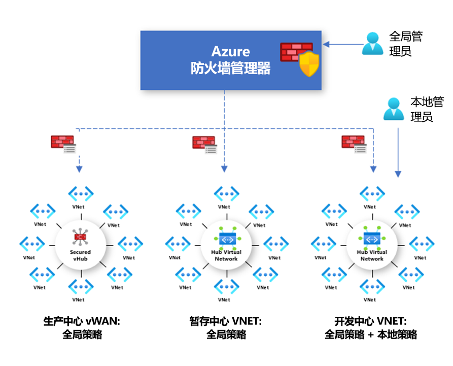

# Azure 防火墙管理器预览版策略概述

[!INCLUDE [Preview](../../includes/firewall-manager-preview-notice.md)]

防火墙策略是包含 NAT、网络和应用程序规则集合以及威胁情报设置的 Azure 资源。 它是一个全局资源，可跨安全虚拟中心和中心虚拟网络中的多个 Azure 防火墙实例使用。 策略跨区域和订阅工作。

## 策略的创建和关联

可通过多种方式创建和管理策略，包括使用 Azure 门户、REST API、模板、Azure PowerShell 和 CLI。

还可以使用门户或 Azure PowerShell 迁移 Azure 防火墙中的现有规则，以创建策略。 有关详细信息，请参阅[如何将 Azure 防火墙配置迁移到 Azure 防火墙策略（预览版）](migrate-to-policy.md)。 

策略可与一个或多个虚拟中心或 VNet 相关联。 防火墙可以位于与帐户关联的任何订阅中，且可以位于任何区域中。

## 分层策略

可以从头开始创建新策略，或者从现有策略继承策略。 DevOps 可以通过继承在组织规定的基本策略之上创建本地防火墙策略。

使用非空父策略创建的策略从父策略继承所有规则集合。 继承自父策略的网络规则集始终优先于定义为新策略一部分的网络规则集合。 相同的逻辑也适用于应用程序规则集合。 但是，不管是否继承，网络规则集合始终在应用程序规则集合之前进行处理。

威胁情报模式也继承自父策略。 可将威胁情报模式设置为不同的值以替代此行为，但无法禁用模式。 只能使用更严格的值替代行为。 例如，如果父策略设置为“仅警报”，则可将此本地策略配置为“警报并拒绝”。  

NAT 规则集合不是继承的，因为它们与给定的防火墙相关。

通过继承，对父策略进行的任何更改会自动应用到关联的防火墙子策略。

## 传统规则和策略

Azure 防火墙支持传统规则和策略。 下表对策略和规则做了比较：

|         |策略  |规则  |
|---------|---------|---------|
|包含     |NAT、网络、应用程序规则和威胁情报设置|NAT、网络和应用程序规则 |
|保护     |虚拟中心和虚拟网络|仅虚拟网络|
|门户体验     |使用防火墙管理器的集中式管理|独立的防火墙体验|
|支持多个防火墙     |防火墙策略是可跨防火墙使用的独立资源|手动导出和导入规则，或使用第三方管理解决方案 |
|定价     |根据防火墙关联计费。 请参阅[定价](#pricing)。|免费|
|支持的部署机制     |门户、REST API、模板、Azure PowerShell 和 CLI|门户、REST API、模板、PowerShell 和 CLI。 |
|版本状态     |公共预览版|正式版|

## 定价

策略根据防火墙关联计费。 存在零个或一个防火墙关联的策略是免费的。 存在多个防火墙关联的策略按固定费率计费。 有关详细信息，请参阅 [Azure 防火墙管理器定价](https://azure.microsoft.com/pricing/details/firewall-manager/)。

## 后续步骤

若要了解如何部署 Azure 防火墙，请参阅[教程：在 Azure 门户中使用 Azure 防火墙管理器预览版保护云网络](secure-cloud-network.md)。
