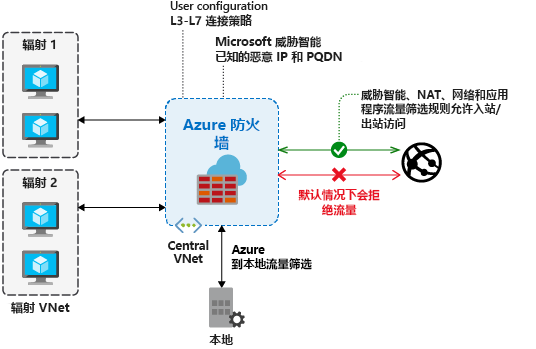

# 什么是 Azure 防火墙？

Azure 防火墙是托管的基于云的网络安全服务，可保护 Azure 虚拟网络资源。 它是一个服务形式的完全有状态防火墙，具有内置的高可用性和不受限制的云可伸缩性。

可以跨订阅和虚拟网络集中创建、实施和记录应用程序与网络连接策略。 Azure 防火墙对虚拟网络资源使用静态公共 IP 地址，使外部防火墙能够识别来自你的虚拟网络的流量。  该服务与用于日志记录和分析的 Azure Monitor 完全集成。

Azure 防火墙提供以下功能：

## 内置的高可用性

内置高可用性，因此不需要部署额外的负载均衡器，也不需要进行任何配置。

## 可用性区域

在部署期间，可将 Azure 防火墙配置为跨多个可用性区域，以提高可用性。 使用可用性区域可将可用性提高到 99.99% 运行时间。 有关详细信息，请参阅 Azure 防火墙的[服务级别协议 (SLA)](https://azure.microsoft.com/support/legal/sla/azure-firewall/v1_0/)。 如果选择了两个或更多个可用性区域，则可以提供 99.99% 的运行时间 SLA。

还可以仅仅出于相互更靠近的原因，将 Azure 防火墙关联到特定的区域，并享用服务标准 99.95% SLA。

在可用性区域中部署的防火墙不会产生额外的费用。 但是，与可用性区域关联的入站和出站数据传输会产生额外的费用。 有关详细信息，请参阅[带宽定价详细信息](https://azure.microsoft.com/pricing/details/bandwidth/)。

在支持可用性区域的区域中可以使用 Azure 防火墙可用性区域。 有关详细信息，请参阅[在 Azure 中支持可用性区域的区域](../availability-zones/az-region.md)。

> [!NOTE]
> 只能在部署期间配置可用性区域。 无法将现有的防火墙配置为包含可用性区域。

有关可用性区域的详细信息，请参阅 [Azure 中的区域和可用性区域](../availability-zones/az-overview.md)

## 不受限制的云可伸缩性

为了适应不断变化的网络流量流，Azure 防火墙可尽最大程度进行纵向扩展，因此不需要为峰值流量做出预算。

## 应用程序 FQDN 筛选规则

可将出站 HTTP/S 流量或 Azure SQL 流量（预览版）限制到指定的一组完全限定的域名 (FQDN)（包括通配符）。 此功能不需要 TLS 终止。

## 网络流量筛选规则

可以根据源和目标 IP 地址、端口和协议，集中创建“允许”或“拒绝”网络筛选规则。   Azure 防火墙是完全有状态的，因此它能区分不同类型的连接的合法数据包。 将跨多个订阅和虚拟网络实施与记录规则。

## FQDN 标记

FQDN 标记使你可以轻松地允许已知的 Azure 服务网络流量通过防火墙。 例如，假设你想要允许 Windows 更新网络流量通过防火墙。 创建应用程序规则，并在其中包括 Windows 更新标记。 现在，来自 Windows 更新的网络流量将可以流经防火墙。

## 服务标记

服务标记表示一组 IP 地址前缀，帮助最大程度地降低安全规则创建过程的复杂性。 无法创建自己的服务标记，也无法指定要将哪些 IP 地址包含在标记中。 Microsoft 会管理服务标记包含的地址前缀，并会在地址发生更改时自动更新服务标记。

## 威胁情报

可以为防火墙启用基于威胁智能的筛选，以提醒和拒绝来自/到达已知恶意 IP 地址和域的流量。 IP 地址和域源自 Microsoft 威胁智能源。

## 出站 SNAT 支持

所有出站虚拟网络流量 IP 地址将转换为 Azure 防火墙公共 IP（源网络地址转换）。 可以识别源自你的虚拟网络的流量，并允许将其发往远程 Internet 目标。 如果目标 IP 是符合 [IANA RFC 1918](https://tools.ietf.org/html/rfc1918) 的专用 IP 范围，Azure 防火墙不会执行 SNAT。 

如果组织对专用网络使用公共 IP 地址范围，Azure 防火墙会通过 SNAT 将流量发送到 AzureFirewallSubnet 中的某个防火墙专用 IP 地址。 可以将 Azure 防火墙配置为**不** SNAT 公共 IP 地址范围。 有关详细信息，请参阅 [Azure 防火墙 SNAT 专用 IP 地址范围](snat-private-range.md)。

## 入站 DNAT 支持

转换到防火墙公共 IP 地址的入站 Internet 网络流量（目标网络地址转换）并将其筛选到虚拟网络上的专用 IP 地址。

## 多个公共 IP 地址

可将多个公共 IP 地址（最多 250 个）关联到防火墙。

这样可以实现以下方案：

- **DNAT** - 可将多个标准端口实例转换为后端服务器。 例如，如果你有两个公共 IP 地址，可以转换这两个 IP 地址的 TCP 端口 3389 (RDP)。
- **SNAT** - 其他端口可用于出站 SNAT 连接，以减少 SNAT 端口耗尽的可能性。 目前，Azure 防火墙会随机选择用于建立连接的源公共 IP 地址。 如果你在网络中进行任何下游筛选，则需要允许与防火墙关联的所有公共 IP 地址。 请考虑使用[公共 IP 地址前缀](../virtual-network/public-ip-address-prefix.md)来简化此配置。

## Azure Monitor 日志记录

所有事件与 Azure Monitor 集成，使你能够在存储帐户中存档日志、将事件流式传输到事件中心，或者将其发送到 Azure Monitor 日志。

## 认证

Azure 防火墙符合支付卡行业 (PCI)、服务组织控制 (SOC)、国际标准化组织 (ISO) 和 ICSA 实验室标准。 有关详细信息，请参阅 [Azure 防火墙符合性认证](compliance-certifications.md)。

## 已知问题

Azure 防火墙存在以下已知问题：

|问题  |说明  |缓解操作  |
|---------|---------|---------|
针对非 TCP/UDP 协议（例如 ICMP）的网络筛选规则不适用于 Internet 绑定的流量|针对非 TCP/UDP 协议的网络筛选规则不支持公共 IP 地址的 SNAT。 在分支子网与 VNet 之间支持非 TCP/UDP 协议。|Azure 防火墙使用[目前不支持 IP 协议 SNAT](https://docs.microsoft.com/azure/load-balancer/load-balancer-overview) 的标准负载均衡器。 我们正在探索如何在将来的版本中推出支持此方案的选项。|
|缺少对 ICMP 的 PowerShell 和 CLI 支持|Azure PowerShell 和 CLI 不支持使用 ICMP 作为网络规则中的有效协议。|仍然可以通过门户和 REST API 使用 ICMP 作为协议。 我们正在致力于在不久之后在 PowerShell 和 CLI 中添加 ICMP。|
|FQDN 标记要求设置 protocol: port|带有 FQDN 标记的应用程序规则需要 port:protocol 定义。|可以将 **https** 用作 port: protocol 值。 我们正在致力于使此字段在使用了 FQDN 标记时可选。|
|不支持将防火墙移动到不同的资源组或订阅|不支持将防火墙移动到不同的资源组或订阅。|我们已计划提供此功能的支持。 若要将防火墙移动到不同的资源组或订阅，必须删除当前实例并在新的资源组或订阅中重新创建它。|
|威胁智能警报可能会被屏蔽|配置为仅警报模式时，目标为 80/443 的用于出站筛选的网络规则会屏蔽威胁智能警报。|使用应用程序规则为 80/443 创建出站筛选。 或者，将威胁智能模式更改为“提醒和拒绝”  。|
|Azure 防火墙只将 Azure DNS 用于名称解析|Azure 防火墙只使用 Azure DNS 来解析 FQDN。 不支持自定义 DNS 服务器。 对其他子网上的 DNS 解析没有影响。|我们正在努力放宽此限制。|
|Azure 防火墙 DNAT 不适用于专用 IP 目标|Azure 防火墙 DNAT 支持仅限于 Internet 出口/入口。 DNAT 目前不适用于专用 IP 目标。 例如，分支到分支。|这是当前的一项限制。|
|无法删除第一个公共 IP 配置|每个 Azure 防火墙公共 IP 地址都分配给一个 IP 配置  。  第一个 IP 配置在防火墙部署过程中分配，通常还包含对防火墙子网的引用（除非通过模板部署以不同的方式进行了显式配置）。 无法删除此 IP 配置，因为它会取消分配防火墙。 如果防火墙至少包含另一个可用的公共 IP 地址，则你仍然可以更改或删除与此 IP 配置相关联的公共 IP 地址。|这是设计的结果。|
|只能在部署期间配置可用性区域。|只能在部署期间配置可用性区域。 部署防火墙后无法配置可用性区域。|这是设计的结果。|
|对入站连接的 SNAT|除了 DNAT 以外，通过防火墙公共 IP 地址（入站）建立的连接将通过 SNAT 转换为某个防火墙专用 IP。 当前提出此项要求（也适用于主动/主动 NVA）的目的是确保对称路由。|若要保留 HTTP/S 的原始源，请考虑使用 [XFF](https://en.wikipedia.org/wiki/X-Forwarded-For) 标头。 例如，在防火墙前面使用 [Azure Front Door](../frontdoor/front-door-http-headers-protocol.md#front-door-to-backend) 或 [Azure 应用程序网关](../application-gateway/rewrite-http-headers.md)等服务。 还可以添加 WAF 作为 Azure Front Door 的一部分，并链接到防火墙。
|仅在代理模式下支持 SQL FQDN 筛选（端口 1433）|对于 Azure SQL 数据库、Azure SQL 数据仓库和 Azure SQL 托管实例：  在预览期间，仅在代理模式下支持 SQL FQDN 筛选（端口 1433）。  对于 Azure SQL IaaS：  如果使用的是非标准端口，则可以在应用程序规则中指定这些端口。|对于采用重定向模式的 SQL（这是从 Azure 内连接时采用的默认设置），可以将 SQL 服务标记用作 Azure 防火墙网络规则的一部分，改为对访问进行筛选。
|不允许 TCP 端口 25 上的出站流量| 将阻止使用 TCP 端口 25 的出站 SMTP 连接。 端口 25 主要用于未经身份验证的电子邮件传递。 这是虚拟机的默认平台行为。 有关详细信息，请参阅[排查 Azure 中的出站 SMTP 连接问题](../virtual-network/troubleshoot-outbound-smtp-connectivity.md)。 但是，与虚拟机不同，目前无法在 Azure 防火墙上启用此功能。 注意：若要允许经过身份验证的 SMTP（端口 587）或基于除 25 之外的端口的 SMTP，请确保配置网络规则而不是应用程序规则，因为目前不支持 SMTP 检查。|请按照 SMTP 故障排除文章中所述的建议方法发送电子邮件。 或者，排除需要从默认路由对防火墙进行出站 SMTP 访问的虚拟机。 改为配置直接对 Internet 进行出站访问。
|主动 FTP 不受支持|在 Azure 防火墙上禁用主动 FTP，防范使用 FTP PORT 命令进行的 FTP 弹跳攻击。|可以改用被动 FTP。 仍需在防火墙上显式打开 TCP 端口 20 和 21。
|SNAT 端口使用率指标显示 0%|即使使用 SNAT 端口，Azure 防火墙 SNAT 端口使用率指标也可能显示 0%。 在这种情况下，将此指标用作防火墙运行状况指标的一部分会导致不正确的结果。|此问题已修复，预计在 2020 年 5 月推出生产版。 在某些情况下，重新部署防火墙即可解决此问题，但存在偶然性。 可以只使用防火墙运行状况状态来查找 *status=degraded* 而非 *status=unhealthy*，但这是一种权宜解决方法。 端口耗尽会显示为“已降级”  。  “不正常”保留给将来使用，到时会有更多指标影响防火墙运行状况。
|在启用了强制隧道的情况下不支持 DNAT|由于采用非对称路由，在启用了强制隧道的情况下部署的防火墙无法支持从 Internet 进行入站访问。|这种限制是根据非对称路由设计的。 入站连接的返回路径通过本地防火墙，而该防火墙看不到已建立的连接。
|出站被动 FTP 不适用于具有多个公共 IP 地址的防火墙。|被动 FTP 为控制通道和数据通道建立不同的连接。 当具有多个公共 IP 地址的防火墙发送出站数据时，它会随机选择一个公共 IP 地址作为源 IP 地址。 当数据通道和控制通道使用不同的源 IP 地址时，FTP 就会失败。|规划显式 SNAT 配置。 同时，对于这种情况，请考虑使用单个 IP 地址。|
|NetworkRuleHit 指标缺少协议维度|ApplicationRuleHit 指标允许基于筛选的协议，但相应的 NetworkRuleHit 指标中缺少此功能。|我们正在研究修复措施。|
|不支持端口介于 64000 和 65535 之间的 NAT 规则|Azure 防火墙允许网络和应用程序规则中 1-65535 范围内的任何端口，但是 NAT 规则仅支持 1-63999 范围内的端口。|这是当前的一项限制。
|配置更新平均可能需要 5 分钟。|Azure 防火墙配置更新平均可能需要 3 到 5 分钟，且不支持并行更新。|我们正在研究修复措施。

## 后续步骤

- [教程：使用 Azure 门户部署和配置 Azure 防火墙](tutorial-firewall-deploy-portal.md)
- [使用模板部署 Azure 防火墙](deploy-template.md)
- [创建 Azure 防火墙测试环境](scripts/sample-create-firewall-test.md)
