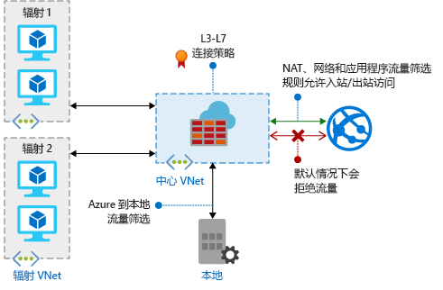

# 什么是 Azure 防火墙？

Azure 防火墙是托管的基于云的网络安全服务，可保护 Azure 虚拟网络资源。 它是一个服务形式的完全有状态防火墙，具有内置的高可用性和不受限制的云可伸缩性。 

[!INCLUDE [firewall-preview-notice](../../includes/firewall-preview-notice.md)]

可以跨订阅和虚拟网络集中创建、实施和记录应用程序与网络连接策略。 Azure 防火墙对虚拟网络资源使用静态公共 IP 地址，使外部防火墙能够识别来自你的虚拟网络的流量。  该服务与用于日志记录和分析的 Azure Monitor 完全集成。

## 功能

Azure 防火墙公共预览版提供以下功能：

### 内置的高可用性
内置高可用性，因此不需要部署额外的负载均衡器，也不需要进行任何配置。

### 不受限制的云可伸缩性 
为了适应不断变化的网络流量流，Azure 防火墙可尽最大程度进行纵向扩展，因此不需要为峰值流量做出预算。

### FQDN 筛选 
可将出站 HTTP/S 流量限制为指定的完全限定域名 (FQDN) 列表，包括通配符域名。 此功能不需要 SSL 终止。

### 网络流量筛选规则

可以根据源和目标 IP 地址、端口和协议，集中创建“允许”或“拒绝”网络筛选规则。 Azure 防火墙是完全有状态的，因此它能区分不同类型的连接的合法数据包。 将跨多个订阅和虚拟网络实施与记录规则。

### 出站 SNAT 支持

所有出站虚拟网络流量 IP 地址将转换为 Azure 防火墙公共 IP（源网络地址转换）。 可以识别源自你的虚拟网络的流量，并允许将其发往远程 Internet 目标。

### Azure Monitor 日志记录

所有事件与 Azure Monitor 集成，使你能够在存储帐户中存档日志、将事件流式传输到事件中心，或者将其发送到 Log Analytics。

## 已知问题

Azure 防火墙公共预览版存在以下已知问题：

|问题  |Description  |缓解措施  |
|---------|---------|---------|
|与 NSG 的互操作性     |如果在防火墙子网中应用了网络安全组 (NSG)，则 NSG 可能会阻止出站 Internet 连接，即使它配置为允许出站 Internet 访问。 出站 Internet 连接标记为来自 VirtualNetwork，目标为 Internet。 默认情况下，NSG 包含允许 VirtualNetwork 到 VirtualNetwork 连接的规则，但如果目标是 Internet，则不允许此类连接。|若要缓解此问题，请将以下入站规则添加到防火墙子网中应用的 NSG：  源：VirtualNetwork；源端口：任何   目标：任何；目标端口：任何   协议：所有；访问：允许|
|与 Azure 安全中心 (ASC) 实时 (JIT) 功能冲突|如果使用 JIT 访问虚拟机，并且虚拟机位于具有用户定义路由的子网中，而该路由指向用作默认网关的 Azure 防火墙，则 ASC JIT 不起作用。 这种结果是非对称路由造成的 – 数据包通过虚拟机公共 IP 传入（JIT 开放了访问权限），但返回路径是通过防火墙形成的，因此丢弃了数据包，因为防火墙上未建立会话。|若要解决此问题，请将 JIT 虚拟机放置在未与防火墙建立用户定义的路由的独立子网中。|
|使用全局对等互连的中心辐射模型不起作用|不支持中心辐射模型，其中，中心和防火墙部署在一个 Azure 区域，分支部署在另一个 Azure 区域，分支通过全局 VNet 对等互连连接到中心。|有关详细信息，请参阅[创建、更改或删除虚拟网络对等互连](https://docs.microsoft.com/en-us/azure/virtual-network/virtual-network-manage-peering#requirements-and-constraints)|
针对 TCP/UDP 协议（例如 ICMP）的网络筛选规则不适用于 Internet 绑定的流量|针对非 TCP/UDP 协议的网络筛选规则不支持公共 IP 地址的 SNAT。 在分支子网与 VNet 之间支持非 TCP/UDP 协议。|Azure 防火墙使用[目前不支持 IP 协议 SNAT](https://docs.microsoft.com/en-us/azure/load-balancer/load-balancer-standard-overview#limitations) 的标准负载均衡器。 我们正在探索如何在将来的版本中推出支持此方案的选项。

## 后续步骤

- [教程：使用 Azure 门户部署和配置 Azure 防火墙](tutorial-firewall-deploy-portal.md)
- [使用模板部署 Azure 防火墙](deploy-template.md)
- [创建 Azure 防火墙测试环境](scripts/sample-create-firewall-test.md)

