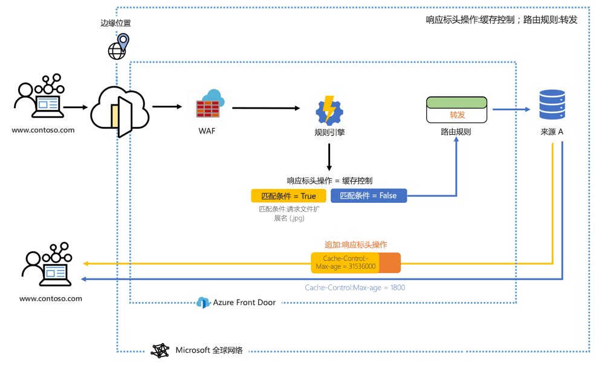
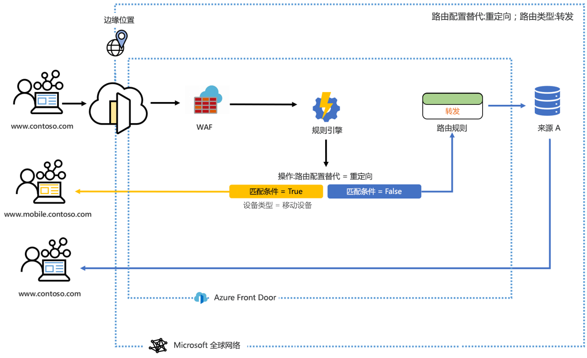

# 什么是 Azure Front Door 的规则引擎？ 

可以通过规则引擎自定义在边缘处理 HTTP 请求的方式，并对 Web 应用程序行为提供更多控制。 Azure Front Door 的规则引擎包含多个关键功能，例如：

- 基于标头的路由 - 根据请求标头、Cookie 和查询字符串的内容中的模式来路由请求。
- 基于参数的路由 - 利用一系列匹配条件（包括 post 参数、查询字符串、Cookie 和请求方法），根据 HTTP 请求参数路由请求。 
- 路由配置替代： 
    - 使用重定向功能将 301/302/307/308 重定向返回到客户端，以重定向到新的主机名、路径和协议。 
    - 使用转发功能重写请求 URL 路径（无需执行传统的重定向），并将请求转发到所配置的后端池中的相应后端。 
    - 自定义缓存配置，并根据匹配条件动态地将路由从转发更改为缓存。 

> [!IMPORTANT]
> 此公共预览版在提供时没有附带服务级别协议，不应用于生产工作负荷。 某些功能可能不受支持或受到约束，或者不一定在所有 Azure 位置都可用。 有关详细信息，请参阅 [Microsoft Azure 预览版补充使用条款](https://azure.microsoft.com/support/legal/preview-supplemental-terms/)。
>

## 体系结构 

规则引擎在边缘处理请求。 配置规则引擎后，当请求到达 Front Door 终结点时，将首先执行 WAF，然后执行与前端/域关联的规则引擎配置。 执行规则引擎配置意味着父路由规则已经是匹配项。 是否会执行规则引擎配置的每个规则中的所有操作取决于是否满足该规则中的所有匹配条件。 如果请求与规则引擎配置中的任何条件都不匹配，则会执行默认路由规则。 

例如，在下面的配置中，规则引擎配置为在满足匹配条件时追加一个响应标头，该响应标头更改缓存控件的最大有效期。 

在另一个示例中，我们看到规则引擎配置为当匹配条件（设备类型）为真时将用户发送到站点的移动版本。 

在这两个示例中，当不满足任何匹配条件时，会执行指定的路由规则。 

## 术语 

使用 AFD 规则引擎，可以创建一系列规则引擎配置，每个配置由一组规则组成。 下面概述了在配置规则引擎时会遇到的一些有用的术语。 

- 规则引擎配置  ：应用于单个路由规则的一组规则。 每个配置限制为 5 个规则。 最多可以创建 10 个配置。 
- 规则引擎规则  ：由最多 10 个匹配条件和 5 个操作组成的规则。
- 匹配条件  ：可以利用许多匹配条件来分析传入请求。 一个规则最多可包含 10 个匹配条件。 将使用 AND  运算符来评估匹配条件。 可以在[此处](front-door-rules-engine-match-conditions.md)找到匹配条件的完整列表。 
- *操作*：操作规定如何处理传入请求 - 目前，请求/响应标头操作、转发、重定向和重写都是可以使用的操作。 一个规则最多可包含 5 个操作；但是，一个规则只能包含 1 个路由配置替代。  可以在[此处](front-door-rules-engine-actions.md)找到操作的完整列表。

## 后续步骤

- 了解如何设置你的第一个[规则引擎配置](front-door-tutorial-rules-engine.md)。 
- 了解如何[创建 Front Door](quickstart-create-front-door.md)。
- 了解 [Front Door 的工作原理](front-door-routing-architecture.md)。
