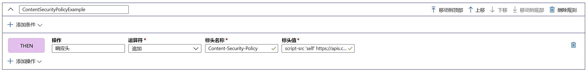

# 教程：使用规则引擎添加安全性标头

本教程介绍如何实现安全性标头以阻止基于浏览器的漏洞攻击，例如 HTTP Strict-Transport-Security (HSTS)、X-XSS-Protection、Content-Security-Policy 或 X-Frame-Options。 基于安全性的属性也可以用 Cookie 来定义。

下例演示了如何将 Content-Security-Policy 标头添加到所有传入请求中，这些请求与规则引擎配置关联的路由中定义的路径匹配。 在这里，我们仅允许来自受信任的站点 https://apiphany.portal.azure-api.net 的脚本在我们的应用程序上运行。

在本教程中，你将了解如何执行以下操作：
> [!div class="checklist"]
> - 在规则引擎中配置内容安全性策略。

## 先决条件

* 在完成本教程中的步骤之前，必须先创建一个 Front Door。 有关详细信息，请参阅[快速入门：创建 Front Door](quickstart-create-front-door.md)。
* 如果这是你第一次使用规则引擎功能，请参阅如何[设置规则引擎](front-door-tutorial-rules-engine.md)。

## 在 Azure 门户中添加 Content-Security-Policy 标头

1. 单击“添加”以添加新规则。 为规则提供一个名称，然后单击“添加操作” > “响应标头” 。

1. 将运算符设置为“追加”，将此标头添加为对此路由的所有传入请求的响应。

1. 添加标头名称：“Content-Security-Policy”，并定义此标头应接受的值。 在此方案中，我们选择“script-src 'self' https://apiphany.portal.azure-api.net”。

1. 添加了所有要配置的规则后，请不要忘记转到首选路由，并将规则引擎配置关联到路由规则。 若要使规则正常运行，需要执行此步骤。 

> [!NOTE]
> 在此示例中，我们没有向规则添加[匹配条件](front-door-rules-engine-match-conditions.md)。 所有与路由规则中定义的路径匹配的传入请求都将应用此规则。 如果希望它仅应用于这些请求的一个子集，请确保将特定的“匹配条件”添加到此规则。

## 清理资源

在前面的步骤中，已通过规则引擎配置安全标头。 如果不再需要该规则，可以通过单击“删除规则”将其删除。

:::image type="content" source="./media/front-door-rules-engine/rules-engine-delete-rule.png" alt-text="删除规则":::

## 后续步骤

若要了解如何为 Front Door 配置 Web 应用程序防火墙，请继续学习下一教程。

> [!div class="nextstepaction"]
> [Web 应用程序防火墙和 Front Door](front-door-waf.md)
