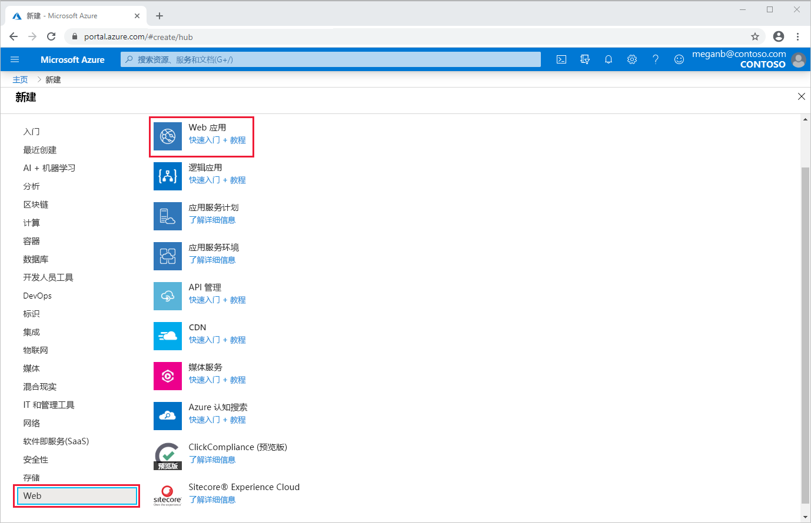
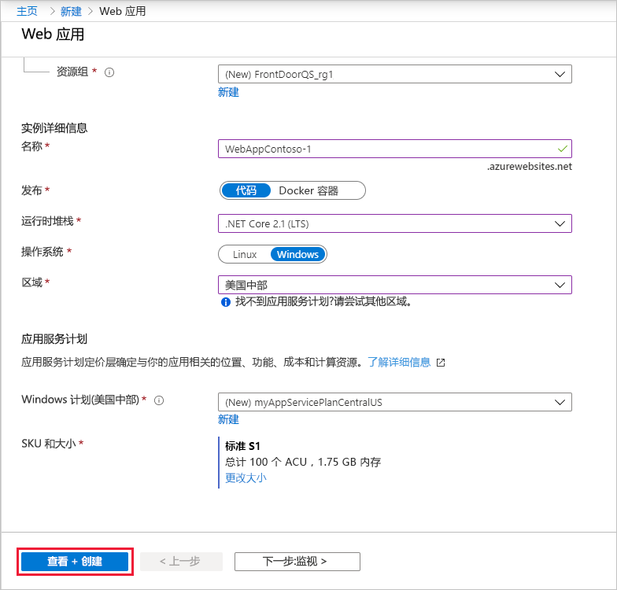
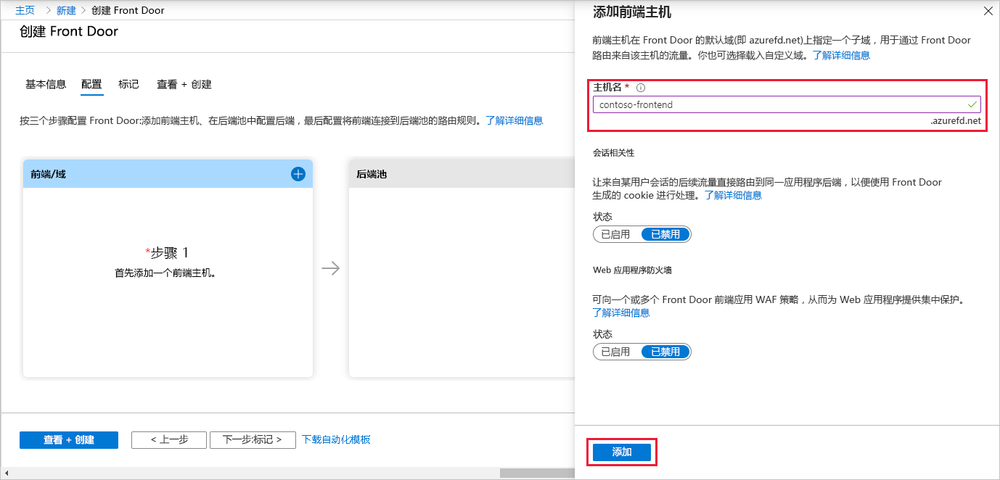
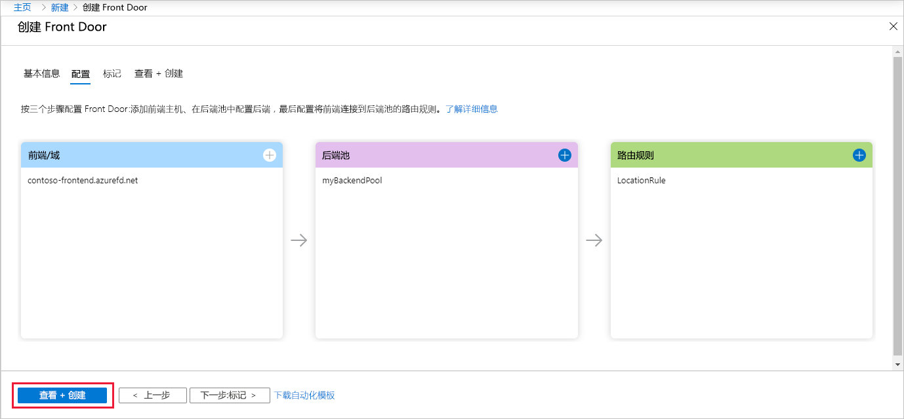
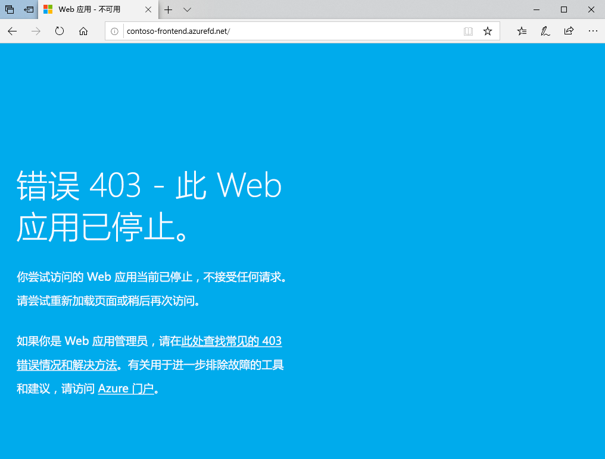

# 快速入门：创建 Front Door，以实现高度可用的全局 Web 应用程序

开始通过 Azure 门户使用 Azure Front Door 为 Web 应用程序设置高可用性。

在本快速入门中，Azure Front Door 汇集了在不同 Azure 区域中运行的某个 Web 应用程序的两个实例。 你将基于权重相等且优先级相同的后端创建 Front Door 配置。 此配置将流量定向到运行该应用程序的最近站点。 Azure Front Door 会持续监视该 Web 应用程序。 当最近的站点不可用时，该服务会提供到下一个可用站点的自动故障转移。

## 先决条件

- 具有活动订阅的 Azure 帐户。 [免费创建帐户](https://azure.microsoft.com/free/?WT.mc_id=A261C142F)。

## 创建 Web 应用的两个实例

本快速入门要求 Web 应用程序的两个实例在不同的 Azure 区域中运行。 这两个 Web 应用程序实例在“主动/主动”模式下运行，因此其中的任何一个实例都可以接收流量。  此配置不同于“主动/备用”配置，在后一种配置中，只有一个实例充当故障转移节点。 

如果你没有 Web 应用，请使用以下步骤设置示例 Web 应用。

1. 通过 https://portal.azure.com 登录到 Azure 门户。

1. 在主页或 Azure 菜单中，选择“创建资源”  。

1. 选择“Web” > “Web 应用”   。

   

1. 在“Web 应用”中，选择要使用的订阅   。

1. 对于“资源组”  ，请选择“新建”  。 输入 FrontDoorQS_rg1 作为名称，然后选择“确定”    。

1. 在“实例详细信息”中，输入 Web 应用的唯一名称   。 本示例使用 WebAppContoso-1  。

1. 选择一个运行时堆栈，本示例使用“.NET Core 2.1 (LTS)”   。

1. 选择区域，例如“美国中部”  。

1. 对于“Windows 计划”，请选择“新建”   。 输入 myAppServicePlanCentralUS 作为名称，然后选择“确定”    。

1. 确保“SKU 和大小”为“标准 S1，总共 100 个 ACU，1.75 GB 内存”   。

1. 选择“审阅 + 创建”，检查“摘要”，然后选择“创建”。    完成部署可能需要几分钟时间。

   

部署完成后，创建另一个 Web 应用。 使用相同的过程和值，但以下值除外：

| 设置          | 值     |
| ---              | ---  |
| **资源组**   | 选择“新建”并输入 FrontDoorQS_rg2   |
| **名称**             | 输入 Web 应用的唯一名称，本示例使用 WebAppContoso-2   |
| **区域**           | 一个不同的区域，本示例使用“美国中南部”  |
| “应用服务计划”   >   “Windows 计划”         | 选择“新建”并输入 myAppServicePlanSouthCentralUS，然后选择“确定”    |

## 为应用程序创建 Front Door

配置 Azure Front Door，以根据两个 Web 应用服务器之间的最小延迟来定向用户流量。 若要开始，请为 Azure Front Door 添加前端主机。

1. 在主页或 Azure 菜单中，选择“创建资源”  。 选择“网络” > “Front Door”   。

1. 在“创建 Front Door”中，选择一个订阅   。

1. 对于“资源组”，请选择“新建”，然后输入 FrontDoorQS_rg0 并选择“确定”     。  你可以改用现有的资源组。

1. 如果创建了资源组，请选择“资源组位置”，然后选择“下一步:   配置”。

1. 在“前端/域”中，选择“+”以打开“添加前端主机”    。

1. 对于“主机名”，请输入全局唯一的主机名  。 本示例使用 contoso-frontend  。 选择 **添加** 。

   

接下来，创建一个后端池，在其中包含你的两个 Web 应用。

1. 仍在“创建 Front Door”中，在“后端池”中选择“+”以打开“添加后端池”     。

1. 对于“名称”，请输入 myBackendPool   。

1. 选择“添加后端”  。 对于“后端主机类型”，请选择“应用服务”   。

1. 选择你的订阅，然后从“后端主机名”中选择你创建的第一个 Web 应用  。 在本示例中，Web 应用是 WebAppContoso-1  。 选择 **添加** 。

1. 再次选择“添加后端”  。 对于“后端主机类型”，请选择“应用服务”   。

1. 再次选择你的订阅，然后从“后端主机名”中选择你创建的第二个 Web 应用  。 选择 **添加** 。

   

最后，添加一个路由规则。 路由规则将前端主机映射到后端池。 该规则会将针对 `contoso-frontend.azurefd.net` 的请求转发到 myBackendPool  。

1. 仍在“创建 Front Door”中，在“路由规则”中选择“+”以配置路由规则    。

1. 在“添加规则”中，对于“名称”，请输入 LocationRule    。 接受所有默认值，然后选择“添加”以添加路由规则  。

   >[!WARNING]
   > 必须确保 Front Door 中的每个前端主机都具有传递规则，且其中包含与之关联的默认路径 (`\*`)  。 也就是说，在所有传递规则中，默认路径 (`\*`) 中定义的每个前端主机必须至少有一个路由规则。 如果不这样做，可能会导致最终用户流量无法正确路由。

1. 选择“查看 + 创建”，然后选择“创建”   。

   

## 通过实际操作查看 Azure Front Door

创建 Front Door 后，需要花费几分钟时间来全局部署配置。 完成后，访问你创建的前端主机。 在浏览器中转到 `contoso-frontend.azurefd.net`。 你的请求将从后端池中的指定服务器自动路由到离你最近的服务器。

如果在本快速入门中创建了这些应用，将会看到信息页。

若要实际测试即时全局故障转移，请尝试以下步骤：

1. 如上文所述打开浏览器并转到前端地址：`contoso-frontend.azurefd.net`。

1. 在 Azure 门户中，搜索并选择“应用服务”  。 向下滚动找到你的 Web 应用之一，在本示例中为 WebAppContoso-1  。

1. 选择该 Web 应用，选择“停止”，然后选择“是”以确认操作   。

1. 刷新浏览器。 应会看到相同的信息页。

   >[!TIP]
   >这些操作会略有延迟。 可能需要再次刷新。

1. 找到另一个 Web 应用，同样将其停止。

1. 刷新浏览器。 此时，应会看到一条错误消息。

   

## 清理资源

完成后，可以删除你创建的所有项。 删除资源组也会删除其内容。 如果你不打算使用此 Front Door，则应删除资源，以免产生不必要的费用。

1. 在 Azure 门户中，搜索并选择“资源组”，或者从 Azure 门户菜单中选择“资源组”   。

1. 通过筛选或者向下滚动来找到某个资源组，例如 FrontDoorQS_rg0  。

1.  选择该资源组，然后选择“删除资源组”。

   >[!WARNING]
   >此操作不可逆。

1. 键入资源组名称以确认，然后选择“删除”  。

对其他两个组重复此过程。

## 后续步骤

继续学习下一篇文章，了解如何将自定义域添加到 Front Door。
> [!div class="nextstepaction"]
> [添加自定义域](front-door-custom-domain.md)
