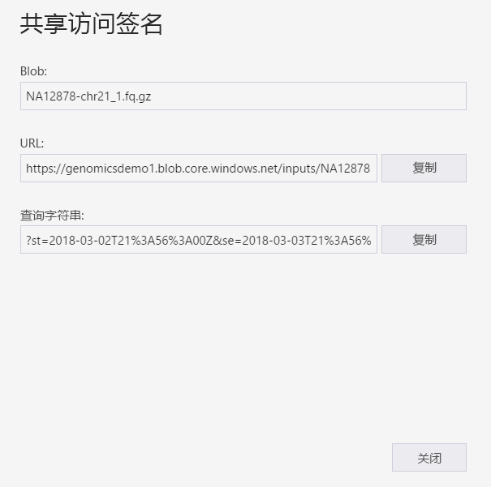
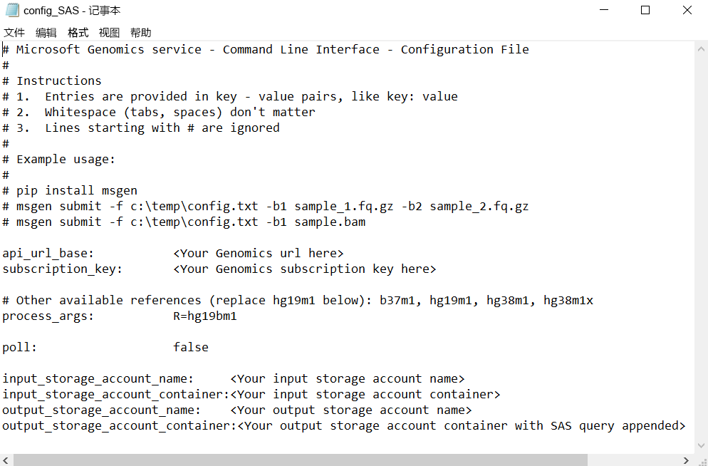

# <a name="submit-a-workflow-using-a-sas-instead-of-a-storage-account-key"></a>使用 SAS 而非存储帐户密钥提交工作流

本快速入门演示了如何使用 config.txt 文件将工作流提交到 Microsoft 基因组学服务，该文件包含[共享访问签名 (SAS)](https://docs.microsoft.com/azure/storage/common/storage-dotnet-shared-access-signature-part-1) 而不是存储帐户密钥。 如果担心让存储帐户密钥在 config.txt 文件中可见存在安全问题，则可使用此功能。 本文假定你已安装和运行 `msgen` 客户端，并且熟悉如何使用 Azure 存储。 如果你已成功使用提供的示例数据提交工作流，则可开始学习本教程。 

## <a name="what-is-a-sas"></a>什么是 SAS？
[共享访问签名 (SAS)](https://docs.microsoft.com/azure/storage/common/storage-dotnet-shared-access-signature-part-1) 用于对存储帐户中的资源进行委托访问。 通过 SAS，可以授予对存储帐户中资源的访问权限，无需共享帐户密钥。 这是在应用程序中使用共享访问签名的关键之处 - SAS 是用于共享存储资源的一种安全方式，它不会危及帐户密钥。

提交给 Microsoft 基因组学的 SAS 应该是[服务 SAS](https://docs.microsoft.com/rest/api/storageservices/Constructing-a-Service-SAS)，该 SAS 只将访问权限委托给其中存储了输入和输出文件的 Blob 或容器。 

服务级共享访问签名 (SAS) 令牌的 URI 包含特定资源（SAS 会向其委托访问权限）的 URI，后跟 SAS 令牌。 SAS 令牌是一个查询字符串，其中包括对 SAS 进行身份验证所需的所有信息，并且会指定资源、适用于访问的权限、签名有效的时间间隔、允许从其发起请求的 IP 地址或地址范围、允许通过其发起请求的协议、与请求关联的可选访问策略标识符，以及签名本身。 

## <a name="sas-needed-for-submitting-a-workflow-to-the-microsoft-genomics-service"></a>将工作流提交到 Microsoft 基因组学服务所需的 SAS
对于每个提交到 Microsoft 基因组学服务的工作流，需要至少两个 SAS 令牌，一个用于输入文件，一个用于输出容器。

输入文件的 SAS 应该具有以下属性：
1.  作用域(帐户、容器、Blob)：Blob
2.  过期时间：从现在算起的 48 小时内
3.  权限：读取

输出容器的 SAS 应该具有以下属性：
1.  作用域(帐户、容器、Blob)：容器
2.  过期时间：从现在算起的 48 小时内
3.  权限：读取、写入、删除


## <a name="create-a-sas-for-the-input-files-and-the-output-container"></a>为输入文件和输出容器创建 SAS
可以通过两种方式来创建 SAS 令牌，一种是使用 Azure 存储资源管理器，另一种是编程。  如果编写代码，则既可自行构造 SAS，也可通过首选语言使用 Azure 存储 SDK。


### <a name="set-up-create-a-sas-using-azure-storage-explorer"></a>设置：使用 Azure 存储资源管理器创建 SAS

[Azure 存储资源管理器](https://azure.microsoft.com/features/storage-explorer/)是一项工具，用于管理已经存储在 Azure 存储中的资源。  可在[此处](https://docs.microsoft.com/azure/vs-azure-tools-storage-manage-with-storage-explorer)详细了解如何使用 Azure 存储资源管理器。

输入文件的 SAS 的作用域应局限于特定输入文件 (Blob)。 若要创建 SAS 令牌，请遵循[这些说明](https://docs.microsoft.com/azure/storage/blobs/storage-quickstart-blobs-storage-explorer#work-with-shared-access-signatures)。 创建 SAS 之后，包含查询字符串的完整 URL 以及查询字符串本身都已提供，可以从屏幕复制。

 


### <a name="set-up-create-a-sas-programattically"></a>设置：以编程方式创建 SAS

若要使用 Azure 存储 SDK 创建 SAS，请参阅多种语言（包括 [.NET](https://docs.microsoft.com/azure/storage/blobs/storage-dotnet-shared-access-signature-part-2#generate-a-shared-access-signature-uri-for-a-blob)、[Python](https://docs.microsoft.com/azure/storage/blobs/storage-python-how-to-use-blob-storage) 和 [Node.js](https://docs.microsoft.com/azure/storage/blobs/storage-nodejs-how-to-use-blob-storage#work-with-shared-access-signatures)）的现有文档。 

若要在没有 SDK 的情况下创建 SAS，可以直接构造 SAS 查询字符串，其中包括对 SAS 进行身份验证所需的所有信息。 这些[说明](https://docs.microsoft.com/rest/api/storageservices/constructing-a-service-sas)详述了 SAS 查询字符串的组件以及该字符串的构造方法。 在创建所需的 SAS 签名时，会使用 Blob/容器身份验证信息来生成 HMAC，如这些[说明](https://docs.microsoft.com/rest/api/storageservices/service-sas-examples)所述。


## <a name="add-the-sas-to-the-configtxt-file"></a>将 SAS 添加到 config.txt 文件
若要使用 SAS 查询字符串通过 Microsoft 基因组学服务运行工作流，请编辑 config.txt 文件，从其中删除密钥。 然后，将 SAS 查询字符串（以 `?` 开头）追加到输出容器名称，如下所示。 



使用 Microsoft 基因组学 Python 客户端通过以下命令提交工作流，将相应的 SAS 查询字符串追加到每个输入 Blob 名称：

```python
msgen submit -f [full path to your config file] -b1 [name of your first paired end read file, SAS query string appended] -b2 [name of your second paired end read file, SAS query string appended]
```

### <a name="if-adding-the-input-file-names-to-the-configtxt-file"></a>如果将输入文件名称添加到 config.txt 文件
也可将配对端读取文件的名称直接添加到 config.txt 文件，并追加 SAS 查询令牌，如下所示：


在此示例中，请使用 Microsoft 基因组学 Python 客户端通过以下命令提交工作流，省略 `-b1` 和 `-b2` 命令：

```python
msgen submit -f [full path to your config file] 
```

## <a name="next-steps"></a>后续步骤
本文介绍了如何使用 SAS 令牌而不是帐户密钥通过 `msgen` Python 客户端将工作流提交到 Microsoft 基因组学服务。 若要详细了解工作流提交以及其他可以与 Microsoft 基因组学服务配合使用的命令，请参阅[常见问题解答](frequently-asked-questions-genomics.md)。 
