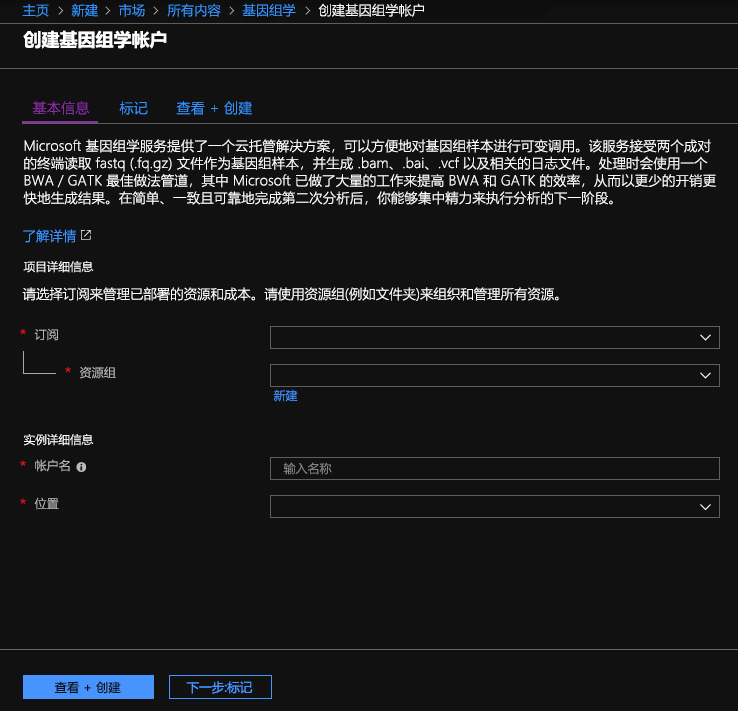
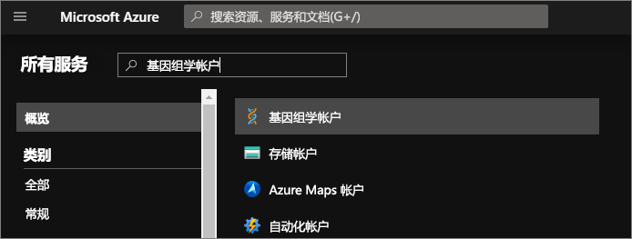
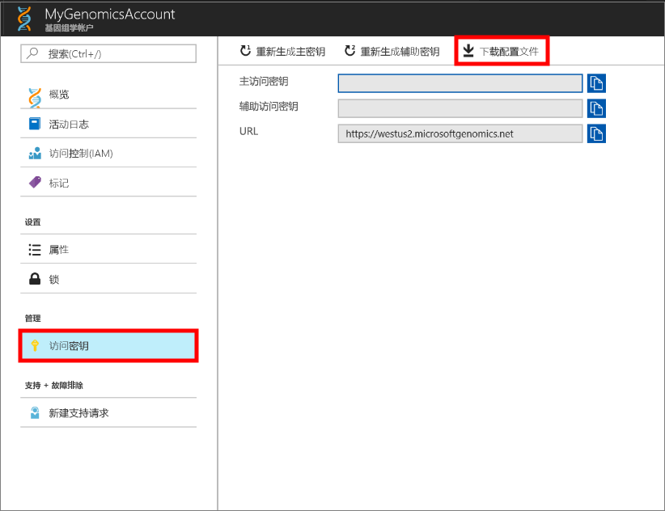

# <a name="quickstart-run-a-workflow-through-the-microsoft-genomics-service"></a>快速入门：通过 Microsoft 基因组学服务运行工作流

Microsoft 基因组学是一种可缩放的安全服务，适用于二次分析，可以快速处理一个基因组，从原始的读数开始，生成比对读数和变体调用。 只需数步即可入门： 
1.  设置：通过 Azure 门户创建 Microsoft 基因组学帐户，然后在本地环境中安装 Microsoft 基因组学 Python 客户端。 
2.  上传输入数据：通过 Azure 门户创建 Microsoft Azure 存储帐户，然后上传输入文件。 输入文件应该是双端读数（fastq 或 bam 文件）。
3.  运行：使用 Microsoft 基因组学命令行界面通过 Microsoft 基因组学服务运行工作流。 

有关 Microsoft 基因组学的详细信息，请参阅[什么是 Microsoft 基因组学？](overview-what-is-genomics.md)

## <a name="set-up-create-a-microsoft-genomics-account-in-the-azure-portal"></a>设置：在 Azure 门户中创建 Microsoft 基因组学帐户

若要创建 Microsoft 基因组学帐户，请导航到 [Azure 门户](https://portal.azure.com/#create/Microsoft.Genomics)。 如果还没有 Azure 订阅，请先创建一个，然后再创建 Microsoft 基因组学帐户。 




为基因组学帐户配置以下信息，如上图所示。 

 |**设置**          |  建议的值  | 字段说明 |
 |:-------------       |:-------------         |:----------            |
 |帐户名         | MyGenomicsAccount     |选择唯一的帐户标识符。 至于有效的名称，请参阅[命名规则](https://docs.microsoft.com/azure/architecture/best-practices/naming-conventions) |
 |订阅         | 订阅名称|这是 Azure 服务的计费单位 - 有关订阅的详细信息，请参阅[订阅](https://account.azure.com/Subscriptions) |      
 |资源组       | MyResourceGroup       |  可以通过资源组将多个 Azure 资源（存储帐户、基因组学帐户等）分到一个组中，方便管理。 有关详细信息，请参阅[资源组] (https://docs.microsoft.com/azure/azure-resource-manager/resource-group-overview#resource-groups)。 至于有效的资源组名称，请参阅[命名规则](https://docs.microsoft.com/azure/architecture/best-practices/naming-conventions) |
 |Location                   | 美国西部 2                    |    在美国西部 2、西欧和东南亚提供服务 |


单击顶部菜单栏中的“通知”即可监视部署过程。


## <a name="set-up-install-the-microsoft-genomics-python-client"></a>设置：安装 Microsoft 基因组学 Python 客户端

用户需在其本地环境中安装 Python 和 Microsoft 基因组学 Python 客户端。 

### <a name="install-python"></a>安装 Python

Microsoft 基因组学 Python 客户端兼容 Python 2.7。 建议使用 2.7.12 或更高版本；2.7.14 是建议的版本。 可以在[此处](https://www.python.org/downloads/)找到下载版本。 


### <a name="install-the-microsoft-genomics-client"></a>安装 Microsoft 基因组学客户端

使用 Python pip 安装 Microsoft 基因组学客户端 `msgen`。 以下说明假定 Python 已在系统路径中。 如果存在 pip 安装无法识别的问题，则需向系统路径添加 Python 和脚本子文件夹。


```
pip install --upgrade --no-deps msgen
pip install msgen
```


如果不希望将 `msgen` 作为系统范围的二进制文件安装且不希望修改系统范围的 Python 包，请将 `–-user` 标志与 `pip` 配合使用。
如果使用基于包的安装或 setup.py，则会安装所有必需的包。 其他情况则安装符合 msgen 基本需求的包： 

 * [Azure-storage](https://pypi.python.org/pypi/azure-storage)。 
 * [Requests](https://pypi.python.org/pypi/requests)。 


可以通过 `pip`、`easy_install` 或标准的 `setup.py` 过程来安装这些包。 


### <a name="test-the-microsoft-genomics-client"></a>测试 Microsoft 基因组学客户端
若要测试 Microsoft 基因组学客户端，请从基因组学帐户下载配置文件。 可以单击左下角的“更多服务”，进行筛选，然后针对基因组学帐户进行选择，以便导航到你的基因组学帐户。





选择刚创建的基因组学帐户，导航到“访问密钥”，然后下载配置文件。




使用以下命令测试 Microsoft 基因组学 Python 客户端是否正常运行


```
msgen list -f “<full path where you saved the config file>”
```

## <a name="create-a-microsoft-azure-storage-account"></a>创建 Microsoft Azure 存储帐户 
Microsoft 基因组学服务要求将输入作为块 Blob 存储在 Azure 存储帐户中。 它也会将输出文件作为块 Blob 写入到 Azure 存储帐户中用户指定的容器。 输入和输出可以驻留在不同的存储帐户中。
如果已将数据置于 Azure 存储帐户中，则只需确保该数据与基因组学帐户处于同一位置即可。 否则在运行基因组学服务时会产生传出费用。 如果还没有 Microsoft Azure 存储帐户，则需创建一个并上传数据。 [此处](https://docs.microsoft.com/azure/storage/common/storage-create-storage-account)提供 Azure 存储帐户的详细信息，包括存储帐户是什么，以及它提供哪些服务。 若要创建 Microsoft Azure 存储帐户，请导航到 [Azure 门户](https://portal.azure.com/#create/Microsoft.StorageAccount-ARM )。  


为存储帐户配置以下信息，如上图所示。 对存储帐户使用大多数标准选项，仅指定帐户是 Blob 存储帐户，不是常规用途帐户。 Blob 存储帐户的下载和上传速度是常规用途帐户的 2-5 倍。 


 |**设置**          |  建议的值  | 字段说明 |
 |:-------------------------       |:-------------         |:----------            |
 |名称         | MyStorageAccount     |选择唯一的帐户标识符。 至于有效的名称，请参阅[命名规则](https://docs.microsoft.com/azure/architecture/best-practices/naming-conventions) |
 |部署模型         | 资源管理器| 建议使用“资源管理器”部署模型。 有关详细信息，请参阅[了解资源管理器部署](https://docs.microsoft.com/azure/azure-resource-manager/resource-manager-deployment-model) |      
 |帐户类型       | Blob 存储       |  Blob 存储帐户的下载和上传速度可以是常规用途帐户的 2-5 倍。 |
 |性能                  | 标准                   | 默认值为“标准”。 有关标准和高级存储帐户的更多详细信息，请参阅 [Microsoft Azure 存储简介](https://docs.microsoft.com/azure/storage/common/storage-introduction)    |
 |复制                  | 本地冗余存储                  | 本地冗余存储在创建存储帐户时所在区域的数据中心内复制数据。 有关详细信息，请参阅 [Azure 存储复制](https://docs.microsoft.com/azure/storage/common/storage-redundancy)    |
 |需要安全传输                  | 已禁用                 | 默认为禁用。 有关数据传输安全性的详细信息，请参阅[需要安全传输](https://docs.microsoft.com/azure/storage/common/storage-require-secure-transfer)    |
 |访问层                  | 热                   | 热访问是指存储帐户中对象的访问频率会更高。    |
 |订阅         | Azure 订阅 |有关订阅的详细信息，请参阅[订阅](https://account.azure.com/Subscriptions) |      
 |资源组       | MyResourceGroup       |  可以选择同一资源组作为基因组学帐户。 至于有效的资源组名称，请参阅[命名规则](https://docs.microsoft.com/azure/architecture/best-practices/naming-conventions) |
 |Location                  | 美国西部 2                  | 使用的位置与基因组学帐户的位置相同，目的是降低传出费用和延迟。 在美国西部 2、西欧和东南亚提供基因组学服务    |
 |虚拟网络                | 已禁用                   | 默认为禁用。 有关详细信息，请参阅 [Azure 虚拟网络](https://docs.microsoft.com/azure/storage/common/storage-network-security)。    |


然后单击“创建”以创建存储帐户。 与创建基因组学帐户时的操作一样，单击顶部菜单栏中的“通知”即可监视部署过程。 


## <a name="upload-input-data-to-your-storage-account"></a>将输入数据上传到存储帐户

Microsoft 基因组学服务要求使用双端读数作为输入文件。 进行探查时，可以选择上传自己的数据，也可以使用为你提供的可以公开使用的示例数据。 若要使用公开提供的示例数据，可以在下面的托管位置查找：


[https://msgensampledata.blob.core.windows.net/small/chr21_1.fq.gz](https://msgensampledata.blob.core.windows.net/small/chr21_1.fq.gz)
[https://msgensampledata.blob.core.windows.net/small/chr21_2.fq.gz](https://msgensampledata.blob.core.windows.net/small/chr21_2.fq.gz)


需要在存储帐户中为输入数据创建一个 Blob 容器，为输出数据创建另一个 Blob 容器。  请将输入数据上传到输入 Blob 容器中。 执行此操作可以使用各种工具，包括 [Microsoft Azure 存储资源管理器](https://azure.microsoft.com/features/storage-explorer/)、[blobporter](https://github.com/Azure/blobporter) 或 [AzCopy](https://docs.microsoft.com/azure/storage/common/storage-use-azcopy?toc=%2fazure%2fstorage%2fblobs%2ftoc.json)。 


## <a name="run-a-workflow-through-the-microsoft-genomics-service-using-the-python-client"></a>使用 Python 客户端通过 Microsoft 基因组学服务运行工作流 

若要通过 Microsoft 基因组学服务运行工作流，请编辑 config.txt 文件，为数据指定输入和输出存储容器。
打开从基因组学帐户下载的 config.txt 文件。 需指定的部分包括：订阅密钥和底部的六个项、存储帐户名称、输入和输出的密钥和容器名称。 若要查找该信息，可以在门户中导航到存储帐户的“访问密钥”，也可以直接从 Azure 存储资源管理器导航。  


### <a name="submit-your-workflow-to-the-microsoft-genomics-service-the-microsoft-genomics-client"></a>使用 Microsoft 基因组学客户端将工作流提交到 Microsoft 基因组学服务

使用 Microsoft 基因组学 Python 客户端通过以下命令提交工作流：


```python
msgen submit -f [full path to your config file] -b1 [name of your first paired end read] -b2 [name of your second paired end read]
```


可使用以下命令查看工作流的状态： 
```python
msgen list -f c:\temp\config.txt 
```


工作流完成后，即可在 Azure 存储帐户的已配置输出容器中查看输出文件。 


## <a name="next-steps"></a>后续步骤
本文介绍了如何将示例输入数据上传到 Azure 存储中，以及如何通过 `msgen` Python 客户端将工作流提交到 Microsoft 基因组学服务。 若要详细了解可以与 Microsoft 基因组学服务配合使用的其他输入文件类型，请查看以下页面：[配对的 FASTQ](quickstart-input-pair-FASTQ.md) | [BAM](quickstart-input-BAM.md) | [多个 FASTQ 或 BAM](quickstart-input-multiple.md) 