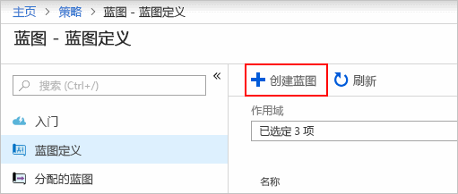
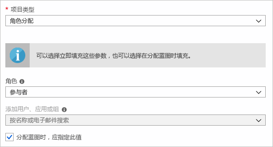
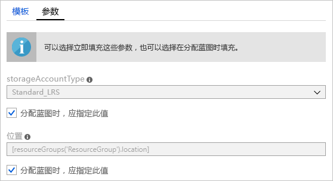
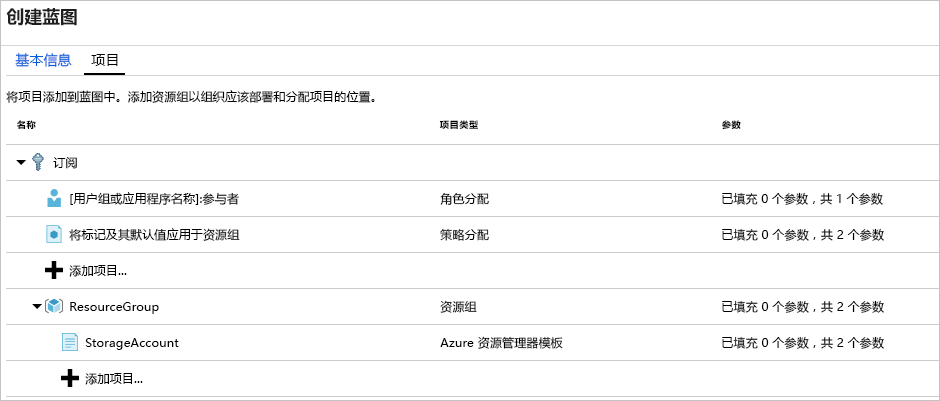
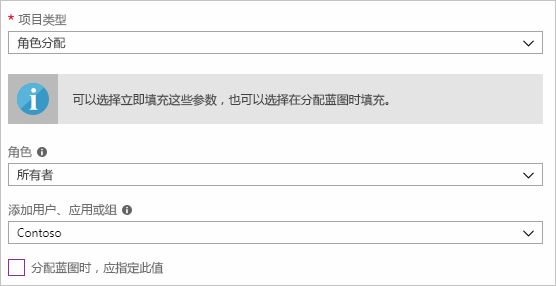
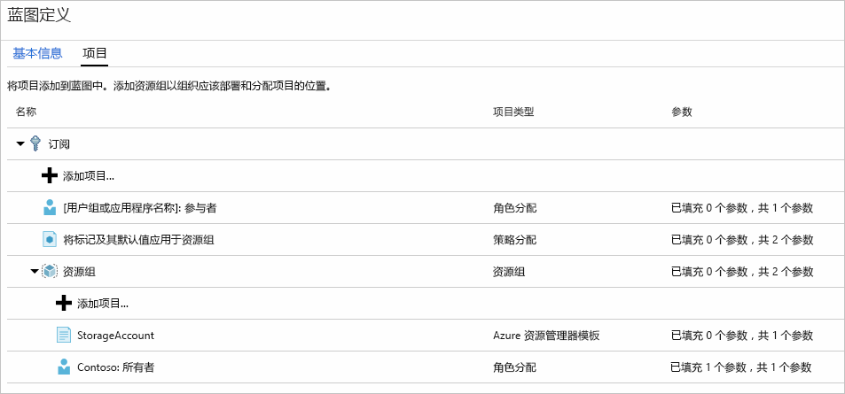
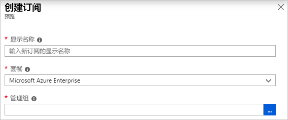
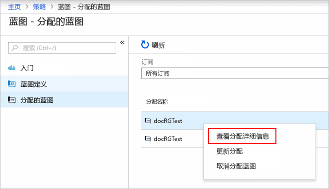

# <a name="quickstart-define-and-assign-a-blueprint-in-the-portal"></a>快速入门：在门户中定义和分配蓝图

了解如何创建和分配蓝图时，可以定义常见的模式，以便根据 Azure 资源管理器模板、策略、安全性等方面的要求开发可重复使用和可快速部署的配置。 本教程介绍如何使用 Azure 蓝图来执行某些与在组织中创建、发布和分配蓝图相关的常见任务。 这些任务包括：

## <a name="prerequisites"></a>先决条件

如果没有 Azure 订阅，请在开始之前创建一个[免费帐户](https://azure.microsoft.com/free)。

## <a name="create-a-blueprint"></a>创建蓝图

定义符合性的标准模式的第一步是根据可用资源构建蓝图。 本示例将创建名为 **MyBlueprint** 的新蓝图，以配置订阅的角色和策略分配。 然后，将添加新的资源组，并在该资源组中创建资源管理器模板和角色分配。

1. 在左侧窗格中，选择“所有服务”  。 搜索并选择“蓝图”  。

1. 从左侧页面选择“蓝图定义”，然后选择页面顶部的“+ 创建蓝图”按钮   。

   或者，选择“入门”  页上的“创建”  ，直接创建一个蓝图。

   

1. 提供**蓝图名称**，例如 **MyBlueprint**。 （最多使用 48 个字母和数字，但不要包含空格或特殊字符）。 暂时将“蓝图说明”留空  。

1. 在“定义位置”框中，选择右侧的省略号，选择要在其中保存蓝图的[管理组](../management-groups/overview.md)或订阅，然后选择“选择”   。

1. 确认信息是否正确。 稍后无法更改“蓝图名称”和“定义位置”字段   。 然后选择页面底部的“下一步:  项目”或页面顶部的“项目”选项卡  。

1. 添加订阅级别的角色分配：

   1. 在“订阅”下选择“+ 添加项目”行   。 随即会在浏览器右侧打开“添加项目”窗口  。

   1. 为“项目类型”选择“角色分配”   。

   1. 在“角色”下，选择“参与者”   。 保留选中“添加用户、应用或组”框，指示使用动态参数  。

   1. 选择“添加”  将此项目添加到蓝图中。

   

   > [!NOTE]
   > 大多数项目支持参数。 在蓝图创建期间为其分配值的参数是静态参数  。 如果在蓝图分配期间分配参数，则该参数是动态参数  。 有关更多信息，请参阅[蓝图参数](./concepts/parameters.md)。

1. 添加订阅级别的策略分配：

   1. 选择角色分配项目下的“+ 添加项目”行  。

   1. 为“项目类型”选择“策略分配”   。

   1. 将“类型”更改为“内置”   。 在“搜索”中输入 **tag**。 

   1. 单击“搜索”  以进行筛选。 选择“对资源组追加标记及其默认值”  。

   1. 选择“添加”  将此项目添加到蓝图中。

1. 选择策略分配行“对资源组追加标记及其默认值”。 

1. 随即将打开作为蓝图定义一部分的向项目提供参数的窗口，并允许基于此蓝图而不是在分配期间（动态参数）设置所有分配的参数（静态参数）。 此示例在蓝图分配期间使用动态参数，因此请保留默认值并选择“取消”  。

1. 添加订阅级别的资源组：

   1. 在“订阅”下选择“+ 添加项目”行   。

   1. 为“项目类型”选择“资源组”   。

   1. 将“项目显示名称”、“资源组名称”和“位置”框留空，但请确保在每个参数属性上选中该复选框，以使其成为动态参数    。

   1. 选择“添加”  将此项目添加到蓝图中。

1. 在资源组下添加模板：

   1. 在“ResourceGroup”条目下选择“+ 添加项目”行   。

   1. 为“项目类型”选择“Azure 资源管理器模板”，将“项目显示名称”设置为“StorageAccount”，并将“说明”保留为空      。

   1. 在编辑器框的“模板”  选项卡上，粘贴以下资源管理器模板。
      粘贴模板后，选择“参数”选项卡，并注意已检测到模板参数 storageAccountType 和 location    。 将自动检测并填充每个参数，但将其配置为“动态参数”。

      > [!IMPORTANT]
      > 如果导入模板，请确保该文件仅为 JSON 且不包含 HTML。 当指向 GitHub 上的 URL 时，请确保已选择“RAW”  以获取纯 JSON 文件，而不是用 HTML 包装在 GitHub 上显示的文件。 如果导入的模板不是纯 JSON，则会出现错误。

      ```json
      {
          "$schema": "https://schema.management.azure.com/schemas/2015-01-01/deploymentTemplate.json#",
          "contentVersion": "1.0.0.0",
          "parameters": {
              "storageAccountType": {
                  "type": "string",
                  "defaultValue": "Standard_LRS",
                  "allowedValues": [
                      "Standard_LRS",
                      "Standard_GRS",
                      "Standard_ZRS",
                      "Premium_LRS"
                  ],
                  "metadata": {
                      "description": "Storage Account type"
                  }
              },
              "location": {
                  "type": "string",
                  "defaultValue": "[resourceGroup().location]",
                  "metadata": {
                      "description": "Location for all resources."
                  }
              }
          },
          "variables": {
              "storageAccountName": "[concat('store', uniquestring(resourceGroup().id))]"
          },
          "resources": [{
              "type": "Microsoft.Storage/storageAccounts",
              "name": "[variables('storageAccountName')]",
              "location": "[parameters('location')]",
              "apiVersion": "2018-07-01",
              "sku": {
                  "name": "[parameters('storageAccountType')]"
              },
              "kind": "StorageV2",
              "properties": {}
          }],
          "outputs": {
              "storageAccountName": {
                  "type": "string",
                  "value": "[variables('storageAccountName')]"
              }
          }
      }
      ```

   1. 清除该 storageAccountType 复选框，并请注意，下拉列表仅包含 allowedValues 下的资源管理器模板中包含的值   。 选中此框将其重新设置为动态参数。

   1. 选择“添加”  将此项目添加到蓝图中。

   

1. 已完成的蓝图应如下所示： 请注意，每个项目在“参数”列下都显示“已填充 y 个参数中的 x 个”。    动态参数在每次分配蓝图期间设置。

   

1. 现在已添加所有计划项目，请选择页面底部的“保存草稿”  。

## <a name="edit-a-blueprint"></a>编辑蓝图

在[创建蓝图](#create-a-blueprint)中，未提供说明，也未将角色分配添加到新资源组。 二者都可按以下步骤修复：

1. 从左侧页面中选择“蓝图定义”  。

1. 在蓝图列表中，右键单击之前创建的蓝图，然后选择“编辑蓝图”  。

1. 在“蓝图说明”中，提供有关蓝图和组成它的项目的一些信息  。 在本示例中，输入如下内容：“此蓝图在订阅上设置标记策略和角色分配，创建 ResourceGroup，并将资源模板和角色分配部署到该 ResourceGroup。” 

1. **选择“下一步:** 项目”或页面顶部的“项目”选项卡  。

1. 在资源组下添加角色分配：

   1. 在“ResourceGroup”条目下选择“+ 添加项目”行   。

   1. 为“项目类型”选择“角色分配”   。

   1. 在“角色”下，选择“所有者”并清除“添加用户、应用或组”框下的复选框    。

   1. 搜索并选择要添加的用户、应用或组。 此项目使用每次分配此蓝图时以同样方式设置的静态参数。

   e. 选择“添加”  将此项目添加到蓝图中。

   

1. 已完成的蓝图应如下所示： 请注意，新添加的角色分配显示“已填充 1 个参数中的 1 个”  。 这意味着它是一个静态参数。

   

1. 草稿更新后，请单击“保存草稿”  。

## <a name="publish-a-blueprint"></a>发布蓝图

现在，所有计划项目都已添加到蓝图中，可以将其发布了。
发布后，即可将蓝图分配到订阅。

1. 从左侧页面中选择“蓝图定义”  。

1. 在蓝图列表中，右键单击之前创建的蓝图，然后选择“发布蓝图”  。

1. 在打开的窗格中，提供版本  （字母、数字和连字符，最大长度为 20 个字符），例如“v1”  。 （可选）并提供更改注释，例如“首次发布”   。

1. 选择页面底部的“发布”。 

## <a name="assign-a-blueprint"></a>分配蓝图

发布蓝图后，可将其分配到订阅。 将创建的蓝图分配到管理组层次结构下的一个订阅。 如果蓝图保存到某个订阅，则只能将其分配给该订阅。

1. 从左侧页面中选择“蓝图定义”  。

1. 在蓝图列表中，右键单击之前创建的蓝图（或选择省略号），然后选择“分配蓝图”  。

1. 在“分配蓝图”页面上，从“订阅”下拉列表中选择要将此蓝图部署到的订阅   。

   如果 [Azure 计费](../../billing/index.md)中提供了受支持的企业产品/服务，则会在“订阅”框下激活“新建”链接   。 执行以下步骤:

   1. 选择“新建”链接以创建新订阅，而不是选择现有订阅  。

   1. 提供新订阅的“显示名称”  。

   1. 从下拉列表中选择可用“产品/服务”  。

   1. 使用省略号选择[管理组](../management-groups/overview.md)，订阅将是其子级。

   1. 在页面底部选择“创建”  。

   

   > [!IMPORTANT]
   > 选择“创建”后，将立即创建新订阅  。

   > [!NOTE]
   > 将为选择每个订阅创建一个分配。 可以在以后对单个订阅分配进行更改，而不强制对所选订阅的其余部分进行更改。

1. 对于“分配名称”，请为此分配提供唯一名称  。

1. 在“位置”  中，选择要在其中创建托管标识和订阅部署对象的区域。 Azure 蓝图使用此托管标识在分配的蓝图中部署所有项目。 若要了解详细信息，请参阅 [Azure 资源的托管标识](../../active-directory/managed-identities-azure-resources/overview.md)。

1. 在“v1”  条目上保留已发布  版本的“蓝图定义版本”  下拉列表。 （默认为最近的已发布版本。）

1. 对于“锁定分配”  ，保留默认值“不锁定”  。 有关详细信息，请参阅[蓝图资源锁定](./concepts/resource-locking.md)。

   

1. 在**托管标识**下，保留默认值“系统已分配”  。

1. 对于订阅级别的角色分配“[用户组或应用程序名称]:  参与者”，搜索并选择用户、应用或组。

1. 对于订阅级别策略分配，请将“标记名称”  设置为“CostCenter”，并将“标记值”  设置为“ContosoIT”   。

1. 对于“ResourceGroup”，从下拉列表中提供“StorageAccount”的名称  和“East US 2”的位置     。

   > [!NOTE]
   > 对于在蓝图定义期间在资源组下添加的每个项目，该项目将缩进以与将部署的资源组或对象对齐。
   > 只有在上下文信息中才会列出无法获取参数或者在分配时没有要定义的参数的项目。

1. 在 Azure 资源管理器模板“StorageAccount”上，为 storageAccountType  参数选择“Standard_GRS”   。

1. 阅读页面底部的信息框，然后选择“分配”  。

## <a name="track-deployment-of-a-blueprint"></a>跟踪蓝图的部署

将蓝图分配给一个或多个订阅时，会发生以下两种情况：

- 蓝图将添加到每个订阅的“分配的蓝图”页 
- 开始部署蓝图定义的所有项目的过程。

现在已将蓝图分配给订阅，请验证部署的进度：

1. 从左侧页面选择“分配的蓝图”  。

1. 在蓝图列表中，右键单击之前分配的一个蓝图，然后选择“查看分配详细信息”  。

   

1. 在“蓝图分配”页面上，验证是否已成功部署所有项目，以及在部署期间是否未出现任何错误  。 如果发生错误，请参阅[蓝图故障排除](./troubleshoot/general.md)，了解确定错误原因的操作步骤。

## <a name="unassign-a-blueprint"></a>取消分配蓝图

如果不再需要蓝图，请从订阅中删除蓝图分配。 蓝图可能已被替换为更新的蓝图，后者具有更新的模式、策略和设计。 删除蓝图时，作为该蓝图的一部分分配的项目将保留。 若要删除蓝图分配，请按照下列步骤操作：

1. 从左侧页面选择“分配的蓝图”  。

1. 在蓝图列表中，选择要取消分配的蓝图。 然后选择页面顶部的“取消分配蓝图”按钮。 

1. 阅读确认消息，然后选择“确定”  。

## <a name="delete-a-blueprint"></a>删除蓝图

1. 从左侧页面中选择“蓝图定义”  。

1. 右键单击要删除的蓝图，然后选择“删除蓝图”  。 在确认对话框中选择“是”。 

> [!NOTE]
> 删除此方法中的蓝图还会删除所选蓝图的所有已发布版本。
> 若要删除单个版本，请打开蓝图，选择“已发布版本”  选项卡，选择要删除的版本，然后选择“删除此版本”  。 另外，只有在删除蓝图定义的所有蓝图分配之后，才能删除该蓝图。

## <a name="next-steps"></a>后续步骤

本快速入门介绍了如何使用 Azure 门户创建、分配和删除蓝图。 若要详细了解 Azure 蓝图，请继续学习蓝图生命周期文章。

> [!div class="nextstepaction"]
> [了解蓝图生命周期](./concepts/lifecycle.md)