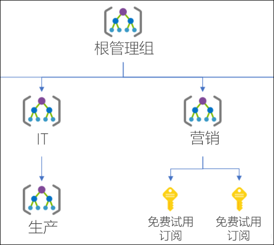

# <a name="organize-your-resources-with-azure-management-groups"></a>使用 Azure 管理组来组织资源

如果你的组织有多个订阅，则可能需要一种方法来高效地管理这些订阅的访问权限、策略和符合性。 Azure 管理组提供订阅上的作用域级别。 可将订阅组织到名为“管理组”的容器中，并将管理条件应用到管理组。 管理组中的所有订阅都将自动继承应用于管理组的条件。 不管使用什么类型的订阅，管理组都能提供大规模的企业级管理。 单个管理组中的所有订阅都必须信任同一个 Azure Active Directory 租户。

例如，可将策略应用到限制创建虚拟机 (VM) 的区域的管理组。 此策略将应用到该管理组下面的所有管理组、订阅和资源，只允许在该区域中创建 VM。

## <a name="hierarchy-of-management-groups-and-subscriptions"></a>管理组和订阅的层次结构

可以生成管理组和订阅的灵活层次结构，以便将资源组织成用于统一策略和访问管理的层次结构。 下图显示了使用管理组创建用于调控的层次结构的示例。


例如，可以创建应用一个策略的层次结构，该策略将 VM 位置限制到名为“生产”的组中的“美国西部”区域。 此策略将继承到该管理组下的所有 EA 订阅，并应用到这些订阅下的所有 VM。 此安全策略不能由资源或订阅所有者更改，因此增强了治理效果。

使用管理组的另一个场景是向用户提供对多个订阅的访问权限。 通过移动该管理组下的多个订阅，可对该管理组创建一个[基于角色的访问控制](../../role-based-access-control/overview.md) (RBAC) 分配，该分配将这种访问权限继承到所有订阅。
管理组的一个分配就能让用户访问所需的一切内容，而无需基于多个订阅编写 RBAC 分配的脚本。

### <a name="important-facts-about-management-groups"></a>关于管理组的重要事实

- 在单个目录中可以支持 10,000 个管理组。
- 一个管理组树最多可支持六个级别的深度。
  - 此限制不包括根级别或订阅级别。
- 每个管理组和订阅只能支持一个父级。
- 每个管理组可以有多个子级。
- 所有订阅和管理组都在每个目录中的单个层次结构内。 请参阅[关于根管理组的重要事实](#important-facts-about-the-root-management-group)。

## <a name="root-management-group-for-each-directory"></a>每个目录的根管理组

为每个目录指定了一个称为“根”管理组的顶级管理组。
此根管理组内置在层次结构中，包含其所有下级管理组和订阅。 此根管理组允许在目录级别应用全局策略和 RBAC 分配。 一开始的时候，[Azure AD 全局管理员需要提升自身权限](../../role-based-access-control/elevate-access-global-admin.md)才能成为此根组的用户访问管理员角色。 提升访问权限后，管理员可将任何 RBAC 角色分配给其他目录用户或组，以便管理层次结构。 作为管理员，你可以将自己的帐户分配为根管理组的所有者。

### <a name="important-facts-about-the-root-management-group"></a>关于根管理组的重要事实

- 默认情况下，根管理组的显示名称是**租户根组**。 ID 是 Azure Active Directory ID。
- 若要更改显示名称，必须在根管理组中为帐户分配“所有者”或“参与者”角色。 请参阅[更改管理组名称](manage.md#change-the-name-of-a-management-group)，了解如何更新管理组的名称。
- 无法像操作其他管理组一样移动或删除根管理组。  
- 所有订阅和管理组归并到目录中的一个根管理组下。
  - 目录中的所有资源归并到根管理组进行全局管理。
  - 新订阅在创建时自动默认为根管理组。
- 所有 Azure 客户都可查看根管理组，但并非所有客户都具有管理该根管理组的权限。
  - 有权访问订阅的每个人都可看到订阅位于层次结构中的位置的上下文。  
  - 未对任何人授予对根管理组的默认访问权限。 只有 Azure AD 全局管理员可将自身提升为拥有访问权限的角色。  拥有对根管理组的访问权限后，全局管理员可向其他用户分配任何 RBAC 角色以便管理它。  

> [!IMPORTANT]
> 对根管理组进行的任何用户访问权限分配或策略分配都适用于在目录中的所有资源  。
> 因此，所有客户都应评估在此作用域中定义项目的需求。
> 用户访问权限和策略分配应仅在此作用域内“必须拥有”。  

## <a name="initial-setup-of-management-groups"></a>管理组的初始设置

任何用户都需在开始使用管理组时进行初始设置。 第一步是在目录中创建根管理组。 创建此组后，目录中存在的所有现有订阅都成为根管理组的子级。 执行此过程是为了确保一个目录中只有一个管理组层次结构。 目录中的单个层次结构可让管理客户应用目录内其他客户无法绕开的全局访问权限和策略。 在根上分配的任何内容都将应用于整个层次结构，其中包括该 Azure AD 租户中的所有管理组、订阅、资源组和资源。

## <a name="trouble-seeing-all-subscriptions"></a>查看所有订阅时遇到问题

2018 年 6 月 25 日之前的预览版中较早开始使用管理组的一些目录可能会遇到问题，即并非所有订阅都在该层次结构中。 将所有订阅都纳入到该层次结构中的过程是在角色或策略分配已针对目录中的根管理组执行后实施的。 

### <a name="how-to-resolve-the-issue"></a>如何解决问题

有两个选项可用于解决此问题。

1. 删除根管理组的所有角色和策略分配
   1. 通过删除根管理组的所有策略和角色分配，服务会在下一个隔夜周期将所有订阅回填到层次结构中。  执行此过程后，所有租户订阅都不存在意外的访问权限授予或策略分配情况。
   1. 在不影响服务的情况下执行此过程的最佳方法是在根管理组的下一个级别应用角色或策略分配。 然后可以从根范围删除所有分配。
1. 直接调用 API 以开始回填过程
   1. 目录中的任何客户都可以调用 *TenantBackfillStatusRequest* 或 *StartTenantBackfillRequest* API。 调用 StartTenantBackfillRequest API 时，它会启动将所有订阅移到层次结构中的初始设置过程。 此过程还会开始强制所有新订阅成为根管理组的子级。 无需更改根级别上的任何分配即可完成此过程。 通过调用该 API，可使根上的任何策略或访问权限分配应用到所有订阅。

如果对此回填过程有疑问，请联系：managementgroups@microsoft.com  
  
## <a name="management-group-access"></a>访问管理组

Azure 管理组支持使用 [Azure 基于角色的访问控制 (RBAC)](../../role-based-access-control/overview.md) 来访问所有资源访问和定义角色。
层次结构中的子资源继承这些权限。 可将任何 RBAC 角色分配到管理组，该角色将继承资源的层次结构。
例如，可以向管理组分配 RBAC 角色 VM 参与者。 此角色不对管理组执行任何操作，但将继承该管理组下的所有 VM。

下图列出了管理组的角色和支持的操作。

| RBAC 角色名称             | 创建 | 重命名 | 移动** | 删除 | 分配访问权限 | 分配策略 | 读取  |
|:-------------------------- |:------:|:------:|:------:|:------:|:-------------:| :------------:|:-----:|
|“所有者”                       | X      | X      | X      | X      | X             | X             | X     |
|参与者                 | X      | X      | X      | X      |               |               | X     |
|MG 参与者*             | X      | X      | X      | X      |               |               | X     |
|读取器                      |        |        |        |        |               |               | X     |
|MG 读取者*                  |        |        |        |        |               |               | X     |
|资源策略参与者 |        |        |        |        |               | X             |       |
|用户访问管理员   |        |        |        |        | X             | X             |       |

*：MG 参与者和 MG 读者只允许用户在管理组范围执行这些操作。  
**：将订阅或管理组移入/移出层次结构不一定需要根管理组上的角色分配。  请参阅[使用管理组管理资源](manage.md)了解有关将项目移到层次结构中的详细信息。

## <a name="custom-rbac-role-definition-and-assignment"></a>自定义 RBAC 角色定义和分配

针对管理组的自定义 RBAC 角色目前受支持，但存在一些[限制](#limitations)。  可以在角色定义的可分配范围中定义管理组范围。  然后即可在该管理组及其下的任何管理组、订阅、资源组或资源中分配该自定义 RBAC 角色。 此自定义角色会继承层次结构，就像任何内置角色一样。    

### <a name="example-definition"></a>示例定义
在包括管理组后，[定义和创建自定义角色](../../role-based-access-control/custom-roles.md)的操作不变。 使用完整路径来定义管理组 **/providers/Microsoft.Management/managementgroups/{groupId}** 。 

使用管理组的 ID，而不是管理组的显示名称。 发生此常见错误是因为在创建管理组时二者都是自定义字段。 

```json
...
{
  "Name": "MG Test Custom Role",
  "Id": "id", 
  "IsCustom": true,
  "Description": "This role provides members understand custom roles.",
  "Actions": [
    "Microsoft.Management/managementgroups/delete",
    "Microsoft.Management/managementgroups/read",
    "Microsoft.Management/managementgroup/write",
    "Microsoft.Management/managementgroup/subscriptions/delete",
    "Microsoft.Management/managementgroup/subscriptions/write",
    "Microsoft.resources/subscriptions/read",
    "Microsoft.Authorization/policyAssignments/*",
    "Microsoft.Authorization/policyDefinitions/*",
    "Microsoft.Authorization/policySetDefinitions/*",
    "Microsoft.PolicyInsights/*",
    "Microsoft.Authorization/roleAssignments/*",
    "Microsoft.Authorization/roledefinitions/*"
  ],
  "NotActions": [],
  "DataActions": [],
  "NotDataActions": [],
  "AssignableScopes": [
        "/providers/microsoft.management/managementGroups/ContosoCorporate"
  ]
}
...
```

### <a name="issues-with-breaking-the-role-definition-and-assignment-hierarchy-path"></a>中断角色定义和分配层次结构路径的问题
角色定义是可分配的范围，处于管理组层次结构中的任意位置。 角色定义可以在父管理组中定义，而实际的角色分配存在于子订阅中。 由于两个项之间存在某种关系，因此尝试将分配与其定义分离时，会收到错误。 

例如：让我们看看某个视觉对象的层次结构的一小部分。 



假设在营销管理组上定义了一个自定义角色。 然后，在两个免费的试用版订阅上分配了该自定义角色。  

如果我们尝试移动这些将要成为生产管理组子项的订阅之一，则会断开从订阅角色分配到营销管理组角色定义的路径。 在这种情况下，会出现一条错误，指出系统不允许该移动，因为它会破坏此关系。  

若要修复此情况下的问题，可以使用多个不同的选项：
- 在将订阅移到新的父 MG 之前，从订阅中删除角色分配。
- 将订阅添加到角色定义的可分配范围。
- 在角色定义中更改可分配范围。 在上面的示例中，可以将可分配范围从“营销”更新为“根管理组”，这样，层次结构的两个分支就都可以访问定义。   
- 创建另一个将在其他分支中定义的自定义角色。  此新角色会要求也可在订阅上更改角色分配。  

### <a name="limitations"></a>限制  
在管理组上使用自定义角色时存在限制。 

 - 在新角色的可分配范围中，只能定义一个管理组。  设置此限制是为了减少出现角色定义和角色分配不关联的情况的次数。  将进行了角色分配的订阅或管理组移到另一个没有角色定义的父项时，会出现此情况。   
 - 不允许在管理组自定义角色中定义 RBAC 数据平面操作。  存在此限制是因为，在通过 RBAC 操作更新数据平面资源提供程序时存在延迟问题。 我们会解决此延迟问题，并会在角色定义中禁用这些操作以降低风险。
 - Azure 资源管理器不验证管理组是否存在于角色定义的可分配范围中。  即使存在拼写错误或者列出的管理组 ID 不正确，仍会创建角色定义。   

## <a name="moving-management-groups-and-subscriptions"></a>移动管理组和订阅 

只有在三项规则的计算结果都为 true 的情况下，某一管理组或订阅才能成为另一管理组的子项。

如果执行移动操作，你需要： 

-  在子订阅或管理组上的管理组写入权限和角色分配写入权限。
   - 内置角色示例：**所有者**
- 目标父管理组中的管理组写入访问权限。
   - 内置角色示例：**所有者**、**参与者**、**管理组参与者**
- 现有父管理组中的管理组写入访问权限。
   - 内置角色示例：**所有者**、**参与者**、**管理组参与者**

**例外**：如果目标或现有父管理组不是根管理组，则权限要求不适用。 由于根管理组是所有新管理组和订阅的默认登陆点，因此不需在其上具有相关权限即可移动某个项。

如果订阅上的“所有者”角色继承自当前管理组，你的移动目标会受限。 只能将订阅移到你在其中拥有“所有者”角色的另一管理组。 不能将它移到你在其中是参与者的管理组，因为你会失去订阅的所有权。 如果你是直接分配到订阅的“所有者”角色的（而不是从管理组继承的），则可将它移到你在其中是参与者的任何管理组。 

## <a name="audit-management-groups-using-activity-logs"></a>使用活动日志审核管理组

[Azure 活动日志](../../azure-monitor/platform/activity-logs-overview.md)支持管理组。 可以搜索到与其他 Azure 资源相同的中心位置中的管理组发生的所有事件。  例如，可以看到对特定管理组所做的所有角色分配或策略分配更改。


如果要在 Azure 门户外针对管理组进行查询，管理组的目标范围将如下所示： **"/providers/Microsoft.Management/managementGroups/{yourMgID}"** 。

## <a name="next-steps"></a>后续步骤

若要了解有关管理组的详细信息，请参阅：

- [创建管理组来组织 Azure 资源](create.md)
- [如何更改、删除或管理管理组](manage.md)
- [在 Azure PowerShell 资源模块中查看管理组](/powershell/module/az.resources#resources)
- [在 REST API 中查看管理组](/rest/api/resources/managementgroups)
- [在 Azure CLI 中查看管理组](/cli/azure/account/management-group)
