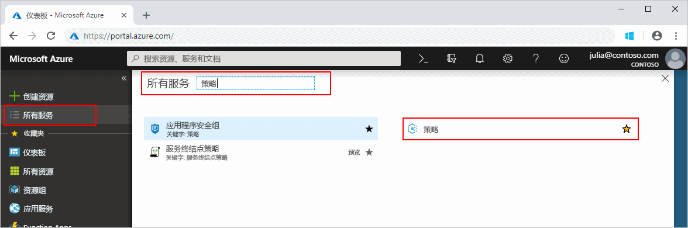
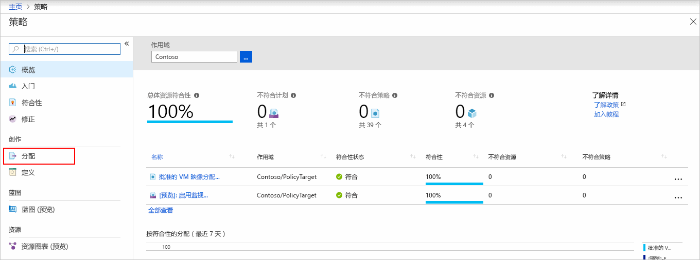
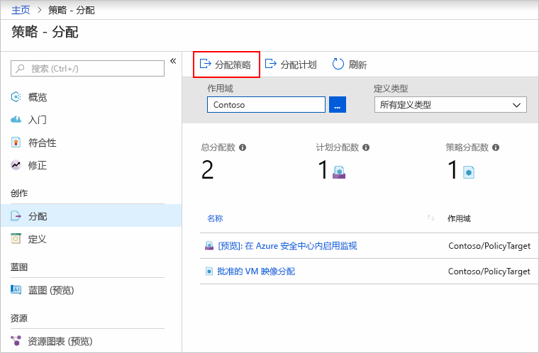
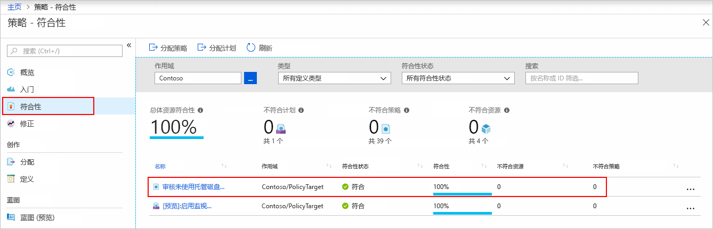
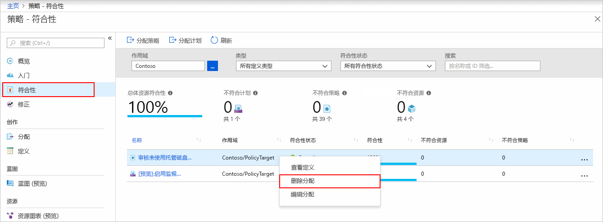

# 创建策略分配以识别不合规资源

若要了解 Azure 中的符合性，第一步是确定资源的状态。
本快速入门逐步讲解如何创建策略分配，以识别未使用托管磁盘的虚拟机。

此过程结束时，你可以成功识别哪些虚拟机未使用托管磁盘。 这些虚拟机不符合策略分配要求。

如果没有 Azure 订阅，请在开始之前创建一个[免费](https://azure.microsoft.com/free/)帐户。

## 创建策略分配

本快速入门将创建一个策略分配，并分配“审核未使用托管磁盘的 VM”策略定义。

1. 在 Azure 门户中单击“所有服务”，然后搜索并选择“策略”，启动 Azure Policy 服务。

   

1. 选择“Azure Policy”页左侧的“分配”。 分配即为在特定范围内分配策略以供执行。

   

1. 在“策略 - 分配”页的顶部选择“分配策略”。

   

1. 在“分配策略”页上，通过单击省略号并选择管理组或订阅，选择“范围”。 或者，请选择一个资源组。 范围用于确定对其强制执行策略分配的资源或资源组。  然后在“范围”页的底部单击“选择”。

   此示例使用 Contoso 订阅。 你的订阅将有所不同。

1. 可基于“范围”排除资源。  “排除”从低于“范围”级别的一个级别开始。 “排除”是可选的，因此暂时将其留空。

1. 选择“策略定义”旁边的省略号打开可用定义的列表。 Azure Policy 附带可供使用的内置策略定义。 许多是可用的，例如：

   - 强制实施标记和值
   - 应用标记和值
   - 需要 SQL Server 版本 12.0

   有关可用内置策略的部分列表，请参阅[策略示例](./samples/index.md)。

1. 在策略定义列表中搜索，找到“审核未使用托管磁盘的 VM”定义。 单击该策略，再单击“选择”。

   

1. “分配名称”中自动填充了所选的策略名称，但可以更改它。 对于此示例，请保留“审核未使用托管磁盘的 VM”。 还可根据需要添加“说明”。 该说明提供有关此策略分配的详细信息。 将根据登录的用户自动填写“分配者”。 此字段是可选字段，因此可输入自定义值。

1. 不选中“创建托管标识”。 当策略或计划包含具有 [deployIfNotExists](./concepts/effects.md#deployifnotexists) 效果的策略时，必须选中此复选框。 由于本快速入门所使用的策略中未包含上述策略，请将其留空。 有关详细信息，请参阅[托管标识](../../active-directory/managed-identities-azure-resources/overview.md)和[修正安全性工作原理](./how-to/remediate-resources.md#how-remediation-security-works)。

1. 单击“分配”。

你现已准备好识别不合规的资源，了解环境的符合性状态。

## 识别不合规的资源

选择页面左侧的“符合性”。 然后找到所创建的“审核未使用托管磁盘的 VM”策略分配。

如果存在与此新分配不相符的任何现有资源，这些资源会在“不符合的资源”下显示。

针对现有资源评估某条件时，如果结果为 true，则会将这些资源标记为与策略不符。 下表显示了对于生成的符合性状态，不同的策略效果是如何与条件评估配合使用的。 虽然不显示 Azure 门户中的评估逻辑，但会显示符合性状态结果。 符合性状态结果为符合或不符合。

| **资源状态** | **效果** | **策略评估** | **符合性状态** |
| --- | --- | --- | --- |
| Exists | Deny、Audit、Append\*、DeployIfNotExist\*、AuditIfNotExist\* | True | 不合规 |
| Exists | Deny、Audit、Append\*、DeployIfNotExist\*、AuditIfNotExist\* | False | 符合 |
| 新建 | Audit、AuditIfNotExist\* | True | 不合规 |
| 新建 | Audit、AuditIfNotExist\* | False | 符合 |

\*Append、DeployIfNotExist 和 AuditIfNotExist 效果要求 IF 语句为 TRUE。 这些效果还要求存在条件为 FALSE 才能将资源判定为不合规。 如果为 TRUE，则 IF 条件会触发相关资源存在条件的计算。

## 清理资源

删除创建的分配，请执行以下步骤：

1. 选择“Azure Policy”页面左侧中的“符合性”（或“分配”）并找到你创建的“审核未使用托管磁盘的 VM”策略分配。

1. 右键单击“审核未使用托管磁盘的 VM”策略分配并选择“删除分配”。

   

## 后续步骤

在本快速入门中，你向某个范围分配了策略定义并评估了其符合性报告。 策略定义可验证范围内的所有资源都符合策略，并可标识不符合策略的资源。

要了解有关分配策略以验证新资源是否符合要求的详细信息，请继续以下教程：

> [!div class="nextstepaction"]
> [创建和管理策略](./tutorials/create-and-manage.md)