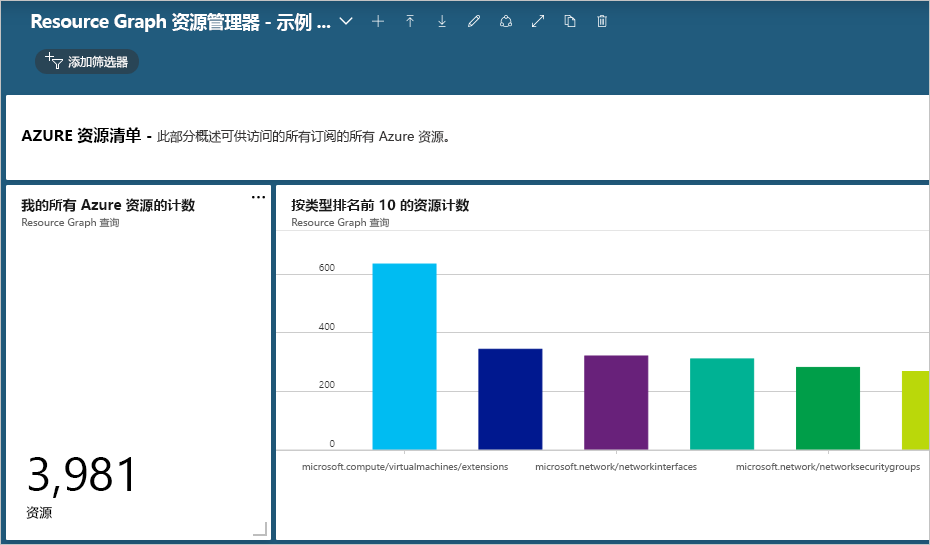
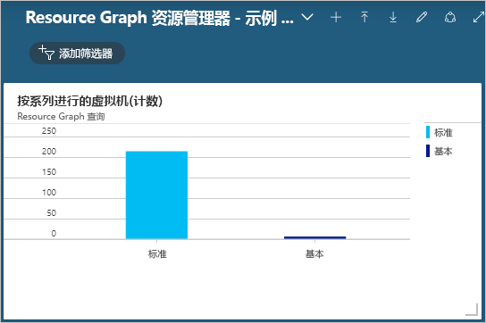

# <a name="quickstart-run-your-first-resource-graph-query-using-azure-resource-graph-explorer"></a>快速入门：使用 Azure Resource Graph Explorer 运行第一个 Resource Graph 查询

可以直接在 Azure 门户中通过 Azure Resource Graph Explorer 使用 Azure Resource Graph 的强大功能。 Resource Graph Explorer 提供有关可查询的 Azure 资源管理器资源类型和属性的可浏览信息。 Resource Graph Explorer 还提供一个整洁的界面用于处理多个查询、评估结果，甚至是将某些查询的结果转换为可固定到 Azure 仪表板的图表。

在本快速入门结束时，你已使用 Azure 门户和 Resource Graph Explorer 运行第一个 Resource Graph 查询，并已将结果固定到仪表板。

如果没有 Azure 订阅，请在开始之前创建一个[免费](https://azure.microsoft.com/free/)帐户。

## <a name="run-your-first-resource-graph-query"></a>运行首个 Resource Graph 查询

打开 [Azure 门户](https://portal.azure.com)，遵循以下步骤找到并使用 Resource Graph Explorer 运行第一个 Resource Graph 查询：

1. 在左侧窗格中，选择“所有服务”  。 搜索并选择 **Resource Graph Explorer**。

1. 在窗口中的“查询 1”部分输入查询 `Resources | project name, type | limit 5`，然后选择“运行查询”。  

   > [!NOTE]
   > 由于此查询示例未提供排序修饰符（例如 `order by`），因此多次运行此查询可能会为每个请求生成一组不同的资源。

1. 在“结果”选项卡中查看查询响应。  选择“消息”选项卡，以查看有关查询的详细信息，包括结果计数和查询持续时间。  出现的任何错误将显示在此选项卡下。

1. 更新查询，以将 `order by` 条件指定为 **Name** 属性：`Resources | project name, type | limit 5 | order by name asc`。 然后选择“运行查询”。 

   > [!NOTE]
   > 与第一个查询一样，多次运行此查询可能会为每个请求生成一组不同的资源。 查询命令的顺序非常重要。 在本例中，`order by` 位于 `limit` 之后。 这将首先限制查询结果，然后对其进行排序。

1. 将查询更新为先按 **Name** 属性应用 `order by`，然后对前五个结果应用 `limit`：`Resources | project name, type | order by name asc | limit 5`。 然后选择“运行查询”。 

假设环境中没有任何变化，则多次运行最后一个查询时，返回的结果将是一致的且符合预期的 -- 按 **Name** 属性排序，但仍限制为前五个结果。

### <a name="schema-browser"></a>架构浏览器

架构浏览器位于 Resource Graph Explorer 的左窗格中。 此资源列表显示 Azure 资源的所有资源类型，这些类型受 Azure Resource Graph 的支持，并且存在于你有权访问的租户中。  展开资源类型或附属属性会显示可用于创建 Resource Graph 查询的子属性。 选择资源类型会将 `where type =="<resource type>"` 放入查询框中。 选择一个子属性会将 `where <propertyName> == "INSERT_VALUE_HERE"` 添加到查询框中。 在架构浏览器中，可以十分方便地发现可在查询中使用的属性。 请确保将 _INSERT\_VALUE\_HERE_ 替换为自己的值，并调整包含条件、运算符和函数的查询，以获得预期结果。

## <a name="create-a-chart-from-the-resource-graph-query"></a>基于 Resource Graph 查询创建图表

运行上述最后一个查询后，如果你选择“图表”选项卡，则会看到一条消息，指出“该结果集与饼图可视化效果不兼容。”  列出结果的查询无法生成图表，但提供资源计数的查询则可以。 让我们使用[示例查询 - 按 OS 类型统计虚拟机数目](./samples/starter.md#count-virtual-machines-by-os-type)，基于 Resource Graph 查询创建可视化效果。

1. 在窗口中的“查询 1”部分输入以下查询，然后选择“运行查询”。  

   ```kusto
   Resources
   | where type =~ 'Microsoft.Compute/virtualMachines'
   | summarize count() by tostring(properties.storageProfile.osDisk.osType)
   ```

1. 选择“结果”选项卡，可以看到，此查询的响应提供了计数。 

1. 选择“图表”选项卡。  现在，查询将会生成可视化效果。 在“选择图表类型...”中将类型更改为“条形图”或“圆环图”，以体验各种可用的可视化选项。   

## <a name="pin-the-query-visualization-to-a-dashboard"></a>将查询可视化效果固定到仪表板

如果查询返回的结果可以可视化，则你可以将该数据可视化效果固定到某个仪表板。 运行上述查询后，执行以下步骤：

1. 选择“保存”，并提供名称“按 OS 类型统计的 VM 数目”。  然后在右窗格底部选择“保存”。 

1. 选择“运行查询”，以重新运行现已保存的查询。 

1. 在“图表”选项卡上，选择一种数据可视化效果。  然后选择“固定到仪表板”。 

1. 选择显示的门户通知，或者在左窗格中选择“仪表板”。 

现在，该查询会显示在仪表板上，其磁贴标题与查询名称相匹配。 如果在固定时该查询未保存，则其名称将是“查询 1”。

每当加载仪表板时，该查询和生成的数据可视化效果就会运行并更新，直接在工作流中提供 Azure 环境的实时动态见解。

> [!NOTE]
> 也可以将生成列表的查询固定到仪表板。 此功能并不局限于查询的数据可视化。

## <a name="import-example-resource-graph-explorer-dashboards"></a>导入示例 Resource Graph Explorer 面板

若要提供 Resource Graph 查询示例并了解如何使用 Resource Graph Explorer 增强 Azure 门户工作流，请尝试以下示例仪表板。

- [Resource Graph Explorer - 示例仪表板 #1](https://github.com/Azure-Samples/Governance/blob/master/src/resource-graph/portal-dashboards/sample-1/resourcegraphexplorer-sample-1.json)

  [](./media/arge-sample1-large.png#lightbox)

- [Resource Graph Explorer - 示例仪表板 #2](https://github.com/Azure-Samples/Governance/blob/master/src/resource-graph/portal-dashboards/sample-2/resourcegraphexplorer-sample-2.json)

  [](./media/arge-sample2-large.png#lightbox)

> [!NOTE]
> 上述示例仪表板屏幕截图中的计数和图表根据 Azure 环境的不同而异。

1. 选择并下载想要评估的示例仪表板。

1. 在 Azure 门户上的左窗格中选择“仪表板”。 

1. 选择“上传”，找到并选择已下载的示例仪表板文件。  然后选择“打开”。 

此时会自动显示已导入的仪表板。 由于该仪表板现已加载到 Azure 门户中，因此你可以根据需要进行探索和更改，或者基于示例创建可与团队共享的新仪表板。 有关使用仪表板的详细信息，请参阅[在 Azure 门户中创建和共享仪表板](../../azure-portal/azure-portal-dashboards.md)。

## <a name="clean-up-resources"></a>清理资源

若要从 Azure 门户环境中删除示例 Resource Graph 仪表板，可执行以下步骤：

1. 在左窗格中选择“仪表板”。 

1. 在仪表板下拉列表中，选择要删除的示例 Resource Graph 仪表板。

1. 在仪表板顶部的菜单中选择“删除”，然后选择“确定”以确认。  

## <a name="next-steps"></a>后续步骤

- 获取有关[查询语言](./concepts/query-language.md)的详细信息
- 了解如何[浏览资源](./concepts/explore-resources.md)
- 在 [Azure CLI](first-query-azurecli.md) 中运行首个查询
- 查看[初学者查询](./samples/starter.md)的示例
- 查看[高级查询](./samples/advanced.md)的示例
- 在 [UserVoice](https://feedback.azure.com/forums/915958-azure-governance) 上提供反馈