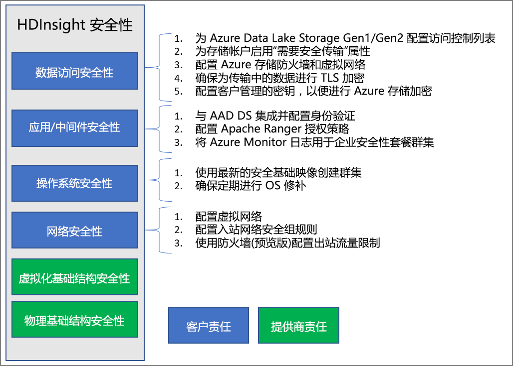

# Azure HDInsight 中的企业安全性概述

Azure HDInsight 提供许多方法来解决企业安全性需求。 这些解决方案中的大多数默认情况下未激活。 这种灵活性允许你选择对你来说最重要的安全功能，避免在不需要的功能上花钱。 这也意味着，你有责任确保为设置和环境启用正确的解决方案。

本文审视安全解决方案的方式是将安全解决方案划分为四大传统的安全支柱：外围安全性、身份验证、授权和加密。

本文还介绍 **Azure HDInsight 企业安全性套餐 (ESP)** ，该套餐为 HDInsight 群集提供基于 Active Directory 的身份验证、多用户支持和基于角色的访问控制。

## 企业安全性支柱

审视企业安全性的一种方式是根据控制类型将安全解决方案分成四个主要组。 这些组也称为安全支柱，包括：外围安全性、身份验证、授权和加密。

### 外围安全性

HDInsight 中的外围安全性通过[虚拟网络](../hdinsight-plan-virtual-network-deployment.md)实现。 企业管理员可在虚拟网络 (VNET) 中创建群集，并使用网络安全组 (NSG) 限制对虚拟网络的访问。 只有入站 NSG 规则中允许的 IP 地址才能与 HDInsight 群集通信。 此配置可实现外围安全性。

部署在 VNET 中的所有群集也会有一个专用终结点，该终结点解析为 VNET 中的专用 IP，可以对群集网关进行专用 HTTP 访问。

### Authentication

HDInsight 的[企业安全性套餐](apache-domain-joined-architecture.md)提供基于 Active Directory 的身份验证、多用户支持和基于角色的访问控制。 Active Directory 集成通过使用 [Azure Active Directory 域服务](../../active-directory-domain-services/overview.md)实现。 有了这些功能，就可以创建已加入托管 Active Directory 域的 HDInsight 群集。 接下来可配置企业员工的列表，这些员工可进行身份验证并登录到群集。

借助这种设置，企业员工可以使用其域凭据登录到群集节点。 他们还可以使用自己的域凭据在其他已批准的终结点（例如 Apache Ambari 视图、ODBC、JDBC、PowerShell 和 REST API）上进行身份验证，以便与群集交互。 

### 授权

大多数企业遵循的最佳实践是，确保并非每位员工都有权访问所有企业资源。 同理，管理员可以针对群集资源定义基于角色的访问控制策略。 此功能只在 ESP 群集中提供。

Hadoop 管理员可以配置基于角色的访问控制 (RBAC) 来确保 Apache [Hive](apache-domain-joined-run-hive.md)、[HBase](apache-domain-joined-run-hbase.md) 和 [Kafka](apache-domain-joined-run-kafka.md) 的安全性，只需使用 Apache Ranger 中的这些插件即可。 可以通过配置 RBAC 策略将权限与组织中的角色相关联。 此层抽象可以更轻松地确保用户仅仅有履行工作责任所需的权限。 也可通过 Ranger 审核员工的数据访问权限以及对访问控制策略所做的任何更改。

例如，管理员可以配置 [Apache Ranger](https://ranger.apache.org/)，为 Hive 设置访问控制策略。 此功能可确保行级和列级筛选（数据掩码），用于筛选未授权用户的敏感数据。

### 审核

若要跟踪对资源的未经授权或非故意的访问，则必须审核对群集资源和数据的所有访问。 这与阻止未经授权的用户访问 HDInsight 群集资源和保护数据具有同等重要性。

管理员可以查看和报告对 HDInsight 群集资源与数据的所有访问。 管理员还可以查看和报告对在 Apache Ranger 支持的终结点中创建的访问控制策略进行的所有更改。 

若要访问 Apache Ranger 和 Ambari 审核日志以及 SSH 访问日志，请[启用 Azure Monitor](../hdinsight-hadoop-oms-log-analytics-tutorial.md) 并查看相关的审核记录。

### 加密

保护数据对于满足组织安全性和合规性要求具有重要意义。 除了限制未经授权的员工访问数据外，还应对数据加密。

HDInsight 群集的两种数据存储（Azure Blob 存储和 Azure Data Lake Storage Gen1/Gen2）都支持在服务器端以透明方式进行静态[数据加密](../../storage/common/storage-service-encryption.md)。 HDInsight 安全群集将与这种服务器端静态数据加密功能无缝协作。

## 共担责任模型

下图汇总了主要的系统安全领域，以及在每个领域提供的安全解决方案。 此外还突出显示了哪些安全领域是作为客户的你的责任，哪些领域是作为服务提供商的 HDInsight 的责任。

下表提供了每类安全解决方案的资源的链接。

| 安全领域 | 可用解决方案 | 责任方 |
|---|---|---|
| 数据访问安全性 | 为 Azure Data Lake Storage Gen1 和 Gen2 配置[访问控制列表 (ACL)](../../storage/blobs/data-lake-storage-access-control.md)  | 客户 |
|  | 在存储帐户中启用“[需要安全传输](../../storage/common/storage-require-secure-transfer.md)”属性。 | 客户 |
|  | 配置 [Azure 存储防火墙](../../storage/common/storage-network-security.md)和虚拟网络 | 客户 |
|  | 确保为传输中的数据启用 [TLS 加密](../../storage/common/storage-security-tls.md)。 | 客户 |
|  | 配置[客户管理的密钥](../../storage/common/storage-encryption-keys-portal.md)以进行 Azure 存储加密 | 客户 |
| 应用程序和中间件安全性 | 集成 AAD-DS 并[配置身份验证](apache-domain-joined-configure-using-azure-adds.md) | 客户 |
|  | 配置 [Apache Ranger 授权](apache-domain-joined-run-hive.md)策略 | 客户 |
|  | 使用 [Azure Monitor 日志](../hdinsight-hadoop-oms-log-analytics-tutorial.md) | 客户 |
| 操作系统安全性 | 使用最新且安全的基础映像创建群集 | 客户 |
|  | 确保定期进行 [OS 修补](../hdinsight-os-patching.md) | 客户 |
| 网络安全 | 配置[虚拟网络](../hdinsight-plan-virtual-network-deployment.md) |
|  | 配置[网络安全组 (NSG) 入站规则](../hdinsight-plan-virtual-network-deployment.md#networktraffic) | 客户 |
|  | 使用防火墙（预览版）配置[出站流量限制](../hdinsight-restrict-outbound-traffic.md) | 客户 |
| 虚拟化的基础结构 | 不适用 | HDInsight（云提供商） |
| 物理基础结构安全性 | 不适用 | HDInsight（云提供商） |

## 后续步骤

* [HDInsight 群集规划](apache-domain-joined-architecture.md)
* [配置 ESP HDInsight 群集](apache-domain-joined-configure.md)
* [管理 ESP HDInsight 群集](apache-domain-joined-manage.md)
