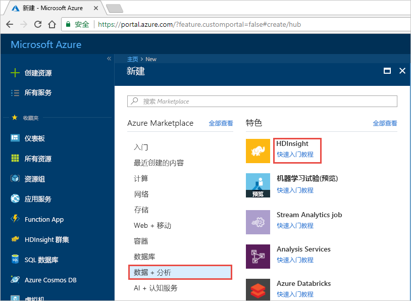
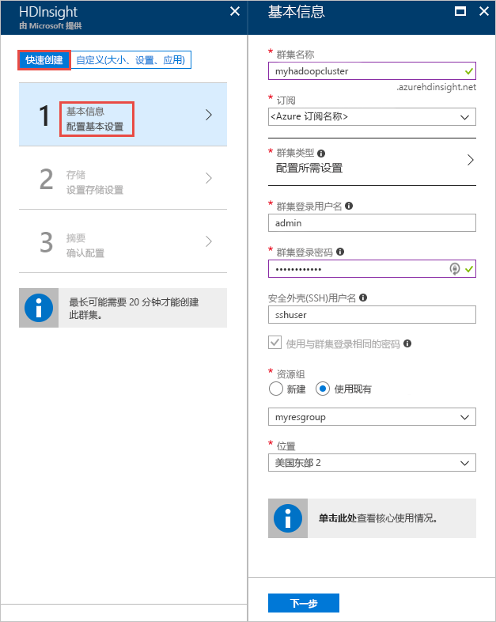
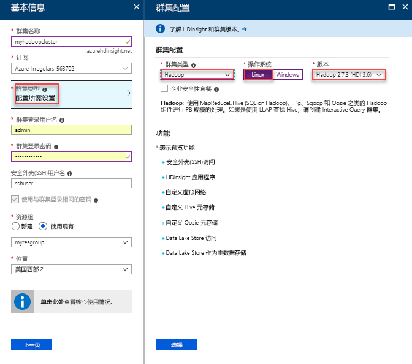
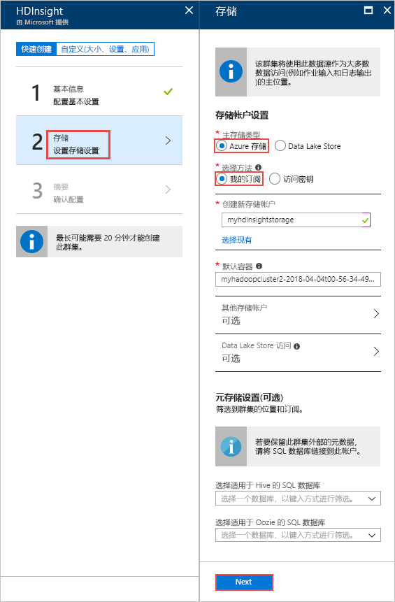
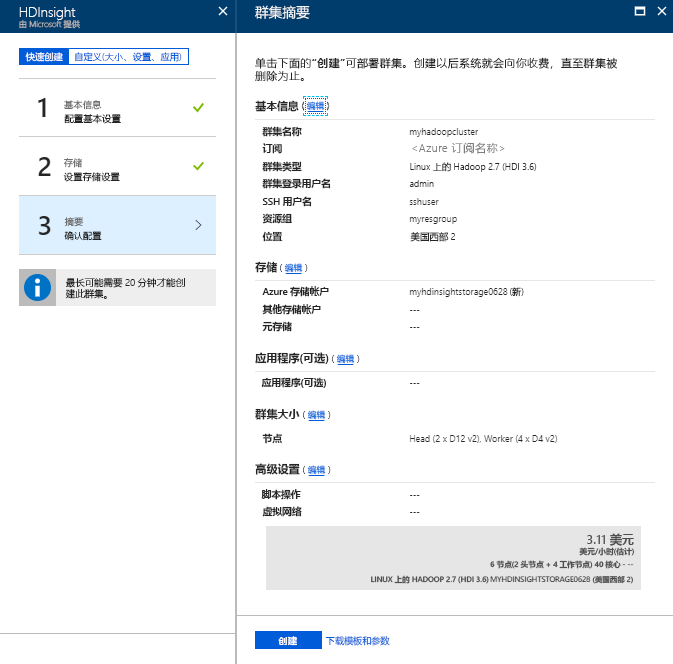
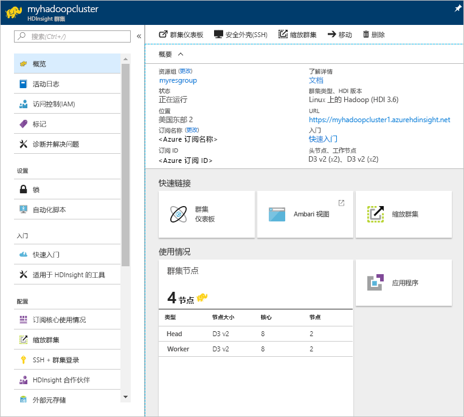
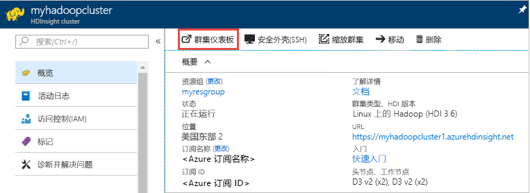
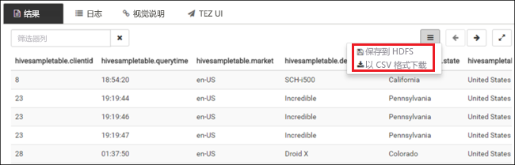
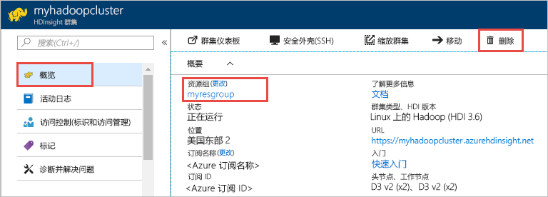

# 快速入门：通过 Azure 门户在 Azure HDInsight 中开始使用 Hadoop 和 Hive

本文介绍如何使用 Azure 门户在 HDInsight 中创建 [Hadoop](http://hadoop.apache.org/) 群集，以及如何在 HDInsight 中运行 Hive 作业。 大多数 Hadoop 作业都是批处理作业。 创建群集，运行一些作业，并删除群集。 在本文中，将会执行所有这三项任务。

在此快速入门中，使用 Azure 门户创建 HDInsight Hadoop 群集。 还可以使用 [Azure 资源管理器模板](apache-hadoop-linux-tutorial-get-started.md)创建群集。

目前，HDInsight 附带[七个不同的群集类型](./apache-hadoop-introduction.md#cluster-types-in-hdinsight)。 每个群集类型都支持一组不同的组件。 所有群集类型都支持 Hive。 有关 HDInsight 中受支持组件的列表，请参阅 [HDInsight 提供的 Hadoop 群集版本中有哪些新功能？](../hdinsight-component-versioning.md)  

如果没有 Azure 订阅，请在开始之前[创建一个免费帐户](https://azure.microsoft.com/free/)。

## 创建 Hadoop 群集

在本部分中，使用 Azure 门户在 HDInsight 中创建 Hadoop 群集。 

1. 登录到 [Azure 门户](https://portal.azure.com)。

1. 在 Azure 门户中，选择“创建资源” > “数据 + 分析” > “HDInsight”。 

    

2. 在“HDInsight” > “快速创建” > “基本”下，提供以下屏幕截图中所建议的值：

    

    输入或选择下列值：
    
    |属性  |说明  |
    |---------|---------|
    |**群集名称**     | 输入 Hadoop 群集的名称。 由于 HDInsight 中的所有群集共享同一 DNS 命名空间，因此该名称必须唯一。 该名称最多可以有 59 个字符，包括字母、数字和连字符。 名称的第一个和最后一个字符不能为连字符。 |
    |**订阅**     |  选择 Azure 订阅。 |
    |**群集类型**     | 暂时跳过此步骤。 在此过程的下一步骤中提供此输入。|
    |**群集登录用户名和密码**     | 默认登录名为“admin”。密码长度不得少于 10 个字符，且至少必须包含一个数字、一个大写字母和一个小写字母、一个非字母数字字符（' " ` \)字符除外）。 请确保不提供常见密码，如“Pass@word1”。|
    |**SSH 用户名** | 默认用户名为“sshuser”。  可以提供其他名称作为 SSH 用户名。 |
    | **使用与群集登录相同的密码** | 选中此复选框，让 SSH 用户使用与提供给群集登录用户相同的密码。|
    |**资源组**     | 创建资源组，或选择现有资源组。  资源组是 Azure 组件的容器。  在本例中，资源组包含 HDInsight 群集和依赖的 Azure 存储帐户。 |
    |**位置**     | 选择要在其中创建群集的 Azure 位置。  选择的位置与你越靠近，性能就越好。 |
        
3. 选择“群集类型”，然后提供如以下屏幕截图所示的输入：

    

    选择以下值：
    
    |属性  |说明  |
    |---------|---------|
    |**群集类型**     | 选择“Hadoop” |
    |**操作系统**     |  选择 Azure 订阅。 |
    |**版本**     | 选择 Hadoop 2.7.3 (HDI 3.6)|

    单击“选择”，然后单击“下一步”。

4. 在“存储”选项卡中，提供如以下屏幕截图所示的输入：

    

    选择以下值：
    
    |属性  |说明  |
    |---------|---------|
    |**主存储类型**     | 在本文中，选择“Azure 存储”，将 Azure 存储 Blob 用作默认存储帐户。 还可以将 Azure Data Lake Storage 用作默认存储。 |
    |**选择方法**     |  在本文中，选择“我的订阅”，使用 Azure 订阅中的存储帐户。 若要使用其他订阅中的存储帐户，请选择“访问密钥”，然后提供该帐户的访问密钥。 |
    |**新建存储帐户**     | 为存储帐户提供名称。|

    接受所有其他默认值，然后选择“下一步”。

5. 在“摘要”选项卡中，验证之前步骤中所选的值。

    
      
4. 选择“创建”。 门户仪表板上应会显示标题为“为 HDInsight 提交部署”的新磁贴。 创建群集大约需要 20 分钟时间。

    

4. 创建群集后，Azure 门户中会显示群集概述页。
   
        
    
    每个群集都有一个 [Azure 存储帐户](../hdinsight-hadoop-use-blob-storage.md)或 [Azure Data Lake 帐户](../hdinsight-hadoop-use-data-lake-store.md)依赖项。 该帐户称为默认存储帐户。 HDInsight 群集与其默认存储帐户必须一起放置在同一个 Azure 区域中。 删除群集不会删除存储帐户。

    > [!NOTE]
    > 如需其他群集创建方法或要了解本教程中使用的属性，请参阅 [Create HDInsight clusters](../hdinsight-hadoop-provision-linux-clusters.md)（创建 HDInsight 群集）。       
    > 
    >

## 运行 Hive 查询

[Apache Hive](hdinsight-use-hive.md) 是 HDInsight 中最流行的组件。 可通过多种方法在 HDInsight 中运行 Hive 作业。 本教程使用门户中的 Ambari Hive 视图。 有关提交 Hive 作业的其他方法，请参阅 [Use Hive in HDInsight](hdinsight-use-hive.md)（在 HDInsight 中使用 Hive）。

1. 若要打开 Ambari，请从之前的屏幕截图中，选择“群集仪表板”。  也可以浏览到 **https://&lt;ClusterName>.azurehdinsight.net**，其中 &lt;ClusterName> 是在上一部分中创建的群集。

    

2. 输入在创建群集时指定的 Hadoop 用户名和密码。 默认的用户名为 **admin**。

3. 打开“Hive 视图”，如以下屏幕截图中所示： 
   
    

4. 在“查询”选项卡中，将以下 HiveQL 语句粘贴到工作表中：
   
        SHOW TABLES;

    
   
   > [!NOTE]
   > Hive 要求使用分号。       
   > 
   > 

5. 选择“执行”。 “结果”选项卡将显示在“查询”选项卡下面，并显示有关作业的信息。 
   
    完成查询后，“查询”选项卡将显示操作结果。 应会看到一个名为 **hivesampletable** 的表。 所有 HDInsight 群集都随附了此示例 Hive 表。
   
    

6. 重复步骤 4 和 5，运行以下查询：
   
        SELECT * FROM hivesampletable;
   
7. 还可以保存查询的结果。 选择右侧的菜单按钮，并指定是要将结果下载为 CSV 文件，还是要将其存储到与群集关联的存储帐户。

    

完成 Hive 作业后，可以[将结果导出到 Azure SQL 数据库或 SQL Server 数据库](apache-hadoop-use-sqoop-mac-linux.md)，还可以[使用 Excel 将结果可视化](apache-hadoop-connect-excel-power-query.md)。 有关在 HDInsight 中使用 Hive 的详细信息，请参阅 [Use Hive and HiveQL with Hadoop in HDInsight to analyze a sample Apache log4j file](hdinsight-use-hive.md)（将 Hive 和 HiveQL 与 HDInsight 中的 Hadoop 配合使用以分析示例 Apache log4j 文件）。

## 故障排除

如果在创建 HDInsight 群集时遇到问题，请参阅[访问控制要求](../hdinsight-administer-use-portal-linux.md#create-clusters)。

## 清理资源
完成本教程后，可以删除群集。 有了 HDInsight，便可以将数据存储在 Azure 存储中，因此可以在群集不用时安全地删除群集。 此外，还需要为 HDInsight 群集付费，即使不用也是如此。 由于群集费用数倍于存储空间费用，因此在群集不用时删除群集可以节省费用。 

> [!NOTE]
> 如果立即进行下一教程，了解如何使用 Hadoop on HDInsight 运行 ETL 操作，建议保持群集运行。 这是因为该教程中必须再次创建 Hadoop 群集。 但是，如果不立即学习下一教程，则必须立即删除该群集。
> 
>  

**删除群集和/或默认存储帐户**

1. 返回到包含 Azure 门户的浏览器选项卡。 你应该在群集概览页上。 如果仅希望删除群集但保留默认的存储帐户，请选择“删除”。

    

2. 如果希望删除群集和默认存储帐户，请选择资源组名称（之前的屏幕截图中已突出显示），打开资源组页。

3. 选择“删除资源组”，删除资源组（包括群集和默认存储帐户）。 注意，删除资源组会删除存储帐户。 如果想要保留存储帐户，请选择仅删除群集。

## 后续步骤
本教程已介绍如何使用资源管理器模板创建基于 Linux 的 HDInsight 群集，以及如何执行基本 Hive 查询。 下一篇文章将介绍如何使用 Hadoop on HDInsight 执行提取、转换和加载 (ETL) 操作。

> [!div class="nextstepaction"]
>[使用 Apache Hive on HDInsight 提取、转换和加载数据](../hdinsight-analyze-flight-delay-data-linux.md)

如果已准备好开始处理自己的数据，并需要进一步了解 HDInsight 存储数据的方式或如何将数据导入 HDInsight，请参阅以下文章：

* 有关 HDInsight 如何使用 Azure 存储的信息，请参阅[将 Azure 存储与 HDInsight 配合使用](../hdinsight-hadoop-use-blob-storage.md)。
* 有关如何创建包含 Data Lake Storage 的 HDInsight 群集的信息，请参阅[快速入门：在 HDInsight 中设置群集](../../storage/data-lake-storage/quickstart-create-connect-hdi-cluster.md)
* 若要了解如何将数据上传到 HDInsight，请参阅[将数据上传到 HDInsight](../hdinsight-upload-data.md)。

有关如何使用 HDInsight 分析数据的详细信息，请参阅以下文章：

* 若要详细了解如何将 Hive 与 HDInsight 配合使用（包括如何从 Visual Studio 中执行 Hive 查询），请参阅[将 Hive 与 HDInsight 配合使用](hdinsight-use-hive.md)。
* 若要了解 Pig（一种用于转换数据的语言），请参阅[将 Pig 与 HDInsight 配合使用](hdinsight-use-pig.md)。
* 若要了解 MapReduce（在 Hadoop 中处理数据的程序编写方式），请参阅[将 MapReduce 与 HDInsight 配合使用](hdinsight-use-mapreduce.md)。
* 若要了解如何使用用于 Visual Studio 的 HDInsight 工具来分析 HDInsight 数据，请参阅 [Get started using Visual Studio Hadoop tools for HDInsight](apache-hadoop-visual-studio-tools-get-started.md)（用于 HDInsight 的 Visual Studio Hadoop 工具入门）。

若要详细了解如何创建或管理 HDInsight 群集，请参阅以下文章：

* 若要了解如何管理基于 Linux 的 HDInsight 群集，请参阅 [Manage HDInsight clusters using Ambari](../hdinsight-hadoop-manage-ambari.md)（使用 Ambari 管理 HDInsight 群集）。
* 有关可用于创建 HDInsight 群集的选项的详细信息，请参阅 [Creating HDInsight on Linux using custom options](../hdinsight-hadoop-provision-linux-clusters.md)（使用自定义选项在 Linux 上创建 HDInsight）。

[1]: ../HDInsight/apache-hadoop-visual-studio-tools-get-started.md

[hdinsight-provision]: hdinsight-provision-linux-clusters.md
[hdinsight-upload-data]: hdinsight-upload-data.md
[hdinsight-use-hive]: hdinsight-use-hive.md
[hdinsight-use-pig]: hdinsight-use-pig.md

