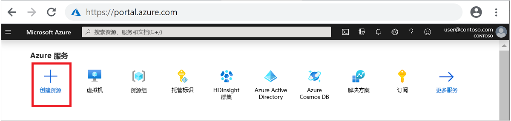
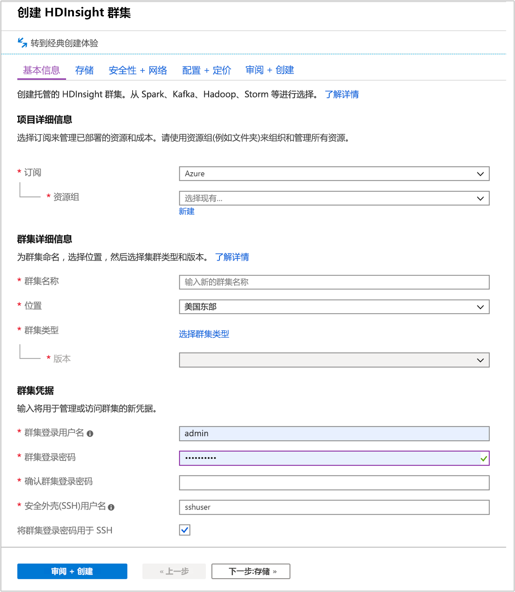
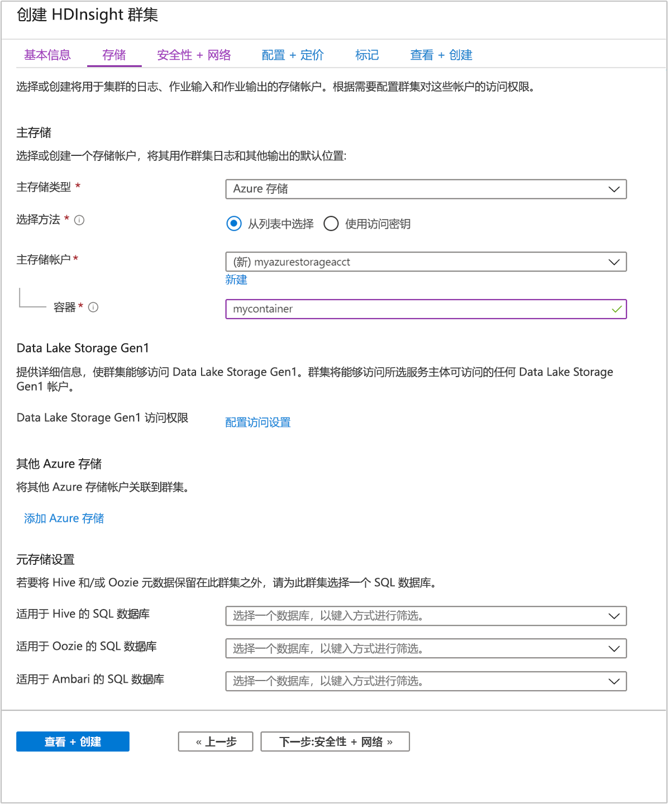
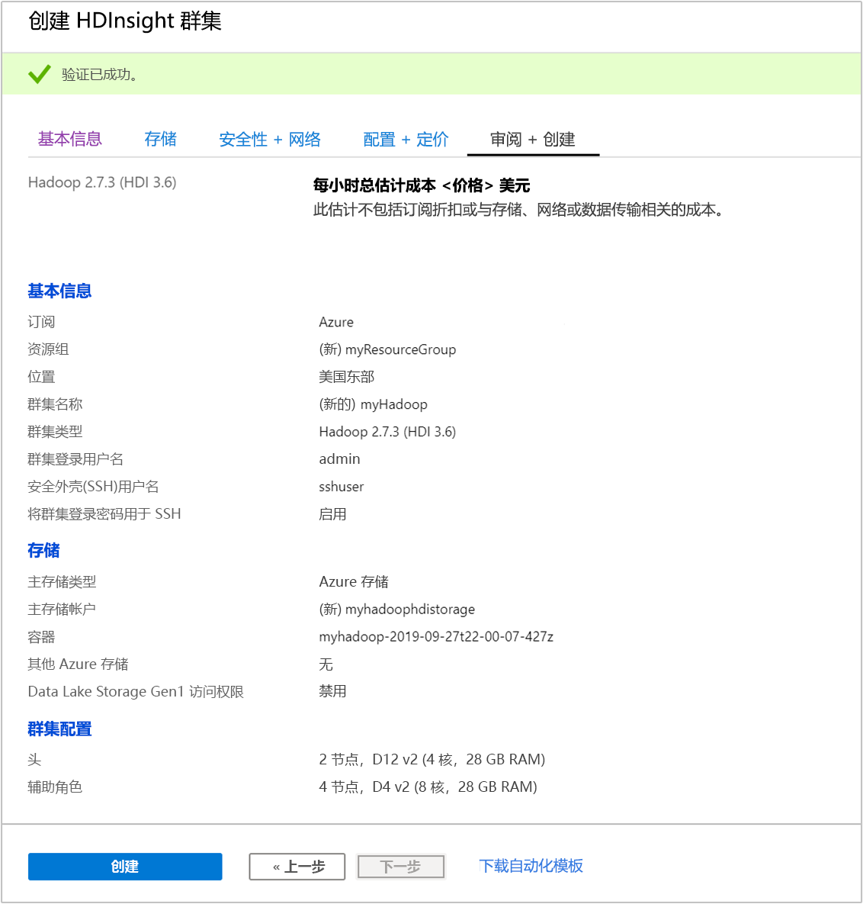

# <a name="quickstart-create-apache-hadoop-cluster-in-azure-hdinsight-using-azure-portal"></a>快速入门：使用 Azure 门户在 Azure HDInsight 中创建 Apache Hadoop 群集

本文介绍如何使用 Azure 门户在 HDInsight 中创建 Apache Hadoop 群集，以及如何在 HDInsight 中运行 Apache Hive 作业。 大多数 Hadoop 作业都是批处理作业。 创建群集，运行一些作业，并删除群集。 在本文中，将会执行所有这三项任务。 有关可用配置的详细说明，请参阅[在 HDInsight 中设置群集](../hdinsight-hadoop-provision-linux-clusters.md)。 有关使用门户创建群集的详细信息，请参阅[在门户中创建群集](../hdinsight-hadoop-create-linux-clusters-portal.md)。

在此快速入门中，使用 Azure 门户创建 HDInsight Hadoop 群集。 还可以使用 [Azure 资源管理器模板](apache-hadoop-linux-tutorial-get-started.md)创建群集。

目前，HDInsight 附带[七个不同的群集类型](../hdinsight-overview.md#cluster-types-in-hdinsight)。 每个群集类型都支持一组不同的组件。 所有群集类型都支持 Hive。 有关 HDInsight 中受支持组件的列表，请参阅 [HDInsight 提供的 Apache Hadoop 群集版本中有哪些新增功能？](../hdinsight-component-versioning.md)  

如果还没有 Azure 订阅，可以在开始前[创建一个免费帐户](https://azure.microsoft.com/free/)。

## <a name="create-an-apache-hadoop-cluster"></a>创建 Apache Hadoop 群集

在本部分中，使用 Azure 门户在 HDInsight 中创建 Hadoop 群集。

1. 登录到 [Azure 门户](https://portal.azure.com)。

1. 在顶部菜单中，选择“+ 创建资源”  。

    

1. 选择“分析”   >   “Azure HDInsight”，转到“创建 HDInsight 群集”  页。

1. 在“基本信息”选项卡中提供以下信息： 

    |properties  |说明  |
    |---------|---------|
    |订阅    |  从下拉列表中选择用于此群集的 Azure 订阅。 |
    |资源组     | 从下拉列表中选择现有资源组，或选择“新建”  。|
    |群集名称   | 输入任何全局唯一的名称。 该名称最多可以有 59 个字符，包括字母、数字和连字符。 名称的第一个和最后一个字符不能为连字符。 |
    |区域    | 从下拉列表中，选择在其中创建群集的区域。  选择的位置与你越靠近，性能就越好。 |
    |群集类型| 选择“选择群集类型”  。 然后选择 **Hadoop** 作为群集类型。|
    |版本|从下拉列表中，选择一个**版本**。 如果不知道要选择哪个版本，请使用默认版本。|
    |群集登录用户名和密码    | 默认登录名为“admin”  。密码长度不得少于 10 个字符，且至少必须包含一个数字、一个大写字母和一个小写字母、一个非字母数字字符（' " ` \)字符除外）。 请确保不提供常见密码，如“Pass@word1”  。|
    |安全外壳 (SSH) 用户名 | 默认用户名为“sshuser”  。  可以提供其他名称作为 SSH 用户名。 |
    |对 SSH 使用群集登录密码| 选中此复选框，让 SSH 用户使用与提供给群集登录用户的密码相同的密码。|

    

    选择页面底部的“下一步:  存储 >>”以前进到存储设置。

1. 在“存储”  选项卡中，提供以下值：

    |properties  |说明  |
    |---------|---------|
    |主存储类型|使用默认值“Azure 存储”。 |
    |选择方法|使用默认值“从列表中选择”。 |
    |主存储帐户|使用下拉列表选择现有存储帐户，或选择“新建”  。 如果创建新帐户，名称的长度必须在 3 到 24 个字符之间，并且只能包含数字和小写字母|
    |容器|使用自动填充的值。|

    

    每个群集都有一个 [Azure 存储帐户](../hdinsight-hadoop-use-blob-storage.md)或 [Azure Data Lake 帐户](../hdinsight-hadoop-use-data-lake-store.md)依赖项。 该帐户称为默认存储帐户。 HDInsight 群集及其默认存储帐户必须共存于同一个 Azure 区域中。 删除群集不会删除存储帐户。

    选择“查看 + 创建”  选项卡。

1. 在“查看 + 创建”  选项卡中，验证你在前面的步骤中选择的值。

    

1. 选择“创建”  。 创建群集大约需要 20 分钟时间。

    创建群集后，Azure 门户中会显示群集概述页。

    

## <a name="run-apache-hive-queries"></a>运行 Apache Hive 查询

[Apache Hive](hdinsight-use-hive.md) 是 HDInsight 中最流行的组件。 可通过多种方法在 HDInsight 中运行 Hive 作业。 本快速入门使用门户中的 Ambari Hive 视图。 有关提交 Hive 作业的其他方法，请参阅 [Use Hive in HDInsight](hdinsight-use-hive.md)（在 HDInsight 中使用 Hive）。

> [!NOTE]
> Apache Hive 视图在 HDInsight 4.0 中不可用。

1. 若要打开 Ambari，请从之前的屏幕截图中，选择“群集仪表板”  。  还可以浏览到 `https://ClusterName.azurehdinsight.net`，其中的 `ClusterName` 是你在上一部分中创建的群集。

    

2. 输入在创建群集时指定的 Hadoop 用户名和密码。 默认的用户名为 **admin**。

3. 打开“Hive 视图”，如以下屏幕截图中所示： 

    

4. 在“查询”  选项卡中，将以下 HiveQL 语句粘贴到工作表中：

    ```sql
    SHOW TABLES;
    ```

    

5. 选择“执行”  。 “结果”  选项卡将显示在“查询”  选项卡下面，并显示有关作业的信息。 

    完成查询后，“查询”  选项卡将显示操作结果。 应会看到一个名为 **hivesampletable** 的表。 所有 HDInsight 群集都随附了此示例 Hive 表。

    

6. 重复步骤 4 和 5，运行以下查询：

    ```sql
    SELECT * FROM hivesampletable;
    ```

7. 还可以保存查询的结果。 选择右侧的菜单按钮，并指定是要将结果下载为 CSV 文件，还是要将其存储到与群集关联的存储帐户。

    

完成 Hive 作业后，可以[将结果导出到 Azure SQL 数据库或 SQL Server 数据库](apache-hadoop-use-sqoop-mac-linux.md)，还可以[使用 Excel 将结果可视化](apache-hadoop-connect-excel-power-query.md)。 有关在 HDInsight 中使用 Hive 的详细信息，请参阅[将 Apache Hive 和 HiveQL 与 HDInsight 中的 Apache Hadoop 配合使用以分析示例 Apache log4j 文件](hdinsight-use-hive.md)。

## <a name="clean-up-resources"></a>清理资源

完成本快速入门后，可以删除群集。 有了 HDInsight，便可以将数据存储在 Azure 存储中，因此可以在群集不用时安全地删除群集。 此外，还需要为 HDInsight 群集付费，即使不用也是如此。 由于群集费用数倍于存储空间费用，因此在群集不用时删除群集可以节省费用。

> [!NOTE]  
> 如果立即继续学习下一篇文章，以了解如何使用 Hadoop on HDInsight 运行 ETL 操作，建议保持群集运行  。 这是因为该教程中必须再次创建 Hadoop 群集。 但是，如果不立即学习下一篇文章，则必须立即删除该群集。

### <a name="to-delete-the-cluster-andor-the-default-storage-account"></a>删除群集和/或默认存储帐户

1. 返回到包含 Azure 门户的浏览器选项卡。 你应该在群集概览页上。 如果仅希望删除群集但保留默认的存储帐户，请选择“删除”  。

    

2. 如果希望删除群集和默认存储帐户，请选择资源组名称（之前的屏幕截图中已突出显示），打开资源组页。

3. 选择“删除资源组”，删除资源组（包括群集和默认存储帐户）  。 注意，删除资源组会删除存储帐户。 如果想要保留存储帐户，请选择仅删除群集。

## <a name="next-steps"></a>后续步骤

本快速入门介绍了如何使用资源管理器模板创建基于 Linux 的 HDInsight 群集，以及如何执行基本 Hive 查询。 下一篇文章将介绍如何使用 Hadoop on HDInsight 执行提取、转换和加载 (ETL) 操作。

> [!div class="nextstepaction"]
> [使用 HDInsight 上的交互式查询提取、转换和加载数据](../interactive-query/interactive-query-tutorial-analyze-flight-data.md)
