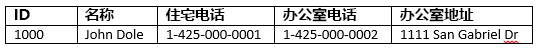
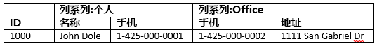

# <a name="quickstart-query-apache-hbase-in-azure-hdinsight-with-hbase-shell"></a>快速入门：使用 HBase Shell 在 Azure HDInsight 中查询 Apache HBase

本快速入门介绍如何使用 Apache HBase Shell 来创建 HBase 表，插入数据，然后对表进行查询。

如果没有 Azure 订阅，请在开始之前创建一个[免费帐户](https://azure.microsoft.com/free/?WT.mc_id=A261C142F)。

## <a name="prerequisites"></a>先决条件

* Apache HBase 群集。 若要创建 HDInsight 群集，请参阅[创建群集](../hadoop/apache-hadoop-linux-tutorial-get-started.md#create-cluster)。  确保选择 **HBase** 群集类型。

* SSH 客户端。 有关详细信息，请参阅[使用 SSH 连接到 HDInsight (Apache Hadoop)](../hdinsight-hadoop-linux-use-ssh-unix.md)。

## <a name="create-a-table-and-manipulate-data"></a>创建表并操作数据

对于大多数人而言，数据以表格形式显示：



在 HBase（[Cloud BigTable](https://cloud.google.com/bigtable/) 的一种实现）中，相同的数据看起来类似于：



可以使用 SSH 连接到 HBase 群集，然后使用 Apache HBase Shell 来创建 HBase 表以及插入和查询数据。

1. 使用 `ssh` 命令连接到 HBase 群集。 通过将 `CLUSTERNAME` 替换为群集的名称来编辑以下命令，然后输入该命令：

    ```cmd
    ssh sshuser@CLUSTERNAME-ssh.azurehdinsight.net
    ```

2. 使用 `hbase shell` 命令来启动 HBase 交互式 shell。 在 SSH 连接中输入以下命令。

    ```bash
    hbase shell
    ```

3. 使用 `create` 命令，创建包含双列系列的 HBase 表。 输入以下命令：

    ```hbase
    create 'Contacts', 'Personal', 'Office'
    ```

4. 使用 `list` 命令，列出 HBase 中的所有表。 输入以下命令：

    ```hbase
    list
    ```

5. 使用 `put` 命令，将指定列中的值插入特定表中的指定行。 输入以下命令：

    ```hbase
    put 'Contacts', '1000', 'Personal:Name', 'John Dole'
    put 'Contacts', '1000', 'Personal:Phone', '1-425-000-0001'
    put 'Contacts', '1000', 'Office:Phone', '1-425-000-0002'
    put 'Contacts', '1000', 'Office:Address', '1111 San Gabriel Dr.'
    ```

6. 使用 `scan` 命令扫描并返回 `Contacts` 表数据。 输入以下命令：

    ```hbase
    scan 'Contacts'
    ```

7. 使用 `get` 命令提取某个行的内容。 输入以下命令：

    ```hbase
    get 'Contacts', '1000'
    ```

    看到的结果与使用 `scan` 命令的结果类似，因为只有一个行。

8. 使用 `delete` 命令删除表中的单元格值。 输入以下命令：

    ```hbase
    delete 'Contacts', '1000', 'Office:Address'
    ```

9. 使用 `disable` 命令禁用表。 输入以下命令：

    ```hbase
    disable 'Contacts'
    ```

10. 使用 `drop` 命令从 HBase 中删除表。 输入以下命令：

    ```hbase
    drop 'Contacts'
    ```

11. 使用 `exit` 命令来停止 HBase 交互式 shell。 输入以下命令：

    ```hbase
    exit
    ```

有关 HBase 表架构的详细信息，请参阅 [Apache HBase 架构设计简介](http://0b4af6cdc2f0c5998459-c0245c5c937c5dedcca3f1764ecc9b2f.r43.cf2.rackcdn.com/9353-login1210_khurana.pdf)。 有关 HBase 命令的详细信息，请参阅 [Apache HBase 参考指南](https://hbase.apache.org/book.html#quickstart)。

## <a name="clean-up-resources"></a>清理资源

完成本快速入门后，可以删除群集。 有了 HDInsight，便可以将数据存储在 Azure 存储中，因此可以在群集不用时安全地删除群集。 此外，还需要为 HDInsight 群集付费，即使不用也是如此。 由于群集费用数倍于存储空间费用，因此在群集不用时删除群集可以节省费用。

若要删除群集，请参阅[使用浏览器、PowerShell 或 Azure CLI 删除 HDInsight 群集](../hdinsight-delete-cluster.md)。

## <a name="next-steps"></a>后续步骤

本快速入门介绍了如何使用 Apache HBase Shell 来创建 HBase 表，插入数据，然后对表进行查询。 若要详细了解存储在 HBase 中的数据，请参阅下一篇文章，其中介绍了如何使用 Apache Spark 执行查询。

> [!div class="nextstepaction"]
> [使用 Apache Spark 读取和写入 Apache HBase 数据](../hdinsight-using-spark-query-hbase.md)