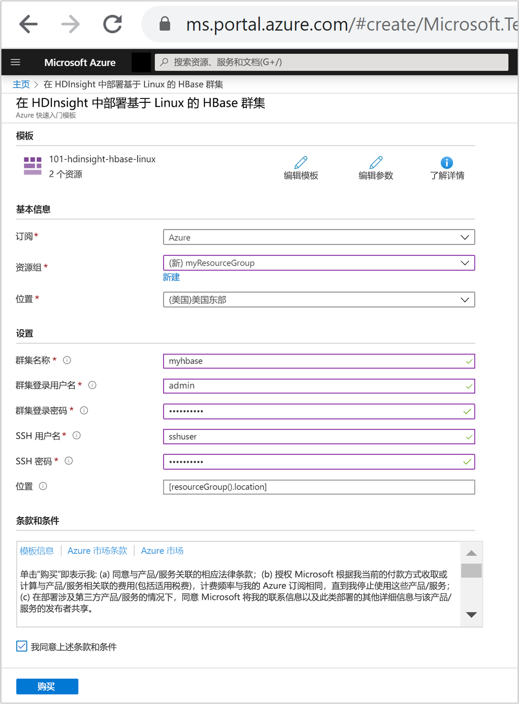
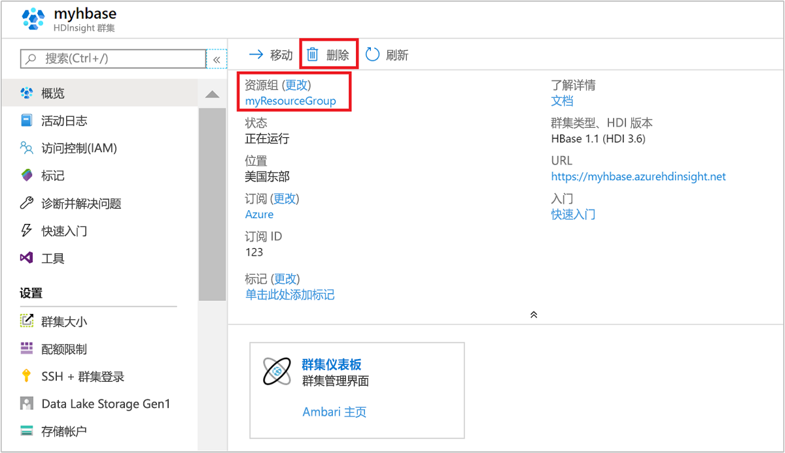

# 快速入门：使用 ARM 模板在 Azure HDInsight 中创建 Apache HBase 群集

本快速入门将使用 Azure 资源管理器模板（ARM 模板）在 Azure HDInsight 中创建 [Apache HBase](./apache-hbase-overview.md) 群集。 HBase 是一种开源 NoSQL 数据库，它构建于 Apache Hadoop 基础之上，并基于 [Google BigTable](https://cloud.google.com/bigtable/) 模型化。

[!INCLUDE [About Azure Resource Manager](../../../includes/resource-manager-quickstart-introduction.md)]

如果你的环境满足先决条件，并且你熟悉如何使用 ARM 模板，请选择“部署到 Azure”按钮。 Azure 门户中会打开模板。

## 先决条件

如果没有 Azure 订阅，请在开始之前创建一个[免费帐户](https://azure.microsoft.com/free/?WT.mc_id=A261C142F)。

## 查看模板

本快速入门中使用的模板来自 [Azure 快速启动模板](https://azure.microsoft.com/resources/templates/101-hdinsight-hbase-linux/)。

:::code language="json" source="~/quickstart-templates/101-hdinsight-hbase-linux/azuredeploy.json":::

该模板中定义了两个 Azure 资源：

* [Microsoft.Storage/storageAccounts](/azure/templates/microsoft.storage/storageaccounts)：创建 Azure 存储帐户。
* [Microsoft.HDInsight/cluster](/azure/templates/microsoft.hdinsight/clusters)：创建 HDInsight 群集。

## 部署模板

1. 选择下面的“部署到 Azure”按钮登录到 Azure，并打开 ARM 模板。

    

1. 输入或选择下列值：

    |属性 |说明 |
    |---|---|
    |订阅|从下拉列表中选择用于此群集的 Azure 订阅。|
    |资源组|从下拉列表中选择现有资源组，或选择“新建”。|
    |位置|将使用用于资源组的位置自动填充此值。|
    |群集名称|输入任何全局唯一的名称。 对于此模板，请只使用小写字母和数字。|
    |群集登录用户名|提供用户名，默认值为 **admin**。|
    |群集登录密码|提供密码。 密码长度不得少于 10 个字符，且至少必须包含一个数字、一个大写字母和一个小写字母、一个非字母数字字符（' " ` 字符除外）。 |
    |SSH 用户名|提供用户名，默认值为 sshuser|
    |SSH 密码|提供密码。|

    

1. 查看“条款和条件”。 接着选择“我同意上述条款和条件”，然后选择“购买” 。 你会收到一则通知，说明正在进行部署。 创建群集大约需要 20 分钟时间。

## 查看已部署的资源

创建群集后，你会收到“部署成功”通知，通知中附有“转到资源”链接 。 “资源组”页会列出新的 HDInsight 群集以及与该群集关联的默认存储。 每个群集都有一个 [Azure 存储帐户](../hdinsight-hadoop-use-blob-storage.md)或 [Azure Data Lake Storage 帐户](../hdinsight-hadoop-use-data-lake-store.md)依赖项。 该帐户称为默认存储帐户。 HDInsight 群集及其默认存储帐户必须共存于同一个 Azure 区域中。 删除群集不会删除存储帐户。

## 清理资源

完成本快速入门后，可以删除群集。 有了 HDInsight，便可以将数据存储在 Azure 存储中，因此可以在群集不用时安全地删除群集。 此外，还需要为 HDInsight 群集付费，即使不用也是如此。 由于群集费用数倍于存储空间费用，因此在群集不用时删除群集可以节省费用。

从 Azure 门户导航到群集，然后选择“删除”。

还可以选择资源组名称来打开“资源组”页，然后选择“删除资源组”。 通过删除资源组，可以删除 HDInsight 群集和默认存储帐户。

## 后续步骤

在本快速入门中，你已了解了如何使用 ARM 模板在 HDInsight 中创建 Apache HBase 群集。 下一篇文章介绍如何通过 HBase Shell 在 HDInsight 中查询 HBase。

> [!div class="nextstepaction"]
> [使用 HBase Shell 在 Azure HDInsight 中查询 Apache HBase](./query-hbase-with-hbase-shell.md)
