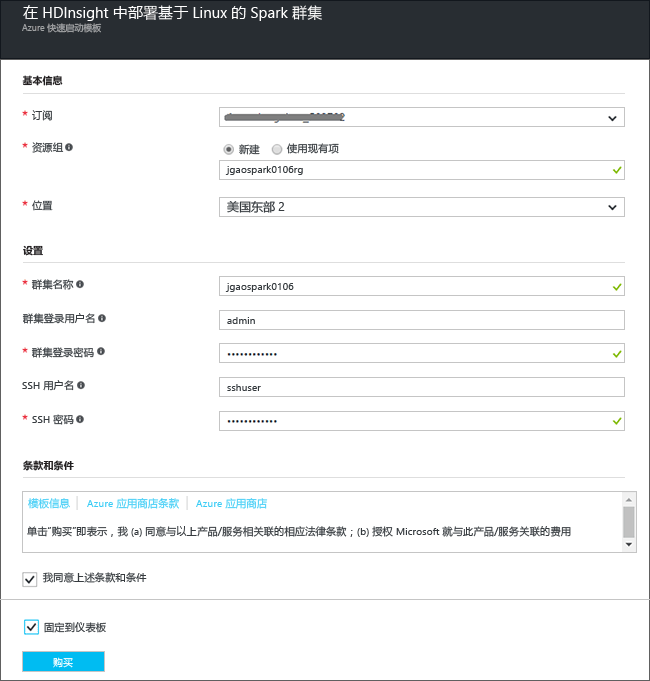
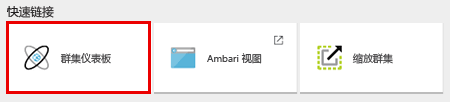

# 入门：在 Azure HDInsight 中创建 Apache Spark 群集并使用 Spark SQL 运行交互式查询

了解如何在 HDInsight 中创建 [Apache Spark](hdinsight-apache-spark-overview.md) 群集，然后使用 [Jupyter](https://jupyter.org) 笔记本在 Spark 群集上运行 Spark SQL 交互式查询。

   

## 先决条件
* **一个 Azure 订阅**。 在开始学习本教程之前，你必须有一个 Azure 订阅。 请参阅[立即创建免费 Azure 帐户](https://azure.microsoft.com/free)。

## 创建 Spark 群集
本部分介绍如何使用 [Azure Resource Manager 模板](https://azure.microsoft.com/resources/templates/101-hdinsight-spark-linux/)在 HDInsight 中创建 Spark 群集。 有关其他群集创建方法，请参阅 [Create HDInsight clusters](hdinsight-hadoop-provision-linux-clusters.md)（创建 HDInsight 群集）。

1. 单击下面的图像即可在 Azure 门户中打开该模板。         

    

2. 输入以下值：

    

    * **订阅**：为此群集选择你的 Azure 订阅。
    * **资源组**：创建资源组，或选择现有的资源组。 资源组用于管理项目的 Azure 资源。
    * **位置**：选择资源组的位置。  此位置还用于默认群集存储和 HDInsight 群集。
    * **ClusterName**：为创建的 Hadoop 群集输入名称。
    * **Spark 版本**：选择要安装在群集上的 Spark 版本。
    * **群集登录名和密码**：默认登录名是 admin。
    * **SSH 用户名和密码**。

   记下这些值。  本教程后面会用到它们。

3. 选择“我同意上述条款和条件”，选择“固定到仪表板”，然后单击“购买”。 此时会出现一个标题为“为模板部署提交部署”的新磁贴。 创建群集大约需要 20 分钟时间。

> [!NOTE]
> 本文创建的 Spark 群集使用 [Azure 存储 Blob 作为群集存储](hdinsight-hadoop-use-blob-storage.md)。 除了使用 Azure 存储 Blob 作为默认存储外，还可以创建使用 [Azure Data Lake Store](../data-lake-store/data-lake-store-overview.md) 作为附加存储的 Spark 群集。 有关说明，请参阅 [Create an HDInsight cluster with Data Lake Store](../data-lake-store/data-lake-store-hdinsight-hadoop-use-portal.md)（创建包含 Data Lake Store 的 HDInsight 群集）。
>
>

## 运行 Spark SQL 查询

在本部分中，你将使用 Jupyter 笔记本针对 Spark 群集运行 Spark SQL 查询。 HDInsight Spark 群集提供了可在 Jupyter Notebook 中使用的三个内核。 其中包括：

* **PySpark** （适用于以 Python 编写的应用程序）
* **PySpark3**（适用于以 Python3 编写的应用程序）
* **Spark** （适用于以 Scala 编写的应用程序）

本文使用 **PySpark** 内核。 有关内核的详细信息，请参阅[将 Jupyter Notebook 内核与 HDInsight 中的 Apache Spark 群集配合使用](hdinsight-apache-spark-jupyter-notebook-kernels.md)。 使用 PySpark 内核的部分主要好处包括：

* 自动设置 Spark 和 Hive 的上下文。
* 可以使用 cell magic（例如 `%%sql`）直接运行 SQL 或 Hive 查询，而不需要任何前置的代码片段。
* SQL 或 Hive 查询的输出将自动可视化。

### 使用 PySpark 内核创建 Jupyter 笔记本

1. 打开 [Azure 门户](https://portal.azure.com/)。

2. 如果已选择将群集固定到仪表板，请单击仪表板中的群集磁贴，启动群集边栏选项卡。

    如果未将群集固定到仪表板，则请单击左窗格中的“HDInsight 群集”，然后单击已创建的群集。

3. 在“快速链接”中，单击“群集仪表板”，然后单击“Jupyter 笔记本”。 出现提示时，请输入群集的管理员凭据。

   

   > [!NOTE]
   > 也可以在浏览器中打开以下 URL 来访问群集的 Jupyter 笔记本。 将 **CLUSTERNAME** 替换为群集的名称：
   >
   > `https://CLUSTERNAME.azurehdinsight.net/jupyter`
   >
   >
3. 创建 Notebook。 单击“新建”，然后单击“PySpark”。

   

   新笔记本随即已创建，并以 Untitled(Untitled.pynb) 名称打开。

4. 在顶部单击笔记本名称，然后根据需要输入友好名称。

    

5. 将以下代码粘贴到空白单元格中，然后按 **SHIFT + ENTER** 执行这些代码。 这些代码会导入此方案所需的类型：

        from pyspark.sql.types import *

    使用笔记本是使用 PySpark 内核创建的，因此不需要显式创建任何上下文。 运行第一个代码单元格时，系统将自动为你创建 Spark 和 Hive 上下文。

    

    每次在 Jupyter 中运行作业时，Web 浏览器窗口标题中都会显示“(繁忙)”状态和 Notebook 标题。 右上角“PySpark”文本的旁边还会出现一个实心圆。 作业完成后，实心圆将变成空心圆。

6. 运行以下代码，将示例数据集注册为临时表 (**hvac**)。

        # Load the data
        hvacText = sc.textFile("wasbs:///HdiSamples/HdiSamples/SensorSampleData/hvac/HVAC.csv")
        
        # Create the schema
        hvacSchema = StructType([StructField("date", StringType(), False),StructField("time", StringType(), False),StructField("targettemp", IntegerType(), False),StructField("actualtemp", IntegerType(), False),StructField("buildingID", StringType(), False)])
        
        # Parse the data in hvacText
        hvac = hvacText.map(lambda s: s.split(",")).filter(lambda s: s[0] != "Date").map(lambda s:(str(s[0]), str(s[1]), int(s[2]), int(s[3]), str(s[6]) ))
        
        # Create a data frame
        hvacdf = sqlContext.createDataFrame(hvac,hvacSchema)
        
        # Register the data fram as a table to run queries against
        hvacdf.registerTempTable("hvac")

    HDInsight 中的 Spark 群集在 **\HdiSamples\HdiSamples\SensorSampleData\hvac** 下面随附了一个示例数据文件 **hvac.csv**。

7. 若要查询数据，请运行以下代码。

        %%sql
        SELECT buildingID, (targettemp - actualtemp) AS temp_diff, date FROM hvac WHERE date = \"6/1/13\"

   由于使用的是 PySpark 内核，因此现在可直接在使用 `%%sql` magic 创建的临时表 **hvac** 上运行 SQL 查询。 有关 `%%sql` magic 以及可在 PySpark 内核中使用的其他 magic 的详细信息，请参阅[包含 Spark HDInsight 群集的 Jupyter Notebook 上可用的内核](hdinsight-apache-spark-jupyter-notebook-kernels.md#choose-between-the-kernels)。

   默认会显示以下表格输出。

     

    你也可以在其他视觉效果中查看结果。 例如，同一输出的分区图看起来如下所示。

    

9. 运行完应用程序后，可以关闭 Notebook 以释放资源。 为此，请在笔记本的“文件”菜单中，单击“关闭并停止”。

## 故障排除

以下是在使用 HDInsight 群集时可能会遇到的一些常见问题。

### 访问控制要求
[!INCLUDE [access-control](../../includes/hdinsight-access-control-requirements.md)]

## 删除群集
[!INCLUDE [delete-cluster-warning](../../includes/hdinsight-delete-cluster-warning.md)]

## 另请参阅
* [概述：Azure HDInsight 上的 Apache Spark](hdinsight-apache-spark-overview.md)

### 方案
* [Spark 和 BI：使用 HDInsight 中的 Spark 和 BI 工具执行交互式数据分析](hdinsight-apache-spark-use-bi-tools.md)
* [Spark 和机器学习：使用 HDInsight 中的 Spark 对使用 HVAC 数据生成温度进行分析](hdinsight-apache-spark-ipython-notebook-machine-learning.md)
* [Spark 和机器学习：使用 HDInsight 中的 Spark 预测食品检查结果](hdinsight-apache-spark-machine-learning-mllib-ipython.md)
* [Spark 流式处理：使用 HDInsight 中的 Spark 生成实时流式处理应用程序](hdinsight-apache-spark-eventhub-streaming.md)
* [使用 HDInsight 中的 Spark 分析网站日志](hdinsight-apache-spark-custom-library-website-log-analysis.md)
* [Application Insight telemetry data analysis using Spark in HDInsight（使用 HDInsight 中的 Spark 执行 Application Insight 遥测数据分析）](hdinsight-spark-analyze-application-insight-logs.md)

### 创建和运行应用程序
* [使用 Scala 创建独立的应用程序](hdinsight-apache-spark-create-standalone-application.md)
* [使用 Livy 在 Spark 群集中远程运行作业](hdinsight-apache-spark-livy-rest-interface.md)

### 工具和扩展
* [使用适用于 IntelliJ IDEA 的 HDInsight 工具插件创建和提交 Spark Scala 应用程序](hdinsight-apache-spark-intellij-tool-plugin.md)
* [Use HDInsight Tools Plugin for IntelliJ IDEA to debug Spark applications remotely（使用 IntelliJ IDEA 的 HDInsight 工具插件远程调试 Spark 应用程序）](hdinsight-apache-spark-intellij-tool-plugin-debug-jobs-remotely.md)
* [在 HDInsight 上的 Spark 群集中使用 Zeppelin 笔记本](hdinsight-apache-spark-use-zeppelin-notebook.md)
* [在 HDInsight 的 Spark 群集中可用于 Jupyter 笔记本的内核](hdinsight-apache-spark-jupyter-notebook-kernels.md)
* [Use external packages with Jupyter notebooks（将外部包与 Jupyter 笔记本配合使用）](hdinsight-apache-spark-jupyter-notebook-use-external-packages.md)
* [Install Jupyter on your computer and connect to an HDInsight Spark cluster（在计算机上安装 Jupyter 并连接到 HDInsight Spark 群集）](hdinsight-apache-spark-jupyter-notebook-install-locally.md)

### 管理资源
* [管理 Azure HDInsight 中 Apache Spark 群集的资源](hdinsight-apache-spark-resource-manager.md)
* [Track and debug jobs running on an Apache Spark cluster in HDInsight（跟踪和调试 HDInsight 中的 Apache Spark 群集上运行的作业）](hdinsight-apache-spark-job-debugging.md)

[hdinsight-versions]: hdinsight-component-versioning.md
[hdinsight-upload-data]: hdinsight-upload-data.md
[hdinsight-storage]: hdinsight-hadoop-use-blob-storage.md

[azure-purchase-options]: http://azure.microsoft.com/pricing/purchase-options/
[azure-member-offers]: http://azure.microsoft.com/pricing/member-offers/
[azure-free-trial]: http://azure.microsoft.com/pricing/free-trial/
[azure-management-portal]: https://manage.windowsazure.com/
[azure-create-storageaccount]: storage-create-storage-account.md

