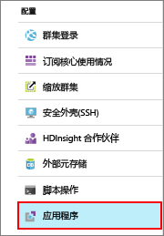
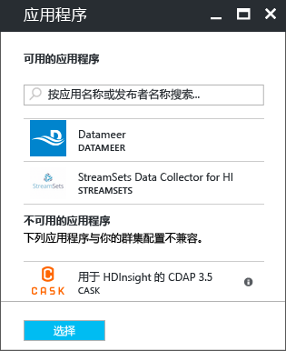

# 在 Azure HDInsight 上安装第三方 Hadoop 应用程序

了解如何在 Azure HDInsight 上安装第三方 Hadoop 应用程序。 有关如何安装自己的应用程序的说明，请参阅[安装自定义 HDInsight 应用程序](hdinsight-apps-install-custom-applications.md)。

HDInsight 应用程序是用户可以在 HDInsight 群集上安装的应用程序。 这些应用程序可能是 Microsoft、独立软件供应商 (ISV) 或自己开发的。  

以下列表显示已发布的应用程序：

* **AtScale 智能平台**可将 HDInsight 群集变为横向扩展 OLAP 服务器。 使用此应用程序可通过 BI 工具（包括 Microsoft Excel、PowerBI、Tableau Software 和 QlikView）以交互方式查询几十亿行数据。
* **Cask CDAP for HDInsight** 为大数据提供首个统一的集成平台，可将数据应用程序和 Data Lake 的生产时间缩短 80%。 此应用程序仅支持标准 HBase 3.4 群集。
* **DATAIKU DDS on HDInsight**，利用此应用程序，数据专家可以对针对性很强的服务进行原型、生成和部署方面的操作，将原始数据转换成有影响力的业务预测。
* **Datameer**： [Datameer](http://www.datameer.com/documentation/display/DAS50/Home?ls=Partners&lsd=Microsoft&c=Partners&cd=Microsoft) 提供一种交互方式，让分析师发现、分析和可视化大数据的结果。 轻松拉进其他数据源，以发现新的关系并迅速获取所需的答案。
* **H2O Artificial Intelligence for HDInsight (Beta)** H2O Sparkling Water 支持以下分布式算法：GLM、Naïve Bayes、分布式随机森林、梯度提升机、深层神经网络、深度学习、K 平均值、PCA、通用化低级别模型、异常检测和自动编码器。
* **Kyligence Analytics Platform** Kyligence Analytics Platform (KAP) 是以 Apache Kylin 和 Apache Hadoop 为后盾的，随时可供企业使用的数据仓库；它在处理大规模数据集时可实现次秒级的查询延迟，简化了企业用户和分析师的数据分析。 
* **Paxata 自助服务数据准备**
* **SnapLogic Hadooplex** 在 HDInsight 上运行的 SnapLogic Hadooplex 可让客户自行将几乎任何来源中的数据引入并制备到 Microsoft Azure 云平台，从而更快地获取业务见解。
* **Spark Job Server for KNIME Spark Executor** Spark Job Server for KNIME Spark Executor 用于将 KNIME Analytics Platform 连接到 HDInsight 群集。
* **Streamsets Data Collector for HDnsight** 提供一个全功能的集成开发环境 (IDE)，可在其中设计、测试、部署和管理汇合流和批处理数据的全面互通引入管道，并提供各种流中转换 - 所有这一切都无需编写自定义代码。 
* **WANdisco Fusion HDI App** 可随数据更改（无论数据位于何处）提供到数据的连续一致连接。 它支持用户随时随地访问数据，不会出现任何停机或中断情况。

本文提供的说明将使用 Azure 门户。 也可以从门户导出 Azure 资源管理器模板或从供应商处获取 Resource Manage 模板的副本，并使用 Azure PowerShell 和 Azure CLI 部署模板。  请参阅[使用资源管理器模板在 HDInsight 中创建 Hadoop 群集](hdinsight-hadoop-create-linux-clusters-arm-templates.md)。

## 先决条件
如果想要在现有的 HDInsight 群集上安装 HDInsight 应用程序，必须有一个 HDInsight 群集。 若要创建群集，请参阅 [创建群集](hadoop/apache-hadoop-linux-tutorial-get-started.md#create-cluster)。 也可以在创建 HDInsight 群集时安装 HDInsight 应用程序。

## 将应用程序安装到现有群集
下面的过程演示如何将 HDInsight 应用程序安装到现有的 HDInsight 群集。

**安装 HDInsight 应用程序**

1. 登录到 [Azure 门户](https://portal.azure.com)。
2. 在左侧菜单中单击“HDInsight 群集”  。
3. 单击某个 HDInsight 群集。  如果没有群集，必须先创建一个。  请参阅 [创建群集](hadoop/apache-hadoop-linux-tutorial-get-started.md#create-cluster)。
4. 单击“配置”类别下的“应用程序”。 可以看到已安装的应用程序列表。 如果找不到“应用程序”，则意味着此版本的 HDInsight 群集没有任何应用程序。
   
    
5. 单击菜单中的“添加”。 
   
    
   
    可以看到现有 HDInsight 应用程序的列表。
   
    
6. 单击其中一个应用程序、接受法律条款，并单击“选择” 。

可以通过门户通知查看安装状态（单击门户顶部的铃铛图标）。 安装应用程序后，应用程序会出现在“已安装的应用”列表中。

## 在群集创建期间安装应用程序
可以选择在创建群集时安装 HDInsight 应用程序。 在此过程中，HDInsight 应用程序会在群集创建并处于运行状态后安装。 若要在群集创建过程中使用 Azure 门户安装应用程序，请使用“自定义”选项而不是默认的“快速创建”选项。

## 列出已安装的 HDInsight 应用和属性
门户会显示群集的已安装 HDInsight 应用程序列表，以及每个已安装应用程序的属性。

**列出 HDInsight 应用程序并显示属性**

1. 登录到 [Azure 门户](https://portal.azure.com)。
2. 在左侧菜单中单击“HDInsight 群集”  。 
3. 单击某个 HDInsight 群集。
4. 在“设置”中，单击“常规”类别下的“应用程序”。 “已安装的应用”在右侧列出。 
   
    
5. 单击其中一个已安装的应用程序，以显示属性。 属性列表：
   
   * 应用名称：应用程序名称。
   * 状态：应用程序状态。 
   * 网页：已部署到边缘节点的 Web 应用程序的 URL。 此凭据与针对群集配置的 HTTP 用户凭据相同。
   * HTTP 终结点：此凭据与针对群集配置的 HTTP 用户凭据相同。 
   * SSH 终结点：可以使用 SSH 连接到边缘节点。 SSH 凭据与针对群集配置的 SSH 用户凭据相同。 有关信息，请参阅[将 SSH 与 HDInsight 配合使用](hdinsight-hadoop-linux-use-ssh-unix.md)。
6. 若要删除应用程序，请右键单击应用程序，并单击上下文菜单中的“删除”。

## 连接到边缘节点
可以使用 HTTP 和 SSH 连接到边缘节点。 可在 [门户](#list-installed-hdinsight-apps-and-properties)中找到终结点信息。 有关信息，请参阅[将 SSH 与 HDInsight 配合使用](hdinsight-hadoop-linux-use-ssh-unix.md)。

HTTP 终结点凭据是针对 HDInsight 群集配置的 HTTP 用户凭据；SSH 终结点凭据是针对 HDInsight 群集配置的 SSH 凭据。

## 故障排除
请参阅 [故障排除安装问题](hdinsight-apps-install-custom-applications.md#troubleshoot-the-installation)。

## 后续步骤
* [安装自定义 HDInsight 应用程序](hdinsight-apps-install-custom-applications.md)：了解如何将未发布的 HDInsight 应用程序部署到 HDInsight。
* [发布 HDInsight 应用程序](hdinsight-apps-publish-applications.md)：了解如何将自定义 HDInsight 应用程序发布到 Azure 应用商店。
* [MSDN：安装 HDInsight 应用程序](https://msdn.microsoft.com/library/mt706515.aspx)：了解如何定义 HDInsight 应用程序。
* [使用脚本操作自定义基于 Linux 的 HDInsight 群集](hdinsight-hadoop-customize-cluster-linux.md)：了解如何使用脚本操作安装其他应用程序。
* [使用 Resource Manager 模板在 HDInsight 中创建基于 Linux 的 Hadoop 群集](hdinsight-hadoop-create-linux-clusters-arm-templates.md)：了解如何调用 Resource Manager 模板创建 HDInsight 群集。
* [在 HDInsight 中使用空边缘节点](hdinsight-apps-use-edge-node.md)：了解如何使用空边缘节点访问 HDInsight 群集、测试 HDInsight 应用程序以及托管 HDInsight 应用程序。

