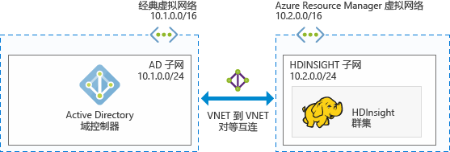
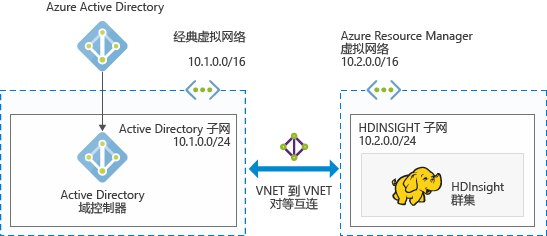

# 在 HDInsight 中计划 Azure 已加入域的 Hadoop 群集

传统 Hadoop 是单用户群集， 适用于大多数使用小型应用程序团队来构建大数据工作负荷的公司。 随着 Hadoop 越来越普及，许多企业开始转向这样一种模型：群集由 IT 团队管理，并由多个应用程序团队共享。 因此，涉及到多用户群集的功能是 HDInsight 中最常请求的功能之一。

HDInsight 不构建自己的多用户身份验证和授权，而是依赖于最常用的标识提供者 – Azure Active Directory (Azure AD)。 可以使用 Azure AD 中强大的安全功能来管理 HDInsight 中的多用户授权。 将 HDInsight 与 Azure AD 集成后，可以使用其 Azure AD 凭据来与群集通信。 HDInsight 会将 Azure AD 用户映射到本地 Hadoop 用户，因此在 HDInsight 上运行的所有服务（Ambari、Hive 服务器、Ranger、Spark Thrift 服务器等）都可以为经身份验证的用户无缝运行。

## 将 HDInsight 与 Azure AD 集成

将 HDInsight 与 Azure AD 集成后，HDInsight 群集节点即可加入 Azure AD 域。 HDInsight 为在群集上运行的 Hadoop 服务创建服务主体，并将其置于 Azure AD 中的指定组织单位 (OU) 内。 HDInsight 还会针对已加入域的节点的 IP 地址，在 Azure AD 域中创建反向 DNS 映射。

可以使用多个体系结构来实现这种设置。 可从以下体系结构中选择。

**将 HDInsight 与 Azure IaaS 上运行的 Azure AD 集成**

这是将 HDInsight 与 Azure AD 集成的最简单体系结构。 Azure AD 域控制器在 Azure 中的一个（或多个）虚拟机 (VM) 上运行。 这些 VM 通常位于虚拟网络中。 可为 HDInsight 群集设置另一个虚拟网络。 要使 HDInsight 能够与 Azure AD 通信，需通过 [VNet 到 VNet 对等互连](../virtual-network/virtual-networks-create-vnetpeering-arm-portal.md)让这些虚拟网络能够实现对等互连。

> [!NOTE]
> 在此体系结构中，不能将 Azure Data Lake Store 与 HDInsight 群集配合使用。

Azure AD 先决条件：

* 必须创建一个[组织单位](../active-directory-domain-services/active-directory-ds-admin-guide-create-ou.md)用于放置 HDInsight 群集 VM 以及群集使用的服务主体。
* 必须设置[轻型目录访问协议](../active-directory-domain-services/active-directory-ds-admin-guide-configure-secure-ldap.md) (LDAP) 来与 Azure AD 通信。 用于设置 LDAPS 的证书必须是实际证书（不是自签名证书）。
* 必须针对 HDInsight 子网的 IP 地址范围（例如上图中的 10.2.0.0/24）在域中创建反向 DNS 区域。
* 需要一个服务帐户或用户帐户， 到时要使用该帐户创建 HDInsight 群集。 此帐户必须具有以下权限：

    - 在组织单位中创建服务主体对象和计算机对象的权限
    - 创建反向 DNS 代理规则的权限
    - 将计算机加入 Active Directory 域的权限

**将 HDInsight 与仅限云的 Azure AD 集成**

对于仅限云的 Azure AD，请配置一个域控制器，使 HDInsight 能够与 Azure AD 集成。 可以使用 [Azure Active Directory 域服务](../active-directory-domain-services/active-directory-ds-overview.md) (Azure AD DS) 实现此目的。 Azure AD DS 在云中创建域控制器计算机并提供其 IP 地址。 它会创建两个域控制器，以确保高可用性。

目前，Azure AD DS 只在经典虚拟网络中存在。 只能使用 Azure 经典门户来访问它。 HDInsight 虚拟网络在 Azure 门户中存在，需通过 VNet 到 VNet 对等互连来与经典虚拟网络实现建立对等互连。

> [!NOTE]
> 经典虚拟网络与 Azure Resource Manager 虚拟网络之间的对等互连需要两个虚拟网络位于同一区域且属于同一 Azure 订阅。

Azure AD 先决条件：

* 必须创建一个[组织单位](../active-directory-domain-services/active-directory-ds-admin-guide-create-ou.md)用于放置 HDInsight 群集 VM 以及群集使用的服务主体。
* 配置 Azure AD DS 时，必须设置 [LDAPS](../active-directory-domain-services/active-directory-ds-admin-guide-configure-secure-ldap.md)。 用于设置 LDAPS 的证书必须是实际证书（不是自签名证书）。
* 必须针对 HDInsight 子网的 IP 地址范围（例如上图中的 10.2.0.0/24）在域中创建反向 DNS 区域。
* [密码哈希](../active-directory-domain-services/active-directory-ds-getting-started-password-sync.md)必须从 Azure AD 同步到 Azure AD DS 。
* 需要一个服务帐户或用户帐户， 到时要使用该帐户创建 HDInsight 群集。 此帐户必须具有以下权限：

    - 在组织单位中创建服务主体对象和计算机对象的权限
    - 创建反向 DNS 代理规则的权限
    - 将计算机加入 Azure AD 域的权限。

## 后续步骤
* 若要配置已加入域的 HDInsight 群集，请参阅 [Configure domain-joined HDInsight clusters](hdinsight-domain-joined-configure.md)（配置已加入域的 HDInsight 群集）。
* 若要管理已加入域的 HDInsight 群集，请参阅 [Manage domain-joined HDInsight clusters](hdinsight-domain-joined-manage.md)（管理已加入域的 HDInsight 群集）。
* 若要配置 Hive 策略和运行 Hive 查询，请参阅 [Configure Hive policies for domain-joined HDInsight clusters](hdinsight-domain-joined-run-hive.md)（为已加入域的 HDInsight 群集配置 Hive 策略）。
* 若要在已加入域的 HDInsight 群集上使用 SSH 运行 Hive 查询，请参阅[将 SSH 与 HDInsight 配合使用](hdinsight-hadoop-linux-use-ssh-unix.md)。

