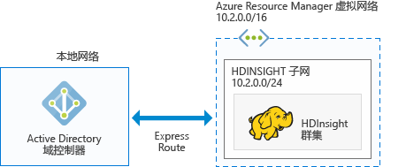

# 在 HDInsight 中计划 Azure 已加入域的 Hadoop 群集

传统 Hadoop 是单用户群集， 适用于大多数使用小型应用程序团队来构建大数据工作负荷的公司。 随着 Hadoop 越来越受欢迎，许多企业开始转向这样一种模型：群集由 IT 团队管理，并由多个应用程序团队共享。 因此，多用户群集是 HDInsight 中最常请求的功能之一。

HDInsight 不构建自己的多用户身份验证和授权，而是依赖于最常用的标识提供者 – Active Directory (AD)。 可以使用 Active Directory 中强大的安全组功能管理 HDInsight 中的多用户授权。 将 HDInsight 与 Active Directory 集成以后，Active Directory 用户即可使用其 Active Directory 凭据与群集通信。 HDInsight 会将 Active Directory 用户映射到本地 Hadoop 用户，使得在 HDInsight 上运行的所有服务（Ambari、Hive 服务器、Ranger、Spark Thrift 服务器等）都可以为经身份验证的用户无缝运行。

## 将 HDInsight 与 Active Directory 集成

将 HDInsight 与 Active Directory 集成以后，HDInsight 群集节点即可通过域加入 Active Directory 域。 HDInsight 为在群集上运行的 Hadoop 服务创建服务主体，并将其置于 Active Directory 中的指定组织单位 (OU) 内。 HDInsight 还会针对已加入域的节点的 IP 地址，在 Active Directory 域中创建反向 DNS 映射。

若要实现该设置，可以遵循多种体系结构。 你需要确定哪种体系结构更适合自己。

**1.HDInsight 与 Azure IAAS 上运行的 AD 集成**

这是将 HDInsight 与 Active Directory 集成的最简单体系结构。 Active Directory 域控制器在 Azure 中的一个（或多个）虚拟机 (VM) 上运行。 这些 VM 通常位于一个虚拟网络中。 可以为 HDInsight 群集设置另一个虚拟网络。 若要让 HDInsight 能否发现 Active Directory，需通过 [VNet 到 VNet 对等互连](../virtual-network/virtual-networks-create-vnetpeering-arm-portal.md)让这些虚拟网络能够实现对等互连。

> [!NOTE]
> 在此体系结构中，不能将 Azure Data Lake Store 与 HDInsight 群集配合使用。
 

Active Directory 的先决条件：

* 必须创建[组织单位](../active-directory-domain-services/active-directory-ds-admin-guide-create-ou.md)，该组织单位中需放置 HDInsight 群集 VM 和群集所用的服务主体。
* 必须设置 [LDAPS](../active-directory-domain-services/active-directory-ds-admin-guide-configure-secure-ldap.md)，以便与 Active Directory 通信。 用于设置 LDAPS 的证书必须是实际证书（不是自签名证书）。
* 必须针对 HDInsight 子网的 IP 地址范围（例如上图中的 10.2.0.0/24）在域中创建反向 DNS 区域。
* 需要服务帐户或用户帐户，用于创建 HDInsight 群集。 此帐户必须具有以下权限：

    - 在组织单位中创建服务主体对象和计算机对象的权限。
    - 创建反向 DNS 代理规则的权限
    - 将计算机加入 Active Directory 域的权限。

**2.HDInsight 与仅限云的 Azure AD 集成**

对于仅限云的 Azure Active Directory (Azure AD)，需配置一个域控制器，以便 HDInsight 能够与 Azure Active Directory 集成。 此过程是使用 [Azure Active Directory 域服务](../active-directory-domain-services/active-directory-ds-overview.md) (Azure AD DS) 实现的。 Azure AD DS 在云上创建域控制器计算机，并为用户提供这些计算机的 IP 地址。 它会创建两个域控制器，以确保高可用性。

目前，Azure AD DS 只在经典 VNet 中存在。 只能使用经典 Azure 门户对其进行访问。 HDInsight VNet 存在于 Azure 门户中，需通过 VNet 到 VNet 对等互连与经典 VNet 实现对等互连。

> [!NOTE]
> 在经典 VNet 与 Azure Resource Manager VNet 之间进行对等互连需要两个 VNet 位于同一区域且属于同一 Azure 订阅。

Active Directory 的先决条件：

* 必须创建[组织单位](../active-directory-domain-services/active-directory-ds-admin-guide-create-ou.md)，该组织单位中需放置 HDInsight 群集 VM 和群集所用的服务主体。 
* 配置 AD DS 时，必须设置 [LDAPS](../active-directory-domain-services/active-directory-ds-admin-guide-configure-secure-ldap.md)。 用于设置 LDAPS 的证书必须是实际证书（不是自签名证书）。
* 必须针对 HDI 子网的 IP 地址范围（例如上图中的 10.2.0.0/24）在域中创建反向 DNS 区域。 
* [密码哈希](../active-directory-domain-services/active-directory-ds-getting-started-password-sync.md)必须从 Azure AD 同步到 AD DS 。
* 需要服务帐户或用户帐户，用于创建 HDInsight 群集。 此帐户必须具有以下权限：

    - 在组织单位中创建服务主体对象和计算机对象的权限。
    - 创建反向 DNS 代理规则的权限
    - 将计算机加入 Active Directory 域的权限。

**3.通过 VPN 将 HDInsight 与本地 AD 集成**

此体系结构类似于体系结构 1。 唯一区别是，Active Directory 在本地，HDInsight 到 Active Directory 的通信通过[从 Azure 到本地网络的 VPN 连接](../expressroute/expressroute-introduction.md)。

> [!NOTE]
> 在此体系结构中，不能将 Azure Data Lake Store 与 HDInsight 群集配合使用。

Active Directory 的先决条件：

* 必须创建[组织单位](../active-directory-domain-services/active-directory-ds-admin-guide-create-ou.md)，该组织单位中需放置 HDInsight 群集 VM 和群集所用的服务主体。
* 必须设置 [LDAPS](../active-directory-domain-services/active-directory-ds-admin-guide-configure-secure-ldap.md)，以便与 Active Directory 通信。 用于设置 LDAPS 的证书必须是实际证书（不是自签名证书）。
* 必须针对 HDI 子网的 IP 地址范围（例如上图中的 10.2.0.0/24）在域中创建反向 DNS 区域。
* 需要服务帐户或用户帐户，用于创建 HDInsight 群集。 此帐户必须具有以下权限：

    - 在组织单位中创建服务主体对象和计算机对象的权限。
    - 创建反向 DNS 代理规则的权限
    - 将计算机加入 Active Directory 域的权限。

**4.将 HDInsight 与同步到 Azure AD 的本地 AD 集成**

此体系结构类似于体系结构 2。 唯一区别是，本地 Active Directory 同步到 Azure Active Directory。 需在云中配置一个域控制器，以便 HDInsight 能够与 Azure Active Directory 集成。 此过程是使用 [Azure Active Directory 域服务](../active-directory-domain-services/active-directory-ds-overview.md) (AD DS) 实现的。 AD DS 在云上创建域控制器计算机，并为用户提供这些计算机的 IP 地址。 它会创建两个域控制器，以确保高可用性。

目前，Azure AD DS 只在经典 VNet 中存在。 只能使用经典 Azure 门户对其进行访问。 HDInsight VNet 存在于 Azure 门户中，需通过 VNet 到 VNet 对等互连与经典 VNet 实现对等互连。

> [!NOTE]
> 在经典 VNet 与 Azure Resource Manager VNet 之间进行对等互连需要两个 VNet 位于同一区域且属于同一 Azure 订阅。

Active Directory 的先决条件：

* 必须创建[组织单位](../active-directory-domain-services/active-directory-ds-admin-guide-create-ou.md)，该组织单位中需放置 HDInsight 群集 VM 和群集所用的服务主体。 
* 配置 AD DS 时，必须设置 [LDAPS](../active-directory-domain-services/active-directory-ds-admin-guide-configure-secure-ldap.md)。 用于设置 LDAPS 的证书必须是实际证书（不是自签名证书）。
* 必须针对 HDI 子网的 IP 地址范围（例如上图中的 10.2.0.0/24）在域中创建反向 DNS 区域。 
* [密码哈希](../active-directory-domain-services/active-directory-ds-getting-started-password-sync.md)必须从 Azure AD 同步到 AD DS 。
* 需要服务帐户或用户帐户，用于创建 HDInsight 群集。 此帐户必须具有以下权限：

    - 在组织单位中创建服务主体对象和计算机对象的权限。
    - 创建反向 DNS 代理规则的权限
    - 将计算机加入 Active Directory 域的权限。

**5.将 HDInsight 与非默认的 Azure AD 集成（建议仅用于测试和开发）**

此体系结构类似于体系结构 2。 对于大多数公司来说，针对 Active Directory 的管理员访问权限仅限特定的个人。 因此，如果需要进行概念证明，或者只是想要尝试创建加入域的群集，则可在订阅中创建新的 Azure Active Directory，不必等待管理员在 Active Directory 上配置先决条件。 由于这是你创建的 Azure AD，因此你拥有针对此 Azure AD 的完全权限，可以配置 AD DS。

AD DS 在云上创建域控制器计算机，并为用户提供这些计算机的 IP 地址。 它会创建两个域控制器，以确保高可用性。

AD DS 目前仅存在于经典 VNet 中，因此需拥有经典门户的访问权限，并且需创建用于配置 AD DS 的经典 VNet。 HDInsight VNet 存在于 Azure 门户中，需通过 VNet 到 VNet 对等互连与经典 VNet 实现对等互连。

> [!NOTE]
> 在经典 VNet 与 Azure Resource Manager VNet 之间进行对等互连需要两个 VNet 位于同一区域且属于同一 Azure 订阅。

Active Directory 的先决条件：

* 必须创建[组织单位](../active-directory-domain-services/active-directory-ds-admin-guide-create-ou.md)，该组织单位中需放置 HDInsight 群集 VM 和群集所用的服务主体。 
* 配置 AD DS 时，必须设置 [LDAPS](../active-directory-domain-services/active-directory-ds-admin-guide-configure-secure-ldap.md)。 可以创建[自签名证书](../active-directory-domain-services/active-directory-ds-admin-guide-configure-secure-ldap.md)来配置 LDAPS。 但是，若要使用自签名证书，需要从 <a href="mailto:hdipreview@microsoft.com">hdipreview@microsoft.com</a> 请求一个异常。
* 必须针对 HDI 子网的 IP 地址范围（例如上图中的 10.2.0.0/24）在域中创建反向 DNS 区域。 
* [密码哈希](../active-directory-domain-services/active-directory-ds-getting-started-password-sync.md)必须从 Azure AD 同步到 AD DS 。
* 需要服务帐户或用户帐户，用于创建 HDInsight 群集。 此帐户必须具有以下权限：

    - 在组织单位中创建服务主体对象和计算机对象的权限。
    - 创建反向 DNS 代理规则的权限
    - 将计算机加入 Active Directory 域的权限。

## 后续步骤
* 若要配置已加入域的 HDInsight 群集，请参阅 [Configure Domain-joined HDInsight clusters](hdinsight-domain-joined-configure.md)（配置已加入域的 HDInsight 群集）。
* 若要管理已加入域的 HDInsight 群集，请参阅[管理已加入域的 HDInsight 群集](hdinsight-domain-joined-manage.md)。
* 若要配置 Hive 策略和运行 Hive 查询，请参阅 [Configure Hive policies for Domain-joined HDInsight clusters](hdinsight-domain-joined-run-hive.md)（为已加入域的 HDInsight 群集配置 Hive 策略）。
* 若要在已加入域的 HDInsight 群集上使用 SSH 运行 Hive 查询，请参阅 [Use SSH with Linux-based Hadoop on HDInsight from Linux, Unix, or OS X](hdinsight-hadoop-linux-use-ssh-unix.md)（在 Linux、Unix 或 OS X 中的 HDInsight 上将 SSH 与基于 Linux 的 Hadoop 配合使用）。

<!--HONumber=Feb17_HO1-->

