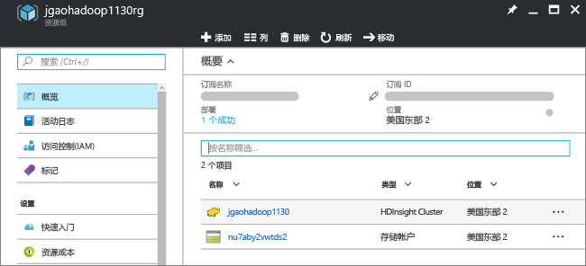
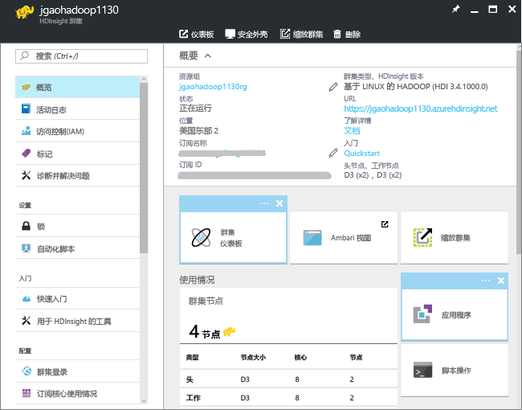

# Hadoop 教程：在 HDInsight 中使用基于 Linux 的 Hadoop 入门
> [!div class="op_single_selector"]
> * [基于 Linux](hdinsight-hadoop-linux-tutorial-get-started.md)
> * [基于 Windows](hdinsight-hadoop-tutorial-get-started-windows.md)
> 
> 

了解如何在 HDInsight 中创建基于 Linux 的 [Hadoop](http://hadoop.apache.org/) 群集，以及如何在 HDInsight 中运行 Hive 作业。 [Apache Hive](https://hive.apache.org/) 是 Hadoop 生态系统中最热门的组件。 目前，HDInsight 随附六种不同类型的群集：[Hadoop](hdinsight-hadoop-introduction.md)、[Spark](hdinsight-apache-spark-overview.md)、[HBase](hdinsight-hbase-overview.md)、[Storm](hdinsight-storm-overview.md)、[交互式 Hive（预览版）](hdinsight-hadoop-use-interactive-hive.md)和 [R Server](hdinsight-hadoop-r-server-overview.md)。  每个群集类型都支持一组不同的组件。 所有六种群集类型都支持 Hive。 有关 HDInsight 中受支持组件的列表，请参阅 [HDInsight 提供的 Hadoop 群集版本中有哪些新功能？](hdinsight-component-versioning.md)  

[!INCLUDE [delete-cluster-warning](../../includes/hdinsight-delete-cluster-warning.md)]

## 先决条件
开始学习本教程之前，必须做好以下准备：

* **Azure 订阅**：若要创建一个月的免费试用帐户，请访问 [azure.microsoft.com/free](https://azure.microsoft.com/free)。

### 访问控制要求
[!INCLUDE [access-control](../../includes/hdinsight-access-control-requirements.md)]

## 创建群集

大多数 Hadoop 作业都是批处理作业。 创建群集，运行一些作业，然后删除群集。 本部分使用 [Azure Resource Manager 模板](../resource-group-template-deploy.md)在 HDInsight 中创建基于 Linux 的 Hadoop 群集。 Resource Manager 模板完全可自定义，使用它可以轻松创建 HDInsight 等 Azure 资源。 学习本教程不需要有 Resource Manager 模板方面的经验。 如需其他群集创建方法或要了解本教程中使用的属性，请参阅 [Create HDInsight clusters](hdinsight-hadoop-provision-linux-clusters.md)（创建 HDInsight 群集）。 使用页面顶部的选择器选择群集创建选项。

本教程使用的 Resource Manager 模板位于公共 Blob 容器 [https://hditutorialdata.blob.core.windows.net/armtemplates/create-linux-based-hadoop-cluster-in-hdinsight.json](https://hditutorialdata.blob.core.windows.net/armtemplates/create-linux-based-hadoop-cluster-in-hdinsight.json)中。 

1. 单击以下映像以登录到 Azure，然后在 Azure 门户中打开 Resource Manager 模板。 
   
    
2. 输入或选择下列值：
   
    。
   
    * **订阅**：选择你的 Azure 订阅。
    * **资源组**：创建新资源组或选择现有资源组。  资源组是 Azure 组件的容器。  在本例中，资源组包含 HDInsight 群集和依赖的 Azure 存储帐户。 
    * **位置**：选择要在其中创建群集的 Azure 位置。  选择的位置与你越靠近，性能就越好。 
    * **ClusterName**：为将创建的 Hadoop 群集输入名称。
    * **群集登录名和密码**：默认登录名是 **admin**。
    * **SSH 用户名和密码**：默认用户名是 **sshuser**。  可以重命名它。 
     
    某些属性已在模板中硬编码。  可以通过模板配置这些值。

    * **位置**：群集和依赖的存储帐户所用的位置与资源组使用。
    * **群集版本**：3.4
    * **OS 类型**：Linux
    * **群集类型**：Hadoop
    * **辅助角色节点数**：2

     每个群集都有一个 Azure Blob 存储帐户依赖项。 该帐户通常称为默认存储帐户。 HDInsight 群集与其默认存储帐户必须一起放置在同一个 Azure 区域中。 删除群集不会删除存储帐户。 在模板中，默认存储帐户名已定义为附加了“store”的群集名称。 

3. 依次选择“我同意上述条款和条件”、“固定到仪表板”，然后单击“购买”。 门户仪表板上应会出现标题为“正在部署模板”的新磁贴。 创建群集大约需要 20 分钟时间。 创建群集后，磁贴的标题被更改为指定的资源组名称。 门户将在新边栏选项卡中自动打开该资源组。 可以看到已同时列出群集和默认存储。
   
    。

4. 单击群集名称，在新边栏选项卡中打开该群集。

   

## 运行 Hive 查询
[Apache Hive](hdinsight-use-hive.md) 是 HDInsight 中最流行的组件。 可通过多种方法在 HDInsight 中运行 Hive 作业。 本教程使用门户中的 Ambari Hive 视图运行一些 Hive 作业。 有关提交 Hive 作业的其他方法，请参阅 [Use Hive in HDInsight](hdinsight-use-hive.md)（在 HDInsight 中使用 Hive）。

1. 根据上面的屏幕截图所示单击“群集仪表板”，然后单击“HDInsight 群集仪表板”。  也可以浏览到 **https://&lt;ClusterName>.azurehdinsight.net** 打开 Ambari，其中 &lt;ClusterName> 是在上一部分中创建的群集。
2. 输入在上一部分中指定的 Hadoop 用户名和密码。 默认的用户名为 **admin**。
3. 打开“Hive 视图”，如以下屏幕截图中所示： 
   
    。
4. 在页面的“查询编辑器”部分中，将以下 HiveQL 语句粘贴到工作表中： 
   
        SHOW TABLES;
   
   > [!NOTE]
   > Hive 要求使用分号。       
   > 
   > 
5. 单击“执行” 。 “查询过程结果”部分应会出现在查询编辑器下方，其中显示了有关作业的信息。 
   
    完成查询后，“查询过程结果”部分将显示操作结果。 **hivesampletable**的表。 所有 HDInsight 群集都随附了此示例 Hive 表。
   
    。
6. 重复步骤 4 和 5，运行以下查询：
   
        SELECT * FROM hivesampletable;
   
   > [!TIP]
   > 请注意“查询过程结果”部分右上角的“保存结果”下拉列表；可以使用此下拉列表下载结果，或者将结果以 CSV 文件形式保存到 HDInsight 存储。
   > 
   > 
7. 单击“历史记录”获取作业列表。

完成 Hive 作业后，可以[将结果导出到 Azure SQL 数据库或 SQL Server 数据库](hdinsight-use-sqoop-mac-linux.md)，还可以[使用 Excel 将结果可视化](hdinsight-connect-excel-power-query.md)。 有关在 HDInsight 中使用 Hive 的详细信息，请参阅 [Use Hive and HiveQL with Hadoop in HDInsight to analyze a sample Apache log4j file](hdinsight-use-hive.md)（将 Hive 和 HiveQL 与 HDInsight 中的 Hadoop 配合使用以分析示例 Apache log4j 文件）。

## 结束本教程
完成本教程后，可以删除群集。 有了 HDInsight，你就可以将数据存储在 Azure 存储空间中，因此可以在群集不用时安全地删除群集。 此外，你还需要为 HDInsight 群集付费，即使不用也是如此。 由于群集费用数倍于存储空间费用，因此在群集不用时删除群集可以节省费用。 

> [!NOTE]
> 使用 [Azure 数据工厂](hdinsight-hadoop-create-linux-clusters-adf.md)，可以根据需要创建 HDInsight 群集，以及配置 TimeToLive 设置以自动删除群集。 
> 
> 

**删除群集和/或默认存储帐户**

1. 登录到 [Azure 门户](https://portal.azure.com)。
2. 在门户仪表板中，单击显示了创建群集时所用资源组名称的磁贴。
3. 在资源边栏选项卡中单击“删除”，删除包含群集和默认存储帐户的资源组；或者，在“资源”磁贴中单击群集名称，然后在群集边栏选项卡中单击“删除”。 请注意，删除资源组将删除存储帐户。 如果想要保留存储帐户，请选择仅删除群集。

## 后续步骤
本教程已介绍如何使用 Resource Manager 模板创建基于 Linux 的 HDInsight 群集，以及如何执行基本 Hive 查询。

有关如何使用 HDInsight 分析数据的详细信息，请参阅以下主题：

* 若要了解有关将 Hive 与 HDInsight 配合使用（包括如何从 Visual Studio 中执行 Hive 查询）的详细信息，请参阅[将 Hive 与 HDInsight 配合使用][hdinsight-use-hive]。
* 若要了解 Pig（一种用于转换数据的语言），请参阅[将 Pig 与 HDInsight 配合使用][hdinsight-use-pig]。
* 若要了解 MapReduce（在 Hadoop 中处理数据的程序编写方式），请参阅[将 MapReduce 与 HDInsight 配合使用][hdinsight-use-mapreduce]。
* 若要了解如何使用用于 Visual Studio 的 HDInsight 工具来分析 HDInsight 数据，请参阅 [Get started using Visual Studio Hadoop tools for HDInsight](hdinsight-hadoop-visual-studio-tools-get-started.md)（用于 HDInsight 的 Visual Studio Hadoop 工具入门）。

如果已准备好开始处理自己的数据，并需要进一步了解 HDInsight 存储数据的方式或如何将数据导入 HDInsight，请参阅以下主题：

* 有关 HDInsight 如何使用 Azure Blob 存储的信息，请参阅 [Use Azure Blob storage with HDInsight](hdinsight-hadoop-use-blob-storage.md)（将 Azure Blob 存储与 HDInsight 配合使用）。
* 有关如何将数据上载到 HDInsight 的信息，请参阅[将数据上载到 HDInsight][hdinsight-upload-data]。

若要详细了解如何创建或管理 HDInsight 群集，请参阅以下主题：

* 若要了解如何管理基于 Linux 的 HDInsight 群集，请参阅 [Manage HDInsight clusters using Ambari](hdinsight-hadoop-manage-ambari.md)（使用 Ambari 管理 HDInsight 群集）。
* 有关可用于创建 HDInsight 群集的选项的详细信息，请参阅 [Creating HDInsight on Linux using custom options](hdinsight-hadoop-provision-linux-clusters.md)（使用自定义选项在 Linux 上创建 HDInsight）。
* 如果已熟悉 Linux 和 Hadoop，但想要了解有关 HDInsight 上的 Hadoop 的具体信息，请参阅 [Working with HDInsight on Linux](hdinsight-hadoop-linux-information.md)（在 Linux 上使用 HDInsight）。 此文提供了如下所述的信息：
  
  * 群集上托管的服务（例如 Ambari 和 WebHCat）的 URL
  * Hadoop 文件和示例在本地文件系统上的位置
  * 使用 Azure 存储空间 (WASB) 而不是 HDFS 作为默认数据存储

[1]: ../HDInsight/hdinsight-hadoop-visual-studio-tools-get-started.md

[hdinsight-provision]: hdinsight-provision-clusters.md
[hdinsight-admin-powershell]: hdinsight-administer-use-powershell.md
[hdinsight-upload-data]: hdinsight-upload-data.md
[hdinsight-use-mapreduce]: hdinsight-use-mapreduce.md
[hdinsight-use-hive]: hdinsight-use-hive.md
[hdinsight-use-pig]: hdinsight-use-pig.md

[powershell-download]: http://go.microsoft.com/fwlink/p/?linkid=320376&clcid=0x409
[powershell-install-configure]: /powershell/azureps-cmdlets-docs
[powershell-open]: /powershell/azureps-cmdlets-docs#Install

[img-hdi-dashboard]: ./media/hdinsight-hadoop-tutorial-get-started-windows/HDI.dashboard.png
[img-hdi-dashboard-query-select]: ./media/hdinsight-hadoop-tutorial-get-started-windows/HDI.dashboard.query.select.png
[img-hdi-dashboard-query-select-result]: ./media/hdinsight-hadoop-tutorial-get-started-windows/HDI.dashboard.query.select.result.png
[img-hdi-dashboard-query-select-result-output]: ./media/hdinsight-hadoop-tutorial-get-started-windows/HDI.dashboard.query.select.result.output.png
[img-hdi-dashboard-query-browse-output]: ./media/hdinsight-hadoop-tutorial-get-started-windows/HDI.dashboard.query.browse.output.png
[image-hdi-clusterstatus]: ./media/hdinsight-hadoop-tutorial-get-started-windows/HDI.ClusterStatus.png
[image-hdi-gettingstarted-powerquery-importdata]: ./media/hdinsight-hadoop-tutorial-get-started-windows/HDI.GettingStarted.PowerQuery.ImportData.png
[image-hdi-gettingstarted-powerquery-importdata2]: ./media/hdinsight-hadoop-tutorial-get-started-windows/HDI.GettingStarted.PowerQuery.ImportData2.png

<!--HONumber=Dec16_HO2-->

