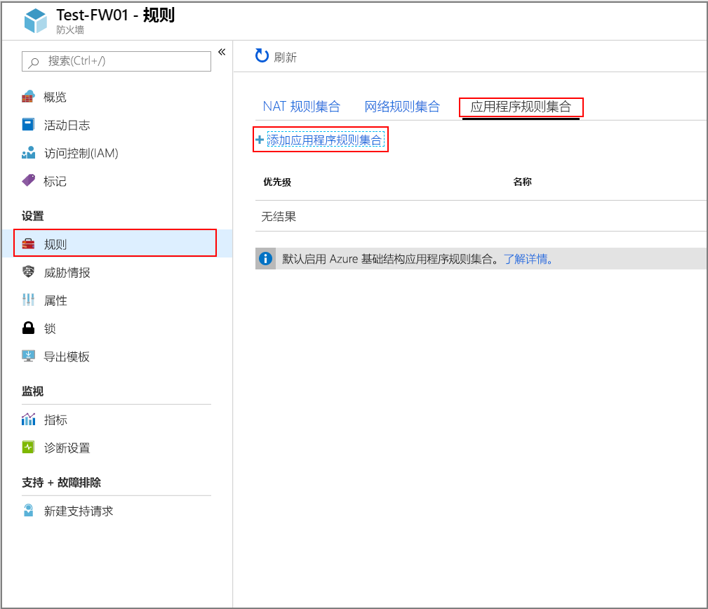
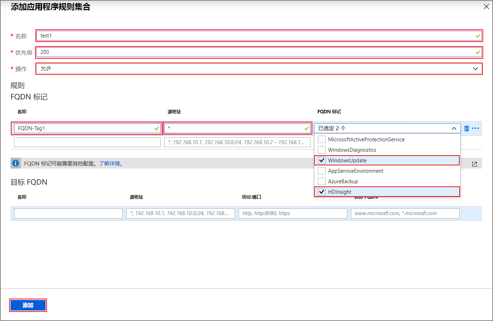
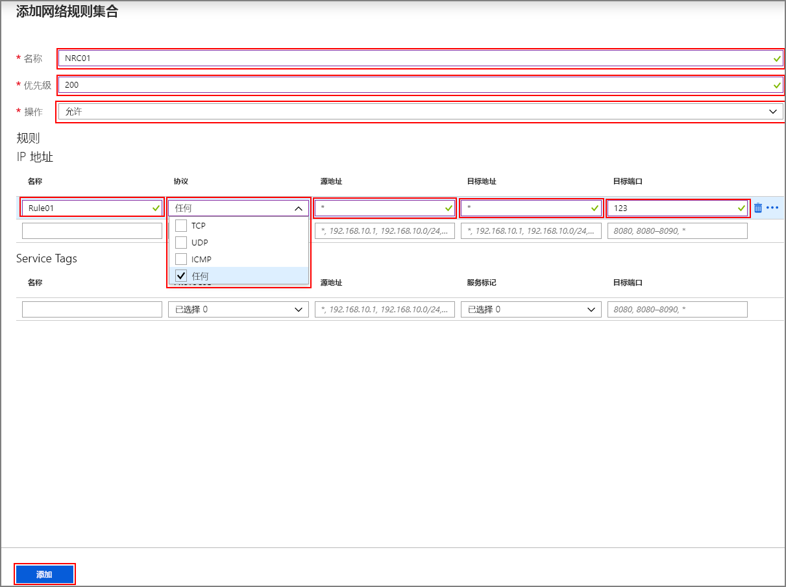

# <a name="configure-outbound-network-traffic-for-azure-hdinsight-clusters-using-firewall-preview"></a>使用防火墙配置 Azure HDInsight 群集的出站网络流量（预览）

本文提供使用 Azure 防火墙保护来自 HDInsight 群集的出站流量的步骤。 以下步骤假设你要为现有群集配置 Azure 防火墙。 如果你正在部署新群集并在防火墙后面操作，请先创建 HDInsight 群集和子网，然后遵循本指南中的步骤。

## <a name="background"></a>后台

Azure HDInsight 群集通常部署在你自己的虚拟网络中。 群集在该虚拟网络外部的服务中包含依赖项，这些依赖项需要网络访问权限才能正常运行。

有多个依赖项需要入站流量。 无法通过防火墙设备发送入站管理流量。 此流量的源地址是已知的，已在[此处](hdinsight-management-ip-addresses.md)发布。 还可以使用此信息创建网络安全组 (NSG) 规则用于保护发往群集的入站流量。

HDInsight 出站流量依赖项几乎完全是使用 FQDN 定义的，而这些 FQDN 并未附带静态 IP 地址。 缺少静态地址意味着无法使用网络安全组 (NSG) 锁定来自群集的出站流量。 地址会频率更改，用户无法基于当前名称解析设置规则，然后使用这些规则来设置 NSG 规则。

保护出站地址的解决方案是使用可基于域名控制出站流量的防火墙设备。 Azure 防火墙可以基于目标或[fqdn 标记](https://docs.microsoft.com/azure/firewall/fqdn-tags)的 FQDN 限制出站 HTTP 和 HTTPS 流量。

## <a name="configuring-azure-firewall-with-hdinsight"></a>在 HDInsight 中配置 Azure 防火墙

使用 Azure 防火墙锁定现有 HDInsight 的传出流量的步骤摘要如下：
1. 创建防火墙。
1. 将应用程序规则添加到防火墙
1. 将网络规则添加到防火墙。
1. 创建一个路由表。

### <a name="create-a-new-firewall-for-your-cluster"></a>为群集创建新的防火墙

1. 在群集所在的虚拟网络中创建名为 **AzureFirewallSubnet** 的子网。 
1. 使用教程中[的步骤创建新的防火墙**FW01** ：使用 Azure 门户部署和配置 Azure 防火墙](../firewall/tutorial-firewall-deploy-portal.md#deploy-the-firewall)。

### <a name="configure-the-firewall-with-application-rules"></a>使用应用程序规则配置防火墙

创建一个应用程序规则集合，以允许群集发送和接收重要通信。

在 Azure 门户中选择新防火墙 **Test-FW01**。 单击“设置” > “应用程序规则集合” > “添加应用程序规则集合”下的“规则”。



在“添加应用程序规则集合”屏幕上完成以下步骤：

1. 输入**名称**、**优先级**，在“操作”下拉菜单中单击“允许”，然后在“FQDN 标记部分”中输入以下规则：

   | **名称** | **源地址** | **FQDN 标记** | **说明** |
   | --- | --- | --- | --- |
   | Rule_1 | * | HDInsight 和 WindowsUpdate | HDI 服务所需 |

1. 向“目标 FQDN”部分添加以下规则：

   | **名称** | **源地址** | **Protocol:Port** | **目标 FQDN** | **说明** |
   | --- | --- | --- | --- | --- |
   | Rule_2 | * | https:443 | login.windows.net | 允许 Windows 登录活动 |
   | Rule_3 | * | https:443 | login.microsoftonline.com | 允许 Windows 登录活动 |
   | Rule_4 | * | https:443,http:80 | <storage_account_name.blob.core.windows.net> | 如果群集由 WASB 提供支持，则为 WASB 添加一个规则。 若只使用 https 连接，请确保在存储帐户上启用 [需要安全传输](https://docs.microsoft.com/azure/storage/common/storage-require-secure-transfer)。 |

1. 单击“添加”。

   

### <a name="configure-the-firewall-with-network-rules"></a>使用网络规则配置防火墙

创建网络规则以正确配置 HDInsight 群集。

1. 在 Azure 门户中选择新防火墙 **Test-FW01**。
1. 单击“设置” > “网络规则集合” > “添加网络规则集合”下的“规则”。
1. 在“添加网络规则集合”屏幕上输入**名称**和**优先级**，然后单击“操作”下拉菜单中的“允许”。
1. 在“IP 地址”部分创建以下规则：

   | **名称** | 协议 | **源地址** | **目标地址** | **目标端口** | **说明** |
   | --- | --- | --- | --- | --- | --- |
   | Rule_1 | UDP | * | * | `123` | 时间服务 |
   | Rule_2 | 任意 | * | DC_IP_Address_1、DC_IP_Address_2 | `*` | 如果你正在使用企业安全性套餐 (ESP)，请在“IP 地址”部分添加一个允许与 ESP 群集的 AAD-DS 通信的网络规则。 可以在门户的 AAD-DS 部分找到域控制器的 IP 地址 | 
   | Rule_3 | TCP | * | Data Lake Storage 帐户的 IP 地址 | `*` | 如果正在使用 Azure Data Lake Storage，则可以在“IP 地址”部分中添加一个网络规则来解决 ADLS Gen1 和 Gen2 的 SNI 问题。 此选项会将流量路由到防火墙，而这可能会导致增大较大数据负载的费用，但流量将会在防火墙日志中记录并且可供审核。 确定 Data Lake Storage 帐户的 IP 地址。 可以使用 `[System.Net.DNS]::GetHostAddresses("STORAGEACCOUNTNAME.blob.core.windows.net")` 等 PowerShell 命令将 FQDN 解析成 IP 地址。|
   | Rule_4 | TCP | * | * | `12000` | （可选）如果正在使用 Log Analytics，请在“IP 地址”部分中创建一个网络规则以实现与 Log Analytics 工作区的通信。 |

1. 在“服务标记”部分创建以下规则：

   | **名称** | 协议 | **源地址** | **服务标记** | **目标端口** | **说明** |
   | --- | --- | --- | --- | --- | --- |
   | Rule_7 | TCP | * | SQL | `1433` | 在 SQL 的“服务标记”部分中配置允许你记录和审核 SQL 流量的网络规则，除非你在 HDInsight 子网中为 SQL Server 配置了服务终结点来绕过防火墙。 |

1. 单击“添加”以完成网络规则集合的创建。

   

### <a name="create-and-configure-a-route-table"></a>创建并配置路由表

创建包含以下条目的路由表：

1. [此所需 HDInsight 管理 IP 地址列表](../hdinsight/hdinsight-management-ip-addresses.md)中的六个地址，其下一跃点为“Internet”：
    1. 所有区域中所有群集的四个 IP 地址
    1. 特定于创建群集的区域的两个 IP 地址
1. IP 地址 0.0.0.0/0 的一个虚拟设备路由，其下一跃点为 Azure 防火墙专用 IP 地址。

例如，若要为“美国中部”区域创建的群集配置路由表，请使用以下步骤:

1. 登录到 Azure 门户。
1. 选择 Azure 防火墙 **Test-FW01**。 复制“概述”页上列出的“专用 IP 地址”。 本示例使用**示例地址 10.1.1.4**
1. 创建新的路由表。
1. 单击“设置”下的“路由”。
1. 单击“添加”，为 IP 地址创建下表中所示的路由。

| 路由名称 | 地址前缀 | 下一个跃点类型 | 下一个跃点地址 |
|---|---|---|---|
| 168.61.49.99 | 168.61.49.99/32 | Internet | 不可用 |
| 23.99.5.239 | 23.99.5.239/32 | Internet | 不可用 |
| 168.61.48.131 | 168.61.48.131/32 | Internet | 不可用 |
| 138.91.141.162 | 138.91.141.162/32 | Internet | 不可用 |
| 13.67.223.215 | 13.67.223.215/32 | Internet | 不可用 |
| 40.86.83.253 | 40.86.83.253/32 | Internet | 不可用 |
| 0.0.0.0 | 0.0.0.0/0 | 虚拟设备 | 10.1.1.4 |

完成路由表配置：

1. 单击“设置”下的“子网”，然后单击“关联”，将创建的路由表分配到 HDInsight 子网。
1. 在“关联子网”屏幕上，选择已创建群集的虚拟网络以及用于 HDInsight 群集的 **HDInsight 子网**。
1. 单击 **“确定”** 。

## <a name="edge-node-or-custom-application-traffic"></a>边缘节点或自定义应用程序流量

上述步骤可让群集正常运行。 但在可能的情况下，你仍然需要配置依赖项，以适应边缘节点上运行的自定义应用程序。

必须识别应用程序依赖项并将其添加到 Azure 防火墙或路由表。

必须为应用程序流量创建路由，以避免非对称路由问题。

如果应用程序有其他依赖项，则需要将这些依赖项添加到 Azure 防火墙。 创建允许 HTTP/HTTPS 流量的应用程序规则，并针对其他方面的控制创建网络规则。

## <a name="logging"></a>日志记录

Azure 防火墙可将日志发送到一些不同的存储系统。 有关为防火墙配置日志记录的说明，请按照教程中[的步骤操作：监视 Azure 防火墙日志和指标](../firewall/tutorial-diagnostics.md)。

完成日志记录设置后，将数据记录到 Log Analytics 时，可以使用如下所示的查询查看阻止的流量：

```
AzureDiagnostics | where msg_s contains "Deny" | where TimeGenerated >= ago(1h)
```

首次运行应用程序时，如果不知道所有的应用程序依赖项，则将 Azure 防火墙与 Azure Monitor 日志集成会很有用。 可以通过[在 Azure Monitor 中分析日志数据](../azure-monitor/log-query/log-query-overview.md)详细了解 Azure Monitor 日志

## <a name="access-to-the-cluster"></a>对群集的访问权限
成功设置防火墙后，可以使用内部终结点（`https://<clustername>-int.azurehdinsight.net`）从 VNET 中访问 Ambari。 若要使用公用终结点`https://<clustername>.azurehdinsight.net`（）或 ssh 终结`<clustername>-ssh.azurehdinsight.net`点（），请确保路由表和 NSG 规则设置中具有正确的路由，以避免在[此处](https://docs.microsoft.com/azure/firewall/integrate-lb)解释的非对称路由问题。

## <a name="configure-another-network-virtual-appliance"></a>配置另一个网络虚拟设备

>[!Important]
> **仅当**所要配置的网络虚拟设备 (NVA) 不是 Azure 防火墙时，才需要以下信息。

前面的说明可帮助你配置 Azure 防火墙，以限制来自 HDInsight 群集的出站流量。 对于许多常见的重要方案，Azure 防火墙已自动配置为允许流量。 若要使用另一个网络虚拟设备，需要手动配置其他一些功能。 配置网络虚拟设备时注意以下几点：

* 应在支持服务终结点的服务中配置服务终结点。
* IP 地址依赖项适用于非 HTTP/S 流量（TCP 和 UDP 流量）。
* 可将 FQDN HTTP/HTTPS 终结点放在 NVA 设备中。
* 通配符 HTTP/HTTPS 终结点是可以根据许多限定符变化的依赖项。
* 将创建的路由表分配到 HDInsight 子网。

### <a name="service-endpoint-capable-dependencies"></a>支持服务终结点的依赖项

| **终结点** |
|---|
| Azure SQL |
| Azure 存储 |
| Azure Active Directory |

#### <a name="ip-address-dependencies"></a>IP 地址依赖项

| **终结点** | **详细信息** |
|---|---|
| \*:123 | NTP 时钟检查。 在端口 123 上的多个终结点中检查流量 |
| [此处](hdinsight-management-ip-addresses.md)发布的 IP | 这是一些 HDInsight 服务 |
| ESP 群集的 AAD-DS 专用 IP |
| \*:16800，用于 KMS Windows 激活 |
| \*12000，用于 Log Analytics |

#### <a name="fqdn-httphttps-dependencies"></a>FQDN HTTP/HTTPS 依赖项

>[!Important]
> 以下列表仅提供了一些最重要的 FQDN。 [此文件](https://github.com/Azure-Samples/hdinsight-fqdn-lists/blob/master/HDInsightFQDNTags.json)提供了用于配置 NVA 的完整 FQDN 列表。

| **终结点**                                                          |
|---|
| azure.archive.ubuntu.com:80                                           |
| security.ubuntu.com:80                                                |
| ocsp.msocsp.com:80                                                    |
| ocsp.digicert.com:80                                                  |
| wawsinfraprodbay063.blob.core.windows.net:443                         |
| registry-1.docker.io:443                                              |
| auth.docker.io:443                                                    |
| production.cloudflare.docker.com:443                                  |
| download.docker.com:443                                               |
| us.archive.ubuntu.com:80                                              |
| download.mono-project.com:80                                          |
| packages.treasuredata.com:80                                          |
| security.ubuntu.com:80                                                |
| azure.archive.ubuntu.com:80                                                |
| ocsp.msocsp.com:80                                                |
| ocsp.digicert.com:80                                                |

## <a name="next-steps"></a>后续步骤

* [Azure HDInsight 虚拟网络体系结构](hdinsight-virtual-network-architecture.md)
