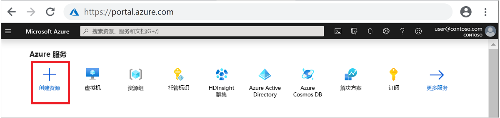
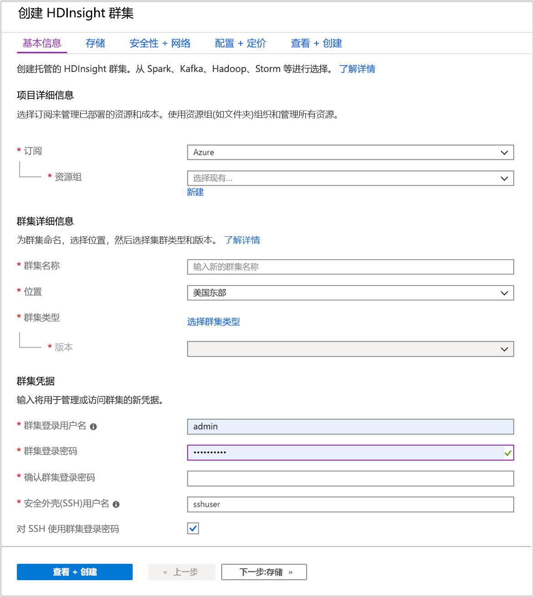
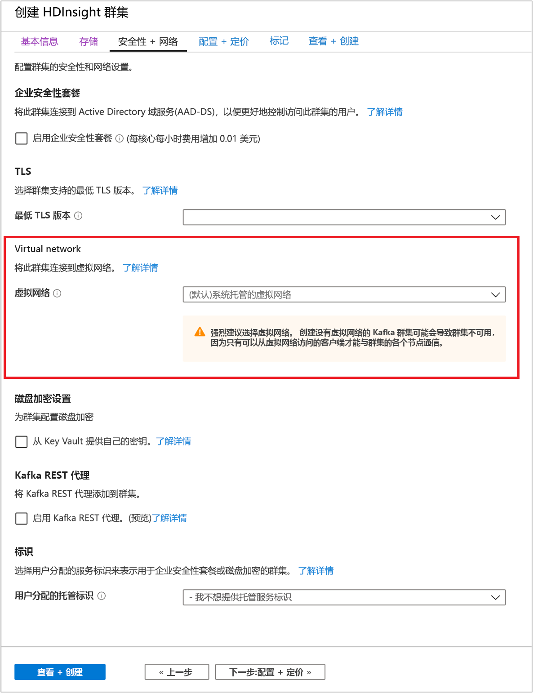
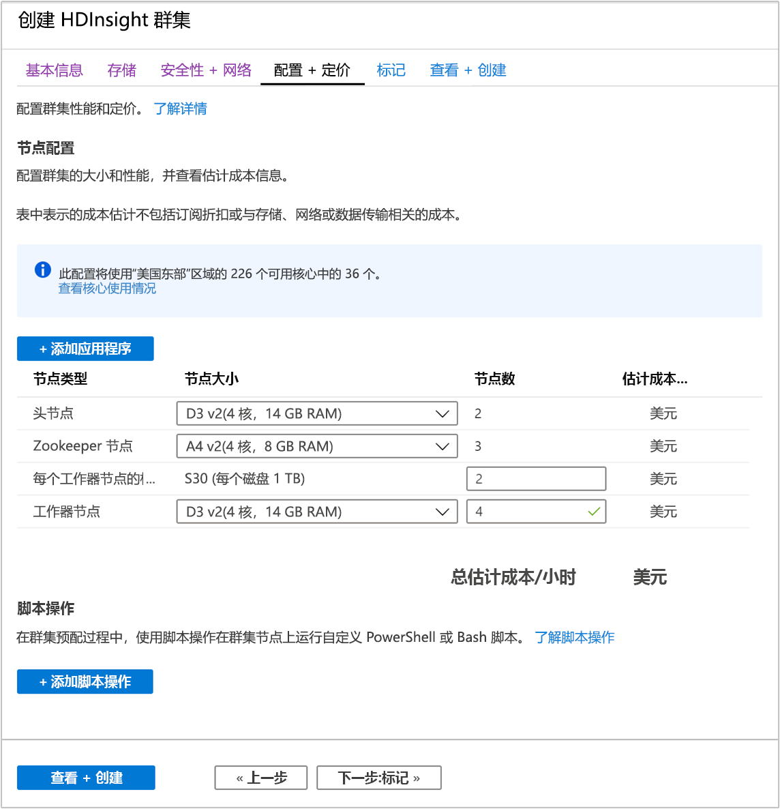
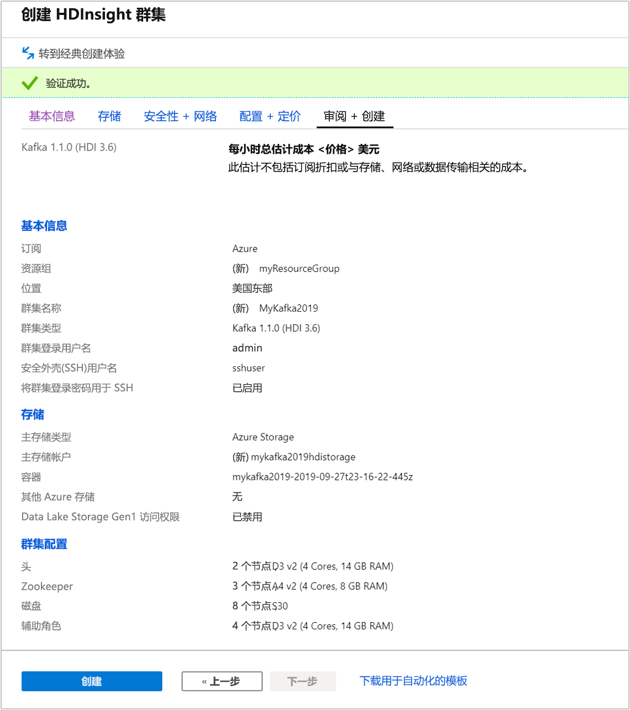

# <a name="quickstart-create-apache-kafka-cluster-in-azure-hdinsight-using-azure-portal"></a>快速入门：使用 Azure 门户在 Azure HDInsight 中创建 Apache Kafka 群集

[Apache Kafka](./apache-kafka-introduction.md) 是开源分布式流式处理平台。 通常用作消息代理，因为它可提供类似于发布-订阅消息队列的功能。

本快速入门介绍如何使用 Azure 门户创建 Apache Kafka 群集。 还介绍了如何使用已包含的实用程序发送并接收使用 Apache Kafka 的信息。 有关可用配置的详细说明，请参阅[在 HDInsight 中设置群集](../hdinsight-hadoop-provision-linux-clusters.md)。 有关使用门户创建群集的其他信息，请参阅[在门户中创建群集](../hdinsight-hadoop-create-linux-clusters-portal.md)。

[!INCLUDE [delete-cluster-warning](../../../includes/hdinsight-delete-cluster-warning.md)]

仅可通过相同虚拟网络内的资源访问 Apache Kafka API。 本快速入门使用 SSH 直接访问群集。 若要将其他服务、网络或虚拟机连接到 Apache Kafka，则必须首先创建虚拟机，然后才能在网络中创建资源。 有关详细信息，请参阅[使用虚拟网络连接到 Apache Kafka](apache-kafka-connect-vpn-gateway.md) 文档。 有关为 HDInsight 规划虚拟网络的更多常规信息，请参阅[为 Azure HDInsight 规划虚拟网络](../hdinsight-plan-virtual-network-deployment.md)。

如果没有 Azure 订阅，请在开始之前创建一个[免费帐户](https://azure.microsoft.com/free/?WT.mc_id=A261C142F)。

## <a name="prerequisites"></a>先决条件

SSH 客户端。 有关详细信息，请参阅[使用 SSH 连接到 HDInsight (Apache Hadoop)](../hdinsight-hadoop-linux-use-ssh-unix.md)。

## <a name="create-an-apache-kafka-cluster"></a>创建 Apache Kafka 群集

若要创建基于 HDInsight 的 Apache Kafka 群集，请使用以下步骤：

1. 登录 [Azure 门户](https://portal.azure.com)。

1. 在顶部菜单中，选择“+ 创建资源”  。

    

1. 选择“分析”   >   “Azure HDInsight”，转到“创建 HDInsight 群集”  页。

1. 在“基本信息”选项卡中提供以下信息： 

    |properties  |说明  |
    |---------|---------|
    |订阅    |  从下拉列表中选择用于此群集的 Azure 订阅。 |
    |资源组     | 创建资源组，或选择现有资源组。  资源组是 Azure 组件的容器。  在本例中，资源组包含 HDInsight 群集和依赖的 Azure 存储帐户。 |
    |群集名称   | 输入任何全局唯一的名称。 该名称最多可以有 59 个字符，包括字母、数字和连字符。 名称的第一个和最后一个字符不能为连字符。 |
    |区域    | 从下拉列表中，选择在其中创建群集的区域。  选择的区域与你越靠近，性能就越好。 |
    |群集类型| 选择“选择群集类型”，打开一个列表  。 从列表中选择“Kafka”作为群集类型。 |
    |版本|将指定群集类型的默认版本。 若要指定不同的版本，请从下拉列表中选择。|
    |群集登录用户名和密码    | 默认登录名为“admin”  。密码长度不得少于 10 个字符，且至少必须包含一个数字、一个大写字母和一个小写字母、一个非字母数字字符（' " ` \)字符除外）。 请确保不提供常见密码，如“Pass@word1”  。|
    |安全外壳 (SSH) 用户名 | 默认用户名为“sshuser”  。  可以提供其他名称作为 SSH 用户名。 |
    |对 SSH 使用群集登录密码| 选中此复选框，让 SSH 用户使用与提供给群集登录用户的密码相同的密码。|

   

    每个 Azure 区域（位置）均提供_容错域_。 容错域是 Azure 数据中心基础硬件的逻辑分组。 每个容错域共享公用电源和网络交换机。 在 HDInsight 群集中实现节点的虚拟机和托管磁盘跨这些容错域分布。 此体系结构可限制物理硬件故障造成的潜在影响。

    为实现数据的高可用性，请选择包含三个容错域的区域（位置）  。 有关区域中容错域数的信息，请参阅 [Linux 虚拟机的可用性](../../virtual-machines/windows/manage-availability.md#use-managed-disks-for-vms-in-an-availability-set)文档。

    选择页面底部的“下一步:  存储 >>”选项卡转到存储设置。

1. 在“存储”  选项卡中，提供以下值：

    |properties  |说明  |
    |---------|---------|
    |主存储类型|使用默认值“Azure 存储”。 |
    |选择方法|使用默认值“从列表中选择”。 |
    |主存储帐户|使用下拉列表选择现有存储帐户，或选择“新建”  。 如果创建新帐户，名称的长度必须在 3 到 24 个字符之间，并且只能包含数字和小写字母|
    |容器|使用自动填充的值。|

    

    选择“安全性 + 网络”选项卡。 

1. 对于本快速入门，请保留默认的安全设置。 若要详细了解企业安全性套餐，请访问[使用 Azure Active Directory 域服务配置具有企业安全性套餐的 HDInsight 群集](../domain-joined/apache-domain-joined-configure-using-azure-adds.md)。 若要了解如何使用自己的密钥进行 Apache Kafka 磁盘加密，请访问[客户管理的密钥磁盘加密](../disk-encryption.md)

   若要将群集连接到虚拟网络，请从“虚拟网络”下拉列表中选择一个虚拟网络。 

   

    选择“配置 + 定价”选项卡。 

1. 若要保证 Apache Kafka on HDInsight 的可用性，“工作器节点”的“节点数”条目必须设置为 3 或以上。   默认值为 4。

    “每个工作器节点的标准磁盘数”条目配置 Apache Kafka on HDInsight 的可伸缩性。  Apache Kafka on HDInsight 在群集中使用虚拟机的本地磁盘来存储数据。 由于 Apache Kafka 的 I/O 很高，因此会使用 [Azure 托管磁盘](../../virtual-machines/windows/managed-disks-overview.md)为每个节点提供高吞吐量和更多存储。 托管磁盘的类型可以为“标准”  (HDD) 或“高级”  (SSD)。 磁盘类型取决于辅助角色节点（Apache Kafka 代理）所使用的 VM 大小。 高级磁盘可自动与 DS 和 GS 系列 VM 一起使用。 所有其他的 VM 类型使用“标准”。

   

    选择“查看 + 创建”  选项卡。

1. 查看群集的配置。 更改所有不正确的设置。 最后，选择“创建”  以创建群集。

    

    创建群集可能需要 20 分钟。

## <a name="connect-to-the-cluster"></a>连接到群集

1. 使用 [ssh 命令](../hdinsight-hadoop-linux-use-ssh-unix.md)连接到群集。 编辑以下命令，将 CLUSTERNAME 替换为群集的名称，然后输入该命令：

    ```cmd
    ssh sshuser@CLUSTERNAME-ssh.azurehdinsight.net
    ```

1. 出现提示时，请输入 SSH 用户名密码。

    连接后，显示的信息类似于以下文本：

    ```output
    Authorized uses only. All activity may be monitored and reported.
    Welcome to Ubuntu 16.04.4 LTS (GNU/Linux 4.13.0-1011-azure x86_64)

     * Documentation:  https://help.ubuntu.com
     * Management:     https://landscape.canonical.com
     * Support:        https://ubuntu.com/advantage

      Get cloud support with Ubuntu Advantage Cloud Guest:
        https://www.ubuntu.com/business/services/cloud

    83 packages can be updated.
    37 updates are security updates.


    Welcome to Apache Kafka on HDInsight.

    Last login: Thu Mar 29 13:25:27 2018 from 108.252.109.241
    ```

## <a name="get-the-apache-zookeeper-and-broker-host-information"></a><a id="getkafkainfo"></a>获取 Apache Zookeeper 主机和代理主机信息

使用 Kafka 时，必须了解 Apache Zookeeper 和代理主机   。 这些主机配合 Apache Kafka API 和 Kafka 随附的许多实用程序一起使用。

在本部分中，可以从群集上的 Apache Ambari REST API 获取主机信息。

1. 安装 [jq](https://stedolan.github.io/jq/)，一个命令行 JSON 处理程序。 此实用程序用于分析 JSON 文档和主机信息。 在打开的 SSH 连接中，输入以下命令以安装 `jq`：

    ```bash
    sudo apt -y install jq
    ```

1. 设置密码变量。 将 `PASSWORD` 替换为群集登录密码，然后输入以下命令：

    ```bash
    export password='PASSWORD'
    ```

1. 提取具有正确大小写格式的群集名称。 群集名称的实际大小写格式可能出乎预期，具体取决于群集的创建方式。 此命令将获取实际的大小写，然后将其存储在变量中。 输入以下命令：

    ```bash
    export clusterName=$(curl -u admin:$password -sS -G "http://headnodehost:8080/api/v1/clusters" | jq -r '.items[].Clusters.cluster_name')
    ```

    > [!Note]  
    > 如果要从群集外部执行此过程，存储群集名称的过程则有所不同。 从 Azure 门户中获取采用小写格式的群集名称。 然后，将以下命令中的 `<clustername>` 替换为群集名称，并执行：`export clusterName='<clustername>'`。


1. 若要使用 Zookeeper 主机信息来设置环境变量，请使用以下命令。 此命令检索所有 Zookeeper 主机，然后仅返回前两个条目。 这是由于某个主机无法访问时，需要一些冗余。

    ```bash
    export KAFKAZKHOSTS=$(curl -sS -u admin:$password -G https://$clusterName.azurehdinsight.net/api/v1/clusters/$clusterName/services/ZOOKEEPER/components/ZOOKEEPER_SERVER | jq -r '["\(.host_components[].HostRoles.host_name):2181"] | join(",")' | cut -d',' -f1,2);
    ```

    > [!Note]  
    > 此命令需要 Ambari 访问权限。 如果群集位于 NSG 后面，请在可访问 Ambari 的计算机上运行此命令。

1. 若要验证是否已正确设置了环境变量，请使用以下命令：

    ```bash
    echo $KAFKAZKHOSTS
    ```

    此命令返回类似于以下文本的信息：

    `zk0-kafka.eahjefxxp1netdbyklgqj5y1ud.ex.internal.cloudapp.net:2181,zk2-kafka.eahjefxxp1netdbyklgqj5y1ud.ex.internal.cloudapp.net:2181`

1. 若要使用 Apache Kafka 代理主机信息来设置环境变量，请使用以下命令：

    ```bash
    export KAFKABROKERS=$(curl -sS -u admin:$password -G https://$clusterName.azurehdinsight.net/api/v1/clusters/$clusterName/services/KAFKA/components/KAFKA_BROKER | jq -r '["\(.host_components[].HostRoles.host_name):9092"] | join(",")' | cut -d',' -f1,2);
    ```

    > [!Note]  
    > 此命令需要 Ambari 访问权限。 如果群集位于 NSG 后面，请在可访问 Ambari 的计算机上运行此命令。

1. 若要验证是否已正确设置了环境变量，请使用以下命令：

    ```bash
    echo $KAFKABROKERS
    ```

    此命令返回类似于以下文本的信息：

    `wn1-kafka.eahjefxxp1netdbyklgqj5y1ud.cx.internal.cloudapp.net:9092,wn0-kafka.eahjefxxp1netdbyklgqj5y1ud.cx.internal.cloudapp.net:9092`

## <a name="manage-apache-kafka-topics"></a>管理 Apache Kafka 主题

Kafka 在主题中存储数据流  。 可以使用 `kafka-topics.sh` 实用工具来管理主题。

* 若要创建主题，请在 SSH 连接中使用以下命令  ：

    ```bash
    /usr/hdp/current/kafka-broker/bin/kafka-topics.sh --create --replication-factor 3 --partitions 8 --topic test --zookeeper $KAFKAZKHOSTS
    ```

    此命令使用存储在 `$KAFKAZKHOSTS` 中的主机信息连接到 Zookeeper， 然后创建名为 **test** 的 Apache Kafka 主题。

    * 本主题中存储的数据已分区到八个分区。

    * 每个分区在群集中的三个辅助角色节点上进行复制。

        * 如果在 Azure 区域中已创建提供三个容错域的群集，则复制因子使用 3。 否则，复制因子使用 4.
        
        * 在具有三个容错域的区域中，复制因子为 3 可让副本分布在容错域中。 在具有两个容错域的区域中，复制因子为 4 可将副本均匀分布在域中。
        
        * 有关区域中容错域数的信息，请参阅 [Linux 虚拟机的可用性](../../virtual-machines/windows/manage-availability.md#use-managed-disks-for-vms-in-an-availability-set)文档。

        * Apache Kafka 不识别 Azure 容错域。 在创建主题的分区副本时，它可能未针对高可用性正确分发副本。

        * 若要确保高可用性，请使用 [Apache Kafka 分区重新均衡工具](https://github.com/hdinsight/hdinsight-kafka-tools)。 必须通过 SSH 连接运行此工具，以便连接到 Apache Kafka 群集的头节点。

        * 为确保 Apache Kafka 数据的最高可用性，应在出现以下情况时为主题重新均衡分区副本：

            * 创建新主题或分区

            * 纵向扩展群集

* 若要列出主题，请使用以下命令  ：

    ```bash
    /usr/hdp/current/kafka-broker/bin/kafka-topics.sh --list --zookeeper $KAFKAZKHOSTS
    ```

    此命令列出 Apache Kafka 群集上可用的主题。

* 若要删除主题，使用以下命令  ：

    ```bash
    /usr/hdp/current/kafka-broker/bin/kafka-topics.sh --delete --topic topicname --zookeeper $KAFKAZKHOSTS
    ```

    此命令删除名为 `topicname` 的主题。

    > [!WARNING]  
    > 如果删除了之前创建的 `test` 主题，则必须重新创建。 稍后会在本文档中使用此主题。

有关适用于 `kafka-topics.sh` 实用工具的命令的详细信息，请使用以下命令：

```bash
/usr/hdp/current/kafka-broker/bin/kafka-topics.sh
```

## <a name="produce-and-consume-records"></a>生成和使用记录

Kafka 将记录  存储在主题中。 记录由生成者  生成，由使用者  使用。 生产者与使用者通过 Kafka 代理服务通信  。 HDInsight 群集中的每个工作节点都是 Apache Kafka 代理主机。

若要将记录存储到之前创建的测试主题，并通过使用者对其进行读取，请使用以下步骤：

1. 若要为该主题写入记录，请从 SSH 连接使用 `kafka-console-producer.sh` 实用工具：

    ```bash
    /usr/hdp/current/kafka-broker/bin/kafka-console-producer.sh --broker-list $KAFKABROKERS --topic test
    ```

    此命令之后是一个空行。

2. 在空行中键入文本消息，然后点击 Enter。 以这种方式输入一些消息，然后使用 **Ctrl + C** 返回到正常的提示符处。 每行均作为单独的记录发送到 Apache Kafka 主题。

3. 若要读取该主题的记录，请从 SSH 连接使用 `kafka-console-consumer.sh` 实用工具：

    ```bash
    /usr/hdp/current/kafka-broker/bin/kafka-console-consumer.sh --bootstrap-server $KAFKABROKERS --topic test --from-beginning
    ```

    此命令从主题中检索并显示记录。 使用 `--from-beginning` 告知使用者从流的开头开始，以检索所有记录。

    如果使用的是较旧版本的 Kafka，请将 `--bootstrap-server $KAFKABROKERS` 替换为 `--zookeeper $KAFKAZKHOSTS`。

4. 使用 __Ctrl + C__ 阻止使用者。

还可以以编程方式创建生产者和使用者。 有关如何使用此 API 的示例，请参阅[将 Apache Kafka 生产者和使用者 API 与 HDInsight 配合使用](apache-kafka-producer-consumer-api.md)文档。

## <a name="clean-up-resources"></a>清理资源

若要清理本快速入门创建的资源，可以删除资源组。 删除资源组也会删除相关联的 HDInsight 群集，以及与资源组相关联的任何其他资源。

若要使用 Azure 门户删除资源组，请执行以下操作：

1. 在 Azure 门户中展开左侧的菜单，打开服务菜单，然后选择“资源组”以显示资源组的列表。 
2. 找到要删除的资源组，然后右键单击列表右侧的“更多”按钮 (...)。 
3. 选择“删除资源组”，然后进行确认。 

> [!WARNING]  
> 删除基于 HDInsight 的 Apache Kafka 群集会删除存储在 Kafka 中的任何数据。

## <a name="next-steps"></a>后续步骤

> [!div class="nextstepaction"]
> [将 Apache Spark 与 Apache Kafka 配合使用](../hdinsight-apache-kafka-spark-structured-streaming.md)
