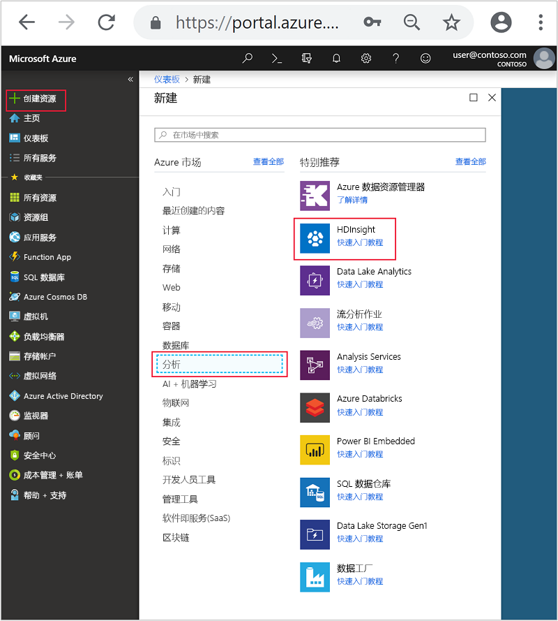
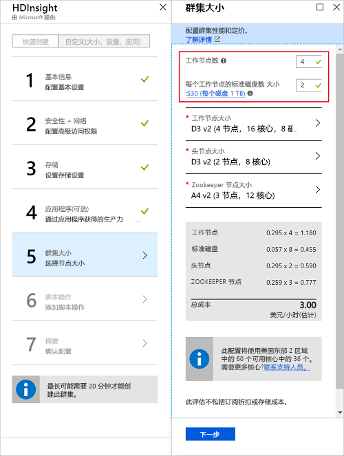

# <a name="start-with-apache-kafka-on-hdinsight"></a>Apache Kafka on HDInsight 入门

了解如何在 Azure HDInsight 上创建和使用 [Apache Kafka](https://kafka.apache.org) 群集。 Kafka 是开源分布式流式处理平台，可与 HDInsight 配合使用。 通常将其用作消息代理，因为它可提供类似于发布-订阅消息队列的功能。 通常将 Kafka 与 Apache Spark 和 Apache Storm 配合使用，以便进行消息传送、活动跟踪、流聚合或数据转换。

[!INCLUDE [delete-cluster-warning](../../../includes/hdinsight-delete-cluster-warning.md)]

## <a name="create-a-kafka-cluster"></a>创建 Kafka 群集

若要创建 Kafka on HDInsight 群集，请使用以下步骤：

1. 从 [Azure 门户](https://portal.azure.com)依次选择“+ 创建资源”、“数据 + 分析”、“HDInsight”。
   
    

2. 在“基本信息”中输入以下信息：

    * **群集名称**：HDInsight 群集的名称。 此名称必须唯一。
    * **订阅**：选择要使用的订阅。
    * **群集类型**：选择此项，然后在“群集配置”中设置以下值：

        * **群集类型**：Kafka
        * 版本：Kafka 0.10.0 (HDI 3.6)

        使用“选择”按钮保存群集类型设置。

        

    * **群集登录用户名**和**群集登录密码**：通过 HTTPS 访问群集时的登录凭据。 可以使用这些凭据访问 Ambari Web UI 或 REST API 等服务。
    * **安全外壳 (SSH) 用户名**：通过 SSH 访问群集时使用的登录名。 默认情况下，密码与群集登录密码相同。
    * **资源组**：要在其中创建群集的资源组。
    * **位置**：要在其中创建群集的 Azure 区域。

        > [!IMPORTANT]
        > 为实现数据的高可用性，我们建议选择包含__三个容错域__的位置（区域）。 有关详细信息，请参阅[数据高可用性](#data-high-availability)部分。
   
 

3. 使用“下一步”按钮完成基本配置。

4. 在“存储”中选择或创建存储帐户。 对于本文档中的步骤，请让其他字段保留默认值。 使用“下一步”按钮保存存储配置。

    

5. 在“应用程序(可选)”中，选择“下一步”继续。 此示例不需要任何应用程序。

6. 在“群集大小”中，选择“下一步”继续。

    > [!WARNING]
    > 若要确保 Kafka on HDInsight 的可用性，群集必须至少包含 3 个辅助节点。 有关详细信息，请参阅[数据高可用性](#data-high-availability)部分。

    

    > [!IMPORTANT]
    > “每个辅助角色节点的磁盘数”条目配置 Kafka on HDInsight 的可伸缩性。 Kafka on HDInsight 在群集中使用虚拟机的本地磁盘。 由于 Kafka 的 I/O 很高，因此会使用 [Azure 托管磁盘](../../virtual-machines/windows/managed-disks-overview.md)提供高吞吐量，并为每个节点提供更多存储。 托管磁盘的类型可以为“标准”(HDD) 或“高级”(SSD)。 高级磁盘可与 DS 和 GS 系列 VM 一起使用。 所有其他的 VM 类型使用“标准”。

7. 在“高级设置”中，选择“下一步”继续。

8. 在“摘要”中，查看群集的配置。 使用“编辑”链接更改不正确的设置。 最后，使用“创建”按钮创建群集。
   
    
   
    > [!NOTE]
    > 创建群集可能需要 20 分钟。

## <a name="connect-to-the-cluster"></a>连接至群集

> [!IMPORTANT]
> 执行以下步骤时，必须使用 SSH 客户端。 有关详细信息，请参阅[将 SSH 与 HDInsight 配合使用](../hdinsight-hadoop-linux-use-ssh-unix.md)文档。

若要使用 SSH 连接到群集，必须提供 SSH 用户帐户名称以及群集的名称。 在以下示例中，请将 `sshuser` 和 `clustername` 替换为帐户名称和群集名称：

```ssh sshuser@clustername-ssh.azurehdinsight.net```

出现提示时，输入用于 SSH 帐户的密码。

有关信息，请参阅[将 SSH 与 HDInsight 配合使用](../hdinsight-hadoop-linux-use-ssh-unix.md)。

## <a id="getkafkainfo"></a>获取 Zookeeper 主机和代理主机信息

使用 Kafka 时，必须了解 Zookeeper 主机和代理主机。 这些主机配合 Kafka API 和 Kafka 随附的许多实用工具一起使用。

若要创建包含主机信息的环境变量，请使用以下步骤：

1. 与群集建立 SSH 连接后，使用以下命令安装 `jq` 实用工具。 此实用工具用于分析 JSON 文档且有助于检索代理主机的信息：
   
    ```bash
    sudo apt -y install jq
    ```

2. 若要将环境变量设置为群集名称，请使用以下命令：

    ```bash
    read -p "Enter the HDInsight cluster name: " CLUSTERNAME
    ```

3. 若要使用 Zookeeper 主机信息来设置环境变量，请使用以下命令：

    ```bash
    export KAFKAZKHOSTS=`curl -sS -u admin -G https://$CLUSTERNAME.azurehdinsight.net/api/v1/clusters/$CLUSTERNAME/services/ZOOKEEPER/components/ZOOKEEPER_SERVER | jq -r '["\(.host_components[].HostRoles.host_name):2181"] | join(",")' | cut -d',' -f1,2`
    ```

    出现提示时，请输入群集登录帐户（管理员）的密码。

4. 若要验证是否已正确设置了环境变量，请使用以下命令：

    ```bash
     echo '$KAFKAZKHOSTS='$KAFKAZKHOSTS
    ```

    此命令返回类似于以下文本的信息：

    `zk0-kafka.eahjefxxp1netdbyklgqj5y1ud.ex.internal.cloudapp.net:2181,zk2-kafka.eahjefxxp1netdbyklgqj5y1ud.ex.internal.cloudapp.net:2181`

5. 若要使用 Kafka 代理主机信息来设置环境变量，请使用以下命令：

    ```bash
    export KAFKABROKERS=`curl -sS -u admin -G https://$CLUSTERNAME.azurehdinsight.net/api/v1/clusters/$CLUSTERNAME/services/KAFKA/components/KAFKA_BROKER | jq -r '["\(.host_components[].HostRoles.host_name):9092"] | join(",")' | cut -d',' -f1,2`
    ```

    出现提示时，请输入群集登录帐户（管理员）的密码。

6. 若要验证是否已正确设置了环境变量，请使用以下命令：

    ```bash   
    echo '$KAFKABROKERS='$KAFKABROKERS
    ```

    此命令返回类似于以下文本的信息：
   
    `wn1-kafka.eahjefxxp1netdbyklgqj5y1ud.cx.internal.cloudapp.net:9092,wn0-kafka.eahjefxxp1netdbyklgqj5y1ud.cx.internal.cloudapp.net:9092`
   
> [!WARNING]
> 不要期望从此会话中返回的信息始终准确。 缩放群集时，会添加或删除新的代理。 如果发生故障且替换节点，节点的主机名可能会改变。
>
> 应在检索 Zookeeper 和中转站主机信息后尽快使用这些信息，确保信息有效。

## <a name="create-a-topic"></a>创建主题

Kafka 在名为 topics 的类别中存储数据流。 与群集头节点建立 SSH 连接后，使用随 Kafka 提供的脚本创建主题：

```bash
/usr/hdp/current/kafka-broker/bin/kafka-topics.sh --create --replication-factor 3 --partitions 8 --topic test --zookeeper $KAFKAZKHOSTS
```

此命令使用存储在 `$KAFKAZKHOSTS` 中的主机信息连接到 Zookeeper， 然后创建名为 **test** 的 Kafka 主题。 通过使用以下脚本列出主题可确认已创建该主题：

```bash
/usr/hdp/current/kafka-broker/bin/kafka-topics.sh --list --zookeeper $KAFKAZKHOSTS
```

此命令的输出列出了群集的 Kafka 主题。

## <a name="produce-and-consume-records"></a>生成和使用记录

Kafka 将记录存储在主题中。 记录由生成者生成，由使用者使用。 生成者将记录生成到 Kafka 代理。 HDInsight 群集中的每个辅助角色节点都是 Kafka 代理。

若要将记录存储到之前创建的测试主题，并通过使用者对其进行读取，请使用以下步骤：

1. 从 SSH 会话，使用随 Kafka 提供的脚本将记录写入主题：
   
    ```bash
    /usr/hdp/current/kafka-broker/bin/kafka-console-producer.sh --broker-list $KAFKABROKERS --topic test
    ```
   
    此命令之后是一个空行。

2. 在空行中键入文本消息，然后点击 Enter。 以这种方式输入一些消息，然后使用 **Ctrl + C** 返回到正常的提示符处。 每行均作为单独的记录发送到 Kafka 主题。

3. 使用随 Kafka 提供的脚本从主题中读取记录：
   
    ```bash
    /usr/hdp/current/kafka-broker/bin/kafka-console-consumer.sh --bootstrap-server $KAFKABROKERS --topic test --from-beginning
    ```
   
    此命令从主题中检索并显示记录。 使用 `--from-beginning` 告知使用者从流的开头开始，以检索所有记录。

    > [!NOTE]
    > 如果使用的是较旧版本的 Kafka，请将 `--bootstrap-server $KAFKABROKERS` 替换为 `--zookeeper $KAFKAZKHOSTS`。

4. 使用 __Ctrl + C__ 阻止使用者。

还可以以编程方式创建生产者和使用者。 有关如何使用此 API 的示例，请参阅[将 Kafka 生产者和使用者 API 与 HDInsight 配合使用](apache-kafka-producer-consumer-api.md)文档。

## <a name="data-high-availability"></a>数据高可用性

每个 Azure 区域（位置）均提供_容错域_。 容错域是 Azure 数据中心基础硬件的逻辑分组。 每个容错域共享公用电源和网络交换机。 在 HDInsight 群集中实现节点的虚拟机和托管磁盘跨这些容错域分布。 此体系结构可限制物理硬件故障造成的潜在影响。

有关区域中容错域数的信息，请参阅 [Linux 虚拟机的可用性](../../virtual-machines/windows/manage-availability.md#use-managed-disks-for-vms-in-an-availability-set)文档。

> [!IMPORTANT]
> 尽可能使用包含三个容错域的 Azure 区域，并使用复制因子 3 来创建主题。

如果使用只包含两个容错域的区域，请使用 4 作为复制因子，将副本均衡地分布到两个容错域中。

### <a name="kafka-and-fault-domains"></a>Kafka 和容错域

Kafka 不识别容错域。 在创建主题的分区副本时，它可能未针对高可用性正确分发副本。 若要确保高可用性，请使用 [Kafka 分区重新均衡工具](https://github.com/hdinsight/hdinsight-kafka-tools)。 必须通过 SSH 会话运行此工具，以便连接到 Kafka 群集的头节点。

若要确保 Kafka 数据的最高可用性，应该在出现以下情况时为主题重新均衡分区副本：

* 创建新主题或分区

* 扩展群集

## <a name="delete-the-cluster"></a>删除群集

[!INCLUDE [delete-cluster-warning](../../../includes/hdinsight-delete-cluster-warning.md)]

## <a name="troubleshoot"></a>故障排除

如果在创建 HDInsight 群集时遇到问题，请参阅[访问控制要求](../hdinsight-administer-use-portal-linux.md#create-clusters)。

## <a name="next-steps"></a>后续步骤

在本文档中，已了解在 HDInsight 上使用 Apache Kafka 的基本知识。 使用以下内容，详细了解如何使用 Kafka：

* [分析 Kafka 日志](apache-kafka-log-analytics-operations-management.md)
* [在 Kafka 群集之间复制数据](apache-kafka-mirroring.md)
* [将 Kafka Producer 和 Consumer API 与 HDInsight 配合使用](apache-kafka-producer-consumer-api.md)
* [将 Kafka 流 API 与 HDInsight 配合使用](apache-kafka-streams-api.md)
* [将 Apache Spark 流式处理 (DStream) 与 Kafka on HDInsight 配合使用](../hdinsight-apache-spark-with-kafka.md)
* [将 Apache Spark 结构化流式处理与 Kafka on HDInsight 配合使用](../hdinsight-apache-kafka-spark-structured-streaming.md)
* [使用 Apache Spark 结构化流式处理将数据从 Kafka on HDInsight 移到 Cosmos DB](../apache-kafka-spark-structured-streaming-cosmosdb.md)
* [将 Apache Storm 与 Kafka on HDInsight 结合使用](../hdinsight-apache-storm-with-kafka.md)
* [通过 Azure 虚拟网络连接到 Kafka](apache-kafka-connect-vpn-gateway.md)
* [将 Kafka 与 Azure 容器服务配合使用](apache-kafka-azure-container-services.md)
* [将 Kafka 与 Azure Function App 配合使用](apache-kafka-azure-functions.md)
