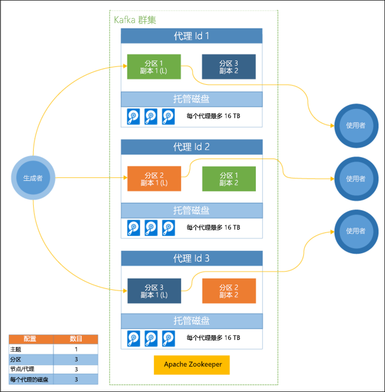

# 什么是 Azure HDInsight 中的 Apache Kafka

[Apache Kafka](https://kafka.apache.org) 是开源分布式流式处理平台，可用于构建实时流数据管道和应用程序。 Kafka 还提供类似于消息队列的消息中转站功能，可在其中向命名的数据流发布和订阅信息。

Kafka on HDInsight 的具体特征如下：

* 它是一种托管服务，可提供简化的配置过程。 其结果是经 Microsoft 测试并支持的配置。

* Microsoft 就 Kafka 正常运行时间提供 99.9 % 的服务级别协议(SLA)。 有关详细信息，请参阅 [HDInsight 的 SLA 信息](https://azure.microsoft.com/support/legal/sla/hdinsight/v1_0/)文档。

* 它使用 Azure 托管磁盘作为 Kafka 的后备存储。 托管磁盘可为每个 Kafka 代理提供高达 16 TB 的存储空间。 有关为 Kafka on HDInsight 配置托管磁盘的信息，请参阅[提高 Apache Kafka on HDInsight 的可伸缩性](apache-kafka-scalability.md)。

    有关托管磁盘的详细信息，请参阅 [Azure 托管磁盘](../../virtual-machines/managed-disks-overview.md)。

* Kafka 采用一维机架视图设计。 Azure 将机架分为两个维度，即更新域 (UD) 和容错域 (FD)。 Microsoft 提供相关工具，重新均衡 UD 和 FD 中的 Kafka 分区与副本。

    有关详细信息，请参阅[使用 Apache Kafka on HDInsight 实现高可用性](apache-kafka-high-availability.md)。

* 创建群集后，HDInsight 允许更改辅助角色节点（托管 Kafka 代理）的数目。 可以通过 Azure 门户、Azure PowerShell 和其他 Azure 管理界面执行向上缩放。 对于 Kafka，在执行缩放操作后，应重新均衡分区副本。 重新均衡分区可让 Kafka 利用新的工作节点数。

   HDInsight Kafka 不支持向下缩放或减少群集中的中转站数。 如果尝试减少节点数，则会返回 `InvalidKafkaScaleDownRequestErrorCode` 错误。

    有关详细信息，请参阅[使用 Apache Kafka on HDInsight 实现高可用性](apache-kafka-high-availability.md)。

* Azure Monitor 日志可用于监视 Kafka on HDInsight。 Azure Monitor 日志可以显示虚拟机级别的信息，例如磁盘和 NIC 指标，以及 Kafka 中的 JMX 指标。

    有关详细信息，请参阅[分析 Apache Kafka on HDInsight 的日志](apache-kafka-log-analytics-operations-management.md)。

## Apache Kafka on HDInsight 体系结构

下图显示了一个典型的 Kafka 配置，该配置利用使用者组、分区和复制提供带容错功能的事件并行读取：

Apache ZooKeeper 管理 Kafka 群集的状态。 Zookeeper 专用于并发、可复原和低延迟事务。

Kafka 将记录（数据）存储在主题中。 记录由**生成者**生成，由**使用者**使用。 生成者将记录发送到 Kafka 代理。 HDInsight 群集中的每个辅助角色节点都是一个 Kafka 中转站。

主题跨代理对记录进行分区。 在使用记录时，每个分区最多可使用一个使用者来实现数据并行处理。

利用复制功能将分区复制到各个节点上，以防止发生节点（代理）服务中断。 关系图中用 (L) 表示的分区是给定分区的前导者。 生成方流量将根据由 ZooKeeper 管理的状态路由到每个节点的前导者。

## 为何使用 Apache Kafka on HDInsight？

以下是可使用 Kafka on HDInsight 执行的常见任务和模式：

|用途 |说明 |
|---|---|
|复制 Apache Kafka 数据|Kafka 提供了 MirrorMaker 实用工具，用于在 Kafka 群集之间复制数据。 有关使用 MirrorMaker 的信息，请参阅[使用 Apache Kafka on HDInsight 复制 Apache Kafka 主题](apache-kafka-mirroring.md)。|
|发布-订阅消息模式|Kafka 提供了生成者 API 来用于向 Kafka 主题发布记录。 订阅某个主题时，会用到使用者 API。 有关详细信息，请参阅 [Apache Kafka on HDInsight 入门](apache-kafka-get-started.md)。|
|流处理|Kafka 通常与 Apache Storm 或 Spark 配合使用，以实现实时流式处理。 Kafka 0.10.0.0（HDInsight 版本 3.5 和 3.6）引入了流式处理 API，可用于构建流式处理解决方案，而无需使用 Storm 或 Spark。 有关详细信息，请参阅 [Apache Kafka on HDInsight 入门](apache-kafka-get-started.md)。|
|横向缩放|Kafka 可将 HDInsight 群集中不同节点之间的流进行分区。 使用者进程可与单个分区相关联，在使用记录时提供负载均衡。 有关详细信息，请参阅 [Apache Kafka on HDInsight 入门](apache-kafka-get-started.md)。|
|按序送达|在每个分区中，记录按接收顺序存储在流中。 通过在使用者进程与分区之间建立一对一的关联，可以保证记录按顺序处理。 有关详细信息，请参阅 [Apache Kafka on HDInsight 入门](apache-kafka-get-started.md)。|
|消息传送|由于支持发布-订阅消息模式，Kafka 通常用作消息中转站。|
|活动跟踪|由于 Kafka 提供有序的日志记录，因此可用于跟踪和重建活动， 例如，网站上或应用程序内的用户操作。|
|聚合|使用流处理可从不同的流中聚合信息，将信息合并和集中到运营数据中。|
|转换|使用流处理可将多个输入主题中的数据合并到一个或多个输出主题中，丰富其内容。|

## 后续步骤

单击以下链接了解如何使用 Apache Kafka on HDInsight：

* [快速入门：在 HDInsight 上创建 Apache Kafka](apache-kafka-get-started.md)

* [将 Kafka 与 REST 代理配合使用](rest-proxy.md)

* [教程：在 HDInsight 上将 Apache Spark 与 Apache Kafka 配合使用](../hdinsight-apache-spark-with-kafka.md)

* [教程：在 HDInsight 上将 Apache Storm 与 Apache Kafka 配合使用](../hdinsight-apache-storm-with-kafka.md)
