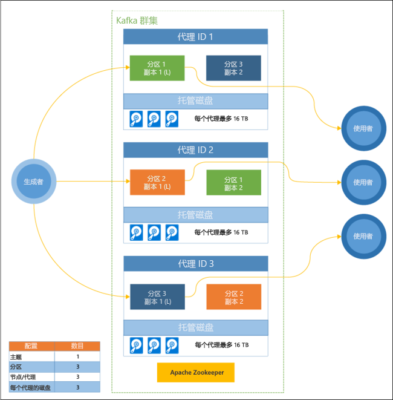

# Apache Kafka on HDInsight 简介

[Apache Kafka](https://kafka.apache.org) 是一个分布式流式处理平台，以开源方式提供，可用于构建实时流式处理数据管道和应用程序。 Kafka 还提供了类似于消息队列的消息中转站，可在其中发布和订阅命名数据流。 Kafka on HDInsight 可在 Microsoft Azure 云中提供高度可扩展和高度可用的托管服务。

## 为何要使用 Kafka on HDInsight？

Kafka on HDInsight 提供以下功能：

* __关于 Kafka 正常运行时间的 99.9% 服务级别协议 (SLA)__：有关详细信息，请参阅 [HDInsight 的 SLA 信息](https://azure.microsoft.com/support/legal/sla/hdinsight/v1_0/)文档。

* __容错__：在设计上，Kafka 采用机架的一维视图，它在某些环境中表现良好。 但是，在 Azure 之类的环境中，机架被分为二维 - 更新域 (UD) 和容错域 (FD)。 Microsoft 提供相应的工具用于重新均衡不同 UD 和 FD 中的分区与副本。 

    有关详细信息，请参阅[使用 Kafka on HDInsight 实现高可用性](apache-kafka-high-availability.md)。

* **与 Azure 托管磁盘集成**：托管磁盘为 Kafka on HDInsight 使用的磁盘提供更高的规模和吞吐量，群集中每个节点提供高达 16 TB 的空间。

    有关为 Kafka on HDInsight 配置托管磁盘的信息，请参阅[提高 Kafka on HDInsight 的可伸缩性](apache-kafka-scalability.md)。

    有关托管磁盘的详细信息，请参阅 [Azure 托管磁盘](../../virtual-machines/windows/managed-disks-overview.md)。

* **警报、监视和预测性维护**：可以使用 Azure Log Analytics 来监视 Kafka on HDInsight。 Log Analytics 可以显示虚拟机级别的信息，例如磁盘和 NIC 指标，以及 Kafka 中的 JMX 指标。

    有关详细信息，请参阅[分析 Kafka on HDInsight 的日志](apache-kafka-log-analytics-operations-management.md)。

* **Kafka 数据复制**：Kafka 提供 MirrorMaker 实用工具，用于在 Kafka 群集之间复制数据。

    有关使用 MirrorMaker 的信息，请参阅[使用 Kafka on HDInsight 复制 Kafka 主题](apache-kafka-mirroring.md)。

* **群集缩放**：创建群集后，HDInsight 允许更改工作节点（托管 Kafka-broker）的数目。 工作负荷增加时，可以扩展群集；要降低成本，可以缩减群集。 可以通过 Azure 门户、Azure PowerShell 和其他 Azure 管理界面执行缩放。 对于 Kafka，在执行缩放操作后，应重新均衡分区副本。 重新均衡分区可让 Kafka 利用新的工作节点数。

    有关详细信息，请参阅[使用 Kafka on HDInsight 实现高可用性](apache-kafka-high-availability.md)。

* **发布-订阅消息传送模式**：Kafka 提供一个生成者 API，用于将记录发布到 Kafka 主题。 订阅主题时，将使用 Consumer API。

    有关详细信息，请参阅 [Kafka on HDInsight 入门](apache-kafka-get-started.md)。

* **流处理**：Kafka 通常与 Apache Storm 或 Spark 配合使用，以实现实时流式处理。 Kafka 0.10.0.0（HDInsight 版本 3.5 和 3.6）引入了流式处理 API，可用于构建流式处理解决方案，而无需使用 Storm 或 Spark。

    有关详细信息，请参阅 [Kafka on HDInsight 入门](apache-kafka-get-started.md)。

* **横向缩放**：Kafka 可将 HDInsight 群集中不同节点之间的流进行分区。 使用者进程可与单个分区关联，以便在使用记录时提供负载均衡。

    有关详细信息，请参阅 [Kafka on HDInsight 入门](apache-kafka-get-started.md)。

* **有序传送**：在每个分区中，记录按接收顺序存储在流中。 通过为每个分区关联一个使用者进程，可保证按顺序处理记录。

    有关详细信息，请参阅 [Kafka on HDInsight 入门](apache-kafka-get-started.md)。

## 用例

* **消息传送**：由于 Kafka 支持发布-订阅消息模式，因此它通常用作消息中转站。

* **活动跟踪**：由于 Kafka 提供按顺序进行日志记录的记录，因此它还可用于跟踪和重新创建活动。 例如，网站上或应用程序内的用户操作。

* **聚合**：使用流处理可从不同的流中聚合信息，将信息合并和集中到操作数据中。

* **转换**：使用流处理可将多个输入主题中的数据合并到一个或多个输出主题中，丰富其内容。

## 体系结构

下图显示了一个典型 Kafka 配置，该配置利用使用者组、分区和复制提供带容错功能的事件并行读取。 Apache ZooKeeper 专为并发、能恢复和低延迟的事务构建，因为它管理 Kafka 群集的状态。 Kafka 将记录存储在主题中。 记录由生成者生成，由使用者使用。 生成者从 Kafka 代理检索记录。 HDInsight 群集中的每个辅助角色节点都是 Kafka 代理。 将为每个使用者创建一个分区，从而允许对流数据进行并行处理。 利用复制功能将分区分布到各个节点上，以防止发生节点（中转站）服务中断。 用 *(L)* 表示的分区是给定分区的前导者。 生成方流量将根据由 ZooKeeper 管理的状态路由到每个节点的前导者。

每个 Kafka 中转站都使用 Azure 托管磁盘。 磁盘数是用户定义的，可以为每个中转站提供高达 16 TB 的存储。

> [!IMPORTANT]
> Kafka 无法识别 Azure 数据中心内的基础硬件（机架）。 若要确保正确均衡底层硬件上的分区，请参阅[配置数据的高可用性 (Kafka)](apache-kafka-high-availability.md) 文档。

## 后续步骤

使用以下链接了解如何使用 Apache Kafka on HDInsight：

* [Kafka on HDInsight 入门](apache-kafka-get-started.md)

* [使用 MirrorMaker 创建 Kafka on HDInsight 的副本](apache-kafka-mirroring.md)

* [将 Apache Storm 与 Kafka on HDInsight 结合使用](../hdinsight-apache-storm-with-kafka.md)

* [将 Apache Spark 与 Kafka on HDInsight 结合使用](../hdinsight-apache-spark-with-kafka.md)

* [通过 Azure 虚拟网络连接到 Kafka](apache-kafka-connect-vpn-gateway.md)