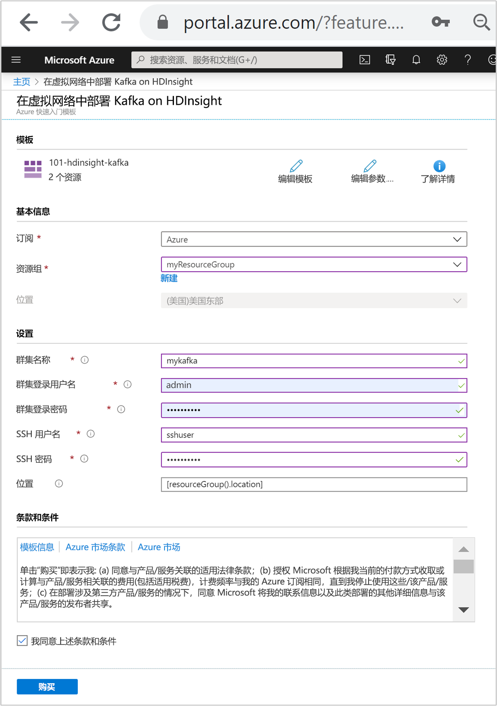
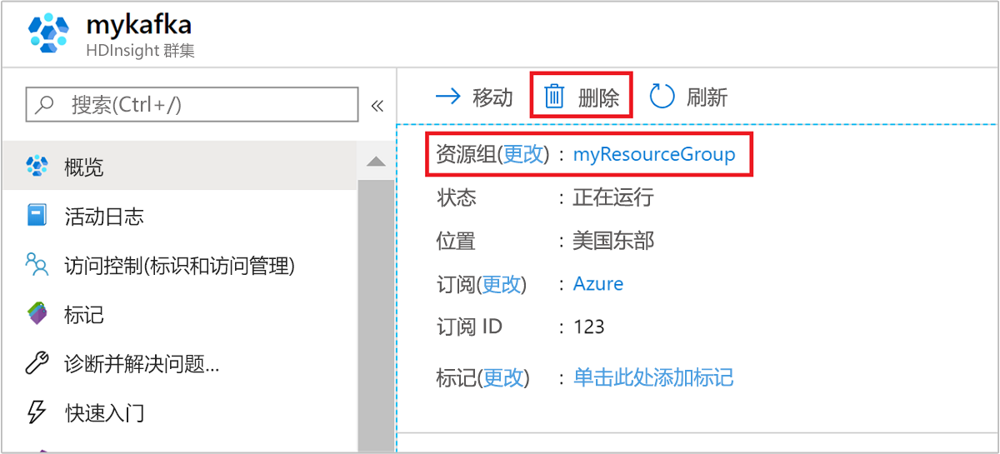

# <a name="quickstart-create-apache-kafka-cluster-in-azure-hdinsight-using-resource-manager-template"></a>快速入门：使用资源管理器模板在 Azure HDInsight 中创建 Apache Kafka 群集

在本快速入门中，我们使用 Azure 资源管理器模板在 Azure HDInsight 中创建一个 [Apache Kafka](./apache-kafka-introduction.md) 群集。 Kafka 是开源分布式流式处理平台。 通常用作消息代理，因为它可提供类似于发布-订阅消息队列的功能。

[!INCLUDE [About Azure Resource Manager](../../../includes/resource-manager-quickstart-introduction.md)]

仅可通过相同虚拟网络内的资源访问 Kafka API。 本快速入门使用 SSH 直接访问群集。 若要将其他服务、网络或虚拟机连接到 Kafka，则必须首先创建虚拟机，然后才能在网络中创建资源。 有关详细信息，请参阅[使用虚拟网络连接到 Apache Kafka](apache-kafka-connect-vpn-gateway.md) 文档。

如果没有 Azure 订阅，请在开始之前创建一个[免费帐户](https://azure.microsoft.com/free/?WT.mc_id=A261C142F)。

## <a name="create-an-apache-kafka-cluster"></a>创建 Apache Kafka 群集

### <a name="review-the-template"></a>查看模板

本快速入门中使用的模板来自 [Azure 快速入门模板](https://github.com/Azure/azure-quickstart-templates/tree/master/101-hdinsight-kafka)。

:::code language="json" source="~/quickstart-templates/101-hdinsight-kafka/azuredeploy.json" range="1-150":::

该模板中定义了两个 Azure 资源：

* [Microsoft.Storage/storageAccounts](https://docs.microsoft.com/azure/templates/microsoft.storage/storageaccounts)：创建 Azure 存储帐户。
* [Microsoft.HDInsight/cluster](https://docs.microsoft.com/azure/templates/microsoft.hdinsight/clusters)：创建 HDInsight 群集。

### <a name="deploy-the-template"></a>部署模板

1. 选择下面的“部署到 Azure”按钮以登录到 Azure，并打开资源管理器模板  。

    <a href="https://portal.azure.com/#create/Microsoft.Template/uri/https%3A%2F%2Fraw.githubusercontent.com%2FAzure-Samples%2Fhdinsight-kafka-java-get-started%2Fmaster%2Fazuredeploy.json" target="_blank"></a>

1. 输入或选择下列值：

    |properties |说明 |
    |---|---|
    |订阅|从下拉列表中选择用于此群集的 Azure 订阅。|
    |资源组|从下拉列表中选择现有资源组，或选择“新建”  。|
    |位置|将使用用于资源组的位置自动填充此值。|
    |群集名称|输入任何全局唯一的名称。 对于此模板，请只使用小写字母和数字。|
    |群集登录用户名|提供用户名，默认值为 **admin**。|
    |群集登录密码|提供密码。 密码长度不得少于 10 个字符，且至少必须包含一个数字、一个大写字母和一个小写字母、一个非字母数字字符（' " ` 字符除外）。 |
    |SSH 用户名|提供用户名，默认值为 **sshuser**|
    |SSH 密码|提供密码。|

    

1. 查看“条款和条件”  。 接着选择“我同意上述条款和条件”，然后选择“购买”   。 你会收到一则通知，说明正在进行部署。 创建群集大约需要 20 分钟时间。

## <a name="review-deployed-resources"></a>查看已部署的资源

创建群集后，你会收到“部署成功”通知，通知中附有“转到资源”链接   。 “资源组”页会列出新的 HDInsight 群集以及与该群集关联的默认存储。 每个群集都有一个 [Azure 存储帐户](../hdinsight-hadoop-use-blob-storage.md)或 [Azure Data Lake Storage 帐户](../hdinsight-hadoop-use-data-lake-store.md)依赖项。 该帐户称为默认存储帐户。 HDInsight 群集及其默认存储帐户必须共存于同一个 Azure 区域中。 删除群集不会删除存储帐户。

## <a name="get-the-apache-zookeeper-and-broker-host-information"></a>获取 Apache Zookeeper 主机和代理主机信息

使用 Kafka 时，必须了解 Apache Zookeeper 和代理主机   。 这些主机配合 Kafka API 和 Kafka 随附的许多实用工具一起使用。

在本部分中，可以从群集上的 Ambari REST API 获取主机信息。

1. 使用 [ssh 命令](../hdinsight-hadoop-linux-use-ssh-unix.md)连接到群集。 编辑以下命令，将 CLUSTERNAME 替换为群集的名称，然后输入该命令：

    ```cmd
    ssh sshuser@CLUSTERNAME-ssh.azurehdinsight.net
    ```

1. 进行 SSH 连接时，使用以下命令安装 `jq` 实用程序。 此实用工具用于分析 JSON 文档且有助于检索主机的信息：

    ```bash
    sudo apt -y install jq
    ```

1. 若要将环境变量设置为群集名称，请使用以下命令：

    ```bash
    read -p "Enter the Kafka on HDInsight cluster name: " CLUSTERNAME
    ```

    出现提示时，请输入 Kafka 群集的名称。

1. 若要使用 Zookeeper 主机信息来设置环境变量，请使用以下命令。 此命令检索所有 Zookeeper 主机，然后仅返回前两个条目。 这是由于某个主机无法访问时，需要一些冗余。

    ```bash
    export KAFKAZKHOSTS=`curl -sS -u admin -G https://$CLUSTERNAME.azurehdinsight.net/api/v1/clusters/$CLUSTERNAME/services/ZOOKEEPER/components/ZOOKEEPER_SERVER | jq -r '["\(.host_components[].HostRoles.host_name):2181"] | join(",")' | cut -d',' -f1,2`
    ```

    出现提示时，请输入群集登录帐户（不是 SSH 帐户）的密码。

1. 若要验证是否已正确设置了环境变量，请使用以下命令：

    ```bash
     echo '$KAFKAZKHOSTS='$KAFKAZKHOSTS
    ```

    此命令返回类似于以下文本的信息：

    `zk0-kafka.eahjefxxp1netdbyklgqj5y1ud.ex.internal.cloudapp.net:2181,zk2-kafka.eahjefxxp1netdbyklgqj5y1ud.ex.internal.cloudapp.net:2181`

1. 若要使用 Kafka 代理主机信息来设置环境变量，请使用以下命令：

    ```bash
    export KAFKABROKERS=`curl -sS -u admin -G https://$CLUSTERNAME.azurehdinsight.net/api/v1/clusters/$CLUSTERNAME/services/KAFKA/components/KAFKA_BROKER | jq -r '["\(.host_components[].HostRoles.host_name):9092"] | join(",")' | cut -d',' -f1,2`
    ```

    出现提示时，请输入群集登录帐户（不是 SSH 帐户）的密码。

1. 若要验证是否已正确设置了环境变量，请使用以下命令：

    ```bash
    echo '$KAFKABROKERS='$KAFKABROKERS
    ```

    此命令返回类似于以下文本的信息：

    `wn1-kafka.eahjefxxp1netdbyklgqj5y1ud.cx.internal.cloudapp.net:9092,wn0-kafka.eahjefxxp1netdbyklgqj5y1ud.cx.internal.cloudapp.net:9092`

## <a name="manage-apache-kafka-topics"></a>管理 Apache Kafka 主题

Kafka 在主题中存储数据流  。 可以使用 `kafka-topics.sh` 实用工具来管理主题。

* 若要创建主题，请在 SSH 连接中使用以下命令  ：

    ```bash
    /usr/hdp/current/kafka-broker/bin/kafka-topics.sh --create --replication-factor 3 --partitions 8 --topic test --zookeeper $KAFKAZKHOSTS
    ```

    此命令使用存储在 `$KAFKAZKHOSTS` 中的主机信息连接到 Zookeeper， 然后创建名为 **test** 的 Kafka 主题。

    * 本主题中存储的数据已分区到八个分区。

    * 每个分区在群集中的三个辅助角色节点上进行复制。

        如果在 Azure 区域中已创建提供三个容错域的群集，则复制因子使用 3。 否则，复制因子使用 4.
        
        在具有三个容错域的区域中，复制因子为 3 可让副本分布在容错域中。 在具有两个容错域的区域中，复制因子为 4 可将副本均匀分布在域中。
        
        有关区域中容错域数的信息，请参阅 [Linux 虚拟机的可用性](../../virtual-machines/windows/manage-availability.md#use-managed-disks-for-vms-in-an-availability-set)文档。

        Kafka 不识别 Azure 容错域。 在创建主题的分区副本时，它可能未针对高可用性正确分发副本。

        若要确保高可用性，请使用 [Apache Kafka 分区重新均衡工具](https://github.com/hdinsight/hdinsight-kafka-tools)。 必须通过 SSH 连接运行此工具，以便连接到 Kafka 群集的头节点。

        为确保 Kafka 数据的最高可用性，应在出现以下情况时为主题重新均衡分区副本：

        * 创建新主题或分区

        * 纵向扩展群集

* 若要列出主题，请使用以下命令  ：

    ```bash
    /usr/hdp/current/kafka-broker/bin/kafka-topics.sh --list --zookeeper $KAFKAZKHOSTS
    ```

    此命令列出 Kafka 群集上可用的主题。

* 若要删除主题，使用以下命令  ：

    ```bash
    /usr/hdp/current/kafka-broker/bin/kafka-topics.sh --delete --topic topicname --zookeeper $KAFKAZKHOSTS
    ```

    此命令删除名为 `topicname` 的主题。

    > [!WARNING]  
    > 如果删除了之前创建的 `test` 主题，则必须重新创建。 稍后会在本文档中使用此主题。

有关适用于 `kafka-topics.sh` 实用工具的命令的详细信息，请使用以下命令：

```bash
/usr/hdp/current/kafka-broker/bin/kafka-topics.sh
```

## <a name="produce-and-consume-records"></a>生成和使用记录

Kafka 将记录  存储在主题中。 记录由生成者  生成，由使用者  使用。 生产者与使用者通过 Kafka 代理服务通信  。 HDInsight 群集中的每个工作节点都是 Kafka 代理主机。

若要将记录存储到之前创建的测试主题，并通过使用者对其进行读取，请使用以下步骤：

1. 若要为该主题写入记录，请从 SSH 连接使用 `kafka-console-producer.sh` 实用工具：

    ```bash
    /usr/hdp/current/kafka-broker/bin/kafka-console-producer.sh --broker-list $KAFKABROKERS --topic test
    ```

    此命令之后是一个空行。

1. 在空行中键入文本消息，然后点击 Enter。 以这种方式输入一些消息，然后使用 **Ctrl + C** 返回到正常的提示符处。 每行均作为单独的记录发送到 Kafka 主题。

1. 若要读取该主题的记录，请从 SSH 连接使用 `kafka-console-consumer.sh` 实用工具：

    ```bash
    /usr/hdp/current/kafka-broker/bin/kafka-console-consumer.sh --bootstrap-server $KAFKABROKERS --topic test --from-beginning
    ```

    此命令从主题中检索并显示记录。 使用 `--from-beginning` 告知使用者从流的开头开始，以检索所有记录。

    如果使用的是较旧版本的 Kafka，请将 `--bootstrap-server $KAFKABROKERS` 替换为 `--zookeeper $KAFKAZKHOSTS`。

1. 使用 __Ctrl + C__ 阻止使用者。

还可以以编程方式创建生产者和使用者。 有关如何使用此 API 的示例，请参阅[将 Apache Kafka 生产者和使用者 API 与 HDInsight 配合使用](apache-kafka-producer-consumer-api.md)文档。

## <a name="clean-up-resources"></a>清理资源

完成本快速入门后，可以删除群集。 有了 HDInsight，便可以将数据存储在 Azure 存储中，因此可以在群集不用时安全地删除群集。 此外，还需要为 HDInsight 群集付费，即使不用也是如此。 由于群集费用数倍于存储空间费用，因此在群集不用时删除群集可以节省费用。

从 Azure 门户导航到群集，然后选择“删除”。 



还可以选择资源组名称来打开“资源组”页，然后选择“删除资源组”  。 通过删除资源组，可以删除 HDInsight 群集和默认存储帐户。

## <a name="next-steps"></a>后续步骤

在本快速入门中，你已了解了如何使用资源管理器模板在 HDInsight 中创建 Apache Kafka 群集。 下一篇文章介绍如何创建一个使用 Apache Kafka Streams API 的应用程序并在 Kafka on HDInsight 上运行该应用程序。

> [!div class="nextstepaction"]
> [在 Azure HDInsight 中使用 Apache Kafka Streams API](./apache-kafka-streams-api.md)
