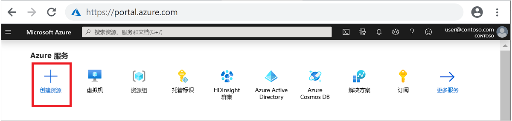
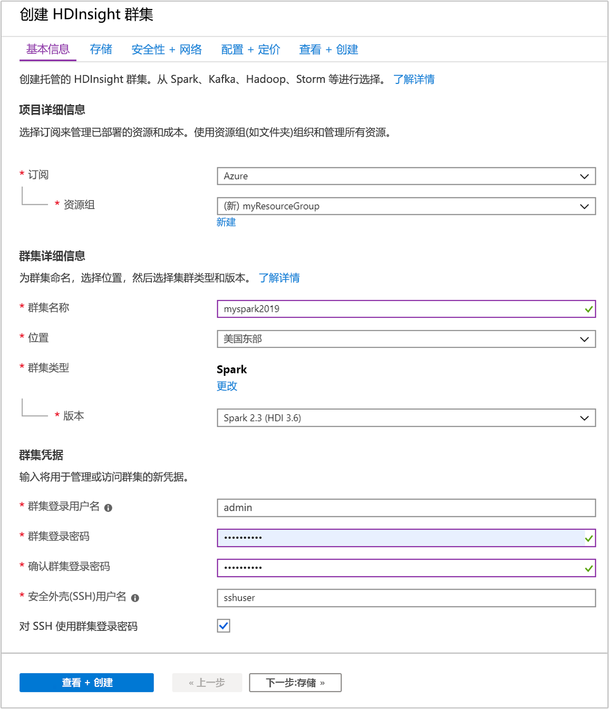
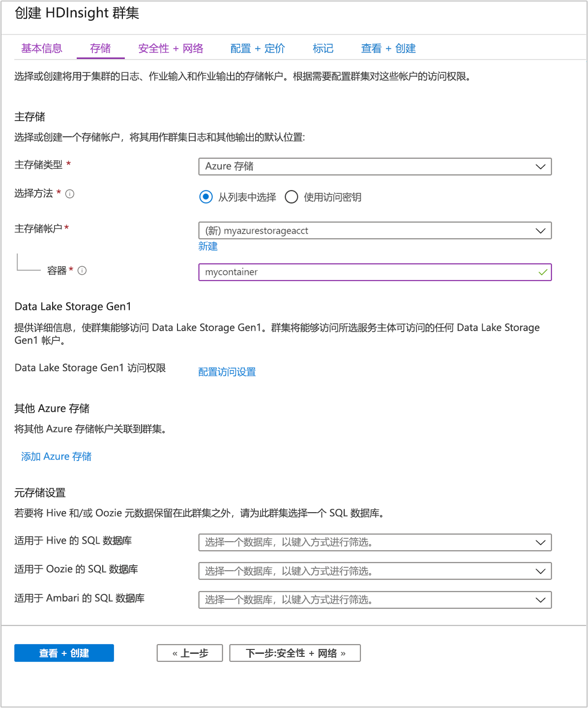
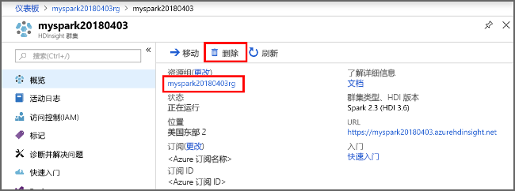

# <a name="quickstart-create-apache-spark-cluster-in-azure-hdinsight-using-azure-portal"></a>快速入门：使用 Azure 门户在 Azure HDInsight 中创建 Apache Spark 群集

在本快速入门中，你将使用 Azure 门户在 Azure HDInsight 中创建 Apache Spark 群集。 然后你将创建一个 Jupyter 笔记本，并使用它来针对 Apache Hive 表运行 Spark SQL 查询。 Azure HDInsight 是适用于企业的分析服务，具有托管、全面且开源的特点。 用于 HDInsight 的 Apache Spark 框架使用内存中处理功能实现快速数据分析和群集计算。 使用 Jupyter 笔记本，可以与数据进行交互、将代码和 Markdown 文本结合使用，以及进行简单的可视化。

有关可用配置的详细说明，请参阅[在 HDInsight 中设置群集](../hdinsight-hadoop-provision-linux-clusters.md)。 有关使用门户创建群集的详细信息，请参阅[在门户中创建群集](../hdinsight-hadoop-create-linux-clusters-portal.md)。

如果将多个群集一起使用，则需创建一个虚拟网络；如果使用的是 Spark 群集，则还需使用 Hive Warehouse Connector。 有关详细信息，请参阅[为 Azure HDInsight 规划虚拟网络](../hdinsight-plan-virtual-network-deployment.md)和[将 Apache Spark 和 Apache Hive 与 Hive Warehouse Connector 集成](../interactive-query/apache-hive-warehouse-connector.md)。

> [!IMPORTANT]  
> HDInsight 群集是基于分钟按比例收费，而不管用户是否正在使用它们。 请务必在使用完之后删除群集。 有关详细信息，请参阅本文的[清理资源](#clean-up-resources)部分。

## <a name="prerequisites"></a>先决条件

具有活动订阅的 Azure 帐户。 [免费创建帐户](https://azure.microsoft.com/free/?ref=microsoft.com&utm_source=microsoft.com&utm_medium=docs&utm_campaign=visualstudio)。

## <a name="create-an-apache-spark-cluster-in-hdinsight"></a>在 HDInsight 中创建 Apache Spark 群集

你将使用 Azure 门户创建一个 HDInsight 群集，它使用 Azure 存储 Blob 作为群集存储。 有关使用 Data Lake Storage Gen2 的详细信息，请参阅[快速入门：在 HDInsight 中设置群集](../../storage/data-lake-storage/quickstart-create-connect-hdi-cluster.md)。

1. 登录 [Azure 门户](https://portal.azure.com/)。

1. 在顶部菜单中，选择“+ 创建资源”  。

    

1. 选择“分析”   >   “Azure HDInsight”，转到“创建 HDInsight 群集”  页。

1. 在“基本信息”选项卡中提供以下信息： 

    |properties  |说明  |
    |---------|---------|
    |订阅  | 从下拉列表中选择用于此群集的 Azure 订阅。 |
    |资源组 | 从下拉列表中选择现有资源组，或选择“新建”  。|
    |群集名称 | 输入任何全局唯一的名称。|
    |区域   | 从下拉列表中，选择在其中创建群集的区域。 |
    |群集类型| 选择“选择群集类型”，打开一个列表。 从列表中选择“Spark”  。|
    |群集版本|选择群集类型后，此字段中将自动填充默认版本。|
    |群集登录用户名| 输入群集登录用户名。  默认名称为 **admin**。在此快速入门中稍后使用该帐户登录到 Jupyter notebook。 |
    |群集登录密码| 输入群集登录密码。 |
    |安全外壳 (SSH) 用户名| 输入 SSH 用户名。 用于此快速入门的 SSH 用户名为“sshuser”  。 默认情况下，此帐户的密码与群集登录用户名帐户的密码相同  。 |

    

    在完成时选择“下一步:  存储 >>”转到“存储”页  。

1. 在“存储”下，提供以下值  ：

    |properties  |说明  |
    |---------|---------|
    |主存储类型|使用默认值“Azure 存储”。 |
    |选择方法|使用默认值“从列表中选择”。 |
    |主存储帐户|使用自动填充的值。|
    |容器|使用自动填充的值。|

    

    选择“查看 + 创建”以继续。 

1. 在“查看 + 创建”下，选择“创建”。   创建群集大约需要 20 分钟时间。 必须先创建群集，才能继续下一会话。

如果在创建 HDInsight 群集时遇到问题，可能是因为你没有这样做的适当权限。 有关详细信息，请参阅[访问控制要求](../hdinsight-hadoop-customize-cluster-linux.md#access-control)。

## <a name="create-a-jupyter-notebook"></a>创建 Jupyter 笔记本

Jupyter Notebook 是支持各种编程语言的交互式笔记本环境。 通过此笔记本可以与数据进行交互、结合代码和 markdown 文本以及执行简单的可视化效果。

1. 在 Web 浏览器中导航到 `https://CLUSTERNAME.azurehdinsight.net/jupyter`，其中的 `CLUSTERNAME` 是群集的名称。 出现提示时，请输入群集的群集登录凭据。

1. 选择“新建” > “PySpark”，创建笔记本   。

   

   新笔记本随即已创建，并以 Untitled(Untitled.pynb) 名称打开。

## <a name="run-apache-spark-sql-statements"></a>运行 Apache Spark SQL 语句

SQL（结构化查询语言）是用于查询和定义数据的最常见、最广泛使用的语言。 Spark SQL 作为 Apache Spark 的扩展使用，可使用熟悉的 SQL 语法处理结构化数据。

1. 验证 kernel 已就绪。 如果在 Notebook 中的内核名称旁边看到空心圆，则内核已准备就绪。 实心圆表示内核正忙。

    

    首次启动 Notebook 时，内核在后台执行一些任务。 等待内核准备就绪。

1. 将以下代码粘贴到一个空单元格中，然后按 **SHIFT + ENTER** 来运行这些代码。 此命令列出群集上的 Hive 表：

    ```PySpark
    %%sql
    SHOW TABLES
    ```

    将 Jupyter Notebook 与 HDInsight 群集配合使用时，会获得一个预设的 `sqlContext`，可以使用它通过 Spark SQL 来运行 Hive 查询。 `%%sql` 指示 Jupyter Notebook 使用预设 `sqlContext` 运行 Hive 查询。 该查询从默认情况下所有 HDInsight 群集都带有的 Hive 表 (hivesampletable  ) 检索前 10 行。 需要大约 30 秒才能获得结果。 输出如下所示：

    

    每次在 Jupyter 中运行查询时，Web 浏览器窗口标题中都会显示“(繁忙)”  状态和 Notebook 标题。 右上角“PySpark”  文本的旁边还会出现一个实心圆。

1. 运行另一个查询，请查看 `hivesampletable` 中的数据。

    ```PySpark
    %%sql
    SELECT * FROM hivesampletable LIMIT 10
    ```

    屏幕在刷新后会显示查询输出。

    

1. 请在 Notebook 的“文件”菜单中选择“关闭并停止”   。 关闭 Notebook 会释放群集资源。

## <a name="clean-up-resources"></a>清理资源

HDInsight 将数据保存在 Azure 存储或 Azure Data Lake Storage 中，因此可以在未使用群集时安全地删除群集。 此外，还需要为 HDInsight 群集付费，即使不用也是如此。 由于群集费用数倍于存储空间费用，因此在群集不用时删除群集可以节省费用。 如果要立即开始[后续步骤](#next-steps)中所列的教程，可能需要保留群集。

切换回 Azure 门户，并选择“删除”  。



还可以选择资源组名称来打开“资源组”页，然后选择“删除资源组”  。 通过删除资源组，可以删除 HDInsight 群集和默认存储帐户。

## <a name="next-steps"></a>后续步骤

在本快速入门中，你已了解如何在 HDInsight 中创建 Apache Spark 群集并运行基本的 Spark SQL 查询。 转到下一教程，了解如何使用 HDInsight 群集针对示例数据运行交互式查询。

> [!div class="nextstepaction"]
> [在 Apache Spark 上运行交互式查询](./apache-spark-load-data-run-query.md)
