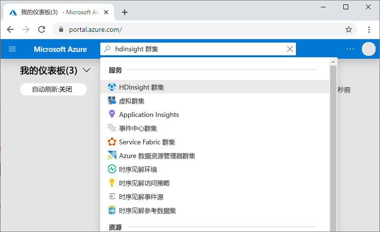
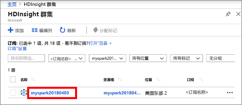
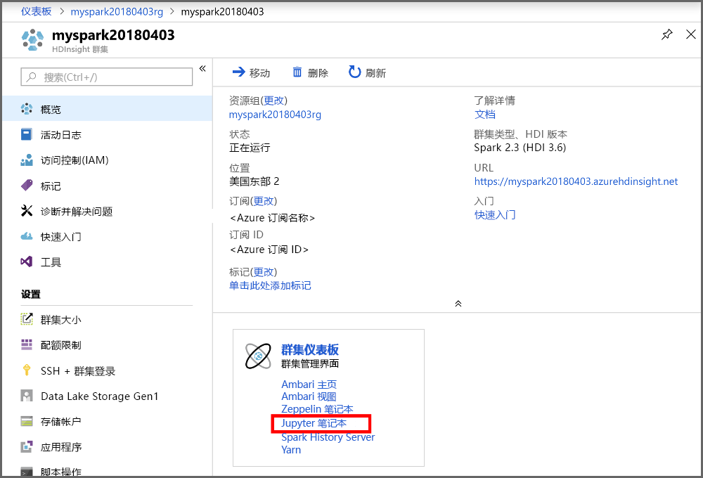
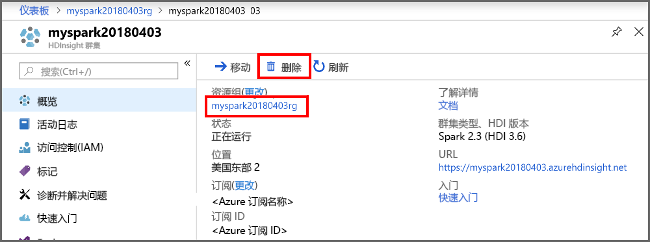

# <a name="quickstart-create-apache-spark-cluster-in-azure-hdinsight-using-powershell"></a>快速入门：使用 PowerShell 在 Azure HDInsight 中创建 Apache Spark 群集

在本快速入门中，我们使用 Azure PowerShell 在 Azure HDInsight 中创建 Apache Spark 群集。 然后，我们创建一个 Jupyter 笔记本，并使用它针对 Apache Hive 表运行 Spark SQL 查询。 Azure HDInsight 是适用于企业的分析服务，具有托管、全面且开源的特点。 用于 Azure HDInsight 的 Apache Spark 框架允许使用内存中处理功能实现快速数据分析和群集计算。 使用 Jupyter 笔记本，可以与数据进行交互、将代码和 Markdown 文本结合使用，以及进行简单的可视化。

[概述：Azure HDInsight 上的 Apache Spark](apache-spark-overview.md) | [Apache Spark](https://spark.apache.org/) | [Apache Hive](https://hive.apache.org/) | [Jupyter Notebook](https://jupyter.org/)

如果将多个群集一起使用，则需创建一个虚拟网络；如果使用的是 Spark 群集，则还需使用 Hive Warehouse Connector。 有关详细信息，请参阅[为 Azure HDInsight 规划虚拟网络](../hdinsight-plan-virtual-network-deployment.md)和[将 Apache Spark 和 Apache Hive 与 Hive Warehouse Connector 集成](../interactive-query/apache-hive-warehouse-connector.md)。

## <a name="prerequisite"></a>先决条件

- 具有活动订阅的 Azure 帐户。 [免费创建帐户](https://azure.microsoft.com/free/?ref=microsoft.com&utm_source=microsoft.com&utm_medium=docs&utm_campaign=visualstudio)。
- [PowerShell Az 模块](https://docs.microsoft.com/powershell/azure/install-az-ps)。

## <a name="create-an-apache-spark-cluster-in-hdinsight"></a>在 HDInsight 中创建 Apache Spark 群集

> [!IMPORTANT]  
> HDInsight 群集是基于分钟按比例收费，而不管用户是否正在使用它们。 请务必在使用完之后删除群集。 有关详细信息，请参阅本文的[清理资源](#clean-up-resources)部分。

创建 HDInsight 群集包括创建以下 Azure 对象和资源：

- Azure 资源组。 Azure 资源组是 Azure 资源的容器。
- Azure 存储帐户或 Azure Data Lake Storage。  每个 HDInsight 群集都需要依赖的数据存储。 在本快速入门中，我们创建的群集使用 Azure 存储 Blob 作为群集存储。 有关使用 Data Lake Storage Gen2 的详细信息，请参阅[快速入门：在 HDInsight 中设置群集](../../storage/data-lake-storage/quickstart-create-connect-hdi-cluster.md)。
- 在 HDInsight 上的一个群集类型不同的群集。  在本快速入门中，你将创建 Spark 2.3 群集。

使用 PowerShell 脚本创建资源。 

[!INCLUDE [updated-for-az](../../../includes/updated-for-az.md)]

运行 PowerShell 脚本时，系统会提示输入以下值：

|参数|值|
|------|------|
|Azure 资源组名称 | 提供资源组的唯一名称。|
|位置| 指定 Azure 区域，例如“美国中部”。 |
|默认存储帐户名 | 为存储帐户提供唯一名称。 |
|群集名称 | 为 HDInsight Spark 群集提供唯一名称。|
|群集登录凭据 | 在本快速入门中稍后使用该帐户连接到群集仪表板。|
|SSH 用户凭据 | SSH 客户端可用于创建与 HDInsight 中的群集进行的远程命令行会话。|

1. 选择以下代码块右上角的“试一试”，打开 [Azure Cloud Shell](../../cloud-shell/overview.md)，然后按照说明连接到 Azure  。

2. 在 Cloud Shell 中复制并粘贴以下 PowerShell 脚本。

    ```azurepowershell-interactive
    ### Create a Spark 2.3 cluster in Azure HDInsight

    # Default cluster size (# of worker nodes), version, and type
    $clusterSizeInNodes = "1"
    $clusterVersion = "3.6"
    $clusterType = "Spark"

    # Create the resource group
    $resourceGroupName = Read-Host -Prompt "Enter the resource group name"
    $location = Read-Host -Prompt "Enter the Azure region to create resources in, such as 'Central US'"
    $defaultStorageAccountName = Read-Host -Prompt "Enter the default storage account name"

    New-AzResourceGroup -Name $resourceGroupName -Location $location

    # Create an Azure storage account and container
    # Note: Storage account kind BlobStorage can only be used as secondary storage for HDInsight clusters.
    New-AzStorageAccount `
        -ResourceGroupName $resourceGroupName `
        -Name $defaultStorageAccountName `
        -Location $location `
        -SkuName Standard_LRS `
        -Kind StorageV2 `
        -EnableHttpsTrafficOnly 1

    $defaultStorageAccountKey = (Get-AzStorageAccountKey `
                                    -ResourceGroupName $resourceGroupName `
                                    -Name $defaultStorageAccountName)[0].Value

    $defaultStorageContext = New-AzStorageContext `
                                    -StorageAccountName $defaultStorageAccountName `
                                    -StorageAccountKey $defaultStorageAccountKey

    # Create a Spark 2.3 cluster
    $clusterName = Read-Host -Prompt "Enter the name of the HDInsight cluster"

    # Cluster login is used to secure HTTPS services hosted on the cluster
    $httpCredential = Get-Credential -Message "Enter Cluster login credentials" -UserName "admin"

    # SSH user is used to remotely connect to the cluster using SSH clients
    $sshCredentials = Get-Credential -Message "Enter SSH user credentials" -UserName "sshuser"

    # Set the storage container name to the cluster name
    $defaultBlobContainerName = $clusterName

    # Create a blob container. This holds the default data store for the cluster.
    New-AzStorageContainer `
        -Name $clusterName `
        -Context $defaultStorageContext

    $sparkConfig = New-Object "System.Collections.Generic.Dictionary``2[System.String,System.String]"
    $sparkConfig.Add("spark", "2.3")

    # Create the cluster in HDInsight
    New-AzHDInsightCluster `
        -ResourceGroupName $resourceGroupName `
        -ClusterName $clusterName `
        -Location $location `
        -ClusterSizeInNodes $clusterSizeInNodes `
        -ClusterType $clusterType `
        -OSType "Linux" `
        -Version $clusterVersion `
        -ComponentVersion $sparkConfig `
        -HttpCredential $httpCredential `
        -DefaultStorageAccountName "$defaultStorageAccountName.blob.core.windows.net" `
        -DefaultStorageAccountKey $defaultStorageAccountKey `
        -DefaultStorageContainer $clusterName `
        -SshCredential $sshCredentials

    Get-AzHDInsightCluster `
        -ResourceGroupName $resourceGroupName `
        -ClusterName $clusterName
    ```

   创建群集大约需要 20 分钟时间。 必须先创建群集，才能继续下一会话。

如果在创建 HDInsight 群集时遇到问题，可能是因为你没有这样做的适当权限。 有关详细信息，请参阅[访问控制要求](../hdinsight-hadoop-customize-cluster-linux.md#access-control)。

## <a name="create-a-jupyter-notebook"></a>创建 Jupyter 笔记本

[Jupyter Notebook](https://jupyter.org/) 是支持各种编程语言的交互式笔记本环境。 通过此笔记本可以与数据进行交互、结合代码和 markdown 文本以及执行简单的可视化效果。

1. 在 [Azure 门户](https://portal.azure.com)中，搜索并选择“HDInsight 群集”。 
   
   
   
1. 从列表中选择已创建的群集。
   
   
   
1. 在群集“概览”页上选择“群集仪表板”，然后选择“Jupyter Notebook”    。 出现提示时，请输入群集的群集登录凭据。

   

1. 选择“新建” > “PySpark”，创建笔记本   。

   

   新笔记本随即已创建，并以 Untitled(Untitled.pynb) 名称打开。

## <a name="run-apache-spark-sql-statements"></a>运行 Apache Spark SQL 语句

SQL（结构化查询语言）是用于查询和定义数据的最常见、最广泛使用的语言。 Spark SQL 作为 Apache Spark 的扩展使用，可使用熟悉的 SQL 语法处理结构化数据。

1. 验证 kernel 已就绪。 如果在 Notebook 中的内核名称旁边看到空心圆，则内核已准备就绪。 实心圆表示内核正忙。

    

    首次启动 Notebook 时，内核在后台执行一些任务。 等待内核准备就绪。 
1. 将以下代码粘贴到一个空单元格中，然后按 **SHIFT + ENTER** 来运行这些代码。 此命令列出群集上的 Hive 表：

    ```PySpark
    %%sql
    SHOW TABLES
    ```

    将 Jupyter Notebook 与 HDInsight 中的 Spark 群集配合使用时，会获得一个预设的 `sqlContext`，用于通过 Spark SQL 运行 Hive 查询。 `%%sql` 指示 Jupyter Notebook 使用预设 `sqlContext` 运行 Hive 查询。 该查询从默认情况下所有 HDInsight 群集都带有的 Hive 表 (hivesampletable  ) 检索前 10 行。 需要大约 30 秒才能获得结果。 输出如下所示：

    

    每次在 Jupyter 中运行查询时，Web 浏览器窗口标题中都会显示“(繁忙)”  状态和 Notebook 标题。 右上角“PySpark”  文本的旁边还会出现一个实心圆。

1. 运行另一个查询，请查看 `hivesampletable` 中的数据。

    ```PySpark
    %%sql
    SELECT * FROM hivesampletable LIMIT 10
    ```

    屏幕在刷新后会显示查询输出。

    

1. 请在 Notebook 的“文件”菜单中选择“关闭并停止”   。 关闭 Notebook 会释放群集资源。

## <a name="clean-up-resources"></a>清理资源

HDInsight 将数据保存在 Azure 存储或 Azure Data Lake Storage 中，因此可以在未使用群集时安全地删除群集。 此外，还需要为 HDInsight 群集付费，即使不用也是如此。 由于群集费用数倍于存储空间费用，因此在群集不用时删除群集可以节省费用。 如果要立即开始[后续步骤](#next-steps)中所列的教程，可能需要保留群集。

切换回 Azure 门户，并选择“删除”  。



还可以选择资源组名称来打开“资源组”页，然后选择“删除资源组”  。 删除资源组即可删除 HDInsight 群集和默认存储帐户。

### <a name="piecemeal-clean-up-with-powershell-az-module"></a>使用 PowerShell Az 模块进行段落清理

```powershell
# Removes the specified HDInsight cluster from the current subscription.
Remove-AzHDInsightCluster `
    -ResourceGroupName $resourceGroupName `
    -ClusterName $clusterName

# Removes the specified storage container.
Remove-AzStorageContainer `
    -Name $clusterName `
    -Context $defaultStorageContext

# Removes a Storage account from Azure.
Remove-AzStorageAccount `
    -ResourceGroupName $resourceGroupName `
    -Name $defaultStorageAccountName

# Removes a resource group.
Remove-AzResourceGroup `
    -Name $resourceGroupName
```

## <a name="next-steps"></a>后续步骤

在本快速入门中，你已了解如何在 HDInsight 中创建 Apache Spark 群集并运行基本的 Spark SQL 查询。 转到下一教程，了解如何使用 HDInsight 群集针对示例数据运行交互式查询。

> [!div class="nextstepaction"]
> [在 Apache Spark 上运行交互式查询](./apache-spark-load-data-run-query.md)
