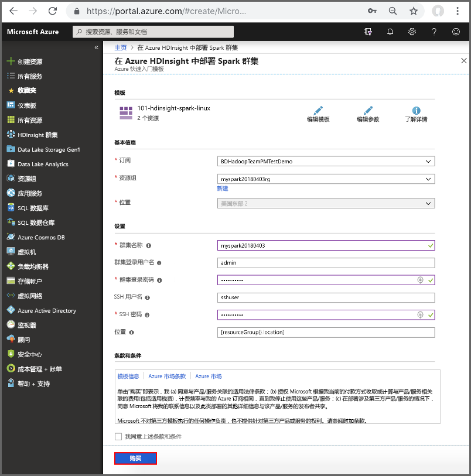
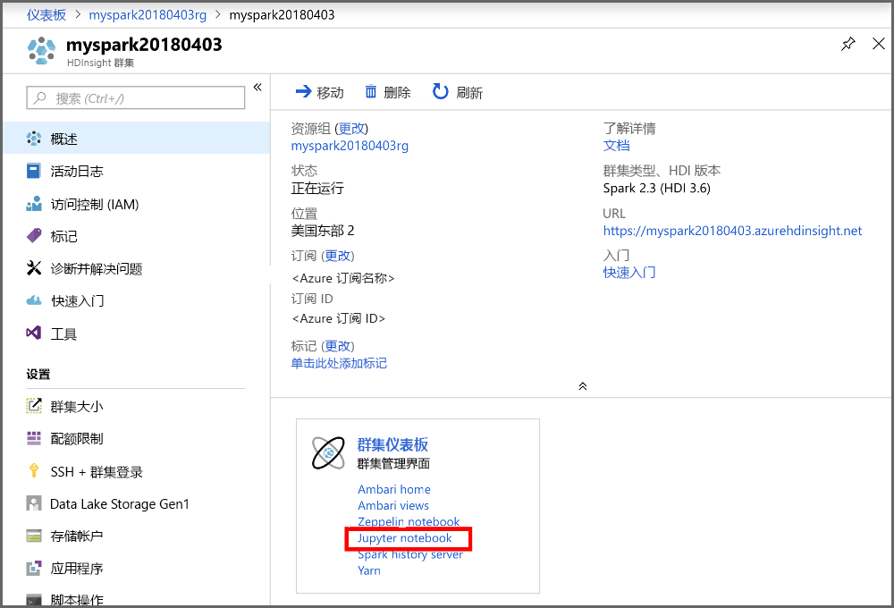

# <a name="create-an-apache-spark-cluster-in-azure-hdinsight"></a>在 Azure HDInsight 中创建 Apache Spark 群集

了解如何在 Azure HDInsight 上创建 Apache Spark 群集，以及如何对 Hive 表运行 Spark SQL 查询。 有关 Spark on HDInsight 的信息，请参阅[概述：Azure HDInsight 上的 Apache Spark](apache-spark-overview.md)。

## <a name="prerequisites"></a>先决条件

* **一个 Azure 订阅**。 在开始学习本教程之前，必须有一个 Azure 订阅。 请参阅[创建免费 Azure 帐户](https://azure.microsoft.com/free)。

## <a name="create-hdinsight-spark-cluster"></a>创建 HDInsight Spark 群集

使用 [Azure 资源管理器模板](../hdinsight-hadoop-create-linux-clusters-arm-templates.md)创建 HDInsight Spark 群集。 可以在 [GitHub](https://azure.microsoft.com/resources/templates/101-hdinsight-spark-linux/) 中找到该模板。 有关其他群集创建方法，请参阅 [Create HDInsight clusters](../hdinsight-hadoop-provision-linux-clusters.md)（创建 HDInsight 群集）。

1. 单击下面的图像即可在 Azure 门户中打开该模板。         

    <a href="https://portal.azure.com/#create/Microsoft.Template/uri/https%3A%2F%2Fraw.githubusercontent.com%2FAzure%2Fazure-quickstart-templates%2Fmaster%2F101-hdinsight-spark-linux%2Fazuredeploy.json" target="_blank"></a>

2. 输入以下值：

    

    * **订阅**：选择用于创建此群集的 Azure 订阅。
    * **资源组**：创建资源组，或选择现有的资源组。 资源组用于管理项目的 Azure 资源。
    * **位置**：选择资源组的位置。 模板将此位置用于创建群集，以及用于默认群集存储。
    * ClusterName：为要创建的 HDInsight 群集输入名称。
    * **群集登录名和密码**：默认登录名是 admin。选择用于群集登录的密码。
    * **SSH 用户名和密码**。 选择用于 SSH 用户的密码。

3. 选择“我同意上述条款和条件”，选择“固定到仪表板”，并单击“购买”。 此时会出现标题为“正在部署模板”的新磁贴。 创建群集大约需要 20 分钟时间。

如果在创建 HDInsight 群集时遇到问题，可能是因为没有这样做的适当权限。 有关详细信息，请参阅[访问控制要求](../hdinsight-administer-use-portal-linux.md#create-clusters)。

> [!NOTE]
> 本文创建的 Spark 群集使用 [Azure 存储 Blob 作为群集存储](../hdinsight-hadoop-use-blob-storage.md)。 还可以创建使用 [Azure Data Lake Store](../hdinsight-hadoop-use-data-lake-store.md) 作为默认存储的 Spark 群集。 有关说明，请参阅 [Create an HDInsight cluster with Data Lake Store](../../data-lake-store/data-lake-store-hdinsight-hadoop-use-portal.md)（创建包含 Data Lake Store 的 HDInsight 群集）。
>
>

## <a name="create-a-jupyter-notebook"></a>创建 Jupyter 笔记本

[Jupyter Notebook](http://jupyter.org) 是一种交互式的笔记本环境，支持各种编程语言，因此可以用来与数据交互、将代码与 Markdown 文本组合在一起，以及执行简单的可视化操作。 Spark on HDInsight 还包括 [Zeppelin Notebook](apache-spark-zeppelin-notebook.md)。 本教程使用 Jupyter Notebook。

**创建 Jupyter Notebook**

1. 打开 [Azure 门户](https://portal.azure.com/)。

2. 打开所创建的 Spark 群集。 有关说明，请参阅[列出和显示群集](../hdinsight-administer-use-portal-linux.md#list-and-show-clusters)。

3. 在门户中，单击“群集仪表板”，并单击“Jupyter Notebook”。 出现提示时，请输入群集的管理员凭据。

   

   > [!NOTE]
   > 也可以在浏览器中打开以下 URL 来访问群集的 Jupyter Notebook。 将 **CLUSTERNAME** 替换为群集的名称：
   >
   > `https://CLUSTERNAME.azurehdinsight.net/jupyter`
   >
   >
3. 单击“新建”，然后单击“Pyspark”以创建 Notebook。 HDInsight 群集上的 Jupyter Notebook 支持三种内核：**PySpark**、**PySpark3** 和 **Spark**。 本教程使用 **PySpark** 内核。 有关内核的详细信息以及使用 **PySpark** 的好处，请参阅[将 Jupyter Notebook 内核与 HDInsight 中的 Apache Spark 群集配合使用](apache-spark-jupyter-notebook-kernels.md)。

   

   新笔记本随即已创建，并以 Untitled(Untitled.pynb) 名称打开。

4. 在顶部单击笔记本名称，并根据需要输入友好名称。

    

## <a name="run-spark-sql-statements-on-a-hive-table"></a>针对 Hive 表运行 Spark SQL 语句

SQL（结构化查询语言）是用于查询和定义数据的最常见、最广泛使用的语言。 Spark SQL 作为 Apache Spark 的扩展使用，可使用熟悉的 SQL 语法处理结构化数据。

Spark SQL 同时支持将 SQL 和 HiveQL 作为查询语言。 其功能包括在 Python、Scala 和 Java 中绑定。 使用它，可以查询存储在多个位置的数据，例如外部数据库、结构化数据文件（示例：JSON）和 Hive 表。

若要通过示例来了解如何从 csv 文件而非 Hive 表读取数据，请参阅[在 HDInsight 中的 Spark 群集上运行交互式查询](apache-spark-load-data-run-query.md)。

**运行 Spark SQL 的步骤**

1. 首次启动 Notebook 时，内核在后台执行一些任务。 等待内核准备就绪。 如果在 Notebook 中的内核名称旁边看到空心圆，则内核已准备就绪。 实心圆表示内核正忙。

    

2. 内核准备就绪后，请将以下代码粘贴到一个空单元格中，然后按 **SHIFT + ENTER** 来运行这些代码。 此命令列出群集上的 Hive 表：

    ```PySpark
    %%sql
    SHOW TABLES
    ```
    将 Jupyter Notebook 与 HDInsight Spark 群集配合使用时，会获得一个预设的 `sqlContext`，可以使用它通过 Spark SQL 来运行 Hive 查询。 `%%sql` 指示 Jupyter Notebook 使用预设 `sqlContext` 运行 Hive 查询。 该查询从默认情况下所有 HDInsight 群集都带有的 Hive 表 (hivesampletable) 检索前 10 行。 需要大约 30 秒才能获得结果。 输出如下所示： 

    

    有关 `%%sql` magic 和预设上下文的详细信息，请参阅[适用于 HDInsight 群集的 Jupyter 内核](apache-spark-jupyter-notebook-kernels.md)。

    每次在 Jupyter 中运行查询时，Web 浏览器窗口标题中都会显示“(繁忙)”状态和 Notebook 标题。 右上角“PySpark”文本的旁边还会出现一个实心圆。
    
2. 运行另一个查询，请查看 `hivesampletable` 中的数据。

    ```PySpark
    %%sql
    SELECT * FROM hivesampletable LIMIT 10
    ```
    
    屏幕在刷新后会显示查询输出。

    

2. 请在 Notebook 的“文件”菜单中单击“关闭并停止”。 关闭 Notebook 会释放群集资源。

3. 如果计划稍后再完成后续步骤，请确保删除在本文中创建的 HDInsight 群集。 

[!INCLUDE [delete-cluster-warning](../../../includes/hdinsight-delete-cluster-warning.md)]

## <a name="next-steps"></a>后续步骤 

本文介绍了如何创建 HDInsight Spark 群集并运行基本的 Spark SQL 查询。 转到下一文章，了解如何使用 HDInsight Spark 群集针对示例数据运行交互式查询。

> [!div class="nextstepaction"]
>[在 HDInsight Spark 群集上运行交互式查询](apache-spark-load-data-run-query.md)


