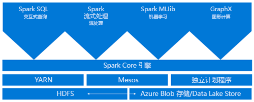
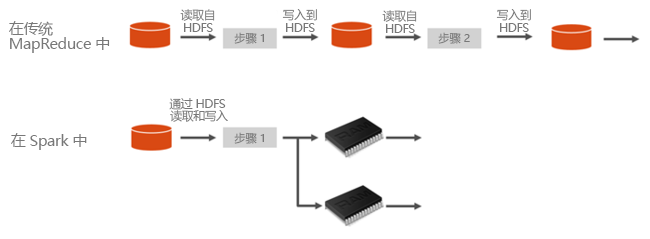
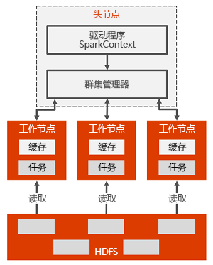

# HDInsight 上的 Spark 简介

本文介绍 HDInsight 上的 Spark。 <a href="http://spark.apache.org/" target="_blank">Apache Spark</a> 是一种开放源代码并行处理框架，支持内存中处理，以提升大数据分析应用程序的性能。 HDInsight 上的 Spark 群集兼容 Azure 存储 (WASB) 和 Azure Data Lake Store。 因此，存储在 Azure 中的现有数据可以轻松地通过 Spark 群集进行处理。

[!INCLUDE [hdinsight-price-change](../../../includes/hdinsight-enhancements.md)]

在 HDInsight 上创建 Spark 群集时，会创建已安装并配置了 Spark 的 Azure 计算资源。 在 HDInsight 中创建 Spark 群集只需要约 10 分钟。 系统将要处理的数据存储在 Azure 存储或 Azure Data Lake Store 中。 请参阅[将 Azure 存储与 HDInsight 配合使用](../hdinsight-hadoop-use-blob-storage.md)。

## Spark 与传统 MapReduce

什么使 Spark 运行快速？ Apache Spark 的体系结构与传统 MapReduce 有哪些不同，使其能够为数据共享提供更佳性能？

Spark 提供了用于内存中群集计算的基元。 Spark 作业可以将数据加载和缓存到内存中并重复地对其进行查询，比基于磁盘的系统更快速。 Spark 还集成到 Scala 编程语言中，让你可以像处理本地集合一样处理分布式数据集。 无需将所有内容构造为映射和化简操作。

在 Spark 中，操作之间的数据共享更快捷，因为数据在内存中。 相比之下，Hadoop 通过 HDFS 共享数据，所需处理时间更长。

## 什么是 Azure HDInsight 上的 Apache Spark？
HDInsight 上的 Spark 群集提供完全托管的 Spark 服务。 下面列出了在 HDInsight 上创建 Spark 群集的优势。

| 功能 | 说明 |
| --- | --- |
| 方便创建 Spark 群集 |可以使用 Azure 门户、Azure PowerShell 或 HDInsight .NET SDK，在几分钟之内于 HDInsight 上创建新的 Spark 群集。 请参阅 [HDInsight 中的 Spark 群集入门](apache-spark-jupyter-spark-sql.md) |
| 易于使用 |HDInsight 中的 Spark 群集包括 Jupyter 和 Zeppelin Notebook。 可以使用这些笔记本执行交互式数据处理和可视化。|
| REST API |HDInsight 中的 Spark 群集包含 [Livy](https://github.com/cloudera/hue/tree/master/apps/spark/java#welcome-to-livy-the-rest-spark-server)，它是基于 REST-API 的 Spark 作业服务器，用于远程提交和监视作业。 |
| 支持 Azure Data Lake Store | 可将 HDInsight 上的 Spark 群集配置为使用 Azure Data Lake Store 作为附加存储以及主存储（仅适用于 HDInsight 3.5 群集）。 有关 Data Lake Store 的详细信息，请参阅 [Azure Data Lake Store 概述](../../data-lake-store/data-lake-store-overview.md)。 |
| 与 Azure 服务集成 |HDInsight 上的 Spark 群集随附了 Azure 事件中心的连接器。 除了 Spark 提供的 [Kafka](http://kafka.apache.org/)之外，客户还可以使用事件中心来生成流式处理应用程序。 |
| 支持 R Server | 可以在 HDInsight Spark 群集上设置 R Server，以 Spark 群集承诺的速度运行分布式 R 计算。 有关详细信息，请参阅 [开始使用 HDInsight 上的 R Server](../r-server/r-server-get-started.md)。 |
| 与第三方 IDE 集成 | HDInsight 为 IntelliJ IDEA 和 Eclipse 之类的 IDE 提供插件，可以使用这些插件创建应用程序并将其提交到 HDInsight Spark 群集。 有关详细信息，请参阅[使用用于 IntelliJ IDEA 的 Azure 工具包](apache-spark-intellij-tool-plugin.md)和[使用用于 Eclipse 的 Azure 工具包](apache-spark-eclipse-tool-plugin.md)。|
| 并发查询 |HDInsight 中的 Spark 群集支持并发查询。 它允许一个用户运行多个查询，或者不同的用户运行多个查询，以及让应用程序共享相同的群集资源。 |
| SSD 缓存 |可以选择将数据缓存在内存中，或缓存在已附加到群集节点的 SSD 中。 内存缓存提供最佳的查询性能，但可能费用不菲；SSD 缓存是改善查询性能的绝佳选项，而且不需要根据内存中的整个数据集创建满足其需求的群集规模。 |
| 与 BI 工具集成 |HDInsight 上的 Spark 群集提供 BI 工具（如 [Power BI](http://www.powerbi.com/) 和 [Tableau](http://www.tableau.com/products/desktop)）的连接器，用于数据分析。 |
| 预先加载的 Anaconda 库 |HDInsight 上的 Spark 群集随附预先安装的 Anaconda 库。 [Anaconda](http://docs.continuum.io/anaconda/) 提供将近 200 个用于机器学习、数据分析、可视化等的库。 |
| 可伸缩性 |虽然可以在创建过程中指定群集中的节点数，但你可能需要扩大或收缩群集以匹配工作负载。 所有 HDInsight 群集允许更改群集中的节点数。 此外，由于所有数据都存储在 Azure 存储或 Data Lake Store 中，因此可以在不丢失数据的情况下删除 Spark 群集。 |
| 全天候支持 |HDInsight 上的 Spark 群集附有企业级的全天候支持和保证正常运行时间达 99.9% 的 SLA。 |

## Spark 群集体系结构

下面是 Spark 群集的体系结构和工作原理：

头节点包含 Spark 主服务器（用于管理应用程序数），应用将映射到 Spark 驱动程序。 每个应用由 Spark 主服务器以各种方式进行管理。 可以将 Spark 部署在 Mesos、YARN 或 Spark 群集管理器上，以便将工作节点资源分配给应用程序。 在 HDInsight 中，Spark 使用 YARN 群集管理器运行。 由 HDInsight 中的 Spark 主服务器管理群集中的资源。 这意味着 Spark 主服务器可以了解哪些资源（如内存）在工作节点上占用或可用。

驱动程序在工作节点上运行用户的主函数，并执行各种并行操作。 然后，驱动程序收集操作的结果。 工作节点从 Hadoop 分布式文件系统 (HDFS) 读取数据并将数据写入其中。 工作节点还将已转换数据作为弹性分布式数据集 (RDD) 缓存在内存中。

在 Spark 主服务器中创建应用后，Spark 主服务器将为应用分配资源，创建称为 Spark 驱动程序的执行程序。 Spark 驱动程序还会创建 SparkContext 并开始创建 RDD。 RDD 的元数据存储在 Spark 驱动程序中。

Spark 驱动程序连接到 Spark 主服务器，并负责将应用程序转换为单个任务的有向图 (DAG)，这些任务在工作节点上的执行程序进程中执行。 每个应用程序获取自己的执行程序进程，这些进程在整个应用程序持续时间内保留，并以多个线程运行任务。

## HDInsight 上的 Spark 有哪些用例？
HDInsight 中的 Spark 群集适用于以下主要方案：

### 交互式数据分析和 BI
[观看教程](apache-spark-use-bi-tools.md)

HDInsight 中的 Apache Spark 将数据存储在 Azure 存储或 Azure Data Lake Store 中。 商务专家和重要决策者可以利用这些数据来进行分析和创建报告，并使用 Microsoft Power BI 来根据分析数据生成交互式报告。 分析师可以从群集存储内的非结构化/半结构化数据着手，使用 Notebook 来定义数据的架构，并使用 Microsoft Power BI 生成数据模型。 HDInsight 中的 Spark 群集还支持 Tableau 等多种第三方 BI 工具，因此能成为数据分析师、商务专家和重要决策者的理想平台。

### Spark 机器学习
[查看教程：使用 HVAC 数据预测建筑物温度](apache-spark-ipython-notebook-machine-learning.md)

[查看教程：预测食品检测结果](apache-spark-machine-learning-mllib-ipython.md)

Apache Spark 随附 [MLlib](http://spark.apache.org/mllib/) - 构建在 Spark（可以从 HDInsight 中的 Spark 群集使用）基础之上的机器学习库。 HDInsight 上的 Spark 群集还包含 Anaconda - 为机器学习提供各种包的 Python 发行版。 结合内置的 Jupyter 和 Zeppelin Notebook 支持，将拥有最先进的机器学习应用程序创建环境。

### Spark 流式处理和实时数据分析

HDInsight 中的 Spark 群集提供丰富的支持，供你生成实时分析解决方案。 尽管 Spark 已随附从 Kafka、Flume、Twitter、ZeroMQ 或 TCP 套接字等众多来源引入数据的连接器，但 HDInsight 中的 Spark 增加了一流的支持，供你从 Azure 事件中心引入数据。 事件中心是 Azure 上最广泛使用的队列服务。 拥有立即可用的事件中心支持，让 HDInsight 中的 Spark 群集成为生成实时分析管道的理想平台。

## Spark 群集包含哪些组件？
默认情况下，HDInsight 中的 Spark 群集可通过群集提供以下组件。

* [Spark Core](https://spark.apache.org/docs/1.5.1/)。 包括 Spark Core、Spark SQL、Spark 流式处理 API、GraphX 和 MLlib。
* [Anaconda](http://docs.continuum.io/anaconda/)
* [Livy](https://github.com/cloudera/hue/tree/master/apps/spark/java#welcome-to-livy-the-rest-spark-server)
* [Jupyter 笔记本](https://jupyter.org)
* [Zeppelin 笔记本](http://zeppelin-project.org/)

HDInsight 上的 Spark 群集还提供 [ODBC 驱动程序](http://go.microsoft.com/fwlink/?LinkId=616229)，可让你从 Microsoft Power BI 和 Tableau 等 BI 工具连接到 HDInsight 中的 Spark 群集。

## 从哪里开始？
首先，请在 HDInsight 上创建一个 Spark 群集。 请参阅[快速入门：使用 Jupyter 在 HDInsight Linux 上创建 Spark 群集并运行交互式查询](apache-spark-jupyter-spark-sql.md)。 

## 后续步骤
### 方案
* [Spark 和 BI：使用 HDInsight 中的 Spark 和 BI 工具执行交互式数据分析](apache-spark-use-bi-tools.md)
* [Spark 和机器学习：使用 HDInsight 中的 Spark 对使用 HVAC 数据生成温度进行分析](apache-spark-ipython-notebook-machine-learning.md)
* [Spark 和机器学习：使用 HDInsight 中的 Spark 预测食品检查结果](apache-spark-machine-learning-mllib-ipython.md)
* [使用 HDInsight 中的 Spark 分析网站日志](apache-spark-custom-library-website-log-analysis.md)

### 创建和运行应用程序
* [使用 Scala 创建独立的应用程序](apache-spark-create-standalone-application.md)
* [使用 Livy 在 Spark 群集中远程运行作业](apache-spark-livy-rest-interface.md)

### 工具和扩展
* [使用适用于 IntelliJ IDEA 的 HDInsight 工具插件创建和提交 Spark Scala 应用程序](apache-spark-intellij-tool-plugin.md)
* [Use HDInsight Tools Plugin for IntelliJ IDEA to debug Spark applications remotely（使用 IntelliJ IDEA 的 HDInsight 工具插件远程调试 Spark 应用程序）](apache-spark-intellij-tool-plugin-debug-jobs-remotely.md)
* [在 HDInsight 上的 Spark 群集中使用 Zeppelin 笔记本](apache-spark-zeppelin-notebook.md)
* [在 HDInsight 的 Spark 群集中可用于 Jupyter 笔记本的内核](apache-spark-jupyter-notebook-kernels.md)
* [Use external packages with Jupyter notebooks（将外部包与 Jupyter 笔记本配合使用）](apache-spark-jupyter-notebook-use-external-packages.md)
* [Install Jupyter on your computer and connect to an HDInsight Spark cluster（在计算机上安装 Jupyter 并连接到 HDInsight Spark 群集）](apache-spark-jupyter-notebook-install-locally.md)

### 管理资源
* [管理 Azure HDInsight 中 Apache Spark 群集的资源](apache-spark-resource-manager.md)
* [Track and debug jobs running on an Apache Spark cluster in HDInsight（跟踪和调试 HDInsight 中的 Apache Spark 群集上运行的作业）](apache-spark-job-debugging.md)
* [Azure HDInsight 中 Apache Spark 的已知问题](apache-spark-known-issues.md)。
