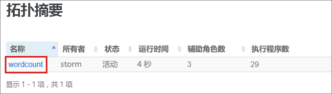
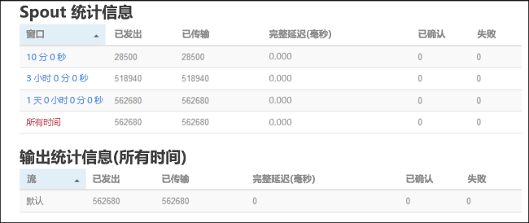

# <a name="quickstart-create-and-monitor-an-apache-storm-topology-in-azure-hdinsight"></a>快速入门：在 Azure HDInsight 中创建和监视 Apache Storm 拓扑

Apache Storm 是一个可扩展的、具有容错能力的分布式实时计算系统，用于处理数据流。 使用 Azure HDInsight 上的 Storm，可以创建一个基于云的、用于实时执行大数据分析的 Storm 群集。

本快速入门将使用 Apache [storm-starter](https://github.com/apache/storm/tree/v2.0.0/examples/storm-starter) 项目中的示例来创建和监视现有 Apache Storm 群集的 Apache Storm 拓扑。

## <a name="prerequisites"></a>先决条件

* HDInsight 上的 Apache Storm 群集。 请参阅[使用 Azure 门户创建 Apache Hadoop 群集](../hdinsight-hadoop-create-linux-clusters-portal.md)，并选择 **Storm** 作为**群集类型**。

* SSH 客户端。 有关详细信息，请参阅[使用 SSH 连接到 HDInsight (Apache Hadoop)](../hdinsight-hadoop-linux-use-ssh-unix.md)。

## <a name="create-the-topology"></a>创建拓扑

1. 连接到 Storm 群集。 编辑以下命令，将 `CLUSTERNAME` 替换为 Storm 群集的名称，然后输入该命令：

    ```cmd
    ssh sshuser@CLUSTERNAME-ssh.azurehdinsight.net
    ```

2. **WordCount** 示例包含在位于 `/usr/hdp/current/storm-client/contrib/storm-starter/` 的 HDInsight 群集中。 此拓扑生成随机句子，并计算单词的出现次数。 使用以下命令在群集上启动 **wordcount** 拓扑：

    ```bash
    storm jar /usr/hdp/current/storm-client/contrib/storm-starter/storm-starter-topologies-*.jar org.apache.storm.starter.WordCountTopology wordcount
    ```

## <a name="monitor-the-topology"></a>监视拓扑

Storm 提供一个 Web 界面用于处理正在运行的拓扑，并包含在 HDInsight 群集中。

执行以下步骤以使用 Storm UI 来监视拓扑。

1. 若要显示 Storm UI，请打开 Web 浏览器，访问 `https://CLUSTERNAME.azurehdinsight.net/stormui`。 将 `CLUSTERNAME` 替换为群集的名称。

2. 在“拓扑摘要”  下，选择“名称”  列中的“wordcount”  条目。 将显示有关拓扑的信息。

    

    新页提供以下信息：

    |属性 | 说明 |
    |---|---|
    |拓扑统计信息|有关拓扑性能的基本信息，已组织到时间窗口中。 选择特定的时间窗口会更改页面其他部分中显示的信息的时间窗口。|
    |Spout|有关 spout 的基本信息，包括每个 spout 返回的最后一个错误。|
    |Bolt|有关 bolt 的基本信息。|
    |拓扑配置|有关拓扑配置的详细信息。|
    |激活|继续处理已停用的拓扑。|
    |停用|暂停正在运行的拓扑。|
    |重新平衡|调整拓扑的并行度。 更改群集中的节点数目之后，应该重新平衡正在运行的拓扑。 重新平衡可调整并行度，以弥补群集中增加/减少的节点数目。 有关详细信息，请参阅[了解 Apache Storm 拓扑的并行度](https://storm.apache.org/documentation/Understanding-the-parallelism-of-a-Storm-topology.html)。|
    |终止|在经过指定的超时之后终止 Storm 拓扑。|

3. 在此页中，从“Spout”  或“Bolt”  部分中选择一个条目。 将显示有关选定组件的信息。

    

    新页显示以下信息：

    |属性 | 说明 |
    |---|---|
    |Spout/Bolt 统计信息|有关组件性能的基本信息，已组织到时间窗口中。 选择特定的时间窗口会更改页面其他部分中显示的信息的时间窗口。|
    |输入统计信息（仅限 Bolt）|有关生成 Bolt 所用数据的组件的信息。|
    |输出统计信息|有关此 Bolt 发出的数据的信息。|
    |执行程序|有关此组件的实例的信息。|
    |错误|此组件生成的错误。|

4. 在查看 spout 或 bolt 的详细信息时，从“执行器”  部分中的“端口”  列中选择一个条目可以查看组件特定实例的详细信息。

        2015-01-27 14:18:02 b.s.d.task [INFO] Emitting: split default ["with"]
        2015-01-27 14:18:02 b.s.d.task [INFO] Emitting: split default ["nature"]
        2015-01-27 14:18:02 b.s.d.executor [INFO] Processing received message source: split:21, stream: default, id: {}, [snow]
        2015-01-27 14:18:02 b.s.d.task [INFO] Emitting: count default [snow, 747293]
        2015-01-27 14:18:02 b.s.d.executor [INFO] Processing received message source: split:21, stream: default, id: {}, [white]
        2015-01-27 14:18:02 b.s.d.task [INFO] Emitting: count default [white, 747293]
        2015-01-27 14:18:02 b.s.d.executor [INFO] Processing received message source: split:21, stream: default, id: {}, [seven]
        2015-01-27 14:18:02 b.s.d.task [INFO] Emitting: count default [seven, 1493957]

    在此示例中，**seven** 一词出现了 1493957 次。 此计数就是自从启动此拓扑以来该单词出现的次数。

## <a name="stop-the-topology"></a>停止拓扑

返回到单词计数拓扑的“拓扑摘要”页，并从“拓扑操作”部分中选择“终止”按钮。    出现提示时，输入停止拓扑之前要等待的秒数，即 10。 在超时期限之后访问仪表板的“Storm UI”  部分，不再显示该拓扑。

## <a name="clean-up-resources"></a>清理资源

完成本快速入门后，可以删除群集。 有了 HDInsight，便可以将数据存储在 Azure 存储中，因此可以在群集不用时安全地删除群集。 此外，还需要为 HDInsight 群集付费，即使不用也是如此。 由于群集费用数倍于存储空间费用，因此在群集不用时删除群集可以节省费用。

若要删除群集，请参阅[使用浏览器、PowerShell 或 Azure CLI 删除 HDInsight 群集](../hdinsight-delete-cluster.md)。

## <a name="next-steps"></a>后续步骤

本快速入门使用了 Apache [storm-starter](https://github.com/apache/storm/tree/v2.0.0/examples/storm-starter) 项目中的示例来创建和监视现有 Apache Storm 群集的 Apache Storm 拓扑。 转到下一篇文章，了解管理和监视 Apache Storm 拓扑的基础知识。

> [!div class="nextstepaction"]
>[在 Azure HDInsight 中部署和管理 Apache Storm 拓扑](./apache-storm-deploy-monitor-topology-linux.md)