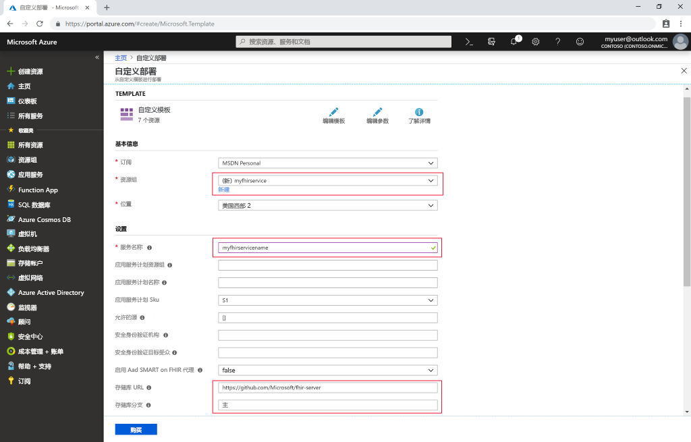

# 快速入门：使用 Azure 门户部署开源 FHIR 服务器

本快速入门介绍如何使用 Azure 门户在 Azure 中部署开源 FHIR 服务器。 我们将使用[开源存储库](https://github.com/Microsoft/fhir-server)中的简单部署链接

如果没有 Azure 订阅，请在开始之前创建一个[免费帐户](https://azure.microsoft.com/free/?WT.mc_id=A261C142F)。

## GitHub 开源存储库

导航到 [GitHub 部署页面](https://github.com/Microsoft/fhir-server/blob/master/docs/DefaultDeployment.md)并找到“部署到 Azure”按钮：

>[!div class="mx-imgBorder"]
>

单击“部署”按钮，此时会打开 Azure 门户。

## 填写部署参数

选择创建一个新资源组，并为其指定名称。 其他必需的参数只有服务的名称和 Sql 管理员密码。

>[!div class="mx-imgBorder"]
>

填写详细信息后，可开始部署。

## 验证 FHIR 服务器是否正在运行

部署完成后，可将浏览器指向 `https://SERVICENAME.azurewebsites.net/metadata` 来获取功能语句。 服务器首次响应需要 1 分钟或更长时间。

## 清理资源

当不再需要时，可删除资源组及所有相关资源。 为此，请选择包含预配资源的资源组，接着选择“删除资源组”，然后确认要删除的资源组的名称。

## 后续步骤

在本教程中，你已将适用于 Azure 的 Microsoft 开源 FHIR 服务器部署到订阅中。 若要了解如何使用 Postman 访问 FHIR API，请转到 Postman 教程。
 
>[!div class="nextstepaction"]
>[使用 Postman 访问 FHIR API](access-fhir-postman-tutorial.md)