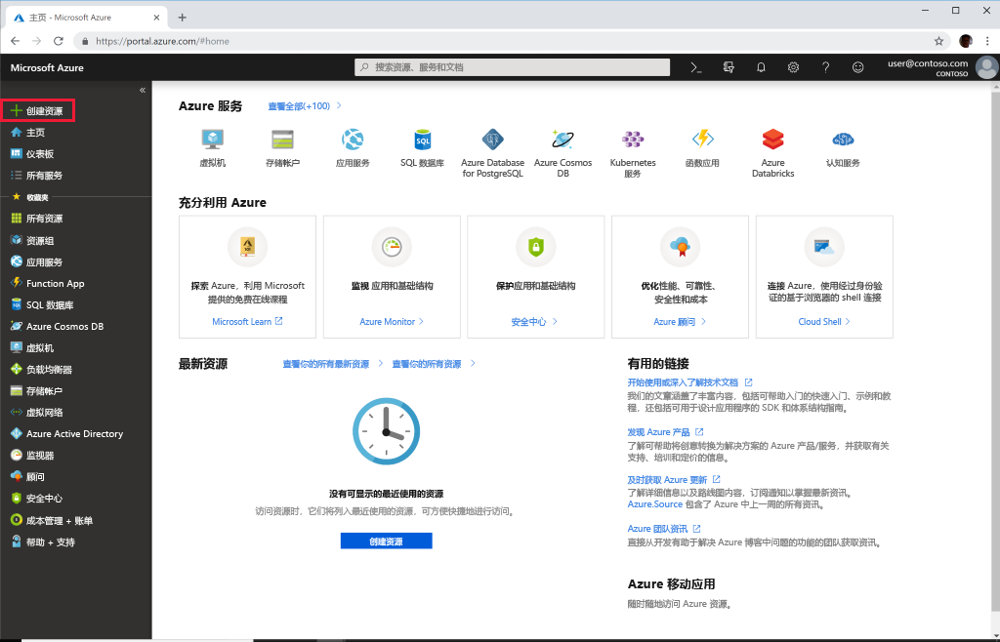

# 快速入门：使用 Azure 门户部署 Azure API for FHIR

本快速入门介绍如何使用 Azure 门户部署 Azure API for FHIR。

如果没有 Azure 订阅，请在开始之前创建一个[免费帐户](https://azure.microsoft.com/free/?WT.mc_id=A261C142F)。

## 新建资源

打开 [Azure 门户](https://portal.azure.com)，然后单击“创建资源”

## 搜索 Azure API for FHIR

通过在搜索框中键入“FHIR”，可以找到 Azure API for FHIR：

:::image type="content" source="media/quickstart-paas-portal/portal-search-healthcare-apis.png" alt-text="搜索医疗保健 API":::

## 创建 Azure API for FHIR 帐户

选择“创建”，创建一个新的 Azure API for FHIR 帐户：

:::image type="content" source="media/quickstart-paas-portal/portal-create-healthcare-apis.png" alt-text="创建 Azure API for FHIR 帐户":::

## 输入帐户详细信息

选择一个现有资源组或创建一个新资源组，选择帐户名称，最后单击“查看 + 创建”：

:::image type="content" source="media/quickstart-paas-portal/portal-new-healthcareapi-details.png" alt-text="新的医疗保健 api 详细信息":::

确认创建并等待 FHIR API 部署。

## 其他设置（可选）

也可以单击“下一步: 其他设置”，查看身份验证设置。 Azure API for FHIR 的默认配置是[使用 Azure RBAC 来分配数据平面角色](configure-azure-rbac.md)。 在此模式下配置时，FHIR 服务的“颁发机构”将设置为订阅的 Azure Active Directory 租户：

:::image type="content" source="media/rbac/confirm-azure-rbac-mode-create.png" alt-text="默认身份验证设置":::

注意，用于输入允许的对象 ID 的框将灰显，因为在本例中，我们使用 Azure RBAC 来配置角色分配。

如果要将 FHIR 服务配置为使用外部或辅助 Azure Active Directory 租户，则可以更改该颁发机构并为应该被允许访问服务器的用户和组输入对象 ID。 有关详细信息，请参阅[本地 RBAC 配置](configure-local-rbac.md)指南。

## 提取 FHIR API 功能语句

若要验证是否预配了新的 FHIR API 帐户，请通过将浏览器指向 `https://<ACCOUNT-NAME>.azurehealthcareapis.com/metadata` 来提取功能语句。

## 清理资源

当不再需要时，可以删除资源组、Azure API for FHIR 和所有相关资源。 为此，请选择包含 Azure API for FHIR 帐户的资源组，接着选择“删除资源组”，然后确认要删除的资源组的名称。

## 后续步骤

在本快速入门指南中，你已将 Azure API for FHIR 部署到订阅中。 若要在 Azure API for FHIR 中设置其他设置，请转到其他设置操作指南。

>[!div class="nextstepaction"]
>[Azure API for FHIR 中的其他设置](azure-api-for-fhir-additional-settings.md)
