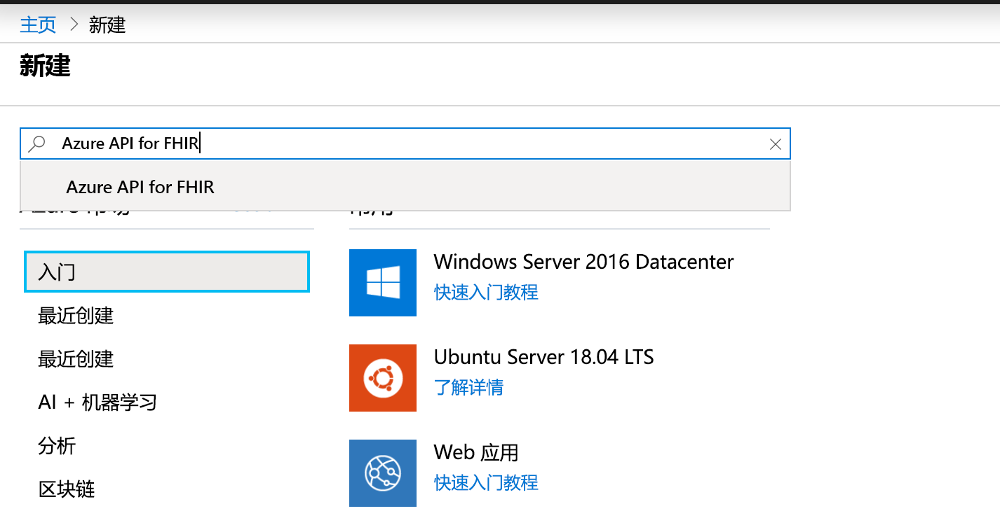
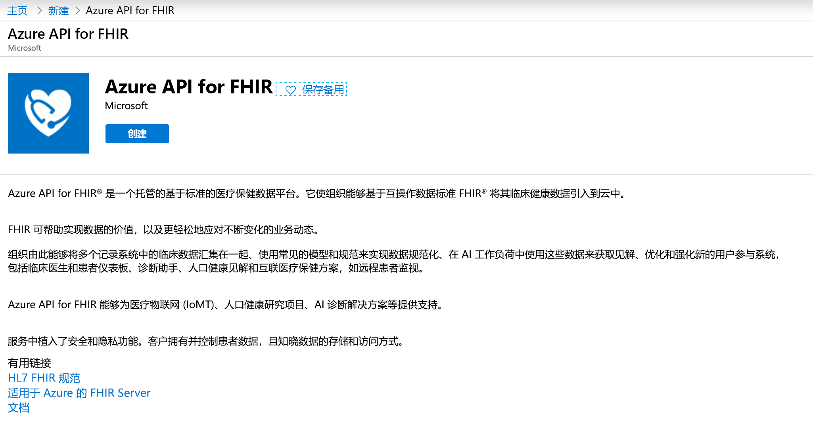
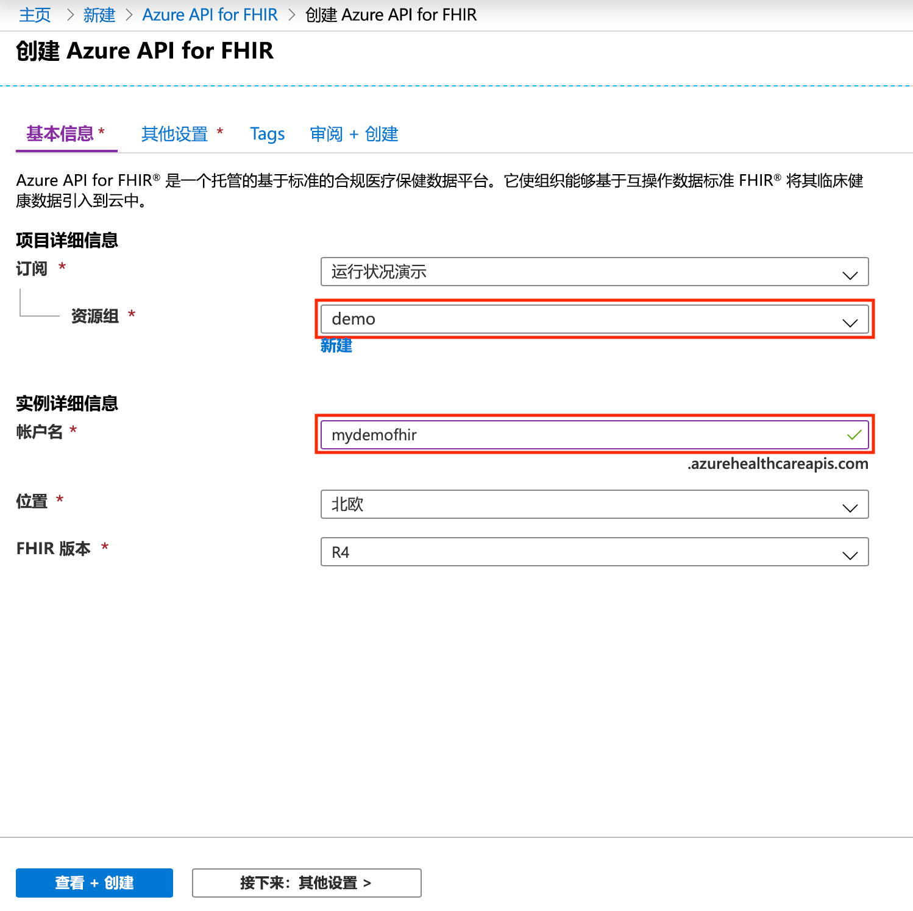

# 快速入门：使用 Azure 门户部署 Azure API for FHIR

本快速入门介绍如何使用 Azure 门户部署 Azure API for FHIR。

如果没有 Azure 订阅，请在开始之前创建一个[免费帐户](https://azure.microsoft.com/free/?WT.mc_id=A261C142F)。

## 新建资源

打开 [Azure 门户](https://portal.azure.com)，然后单击“创建资源”

## 搜索 Azure API for FHIR

通过在搜索框中键入“FHIR”，可以找到 Azure API for FHIR：

## 创建 Azure API for FHIR 帐户

选择“创建”，创建一个新的 Azure API for FHIR 帐户：

## 输入帐户详细信息

选择一个现有资源组或创建一个新资源组，选择帐户名称，最后单击“查看 + 创建”：

确认创建并等待 FHIR API 部署。

## 其他设置

单击“下一步:其他设置”以配置颁发机构、受众、标识对象 ID（应可以访问此 Azure API for FHIR），根据需要启用 SMART on FHIR，并配置数据库吞吐量：

- 颁发机构：可以根据作为服务的身份验证机构登录的机构指定不同的 Azure AD 租户。
- **受众：** 最佳做法和默认设置是将受众设置为 FHIR 服务器的 URL。 可在此处对其进行更改。 受众标识令牌所针对的接收方。 在此上下文中，应将其设置为表示 FHIR API 本身的内容。
- 允许的对象 ID：可以指定应允许其访问此 Azure API for FHIR 的标识对象 ID。 有关如何查找用户和服务主体的对象 ID 的详细信息，请参阅[查找标识对象 ID](find-identity-object-ids.md) 操作指南。  
- Smart On FHIR 代理：可以启用 SMART on FHIR 代理。 有关如何配置 SMART on FHIR 代理的详细信息，请参阅教程 [Azure API for FHIR SMART on FHIR 代理](https://docs.microsoft.com/azure/healthcare-apis/use-smart-on-fhir-proxy)  
- 预配吞吐量 (RU/s)：可在此处为 Azure API for FHIR 指定基础数据库的吞吐量设置。 稍后可以在“数据库”边栏选项卡中更改此设置。 有关更多详细信息，请参阅[配置数据库设置](configure-database.md)页。

## 提取 FHIR API 功能语句

若要验证是否预配了新的 FHIR API 帐户，请通过将浏览器指向 `https://<ACCOUNT-NAME>.azurehealthcareapis.com/metadata` 来提取功能语句。

## 清理资源

当不再需要时，可以删除资源组、Azure API for FHIR 和所有相关资源。 为此，请选择包含 Azure API for FHIR 帐户的资源组，接着选择“删除资源组”，然后确认要删除的资源组的名称。

## 后续步骤

在本快速入门指南中，你已将 Azure API for FHIR 部署到订阅中。 若要在 Azure API for FHIR 中设置其他设置，请转到其他设置操作指南。

>[!div class="nextstepaction"]
>[Azure API for FHIR 中的其他设置](azure-api-for-fhir-additional-settings.md)
