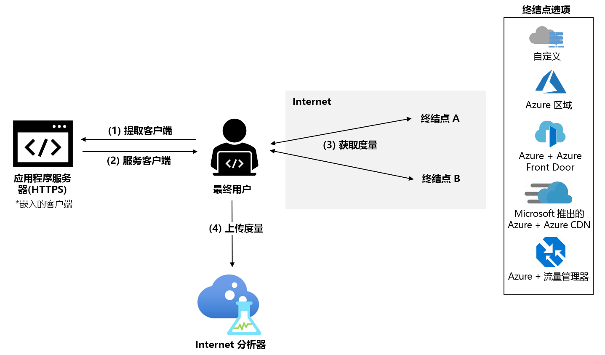

# 什么是 Internet 分析器？ （预览版）

Internet 分析器是一个客户端度量平台，可用于测试网络基础结构更改对客户性能的影响。 无论是要从本地迁移到 Azure 还是要评估一项新的 Azure 服务，在迁移之前，都可以使用 Internet 分析器从用户的数据和 Microsoft 丰富的分析功能了解情况，以便通过 Azure 更好地理解和优化你的网络体系结构。

Internet 分析器使用嵌入在 Web 应用程序中的一个小型 JavaScript 客户端来测量从最终用户到一组所选网络目标（我们称之为“终结点”）的延迟  。 Internet 分析器允许设置多个并行测试，使你可以在基础结构和客户需求需要改善时评估各种场景。 Internet 分析器提供自定义和预配置终结点，为你提供便利和灵活性，为最终用户做出可信的性能决策。 

> [!IMPORTANT]
> 此公共预览版在提供时没有附带服务级别协议，不应用于生产工作负荷。 某些功能可能不受支持或受到约束，或者不一定在所有 Azure 位置都可用。 有关详细信息，请参阅 [Microsoft Azure 预览版补充使用条款](https://azure.microsoft.com/support/legal/preview-supplemental-terms/)。
>

## 快速和可自定义测试

Internet 分析器解决了与云迁移、部署到新的或额外的 Azure 区域、或在 Azure 中测试新的应用程序和内容交付平台（如 [Azure Front Door](https://azure.microsoft.com/services/frontdoor/) 和 [Microsoft Azure CDN](https://azure.microsoft.com/services/cdn/)）的性能相关问题。 

在 Internet 分析器中创建的每个测试都由两个终结点（终结点 A 和终结点 B）组成，终结点 B 的性能相对于终结点 A 进行分析。 

你可以配置自己的自定义终结点，也可以从各种预配置的 Azure 终结点中进行选择。 自定义终结点应用于评估本地工作负载、其他云提供商中的实例或自定义 Azure 配置。 测试可以由两个自定义终结点组成；但是，必须在 Azure 中托管至少一个自定义终结点。 预配置的 Azure 终结点是评估常见的 Azure 网络平台（如 Azure Front Door、Azure 流量管理器和 Azure CDN）性能的一种快速简便的方法。 

预览期间，可以使用以下预配置的终结点： 

* **Azure 区域**
    * 巴西南部
    * 印度中部
    * 美国中部
    * 东亚
    * 美国东部
    * 日本西部
    * 北欧
    * 南非北部
    * 东南亚 
    * 阿联酋北部
    * 英国西部  
    * 西欧
    * 美国西部 
    * 美国西部 2
* **多个 Azure 区域组合** 
    * 美国东部、巴西南部 
    * 美国东部、东亚 
    * 欧洲西部、巴西南部
    * 欧洲西部、东南亚
    * 欧洲西部、阿联酋北部
    * 美国西部、美国东部 
    * 美国西部、欧洲西部
    * 美国西部、阿联酋北部
    * 欧洲西部、阿联酋北部、东南亚
    * 美国西部、欧洲西部、东亚
    * 美国西部、欧洲北部、东南亚、阿联酋北部、南非北部 
* **Azure + Azure Front Door** - 部署在上面列出的任何单个或多个 Azure 区域组合上
* **Azure + Microsoft 推出的 Azure CDN** - 部署在上面列出的任何单一 Azure 区域组合上
* **Azure + Azure 流量管理器** - 部署在上面列出的任何多个 Azure 区域组合上

## 建议的测试方案 

为了帮助你为客户做出最佳性能决策，Internet 分析器允许你为特定的最终用户群体评估两个终结点。 

虽然 Internet 分析器可以回答许多问题，但最常见的问题有： 
* 迁移到云对性能有什么影响？ 
    * *建议的测试：自定义（当前的本地基础结构）与Azure （任何预配置的终结点）*
* 将数据放在边缘与数据中心的价值是什么？ 
    *  *建议的测试：Azure 与Azure Front Door，Azure 与Microsoft 推出的 Azure CDN*
* Azure Front Door 的性能优势是什么？
    *  *建议的测试：自定义/Azure/CDN 与Azure Front Door*
* Microsoft 推出的 Azure CDN 的性能优势是什么？ 
    *  *建议的测试：自定义/Azure/AFD 与Microsoft 推出的 Azure CDN*
* Microsoft 推出的 Azure CDN 如何堆叠？ 
    *  *建议的测试：自定义（其他 CDN 终结点）与Microsoft 推出的 Azure CDN*
* 对于每个地区的最终用户群来说，最好的云是什么？ 
    *  *建议的测试：自定义（其他云服务）与Azure （任何预配置的终结点）*

## 工作原理

要使用 Internet 分析器，请在 Microsoft Azure 门户中设置 Internet 分析器资源，并在应用程序中安装小型 JavaScript 客户端。 客户端通过 HTTPS 下载单像素图像，以此来测量从最终用户到所选终结点的延迟。 在收集了延迟测量值之后，客户端将测量数据发送到 Internet 分析器。

当用户访问 Web 应用程序时，JavaScript 客户端选择两个终结点在所有配置的测试中进行测量。 对于每个终结点，客户端都会执行“冷”和“热”测量   。 “冷”测量除了会在用户和终结点之间产生纯网络延迟（如 DNS 解析、TCP 连接握手和 SSL/TLS 协商）之外，还会产生额外的延迟  。 “热”测量在“冷”测量完成后进行，并利用新式浏览器的持续 TCP 连接管理来精确测量端到端延迟   。 如果用户的浏览器支持，W3C 资源计时 API 可用于精确测量计时。 目前，仅使用热延迟测量进行分析。

## 记分卡 

测试开始后，“记分卡”选项卡下的 Internet 分析器资源中会显示遥测数据。此数据始终聚合。 使用以下筛选器更改你看到的数据视图： 

* **测试：** 选择要查看其结果的测试。 在大多数情况下，一旦有足够的数据完成分析，测试数据就会在 24 小时内出现。 
* **时间段和结束日期：** Internet 分析器每天生成 3 个记分卡，每个记分卡反映不同的聚合时间段：24 小时前（天）、7 天前（星期）和 30 天前（月）。 使用“结束日期”筛选器选择要查看的时间段。 
* **国家/地区：** 使用此筛选器可查看特定于位于某国家/地区的最终用户的数据。 全局筛选器显示所有地理区域的数据。  

有关记分卡的详细信息，请参阅[解释记分卡](internet-analyzer-scorecard.md)页面。 

## 后续步骤

* 了解如何[创建你的首个 Internet 分析器资源](internet-analyzer-create-test-portal.md)。
* 阅读 [Internet 分析器常见问题解答](internet-analyzer-faq.md)。 
