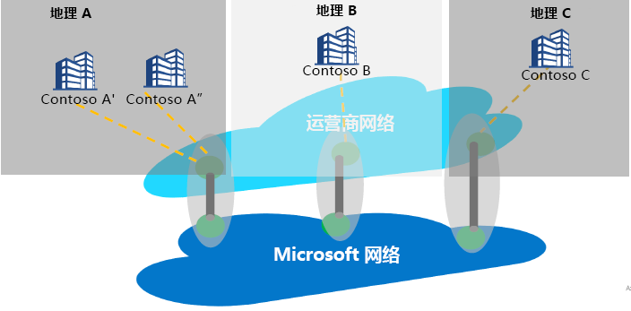

# Internet 对等互连与对等互连服务

Internet 对等互连是指 Microsoft 的全球网络 (AS8075) 与运营商或服务提供商网络之间的任何互连。 服务提供商可以通过实施如下所述的对等互连服务合作要求，提供可靠且高性能的公共连接性，并通过最佳路由将客户连接到 Microsoft 网络，从而成为对等互连服务合作伙伴。

## 关于对等互连服务
对等互连服务是一个与关键服务提供商合作的合作计划，可向企业用户提供同类最佳的公共 Internet 连接。 属于该计划的合作伙伴将拥有直接且高度可用的异地冗余连接，并将其到 Microsoft 的路由优化。 对等互连服务是 Microsoft 连接性产品组合的补充：
*   与 IaaS 或 PaaS 资源的专用连接的 ExpressRoute（对专用 IP 空间的支持）
    *   基于合作伙伴的连接
    *   与 Microsoft 的 Direct 100G 连接
*   基于 Internet 的 IPSEC，可以通过 VPN 连接到云
*   通过虚拟 WAN 以 SD-WAN 方式连接到 Azure

对等互连服务的目标段是 SaaS 连接，SD-WAN 客户愿意在分支和具有双策略 MPLS 和企业级 Internet 的客户上进行 Internet 分类。

连接到 Microsoft 云时的主要目标应该是减少从用户站点到 Microsoft 全球网络（Microsoft 的公共网络骨干，用于将 Microsoft 的所有数据中心和多个云应用程序入口点互连）的往返时间 (RTT)，从而最大程度地减少延迟。 请参阅 [Getting the best connectivity and performance in Office 365](https://techcommunity.microsoft.com/t5/Office-365-Blog/Getting-the-best-connectivity-and-performance-in-Office-365/ba-p/124694)（在 Office 365 中获取最佳连接性和性能）。

> [!div class="mx-imgBorder"]
> 

在上图中，全球企业的每个分支机构都可以通过合作伙伴的网络连接到最接近的可能的 Microsoft 边缘位置。

**对等互连服务客户权益：**
* 基于 Internet 的最佳公共路由可连接到 Microsoft 云服务，以实现最佳性能和可靠性。
* 能够选择首选 SP 来连接到 Microsoft 云。
* 流量见解，例如延迟报告和前缀监视。
* Microsoft 云中的最佳网络跃点（AS 跃点）。
* 路由分析和统计信息 - 边界网关协议 ([BGP](https://en.wikipedia.org/wiki/Border_Gateway_Protocol)) 路由异常事件（泄漏/劫持检测）和不理想路由。

## 对等互连服务合作关系要求
* 到 Microsoft 云的连接性（在距离客户最近的位置）。 合作伙伴服务提供商会将用户流量路由到最靠近用户的 Microsoft Edge。 同样，在向用户发送流量时，Microsoft 会将流量（使用 BGP 标记）路由到最靠近用户的边缘位置，而 SP 会将流量传递给用户。
* 合作伙伴将始终与 Microsoft 全球网络进行高可用、高吞吐量和异地冗余的连接。
* 如果合作伙伴满足要求，可以利用其现有对等互连来支持对等互连服务

## 常见问题解答
有关常见问题解答，请参阅[对等互连服务 - 常见问题解答](service-faqs.md)。

## 后续步骤

* 详细了解[对等互连服务](https://docs.microsoft.com/azure/peering-service/)的客户权益。
* 了解在[对等互连服务合作伙伴演练](walkthrough-peering-service-all.md)中为对等互连服务启用直接对等互连的步骤。
