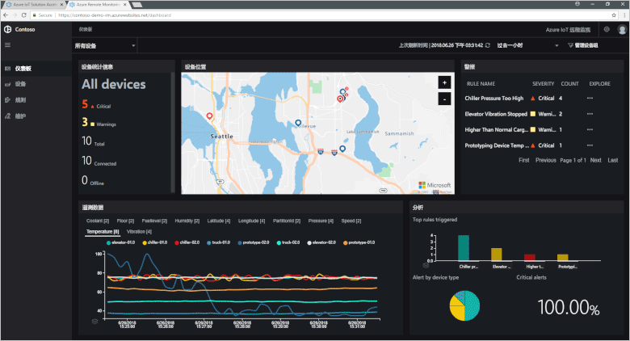

# Azure IoT 解决方案加速器是什么？

基于云的 IoT 解决方案通常使用自定义代码和多个云服务来管理设备连接、数据处理、分析和呈现。

IoT 解决方案加速器是完整的、随时可部署的 IoT 解决方案集合，可以实现远程监视、互连工厂和预测性维护等常见 IoT 方案。 部署解决方案加速器时，部署将包括全部所需的基于云的服务，以及全部所需的应用程序代码。

解决方案加速器是你自己的 IoT 解决方案的起点。 所有解决方案加速器的源代码都是开源的，并已在 GitHub 中提供。 我们建议你根据要求下载并[自定义](iot-accelerators-remote-monitoring-customize.md)解决方案加速器。

此外，在从头开始生成自定义的 IoT 解决方案之前，可以使用解决方案加速器作为学习工具。 解决方案加速器针对基于云的 IoT 解决方案实施成熟的做法，你也可以遵循这些做法。

每个解决方案加速器中的应用程序代码包括一个仪表板，可让你管理解决方案加速器。 例如，可以使用仪表板查看联网设备发出的遥测数据、预配新设备，或者升级联网设备上的固件：

## 支持的 IoT 方案

目前，有四个解决方案加速器可供部署：

### 远程监视

使用此解决方案加速器可以从多个远程设备收集遥测数据，以及控制远程设备。 示例设备包括客户现场安装的散热系统，或者远地泵房中安装的阀门。

### 互连工厂

使用此解决方案加速器可以从配备了 [OPC 统一体系结构](https://opcfoundation.org/about/opc-technologies/opc-ua/)接口的工业资产收集遥测数据，以及控制这些资产。 工业资产可能包括工厂生产线上的组装和测试工位。

### 预测性维护

使用此解决方案加速器可以预测远程设备何时可能会发生故障，以便在预测到的故障发生之前进行维护。 此解决方案加速器使用机器学习算法，基于设备遥测数据预测故障。 示例设备包括飞机引擎或电梯。

### 设备模拟

使用此解决方案加速器可以运行能够生成真实遥测数据的多个模拟设备。 可以使用此解决方案加速器测试其他解决方案加速器的行为，或测试自己的自定义 IoT 解决方案。

## 设计原理

所有解决方案加速器遵循相同的设计原理和目标。 它们在设计上具有以下特点：

* **可缩放**：允许连接和管理数百万个联网设备。
* **可扩展**：允许根据要求进行自定义。
* **易于理解**：可让你了解其工作原理及其实施方式。
* **模块化**：允许将服务更换为其他替代项。
* **安全**：将 Azure 安全性与内置的连接和设备安全功能相结合。

## 体系结构和语言

原始的解决方案加速器是使用模型-视图-控制器 (MVC) 体系结构以 .NET 编写的。 Microsoft 正在将解决方案加速器更新为新的微服务体系结构。 GitHub 中提供了每个微服务的 [Java](https://github.com/Azure/azure-iot-pcs-remote-monitoring-java) 和 [.NET](https://github.com/Azure/azure-iot-pcs-remote-monitoring-dotnet) 版本。 下表显示了解决方案加速器的当前状态：

| 解决方案加速器   | 体系结构  | 语言     |
| ---------------------- | ------------- | ------------- |
| 远程监视      | 微服务 | Java 和 .NET |
| 预测性维护 | MVC           | .NET          |
| 互连工厂      | MVC           | .NET          |

若要详细了解微服务体系结构，请参阅 [.NET 应用程序体系结构](https://www.microsoft.com/net/learn/architecture)和[微服务：由云推动的应用程序革命](https://azure.microsoft.com/blog/microservices-an-application-revolution-powered-by-the-cloud/)。

## 部署选项

可在以下配置中部署基于微服务的解决方案加速器：

* **标准：** 扩展的基础结构部署，适用于开发生产型部署。 Azure 容器服务将微服务部署到多个 Azure 虚拟机。 Kubernetes 会协调托管单个微服务的 Docker 容器。
* **基本：** 降低成本版，用于演示或部署测试。 所有微服务都部署到一个 Azure 虚拟机。
* **本地：** 用于测试和开发的本地计算机部署。 此方法将微服务部署到本地 Docker 容器，并连接到云中的 IoT 中心、Azure Cosmos DB 和 Azure 存储服务。

运行解决方案加速器的成本是[底层 Azure 服务成本](https://azure.microsoft.com/pricing)的总和。 选择部署选项时，会看到所用的 Azure 服务的详细信息。

## 后续步骤

若要试用 IoT 解决方案加速器，请查看[部署基于云的远程监视解决方案](quickstart-remote-monitoring-deploy.md)快速入门。
