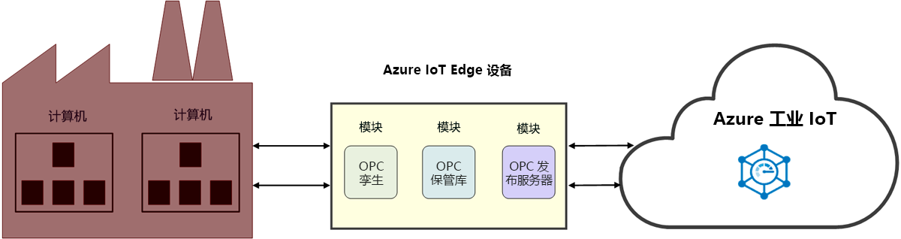

# 什么是工业 IoT (IIoT)

IIoT 是指“工业物联网”。 IIoT 通过在制造业中应用 IoT 来增强工业效率。 

## 提高工业效率

通过互联工厂解决方案加速器来增强操作效率和盈利能力。 在云中连接并监视工业设施和设备，包括工厂车间中已在运转的机器。 分析 IoT 数据，从而获取有助于提高整个工厂车间绩效的见解。

使用 OPC 孪生减少访问工厂车间机器的耗时流程，并专注于生成 IIoT 解决方案。 使用 OPC 保管库简化证书管理和工业资产集成，并确信资产连接受到保护。 这些微服务在 [Azure 工业 IoT 组件](https://github.com/Azure/Industrial-IoT)的顶层提供类似于 REST 的 API。 使用服务 API 可以控制边缘模块的功能。 

> [!NOTE]
> 有关 Azure 工业 IoT 服务的详细信息，请参阅 GitHub [存储库](https://github.com/Azure/Industrial-IoT)和[文档](https://azure.github.io/Industrial-IoT/)。
如果你不熟悉 Azure IoT Edge 模块的工作原理，请先阅读以下文章：
- [关于 Azure IoT Edge](../iot-edge/about-iot-edge.md)
- [Azure IoT Edge 模块](../iot-edge/iot-edge-modules.md)

## 连接工厂

[互联工厂](../iot-accelerators/iot-accelerators-connected-factory-features.md)是 Microsoft 的 Azure 工业 IoT 参考体系结构的实现，可根据具体业务要求进行自定义。 解决方案代码完全是开源的，已在“互联工厂解决方案加速器”GitHub 存储库中提供。 可以使用它作为商用产品的起点，并在几分钟内向 Azure 订阅中部署预生成的解决方案。 

## 工厂车间连接

OPC 孪生是可以自动发现和注册设备的 IIoT 组件，并通过 REST API 提供工业设备的远程控制。 OPC 孪生使用 Azure IoT Edge 和 IoT 中心来连接云与工厂网络。 OPC 孪生使 IIoT 开发人员能够专注于生成 IIoT 应用程序，而无需担心如何安全访问本地机器。

## 安全性

OPC 保管库是 OPC UA 全局发现服务器 (GDS) 的一个实现，它可以配置、注册和管理云中 OPC UA 服务器和客户端应用程序的证书生命周期。 OPC 保管库简化了工业领域中安全资产连接的实现和维护。 通过自动化证书管理，OPC 保管库使工厂操作员无需执行与连接和证书管理相关的复杂手动流程。

## 后续步骤

大致了解工业 IoT 及其组件后，建议接下来学习以下主题：

> [!div class="nextstepaction"]
> [什么是 OPC 孪生](overview-opc-twin.md)
