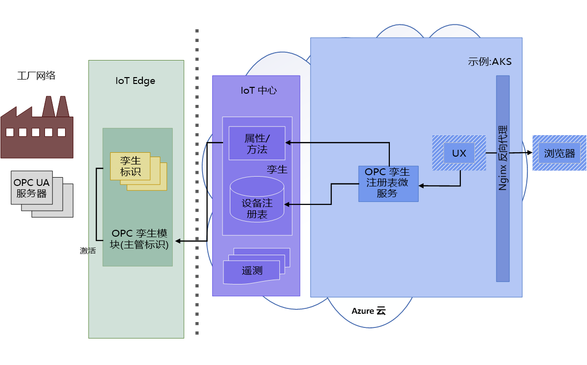
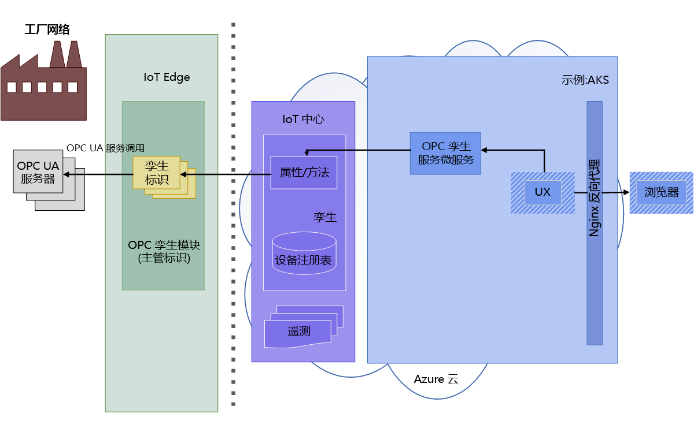
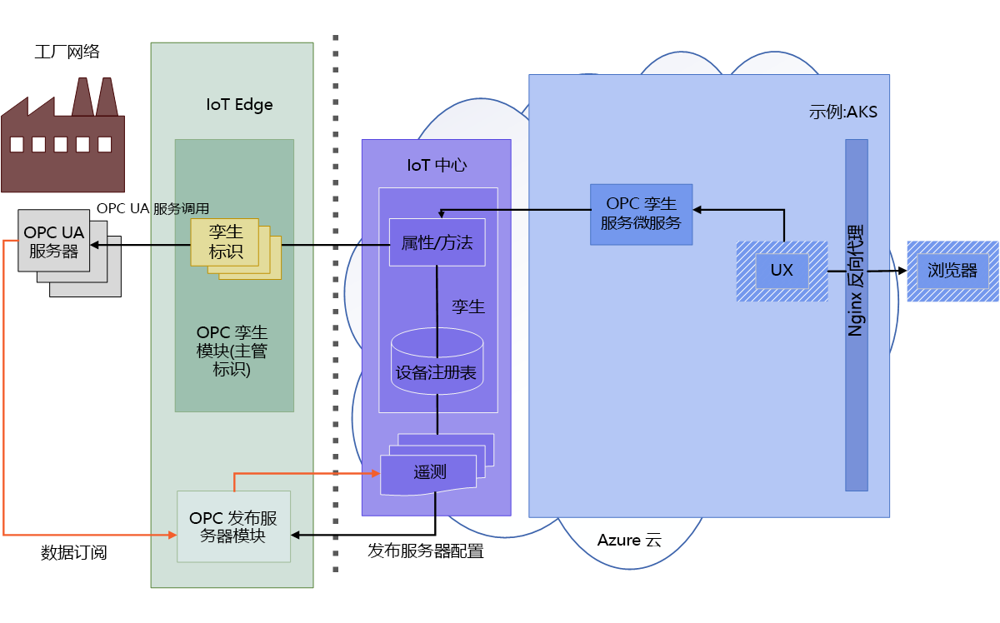

# OPC 孪生体系结构

下图演示了 OPC 孪生体系结构。

## 发现和激活

1. 操作员在模块中启用网络扫描，或使用发现 URL 进行一次性的发现。 发现的终结点和应用程序信息将通过遥测功能发送到载入代理进行处理。  处于发现或扫描模式时，OPC UA 设备载入代理将处理 OPC 孪生 IoT Edge 模块发送的 OPC UA 服务器发现事件。 发现事件在 OPC UA 设备注册表中生成应用程序注册和更新。

   

1. 操作员检查已发现的终结点的证书，并激活已注册的终结点孪生以供访问。 

   

## 浏览和监视

1. 激活后，操作员可以使用孪生服务 REST API 来浏览或检查服务器信息模型、读取/写入对象变量以及调用方法。  用户使用完全以 HTTP 和 JSON 表示的简化 OPC UA API。

   

1. 还可以使用孪生服务 REST 接口在 OPC 发布服务器中创建受监视的项和订阅。 OPC 发布服务器允许将遥测数据从 OPC UA 服务器系统发送到 IoT 中心。 有关 OPC 发布服务器的详细信息，请参阅[什么是 OPC 发布服务器](overview-opc-publisher.md)。

   
