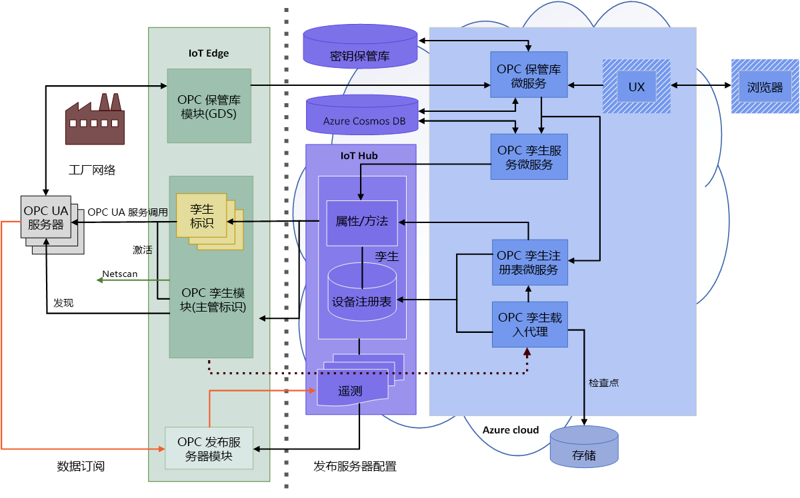

# 什么是 OPC 保管库？

OPC 保管库是可以配置、注册和管理云中 OPC UA 服务器与客户端应用程序的证书生命周期的微服务。 本文介绍 OPC 保管库的简单用例。

## 证书管理

例如，某家制造公司需要将其 OPC UA 服务器计算机连接到新生成的客户端应用程序。 当该制造商初次访问服务器计算机时，OPC UA 服务器应用程序中立即显示一条错误消息，指出客户端应用程序不安全。 此机制内置于 OPC UA 服务器计算机中，用于防止任何未经授权访问应用程序，以及车间遭到恶意的黑客攻击。

## 应用程序安全管理
安全专业人员可以使用 OPC 保管库微服务来轻松地让 OPC UA 服务器与任何客户端应用程序通信，因为 OPC 保管库具有证书注册表、存储和生命周期管理的所有功能。 现已安全连接 OPC UA 服务器，它可以与新生成的客户端应用程序通信

## 完整的 OPC 保管库体系结构
下图演示了完整的 OPC 保管库体系结构。

