# 快速入门：尝试使用基于云的解决方案来管理工业 IoT 设备

本快速入门介绍如何部署 Azure IoT 联网工厂解决方案加速器，以便对工业 IoT 设备运行基于云的监视和管理模拟。 部署联网工厂解决方案加速器时，可以通过其中预先填充的资源来逐步执行常见的工业 IoT 方案。 多个模拟的工厂将连接到解决方案，它们报告计算设备综合效率 (OEE) 和关键绩效指标 (KPI) 所需的数据值。 本快速入门介绍如何使用解决方案仪表板执行以下操作：

* 监视工厂、生产线、工位 OEE 和 KPI 值。
* 分析这些设备生成的遥测数据。
* 对警报做出响应。

若要完成本快速入门，需要一个有效的 Azure 订阅。

如果没有 Azure 订阅，请在开始之前创建一个[免费帐户](https://azure.microsoft.com/free/?WT.mc_id=A261C142F)。

## 部署解决方案

将解决方案加速器部署到 Azure 订阅时，必须设置一些配置选项。

导航到 [Microsoft Azure IoT 解决方案加速器](https://www.azureiotsolutions.com)，使用 Azure 帐户凭据登录。

单击“联网工厂”磁贴。  在“联网工厂”页上单击“立即试用”   ：

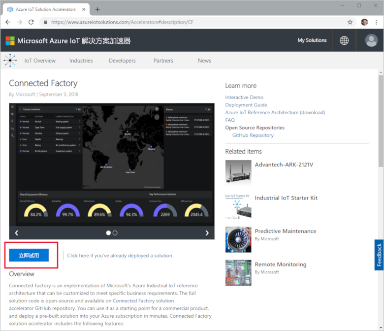

在“创建联网工厂解决方案”页上，为联网工厂解决方案加速器输入唯一的**解决方案名称**。 此名称是包含所有解决方案加速器资源的 Azure 资源组的名称。 本快速入门使用的名称为 **MyDemoConnectedFactory**。

选择要用于部署解决方案加速器的**订阅**和**区域**。 通常，我们会选择离自己最近的区域。 本快速入门使用“Visual Studio Enterprise”和“美国东部”。   只有订阅中的[全局管理员或用户](iot-accelerators-permissions.md)才能完成部署。

单击“创建”开始部署。  此过程至少需要五分钟才能完成运行：

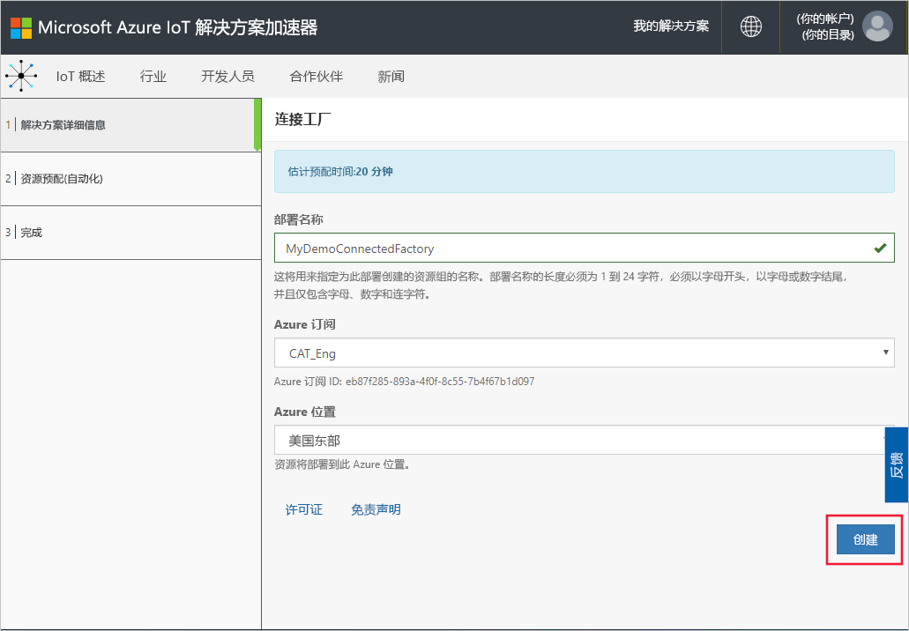

## 登录到解决方案

完成部署到 Azure 订阅后，解决方案磁贴上会出现一个绿色的对号和“就绪”  。 现在可以登录到联网工厂解决方案加速器仪表板。

在“预配的解决方案”  页上，单击新的联网工厂解决方案加速器：

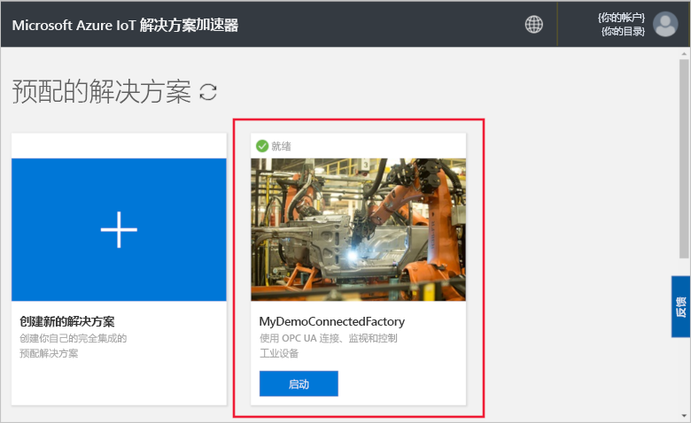

可以在显示的页面中查看有关联网工厂解决方案加速器的信息。 选择“转到解决方案加速器”  ，查看联网工厂解决方案加速器：

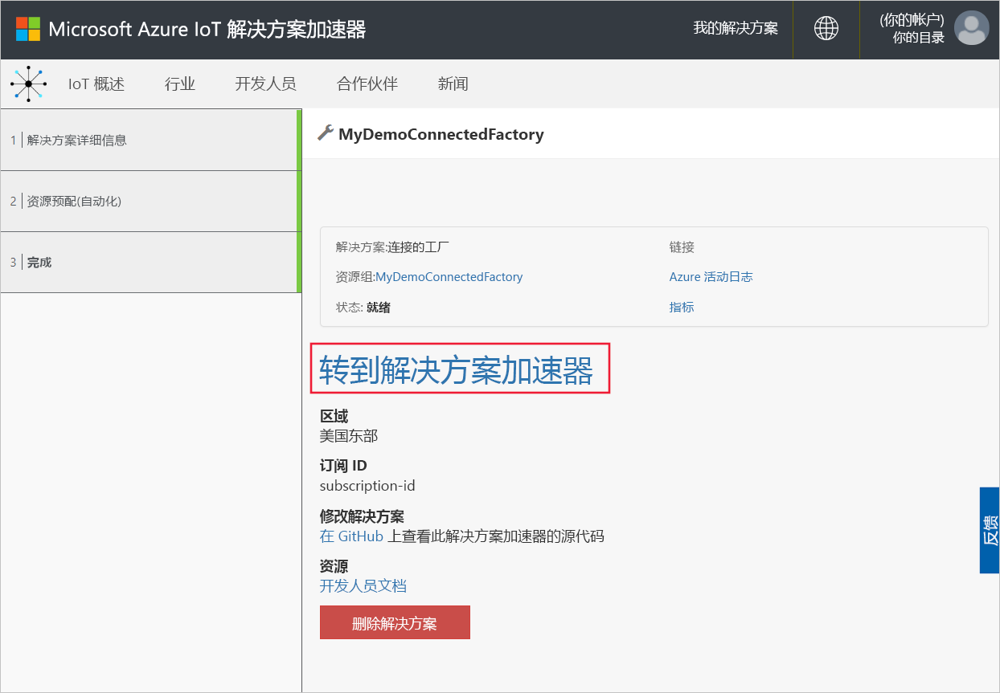

单击“接受”以接受权限请求，联网工厂解决方案仪表板会在浏览器中显示。  其中显示了模拟工厂、生产线和工位。

## 查看仪表板

默认视图是仪表板。  若要导航到门户的其他区域，请使用页面左侧的菜单：

[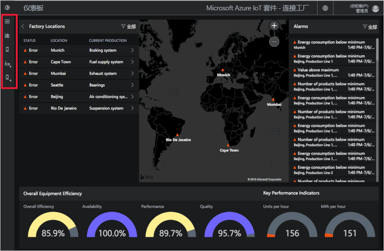](./media/quickstart-connected-factory-deploy/dashboard-expanded.png#lightbox)

使用仪表板管理工业 IoT 设备。 联网工厂使用层次结构来显示全局工厂配置。 该层次结构的顶层是包含一个或多个工厂的企业。 每个工厂包含生产线，而每条生产线由工位构成。 在每个层级，可以查看 OEE 和 KPI、发布新的遥测节点，以及对警报做出响应。

在仪表板上可以查看：

## 设备综合效率

“设备综合效率”面板显示整个企业的 OEE 值，或者显示所查看的工厂/生产线/工位。  该值是从装配站视图聚合到企业级别的聚合值。 可以进一步分析 OEE 图及其构成元素。

[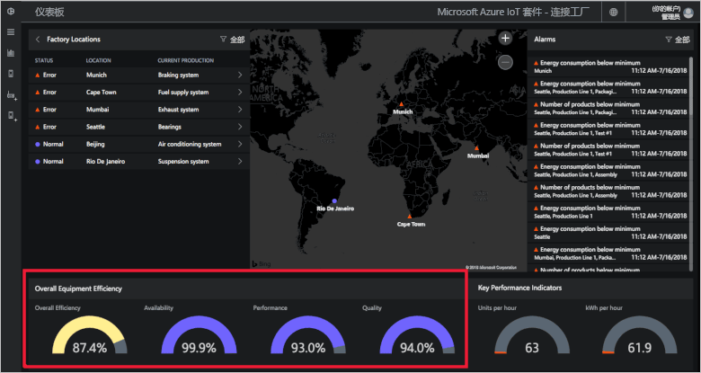](./media/quickstart-connected-factory-deploy/oee-expanded.png#lightbox)

OEE 使用与生产相关的运营参数来评价制造过程的效率。 OEE 是一项工业标准度量指标，其计算方式是将可用率、性能等级和成品率相乘：OEE = 可用率 x 性能等级 x 成品率。

可以进一步分析层次结构数据中任意级别的 OEE。 单击 OEE、可用性、性能或质量百分比刻度。 此时会出现一个上下文面板，其中的可视化效果显示不同时间刻度的数据：

[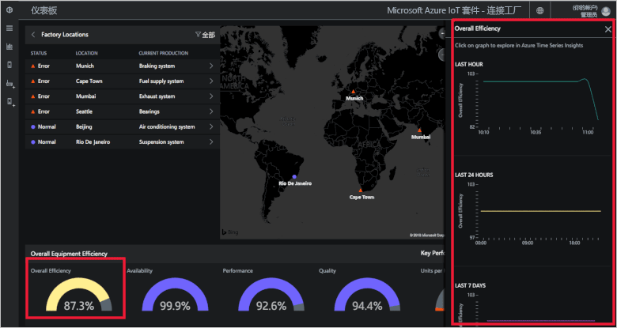](./media/quickstart-connected-factory-deploy/oeedetail-expanded.png#lightbox)

可以单击图表进一步分析数据。

### 关键绩效指标

“关键绩效指标”面板显示整个企业或所查看的工厂/生产线/工位每小时生产的设备数，以及消耗的能源 (kWh)。  这些值是从装配站视图聚合到企业级别的聚合值。

[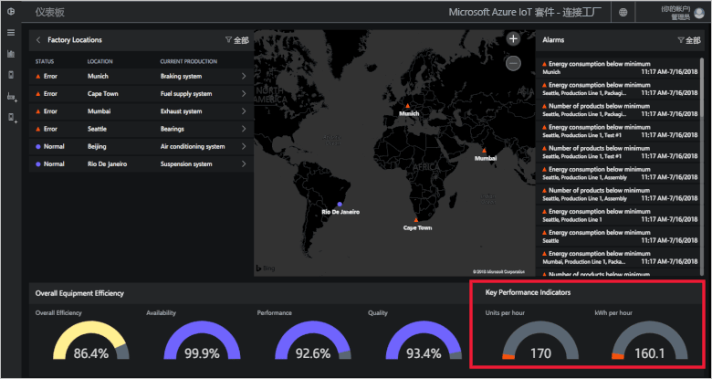](./media/quickstart-connected-factory-deploy/kpis-expanded.png#lightbox)

可以进一步分析层次结构数据中任意级别的 KPI。 单击 OEE、可用性、性能或质量百分比刻度。 此时会出现一个上下文面板，其中的可视化效果显示不同时间刻度的数据：

[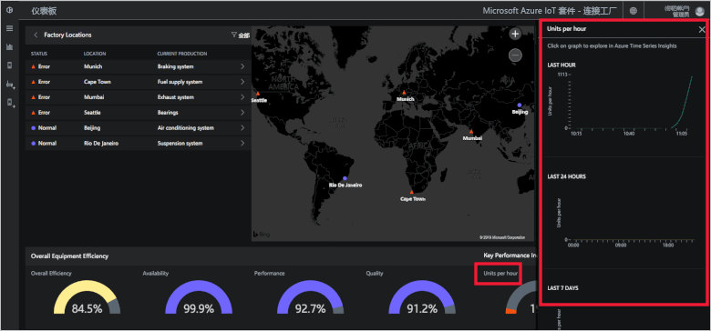](./media/quickstart-connected-factory-deploy/kpidetail-expanded.png#lightbox)

可以单击图表进一步分析数据。

### 工厂位置

一个  “工厂位置”面板，显示解决方案中的状态、位置和当前生产配置。 首次运行解决方案加速器时，仪表板中会显示一组模拟工厂。 每个生产线模拟由三个运行模拟任务和共享数据的实际 OPC UA 服务器组成。 有关 OPC UA 的详细信息，请参阅[联网工厂常见问题解答](iot-accelerators-faq-cf.md)：

[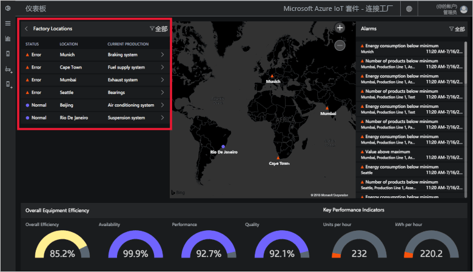](./media/quickstart-connected-factory-deploy/factorylocations-expanded.png#lightbox)

可以在解决方案层次结构中导航，以及查看每个级别的 OEE 值和 KPI：

1. 在“工厂位置”中，单击“孟买”。   随后会显示此位置的生产线。

1. 单击“生产线 1”。  随后会显示此生产线的工位。

1. 单击“包装”。  随后会显示此工位发布的 OPC UA 节点。

1. 单击“能耗”。  随后会有一些图表绘制了不同时间刻度的此值。 可以单击图表进一步分析数据。

[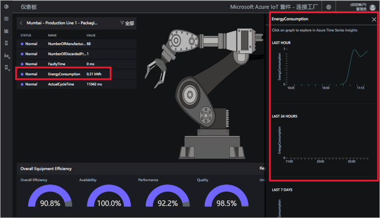](./media/quickstart-connected-factory-deploy/explorelocations-expanded.png#lightbox)

### 映射

如果订阅可以访问[必应地图 API](iot-accelerators-faq-cf.md)，则“工厂”视图会显示解决方案中所有工厂的地理位置和状态。  单击地图上显示的位置即可了解位置详细信息。

[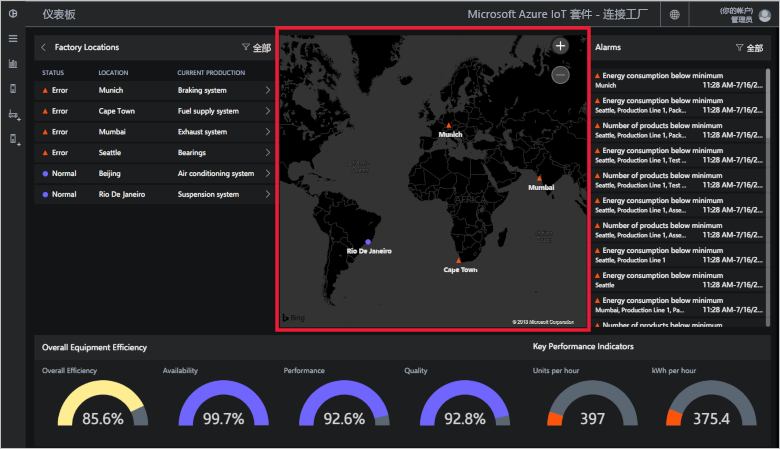](./media/quickstart-connected-factory-deploy/map-expanded.png#lightbox)

### 警报

“警报”面板显示当报告的值或计算的 OEE/KPI 值超出阈值时生成的警报。  此面板显示层次结构中从工位级别到企业的每个级别的警报。 每个警报包括说明、日期、时间、位置和发生次数：

[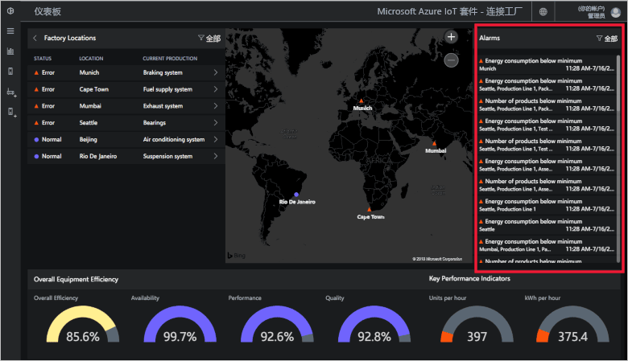](./media/quickstart-connected-factory-deploy/alarms-expanded.png#lightbox)

可以在仪表板中分析造成警报的数据。 管理员可对警报执行默认操作，例如：

* 关闭警报。
* 确认警报。

单击某个警报，在“选择操作”下拉列表中选择“确认警报”，然后单击“应用”：   

若要进一步分析警报数据，请单击警报面板中的图。

这些警报是根据规则生成的，而这些规则是在解决方案加速器的配置文件中指定的。 这些规则可以在 OEE 或 KPI 数据或 OPC UA 节点值超出阈值时生成警报。 可以设置此阈值。

## 清理资源

如果打算深入探索，请保留部署的联网工厂解决方案加速器。

如果不再需要该解决方案加速器，请在[预配的解决方案](https://www.azureiotsolutions.com/Accelerators#dashboard)页中选择它，然后单击“删除解决方案”  将其删除：

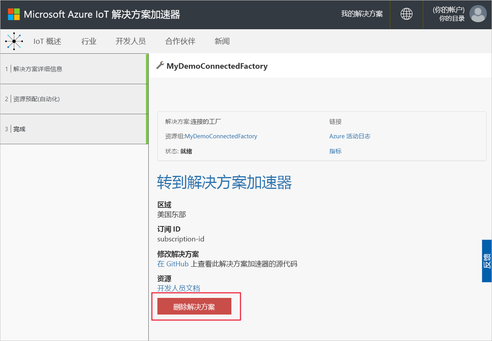

## 后续步骤

在本快速入门中，我们已部署联网工厂解决方案加速器，并学习了如何浏览工厂、生产线和工位。 此外，我们还了解了如何查看层次结构中任意级别的 OEE 和 KPI 值，以及如何对警报做出响应。

若要了解如何使用仪表板中的其他功能来管理工业 IoT 设备，请继续阅读以下操作方法指南：

> [!div class="nextstepaction"]
> [使用联网工厂仪表板](iot-accelerators-connected-factory-dashboard.md)