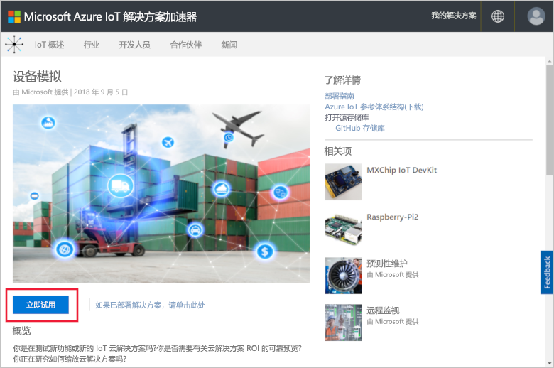
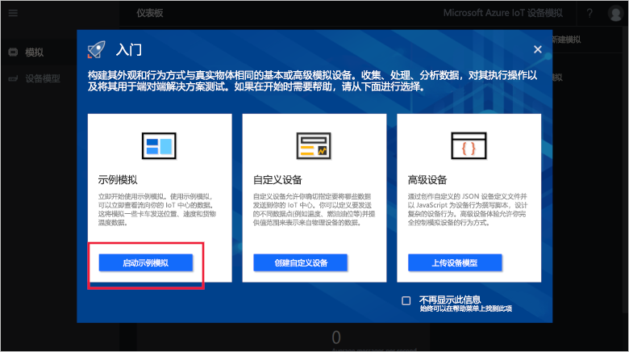
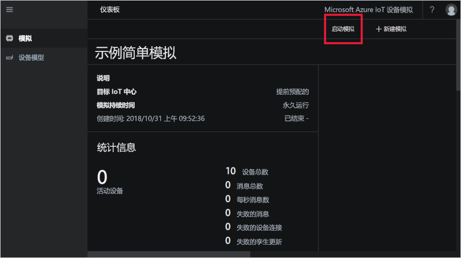
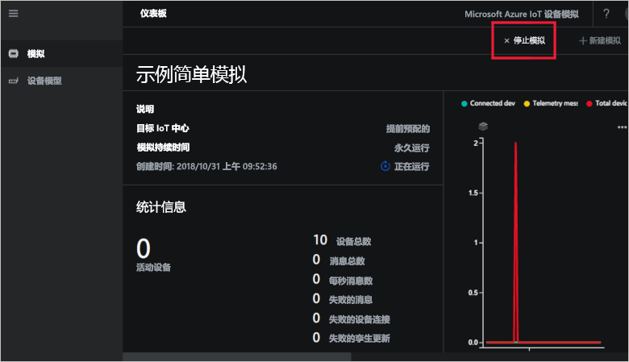

# 快速入门：在 Azure 中部署并运行 IoT 设备模拟

本快速入门介绍如何部署 Azure IoT 设备模拟以测试 IoT 解决方案。 部署解决方案加速器后，运行示例模拟以开始使用。

若要完成本快速入门，需要一个有效的 Azure 订阅。

如果没有 Azure 订阅，请在开始之前创建一个[免费帐户](https://azure.microsoft.com/free/?WT.mc_id=A261C142F)。

## 部署设备模拟

将设备模拟部署到 Azure 订阅时，必须设置一些配置选项。

使用 Azure 帐户凭据登录到 [azureiotsolutions.com](https://www.azureiotsolutions.com/Accelerators)。

单击“设备模拟”磁贴：

在“设备模拟”说明页上单击“立即试用”：

在“创建设备模拟解决方案”页上输入唯一的“解决方案名称”。

选择要用于部署解决方案加速器的**订阅**和**区域**。 通常，我们会选择离自己最近的区域。 只有订阅中的[全局管理员或用户](iot-accelerators-permissions.md)才能完成部署。

勾选用于部署 IoT 中心的框，该中心可以与设备模拟解决方案配合使用。 之后可以随时更改模拟使用的 IoT 中心。

单击“创建”，开始预配解决方案。 此过程至少需要五分钟才能完成运行：

## 登录到解决方案

预配过程完成后，可以通过单击“启动”按钮登录设备模拟实例：

单击“接受”以接受权限请求，设备模拟解决方案仪表板会显示在浏览器中。

首次打开时，你会看到显示**入门**指南的设备模拟仪表板。 单击第一个磁贴以打开示例模拟。 如果关闭**入门**指南，则可以通过单击相应磁贴从仪表板打开**示例简单模拟**：

## 示例模拟

作为示例模拟，不能进行编辑。 使用以下设置配置模拟：

| 设置             | 值                       |
| ------------------- | --------------------------- |
| 目标 IoT 中心      | 使用预先预配的 IoT 中心 |
| 设备型号        | 卡车                       |
| 设备数   | 10                          |
| 遥测频率 | 10 秒                  |
| 模拟持续时间 | 无限期地运行            |

## 运行模拟

单击“启动模拟”。 模拟将按配置无限期地运行。 可以随时单击“停止模拟”来停止模拟。 模拟显示当前运行的统计信息。

一次只能从设备模拟实例运行一个模拟。

## 清理资源

如果打算深入进行探索，请保留已部署的设备模拟。

如果不再需要设备模拟，请通过单击其磁贴从[已预配的解决方案](https://www.azureiotsolutions.com/Accelerators#dashboard)页中删除它，然后单击“删除解决方案”：

## 后续步骤

在本快速入门中，已部署了设备模拟并运行了示例 IoT 设备模拟。

> [!div class="nextstepaction"]
> [使用一种或多种设备类型创建模拟](iot-accelerators-device-simulation-create-simulation.md)