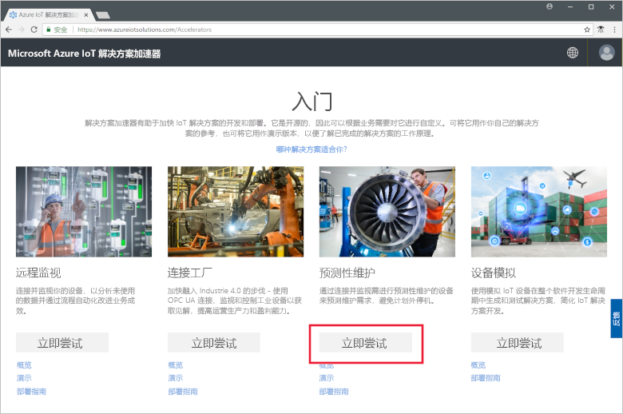
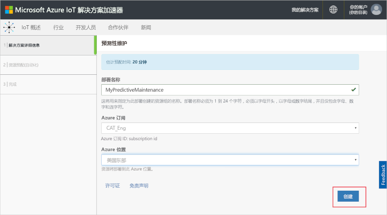
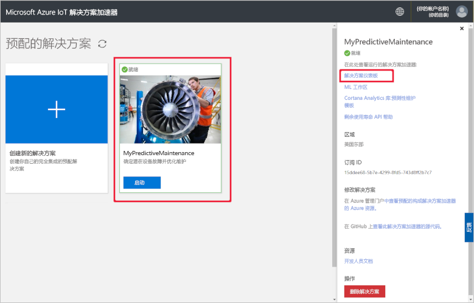
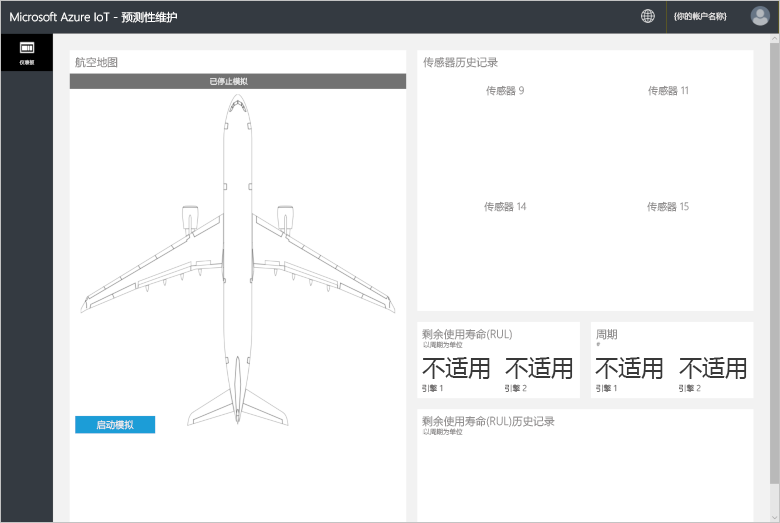
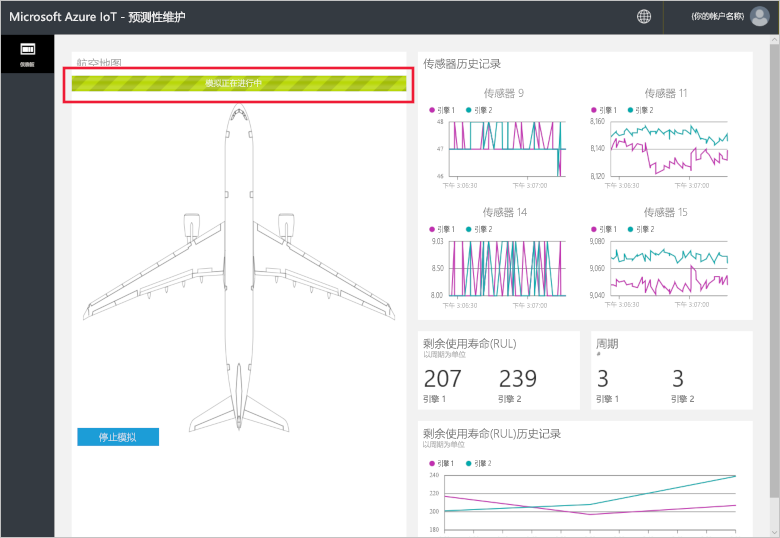
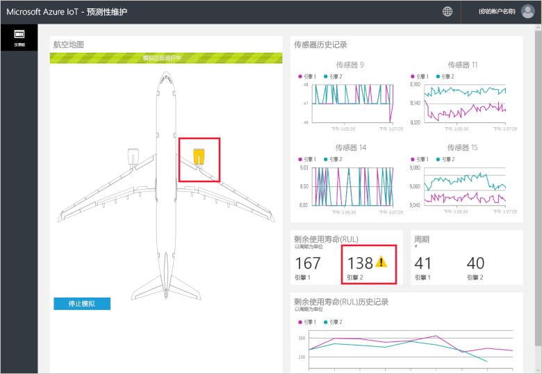
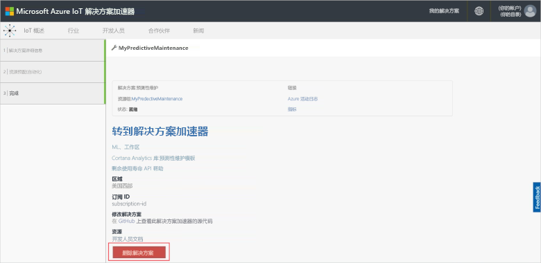

# 快速入门：尝试基于云的解决方案，以便在连接的设备上运行预测性维护分析

本快速入门介绍了如何部署 Azure IoT 预测性维护解决方案加速器，以运行基于云的预测性维护解决方案。 在部署解决方案加速器以后，使用解决方案“仪表板”页面通过模拟的航空发动机运行预测性维护分析。 可以将此解决方案加速器用作你自己的实现的起点，或者将其用作学习工具。

在模拟中，Fabrikam 是一家区域性航空公司，致力于以优惠的价格为客户提供优质的体验。 维护问题是造成航班延误的原因之一，而飞机引擎维护又是其中最为棘手的项目。 因为必须严防飞行期间发生引擎故障，所以 Fabrikam 不仅会定期检查其引擎，而且会恪守所安排的维护计划。 但因为飞机引擎的问题不一， 所以有一些引擎维护工作并非必要。 更重要的是，若在执行维护工作之前发生问题，可能会造成飞机停飞。 如果飞机所在地点正好缺少合适的技术人员或备用零件，这些问题会造成尤其严重的损失。

Fabrikam 飞机的引擎由各种传感器进行检测，这些传感器监视飞行期间的引擎状况。 经过多年累积引擎运行数据和故障数据之后，Fabrikam 的数据科学家开发出了一个模型，可以预测飞机引擎的剩余使用寿命 (RUL)。 该模型使用在四个引擎传感器提供的数据与最终会导致故障的引擎磨损之间存在的相关性。 Fabrikam 现在除了继续执行定期检查来确保安全之外，还会在每次飞行后，使用模型来计算每个引擎的 RUL。 Fabrikam 现在可以预测将来的故障时间点并制定维护计划，将飞机停飞的时间降至最低，还可以降低运营成本，同时确保乘客与乘务员的安全。

若要完成本快速入门，需要一个有效的 Azure 订阅。

如果没有 Azure 订阅，请在开始之前创建一个 [免费帐户](https://azure.microsoft.com/free/?WT.mc_id=A261C142F)。

## 部署解决方案

将解决方案加速器部署到 Azure 订阅时，必须设置一些配置选项。

使用 Azure 帐户凭据登录到 [azureiotsolutions.com](https://www.azureiotsolutions.com/Accelerators)。

在“预测性维护”磁贴上单击“立即尝试”。

在“创建预测性维护解决方案”页上，为预测性维护解决方案加速器输入唯一的“解决方案名称”。 对于本快速入门，我们将使用 **MyPredictiveMaintenance**。

选择要用于部署解决方案加速器的**订阅**和**区域**。 通常，我们会选择离自己最近的区域。 本快速入门使用“Visual Studio Enterprise”和“美国东部”。 只有订阅中的[全局管理员或用户](iot-accelerators-permissions.md)才能完成部署。

单击“创建解决方案”开始部署。 此过程至少需要五分钟才能完成运行：

## 登录到解决方案

完成部署到 Azure 订阅后，解决方案磁贴上会出现一个绿色的对号和“就绪”。 现在，你可以登录到你的预测性维护解决方案加速器仪表板。

在“预配的解决方案”页上，单击新的预测性维护解决方案加速器。 可以在显示的面板中查看有关解决方案加速器的信息。 选择“解决方案仪表板”，查看预测性维护解决方案加速器：

单击“接受”以接受权限请求，预测性维护解决方案仪表板会在浏览器中显示：

单击“开始模拟”开始模拟。 传感器历史记录、RUL、周期和 RUL 历史记录会填充到仪表板中：

当 RUL 小于 160 时（出于演示目的而选择的任意阈值），解决方案门户会在 RUL 显示器旁边显示警告符号。 解决方案门户也会以黄色突出显示飞机引擎。 你会注意到 RUL 值有整体向下的趋势，但呈上下波动形式。 此行为是因为周期长度和模型精确度不同的缘故。

完整模拟需要约 35 分钟的时间才能完成 148 个周期。 160 RUL 阈值第一次在大约 5 分钟的时候达到，而这两个引擎在大约 8 分钟的时候同时达到阈值。

模拟会彻底运行 148 个周期的完整数据集并确定最终的 RUL 和周期值。

可以随时停止模拟，但单击“开始模拟”会从数据集的开头重播模拟。

## 清理资源

如果打算深入进行探索，请保留已部署的预测性维护解决方案加速器。

如果不再需要该解决方案加速器，请从[预配的解决方案](https://www.azureiotsolutions.com/Accelerators#dashboard)页中选择它，然后单击“删除解决方案”以将其删除：

## 后续步骤

本快速入门介绍了如何部署预测性维护解决方案加速器并运行模拟。

若要详细了解解决方案加速器和模拟的航空发动机，请继续阅读以下文章。

> [!div class="nextstepaction"]
> [预测性维护解决方案加速器概述](iot-accelerators-predictive-walkthrough.md)
